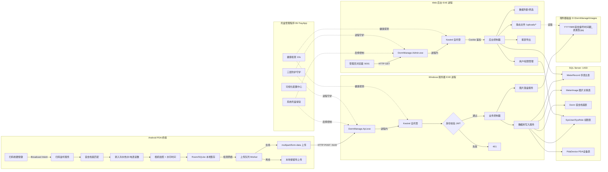
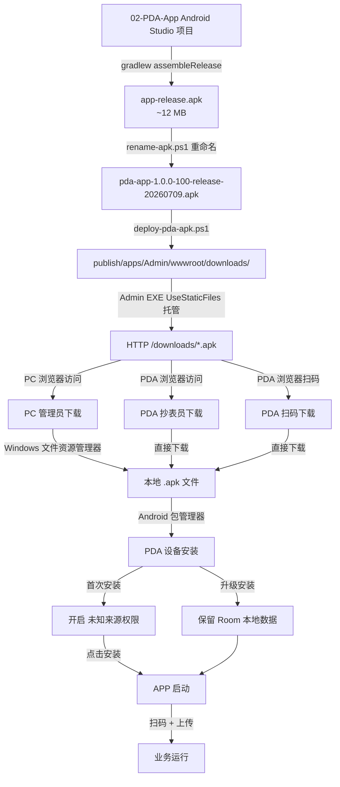
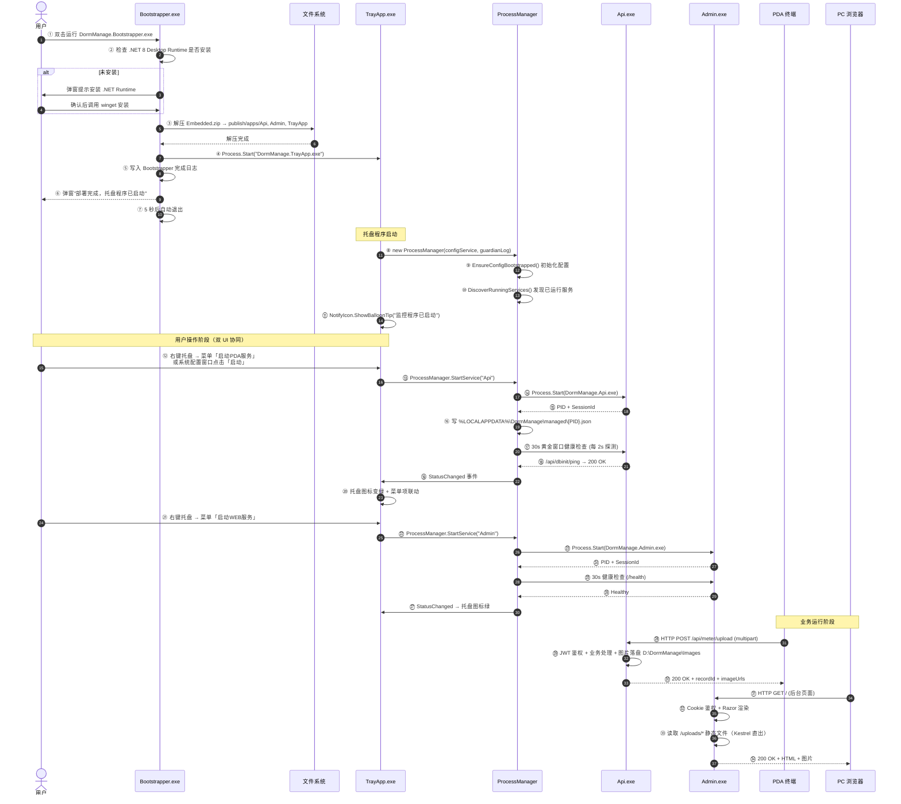
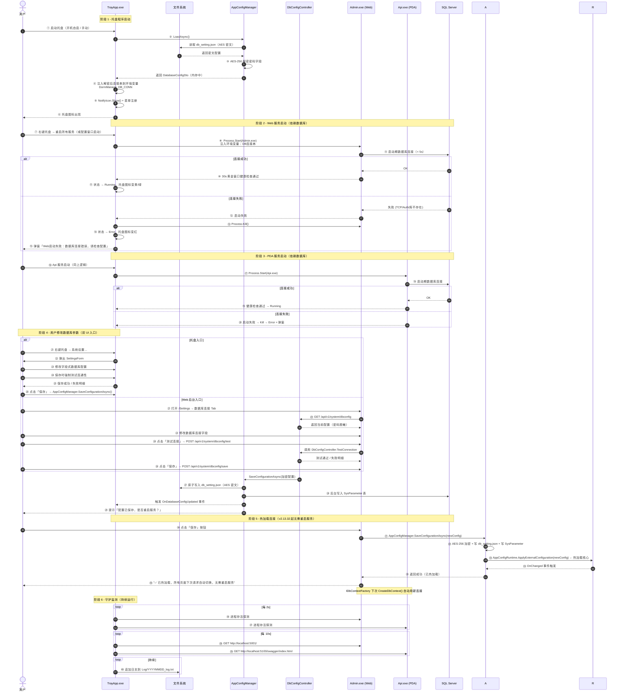
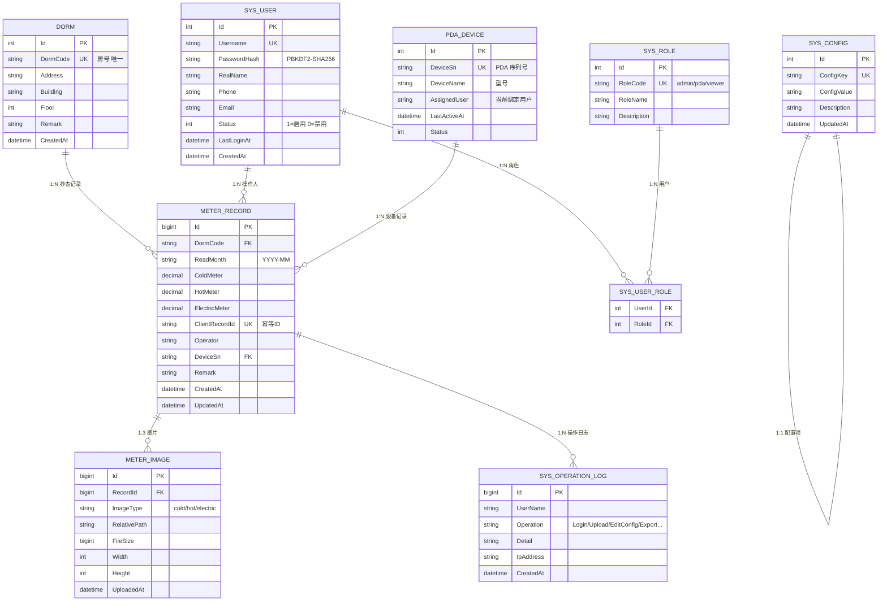
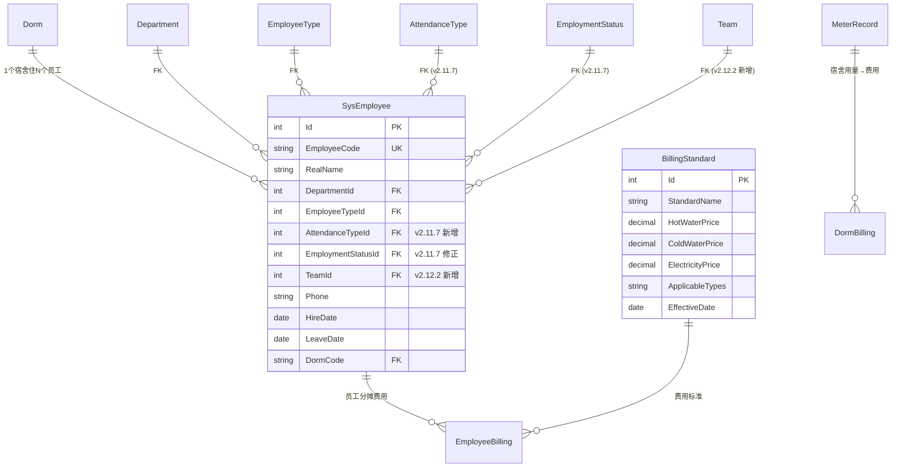

# 金戈宿舍管理系统系统 技术架构与开发方案

> 文档版本：**v2.13.33**
> 适用项目：金戈宿舍管理系统系统
> 撰写日期：2026-07-09
> 最近修订：**2026-07-20**
> 修订记录：
> - **v2.13.33（2026-07-20）— 入住 BUG + 工号姓名关联修复**：详见 `00-方案文档/86-办理入住与工号姓名关联修复-v2.13.33.md`；修复 `selectCiEmp` 卡死（新增 `ciSearchResults/coSearchResults` 缓存 + 重写完整填充逻辑 + 写入 `dataset.empId`）；新增 `BookingService.RepairBookingEmployeeNamesAsync` + `POST /api/v1/bookings/repair-employee-names` + `GET /api/v1/bookings/employee-history/{employeeId}` 端点；`BookingService.GetListAsync` select 引入 `RealName` 字段，物化时覆盖显示用 `Booking.EmployeeName`（仅 RAM 不写 DB），关键词搜索同步覆盖最新档案姓名；`/Booking` 页面 PageHeader 新增「修复姓名关联」按钮（橙色 warning）。
> - **v2.13.32（2026-07-20）— 数据源热加载 + EF 拦截器日志**：详见 `00-方案文档/85-数据源热加载与EF拦截器日志-v2.13.32.md`；新增 `AppConfigRuntime` 单例 + `IDbContextFactory<DormDbContext>` 实现运行时热切换（无需重启服务）；新增 `DatabaseOperationInterceptor`（`DbCommandInterceptor` override + `IDbConnectionInterceptor` 显式）输出 `[DB-CONN]`/`[DB-EXEC]`/`[DB-EXEC-SLOW]` 日志（采样 1/100 + 慢查询/错误 100%）；新增 `DatabaseConfigFileWatcher`（200ms 防抖）实现跨进程同步；`SysParameter` 表升级为运行时回退源；`Settings → 数据库连接` 页面顶部加连接健康徽章（30s 轮询）。**配套修复**：托盘 SettingsForm 加"测试连接"按钮（v2.13.32-hotfix）；`AppConfigManager.SaveConfigurationAsync` 修复合文写 SysParameter 的 BUG（应传明文）。
> - **v2.13.23（2026-07-19）— 托盘图标颜色状态机文档修正**：修正 §6.1 第 4623 行与 §6.3.3 第 4711 行两处"红=启动中/异常"描述为"红=均未运行"；实际代码 `NotifyIconManager.EvaluateIconColor()` 仅基于"是否进入 Running 状态"判断（绿/黄/红 3 色状态机），Starting/Stopping/Crashed 仅在无服务 Running 时显示红色，否则显示黄色
> - **v2.13.19（2026-07-19）— 数据库连接双 UI 双向同步机制落地**：修正 §3.6.10 数据库连接串加密方案为 AES-256-CBC（由 `AesEncryptor` 实现），新增 `AppConfigManager` 单例统一读写本地 `db_setting.json` 与 SQL Server `SysParameter` 表，新增 `DbConfigController`（`/api/v1/system/dbconfig`）供 Web 后台数据库连接 Tab 调用，实现托盘与 Web 双 UI 配置同步；详细需求见 `00-方案文档/71-系统设置数据库连接双UI同步需求-v2.13.19.md`
> - **v2.13.26（2026-07-20）— 个人中心与账号安全 4 大模块完整落地**：新增 §5.5 个人中心架构，涵盖个人信息编辑（显示名/手机/邮箱）、微信 OpenID 绑定/解绑、密码修改（BCrypt + 强度校验）、密码找回（安全问题 + 30 分钟令牌 + 暴力破解防护）；SysUser 表扩展 6 字段（WeChatOpenId/WeChatBindAt/PasswordResetToken/PasswordResetTokenExpiry/PasswordResetFailedCount/PasswordResetLockedUntil）+ 新建 SysUserSecurityQuestion 表 + 新建 SysUserSelfService（10 个方法）+ 新建 SelfController（10 个 API 端点）+ 重写 Profile.cshtml（3 Tab）+ 新建 ForgotPassword.cshtml（3 步向导）；详细需求见 `00-方案文档/80-个人中心与账号安全功能需求文档-v2.13.26.md`（**注：v2.13.49 起 Profile 已重构为 8 子菜单，详见 `102-Profile子菜单对齐Basics重构-v2.13.49.md`**）
> - **v2.13.49（2026-07-21）— 个人中心重构为 8 子菜单与基础资料 1:1**：从原 v2.13.26 的 3 Tab（基本资料/账号安全/偏好设置）重构为 8 子菜单（账号总览/基本资料/修改密码/安全问题/微信绑定/偏好设置/筛选缓存/操作日志），与基础资料 1:1 风格（顶部 page-header + 左侧 200px pills + 右侧 tab-content）；详见 `00-方案文档/102-Profile子菜单对齐Basics重构-v2.13.49.md`
> - **v2.13.50（2026-07-21）— 个人中心 HTML 原型与需求同步**：新建 `04-HTML原型/profile/index.html`（8 子菜单 + 8 pane + URL ?tab= 持久化 + 密码 4 级强度条）+ `profile-data.js`（Mock 数据 4 模块）+ 需求文档升级 v2.13.26 → v2.13.50；详见 `00-方案文档/103-Profile原型与需求同步-v2.13.50.md`
> - **v2.13.51（2026-07-21）— 原型 user-pill 跳转链接修复**：26 个 HTML 原型顶部「管理员」胶囊由 `<span>` 改为 `<a>` 链接到 `../profile/index.html`（按层级自动计算路径），与 Razor `_Layout.cshtml` 一致；详见 `00-方案文档/104-原型user-pill跳转链接修复-v2.13.51.md`
> - **v2.13.52（2026-07-21）— Profile 原型保留主菜单导航设计定稿**：个人中心原型（`profile/index.html`）保留顶部品牌栏 + 10 主菜单 Tab 导航，与全站 26 个 Razor/HTML 原型保持一致；tab-bar.js 移除 `/profile/` 路径拦截 → 全站统一渲染；详见 `00-方案文档/105-Profile原型保留主菜单导航设计-v2.13.52.md`
> - **v2.13.53（2026-07-21）— Profile 导航过时描述深度清理**：用户最终明确需求"原型中点击登录账号进入个人中心时，仍保留页头+主菜单导航的**正常显示**"；清理 `profile/index.html` 的 v2.13.50 版本标识 → v2.13.53、INDEX.md 补充 v2.13.49~v2.13.53 时间线、`01-技术架构与系统开发方案.md §3.6.10` 补充 4 条个人中心迭代记录；详见 `00-方案文档/106-Profile导航过时描述深度清理-v2.13.53.md`
> - **v2.12.36（2026-07-14）— 系统启动顺序与运行期控制规范**：新增 §3.6.10，明确托盘先于服务启动、数据库连接失败即停止 Web/PDA 启动、~~数据库连接串以 AES-256-CBC 在本地加密存储~~（v2.13.19 已修正为 AES-256）、托盘守护监测日志按 `YYYYMMDD_log` 命名写入本地日志目录、全局启动/停止/退出流程；与 §6、§8.1、§9.1 保持一致
> - **v2.12.35（2026-07-13）— Dorm 床位号容量变更约束规则**：① 容量减少时检查已入住人数 ≥ 新容量 → 禁止保存，提示异常；② 容量减少时超床位号员工自动从空闲床位中随机重新分配；③ 容量增加时不影响原床位号，仅追加新床位号；④ 新增床位号重新分配算法（空闲床位集合计算 → 超量员工识别 → 随机抽取分配）；⑤ 新增 §4.3.1 床位号自动生成规则（含容量变更约束） |
> - **v2.12.34（2026-07-13）— Dorm 宿舍档案新增床位号字段 BedNumbers**：① Dorm 表新增 `BedNumbers NVARCHAR(500)` 字段；② 按宿舍房间容量自动生成床位号，从 1 起至 Capacity 上限为床位号自动生成（如 Capacity=4 → `"1,2,3,4"`）；③ 当 Capacity 变更时自动重新生成（追加或截断）；④ 办理入住时默认预分配床位号 = 该宿舍当前在宿人数 + 1；⑤ 新增 §4.3.1 Dorm 表字段 + 床位号自动生成规则 |
> - **v2.12.2（2026-07-13）— 基础资料新增「员工班组」分类 + 人员清单班组筛选项**：在基础资料字典新增 `Team`（员工班组）分类，初始 8 条数据（默认 / A班 / B班 / C班 / D班 / E班 / F班 / G班 / H班，ID 1-9）；人员清单（`personnel/list.html`）筛选区在「员工类型」右侧新增「班组」下拉、列表表头在「员工类型」列后新增「班组」列；字段定义 `SysEmployee.TeamId INT NULL FK→Team.Id`；与基础资料-班组字典、考勤班次字典采用统一的「存储 FK ID + 渲染时 JOIN 取 Name」关联引用规则；详见 [`33-基础资料模块-v2.11.4.md`](33-基础资料模块-v2.11.4.md) §3.10 / §5.3 / §9.3.6 与 [`16-人员清单筛选条件-v2.11.2.md`](16-人员清单筛选条件-v2.11.2.md) §4.4 / §10.4
> - **v2.12.1（2026-07-13）— 新增「数据规范化层」架构说明**：引入 v2.11.24 无效 FK 归一通用规则，规范文档见 [`43-无效FK归一通用规范-v2.11.24.md`](43-无效FK归一通用规范-v2.11.24.md)；C# 端落地为 `DormManage.Shared/Services/DictionaryFallbackService.cs`（写入层/读取层/修复层三层防护）；取代 v2.11.23 文档 §2.2 规则 2b 的部门映射方案
> - **v2.12.0（2026-07-12）— 「共用页头 + Tab 页签切换」导航架构升级**：所有 Web 后台页面统一升级为「顶部品牌栏 + 紧凑型图标导航条 + Tab 页签栏 + 页面内容区」四层架构；废弃 v2.11 双层导航模式；新增 §5.4.11.1 公共组件-导航升级说明；配套规范见 [`37-共用页头与Tab页签导航设计规范-v2.12.md`](00-方案文档/37-共用页头与Tab页签导航设计规范-v2.12.md) 与 [`11-导航栏设计规范-v2.12.md`](00-方案文档/11-导航栏设计规范-v2.12.md)（历史归档）
> - v2.11.6（2026-07-12）— 新增「系统集成」子功能：SysSystemIntegration 数据库表 + 4 个系统集成 API 端点 + HR/K3ERP 双系统配置（系统名称/服务器地址/账号/密码均可编辑修改 + 启用状态/连接测试/保存参数按"修改"权限控制 + 表头"连接测试"列改为"操作"、"操作"列改为"连接状态"）+ 系统设置原型新增"系统集成"Tab
> - **v2.11.7（2026-07-12）** — **托盘系统配置窗口职责收敛**：SettingsForm 仅保留核心服务端参数配置（PDA/Web 端口、可执行文件路径、数据库连接、图片存储路径、服务启停/保存参数），无角色权限控制；Web 端系统设置承载全部功能（服务管理、数据库、PDA版本、用户角色、备份恢复、系统集成、筛选缓存），受角色权限管控；双 UI 从"完整配置互补"调整为"托盘轻量运维 + Web 完整管理"
> - v2.11.4（2026-07-12）— 新增「0.4 筛选条件持久化缓存」章节（预留）；完善列表页面 UI 规范与按钮固定尺寸强制要求
> - v2.0（2026-07-09）— 重构服务端架构，由 IIS 反向代理迁移到 **.NET 8 自托管 EXE 进程** + **托盘管理程序守护**，配套三层进程防护、可视化配置中心、日志审计与备份恢复体系
> - v2.1（2026-07-09）— 增加「托盘菜单参考样式」「系统配置窗口参考样式」两章，规范视觉与交互标准；记录 SettingsForm v2.0 → v2.1 演进路径
> - v2.2（2026-07-09）— 系统性梳理托盘管理程序，明确「托盘菜单」与「系统配置窗口」是同一组服务控制功能的**双 UI 入口**；新增「6.5 服务启停双 UI 协同设计」章节，建立功能矩阵、状态同步机制、双 UI 设计哲学与实现架构
> - v2.3（2026-07-09）— 补充「3.6 部署启动全流程（EXE 解压 → 后台进程启动）」核心章节，明确 Bootstrapper 一次性引导 → TrayApp 7×24 守护 → Api/Admin EXE 后台进程的完整部署链路；含时序图、目录结构图、进程关系全景图、用户视角操作流程
> - v2.4（2026-07-09）— 补充「3.7 服务拆分决策：双 EXE vs 单 EXE vs AllInOne」核心架构决策章节，明确回答『API 与 Admin 是否必须打包为独立 EXE』的关键问题；系统评估方案 A/B/C/D 四种拆分模式，正式确立方案 A（双 EXE）为生产环境默认架构，并记录方案 C（单 EXE + Role 参数）作为 v2.5 演进方向
> - v2.5（2026-07-09）— 补充「2.5 PDA APP 打包与分发部署」核心章节，完成 PDA 端 Android APP 从源码构建 → APK 产物 → Admin wwwroot/downloads/ 部署 → Kestrel 静态文件托管 → PC/PDA 浏览器下载 → Android 安装的完整闭环；含 Gradle 构建脚本、APK 命名规范、MIME 类型配置、自动更新机制、签名与安全
> - v2.6（2026-07-09）— 补充「5.4 Web 后台 UI 参考样式与设计规范」核心章节，建立 Web 后台管理界面的完整 UI 设计规范，覆盖 7 个核心页面（登录 / Dashboard / 列表 / 详情 / 统计 / 用户管理 / 系统配置）+ 公共组件 + 响应式与无障碍 + 实现技术要点；含 ASCII 布局图、字段清单、关键交互、C#/Razor/JS 代码示例
> - v2.7（2026-07-09）— 补充「2.6 PDA APP UI 参考样式与设计规范」核心章节，建立 PDA 端 Android APP 的完整 UI 设计规范，覆盖 7 个核心页面（登录 / 主页 / 扫码 / 录入 / 上传队列 / 历史 / 设置）+ 公共组件 + PDA 厂商适配 + Kotlin 实现技术要点；含 ASCII 布局图、字段清单、关键交互、扫码广播接收器 / MVVM ViewModel / Retrofit 上传 / WorkManager 后台任务完整代码示例
> - v2.8（2026-07-09）— 扩充「第 4 章 数据库设计」，从 22 行扩展为完整规范：包含数据库选型、Mermaid ER 图、9 张表详细字段与约束、6 大索引策略详解（含 UX_MeterRecord_DormMonth 防重复、IX_MeterRecord_CreatedAt 覆盖索引）、SQL 优化示例（分页/统计/重复检测）、Fluent Migrator 迁移方案、SSMS 备份维护计划、PBKDF2 密码哈希、SQL 注入防护、数据字典生成、监控指标；建立数据库层完整设计规范
> - v2.9（2026-07-09）— 补充「6.4.7 数据库连接深度验证」小节：在系统配置窗口的数据库配置区域新增『数据库库名称』字段 + 增强的『读写测试』按钮，实现 8 步深度验证（TCP → SQL 登录 → 库可见 → CREATE → INSERT → SELECT → UPDATE → DELETE → DROP），含完整 C# 实现代码（TestStep + TestResult + DbTestHelper）、错误码速查表、双 UI 协同扩展（托盘菜单 + Web 后台均可用）；解决『配置保存成功但服务启动后才发现权限不足』的运维难题
> - **v2.10（2026-07-09）— 新增「第 19 章 人员清单管理」+「第 20 章 费用管理」：人员清单含部门/员工类型/入职离职/工号/手机号/备注字段 + Excel 批量导入导出；费用管理含 BillingStandard 费用标准（热水/冷水/电单价 + 适用员工类型多选勾选）+ 按月统计 宿舍费用清单 + 按月分摊 员工费用清单 + 双清单 Excel 导出；新增 3 张表（SysEmployee/BillingStandard/DormBilling/EmployeeBilling）+ 10+ API 端点 + 3 个 Web 后台页面 + 完整业务规则（在职分摊、适用类型筛选、平均分摊算法、发布控制、生效时间区间校验）**
- **v2.11（2026-07-10）— 新增「0. 系统设计规划背景说明」章节：明确系统面向 800 人规模企业、200+ 间宿舍（含 1/2/4/6 人间多种房型）、日常入住 500+ 人的设计目标；更新数据库表结构、索引策略、性能基准与容量规划，确保系统在该规模下稳定运行；新增人员生命周期管理（入职/离职/调宿/预约）、费用标准按员工类型差异化、宿舍账单按月生成与分摊等业务能力**
> 适用环境：**Windows 11 / Windows Server 2019 / Windows Server 2016 / Windows Server 2022** + .NET 8 Desktop Runtime + **SQL Server 2014 / SQL Server 2019 / SQL Server 2022（向下兼容 SQL Server 2014 及以上版本）**
> 支持终端：**Android PDA 终端**、**Android 平板终端（12寸屏幕自适应，功能范围同 PDA）**、**Web 访问管理前端**、**小程序移动端（待定义功能范围）**

---

## 目录

0. [系统设计规划背景说明](#0-系统设计规划背景说明)
1. [总体技术选型与架构设计](#1-总体技术选型与架构设计)
2. [Android PDA 前端设计要点](#2-android-pda-前端设计要点)
3. [EXE 服务端架构设计](#3-exe-服务端架构设计)
4. [数据库设计（DDL 示例）](#4-数据库设计ddl-示例)
5. [Web 后台管理端设计](#5-web-后台管理端设计)
6. [托盘管理程序（守护与控制中心）](#6-托盘管理程序守护与控制中心)
7. [三层进程防护体系](#7-三层进程防护体系)
8. [配置管理与可视化运维](#8-配置管理与可视化运维)
9. [监控运维与日志体系](#9-监控运维与日志体系)
10. [备份与恢复策略](#10-备份与恢复策略)
11. [安全与合规设计](#11-安全与合规设计)
12. [性能基准与容量规划](#12-性能基准与容量规划)
13. [项目实施与踩坑指南](#13-项目实施与踩坑指南)
14. [交付物清单](#14-交付物清单)

---

## 0. 部署环境要求（v2.12.42 同步更新）

> **适用范围**：本节规定的运行环境为整个系统的**最低硬件/软件基线**，包括开发环境、测试环境、生产环境。

### 0.0.1 服务器操作系统

| 操作系统 | 支持状态 | 推荐场景 | 备注 |
|---------|---------|---------|------|
| **Windows 11** | ✅ 完全支持 | 开发环境、本机部署 | 最新桌面系统 |
| **Windows Server 2019** | ✅ 完全支持 | **生产环境推荐** | 企业级服务器主流版本 |
| **Windows Server 2016** | ✅ 完全支持 | 老旧服务器迁移 | 需安装 .NET 8 Desktop Runtime |
| **Windows Server 2022** | ✅ 完全支持 | **新建服务器推荐** | Azure 集成增强 |
| Windows 10 (1809+) | ✅ 完全支持 | 旧开发机 | 兼容性已验证 |

> **统一原则**：所有 Windows 客户端 / 服务器操作系统统一支持，部署脚本无需区分版本。

### 0.0.2 数据库

| 数据库 | 支持状态 | 推荐场景 | 备注 |
|--------|---------|---------|------|
| **SQL Server 2022** | ✅ 完全支持 | **新建环境推荐** | 最新稳定版，Azure 集成 |
| **SQL Server 2019** | ✅ 完全支持 | **生产环境推荐** | 稳定成熟 |
| **SQL Server 2017** | ✅ 完全支持 | 升级过渡 | 兼容性已验证 |
| **SQL Server 2014** | ✅ 完全支持 | 老旧服务器 | 需升级 SqlClient 至 4.6+ |
| SQL Server 2016 | ✅ 完全支持 | 中间过渡 | 向下兼容 |
| SQL Server Express (免费版) | ✅ 完全支持 | 中小企业 | 上限 10GB |

> **向下兼容原则**：本系统数据库 Schema 与 SQL Server 2014 及以上版本完全兼容。

### 0.0.3 中间件 / 运行时

| 组件 | 版本 | 必需性 |
|------|------|-------|
| **.NET 8 Desktop Runtime** | 8.0.x | ✅ 必需 |
| **.NET 8 SDK** | 8.0.x | ⚠️ 仅开发环境需要 |
| **ASP.NET Core Runtime** | 8.0.x | ✅ 必需（Desktop Runtime 已包含） |

> **下载**：https://dotnet.microsoft.com/download/dotnet/8.0

### 0.0.4 支持的终端类型（v2.12.42 扩展）

| 终端类型 | 操作系统/平台 | 功能范围 | 状态 |
|---------|-------------|---------|------|
| **安卓 PDA 终端** | Android 8.0+（工业级） | 完整扫码 + 抄表 + 上传 | ✅ V1.0 已实现 |
| **安卓平板终端**（12寸屏幕自适应） | Android 8.0+ | 功能范围同 PDA 终端，UI 自适应大屏 | ✅ V1.0 已实现 |
| **Web 访问管理前端** | Win/Mac/Linux 浏览器 | 人员/宿舍/办理/账单全套管理 | ✅ V1.0 已实现 |
| **小程序移动端** | 微信 / 钉钉 / 支付宝小程序 | **功能范围待定义**（v2.12.42+ 规划） | ⚠️ 规划中 |

#### 0.0.4.1 安卓平板终端（12寸屏幕自适应）

> **业务定位**：与 PDA 终端功能范围完全相同，但 UI 适配 12 寸大屏幕（1280×800 / 1920×1200）

| 项目 | PDA 终端（5寸） | 安卓平板终端（12寸） |
|------|----------------|---------------------|
| 屏幕分辨率 | 720×1280 / 1080×1920 | 1280×800 / 1920×1200 |
| UI 布局 | 单列流式 | 多列分栏（左导航 + 主内容） |
| 扫码功能 | ✅ | ✅ |
| 抄表录入 | ✅ | ✅ |
| 历史记录查询 | ✅ | ✅ |
| 设置页 | ✅ | ✅（横版自适应） |
| 多任务切换 | ❌ | ✅（分屏） |

**自适应实现要点**：
- 使用 Android Resource Qualifier：`layout-sw720dp` / `layout-sw800dp`
- 关键页面（抄表录入、列表）提供横屏布局
- 字号、按钮尺寸按密度独立像素 (dp) 计算

#### 0.0.4.2 小程序移动端（v2.12.42+ 规划）

> **业务定位**：微信 / 钉钉 / 支付宝小程序，员工自助查询 + 管理员移动审批

| 项目 | 内容 |
|------|------|
| **目标用户** | 普通员工（查询住宿信息）+ 宿舍管理员（移动审批） |
| **核心功能**（待定义） | 1. 员工自助：住宿信息 / 入住记录查询<br>2. 入住申请提交<br>3. 退宿申请提交<br>4. 调宿申请<br>5. 消息通知 |
| **管理员功能**（待定义） | 1. 待审批列表<br>2. 移动审批通过/拒绝<br>3. 扫码登记<br>4. 异常上报 |
| **技术栈**（推荐） | 微信原生小程序 / uni-app（跨端） |
| **API 复用** | 100% 复用现有 Web API（端口 5100） |
| **认证方案** | 微信 OAuth + JWT |
| **规划版本** | v2.13.0（V1.0 之后规划） |

#### 0.0.4.3 终端适配矩阵

| 功能模块 | PDA 终端 | 安卓平板 | Web 前端 | 小程序 |
|---------|---------|---------|---------|--------|
| 扫码录入 | ✅ | ✅ | - | ⚠️ 规划 |
| 抄表上传 | ✅ | ✅ | - | - |
| 宿舍列表 | - | - | ✅ | ⚠️ 规划 |
| 人员清单 | - | - | ✅ | ⚠️ 规划 |
| 入住办理 | - | - | ✅ | ⚠️ 规划 |
| 退房办理 | - | - | ✅ | ⚠️ 规划 |
| 账单查看 | - | - | ✅ | ⚠️ 规划 |
| 数据看板 | - | - | ✅ | - |
| 系统设置 | - | - | ✅ | - |

### 0.0.5 网络要求

| 网络组件 | 要求 |
|---------|------|
| 服务器端口 | 5100（API/PDA 服务）、5001（Web 管理后台）、5099（托盘本地 IPC，仅限 127.0.0.1） |
| 数据库端口 | 1433（SQL Server 默认） |
| 内网带宽 | ≥ 100Mbps |
| 公网访问 | 可选（仅当需远程访问时） |

### 0.0.6 兼容性测试矩阵

| 操作系统 | 数据库 | .NET Runtime | 验证状态 |
|---------|--------|------------|---------|
| Windows 11 | SQL Server 2022 | 8.0.28 | ⚠️ 待验证 |
| Windows 11 | SQL Server 2019 | 8.0.28 | ✅ V1.0 已验证 |
| Windows 11 | SQL Server 2014 | 8.0.28 | ⚠️ 待验证 |
| Windows Server 2022 | SQL Server 2022 | 8.0.28 | ⚠️ 待验证 |
| Windows Server 2022 | SQL Server 2019 | 8.0.28 | ⚠️ 待验证 |
| Windows Server 2019 | SQL Server 2019 | 8.0.28 | ⚠️ 待验证（V1.0 对比测试目标） |
| Windows Server 2019 | SQL Server 2014 | 8.0.28 | ⚠️ 待验证 |
| Windows Server 2016 | SQL Server 2019 | 8.0.28 | ⚠️ 待验证 |
| Windows Server 2016 | SQL Server 2014 | 8.0.28 | ⚠️ 待验证 |

> **测试重点**：在另一台 Server 2019 服务器上对比测试 V1.0 版本，确保与 Windows 11 + SQL Server 2019 行为一致；同时验证 Server 2022 + SQL Server 2022 兼容性。

---

## 1. 系统设计规划背景说明

### 1.1 企业背景与规模

本系统面向 **金戈新材料** 公司，服务其员工宿舍管理全流程。系统设计目标规模如下：

| 维度 | 规模 | 说明 |
|------|------|------|
| **公司总人数** | **800 人** | 含合同工、临时工、外包、实习生、驻场等 5 种员工类型 |
| **宿舍房间数** | **200+ 间** | 含 1 人间、2 人间、4 人间、6 人间等多种房型配置 |
| **日常入住人数** | **500+ 人** | 按 800 人总规模的 62.5% 入住率设计 |
| **床位总数** | **≥ 800 个** | 按 1:1 冗余设计，确保高峰期全员可入住 |
| **抄表频率** | **每月 1 次** | 全 200+ 间宿舍每月抄表一次，PDA 端现场录入 |
| **并发抄表员** | **≤ 10 人** | 每月集中抄表期间，最多 10 台 PDA 同时上传数据 |
| **Web 后台并发** | **≤ 20 人** | 管理人员同时在线操作 |
| **PDA 端** | **≤ 15 台** | 抄表员手持设备 |

### 0.2 核心业务流程

```
员工入职 → 分配宿舍（预约/立即入住） → 月度抄表（PDA） → 自动生成账单 → 费用分摊 → 发布查看
    ↑                                                                      ↓
    └──── 离职退宿 ←──── 调宿/退宿 ←──── 异常处理 ←──── 费用争议 ←────┘
```

**关键业务实体**：
- **员工**：800 人全生命周期管理（入职 → 在职 → 调宿 → 离职）
- **宿舍**：200+ 间档案（楼栋/楼层/房型/容量/设施）
- **办理登记**：入住/退房/调宿 全流程留痕
- **抄表记录**：200+ 间 × 12 月 × N 年 = 持续累积
- **费用账单**：每月自动生成宿舍账单 + 员工分摊账单

### 0.3 数据库表结构与规模预估

#### 0.3.1 表清单

| 序号 | 表名 | 用途 | 初始行数 | 年增量 | 5 年累计 |
|------|------|------|---------|--------|---------|
| 1 | Dorm | 宿舍档案 | 200 | 0 | 200 |
| 2 | Employee | 员工档案 | 800 | +200 流动 | 1,800 |
| 3 | DormBooking | 办理登记 | 0 | +600 | 3,000 |
| 4 | MeterRecord | 抄表记录 | 0 | 2,400（200×12） | 12,000 |
| 5 | MeterImage | 抄表照片 | 0 | 7,200（200×12×3） | 36,000 |
| 6 | BillingStandard | 费用标准 | 1 | +2 | 11 |
| 7 | DormBilling | 宿舍月度账单 | 0 | 2,400（200×12） | 12,000 |
| 8 | EmployeeBilling | 员工分摊账单 | 0 | 6,000（500×12） | 30,000 |
| 9 | SysUser | 系统用户 | 3 | 0 | 3 |
| 10 | SysRole | 角色 | 3 | 0 | 3 |
| 11 | SysUserRole | 用户角色关联 | 3 | 0 | 3 |
| 12 | SysPermission | 权限 | 36 | 0 | 36 |
| **13** | **SysRolePermission** | **角色权限关联** | **36** | **0** | **36** |
| **14** | **SysUserFilterCache** | **用户筛选缓存** | **0** | **0** | **0** |
| **15** | **SysSystemIntegration** | **系统集成配置** | **0** | **0** | **0** |
| **合计** | | | **1,003** | **+15,802/年** | **≈ 80,000 行** |

> **结论**：即使 5 年累计仅约 8 万行，数据库体量极轻。SQL Server Express（免费，上限 10GB）绰绰有余。

#### 0.3.2 图片存储规模

| 项目 | 计算 | 结果 |
|------|------|------|
| 每月抄表照片 | 200 间 × 3 表 × 1 次 = 600 张 | |
| 年照片量 | 600 × 12 = 7,200 张 | |
| 单张体积 | JPEG 压缩后 ≈ 200KB | |
| 年照片存储 | 7,200 × 200KB ≈ **1.44 GB** | |
| 5 年累计 | 1.44 GB × 5 ≈ **7.2 GB** | 建议独立数据盘 |

### 0.4 性能设计要求

#### 0.4.1 响应时间目标

| 场景 | 目标 | 说明 |
|------|------|------|
| 首页 Dashboard 加载 | P95 < 1s | 含 6 个图表数据聚合 |
| 列表查询（分页 20 条） | P95 < 500ms | 含 Employee、DormBilling 等大数据量表 |
| 抄表上传（含 3 张图） | P95 < 3s | PDA 端现场操作，不可过长 |
| 账单生成（全 200 间） | < 5s | 每月定时任务，可异步执行 |
| 费用分摊计算（500 人） | < 10s | 每月定时任务 |
| 图片预览（直出） | 首字节 < 200ms | Kestrel 静态文件托管 |
| 登录认证 | < 500ms | Cookie + JWT |

#### 0.4.2 并发能力

| 场景 | 并发数 | 说明 |
|------|--------|------|
| PDA 同时抄表上传 | ≥ 10 路 | 每月集中抄表高峰 |
| Web 后台同时在线 | ≥ 20 人 | 行政管理人员 |
| API 请求 QPS | ≥ 100 | Kestrel 默认 ≥ 100 |
| 数据库连接池 | 最大 100 | 默认值，单机足够 |

### 0.5 索引与查询优化策略

针对 500+ 人、200+ 间房的规模，关键索引策略：

| 索引 | 作用 | 覆盖场景 |
|------|------|---------|
| `UX_MeterRecord_DormMonth` (dormCode, readMonth) | 唯一约束 + 抄表查询 | 月度抄表、重复检测 |
| `IX_MeterRecord_CreatedAt` | 时间排序 | 最新记录查询、审计 |
| `IX_MeterRecord_Operator` | 抄表员统计 | 抄表员工作量统计 |
| `IX_Employee_DormCode` | 宿舍人员查询 | 宿舍在住人员统计 |
| `IX_Employee_Status` | 状态筛选 | 在职/离职员工筛选 |
| `IX_DormBilling_BillingMonth` | 月份查询 | 月度账单查询 |
| `IX_EmployeeBilling_EmployeeId` | 员工账单查询 | 个人费用查询 |
| `UX_Dorm_DormCode` | 宿舍唯一 | 宿舍档案 |
| `UX_DormBooking_EmployeeId` | 办理登记 | 员工办理历史 |

### 0.6 数据归档策略

虽然当前规模不大，但为长期运维考虑：

| 策略 | 说明 |
|------|------|
| **图片归档** | 超过 3 年的照片移至冷存储（NAS/对象存储），数据库保留路径 |
| **账单归档** | 超过 5 年的账单数据归档至历史表，日常表仅保留近 5 年 |
| **抄表记录** | 超过 5 年的记录归档，保留聚合统计值 |
| **日志归档** | 按 30 天滚动，保留最近 6 个月 |

### 0.7 扩展性设计

| 维度 | 当前设计 | 扩展能力 |
|------|---------|---------|
| **数据库** | SQLite 默认 / SQL Server 生产 | 无缝切换，SQL Server 支持水平分库 |
| **文件存储** | 磁盘目录 | 可迁移至 Azure Blob / MinIO |
| **API** | Kestrel 自托管 | 可迁移至 IIS / Docker / Kubernetes |
| **PDA** | Android 原生 | 可扩展 iOS / 微信小程序 |

---

## 2. 总体技术选型与架构设计

### 1.1 技术栈推荐

| 层级 | 选型 | 说明 |
|------|------|------|
| **PDA 端** | **Android 原生 SDK（Kotlin/Java）** | **首选**。工业级 PDA 厂商（优博讯、新大陆、霍尼韦尔）均提供原生 Android SDK 与扫描 SDK（Broadcast Intent）。原生开发对硬件兼容性最好。 |
| PDA 端备选 | Uni-app / Flutter | 若未来需扩展到 iOS 或微信小程序，可考虑。但本项目仅安卓 PDA，**不推荐引入跨平台框架**（增加包体积、扫码 SDK 需二次封装）。 |
| **Web API 服务端** | **.NET 8 ASP.NET Core WebAPI + 自托管 Kestrel（EXE）** | .NET 8 进程内自带 Kestrel 服务器，发布为单个 EXE，无需 IIS 即可对外提供 HTTP 服务。**Windows 11 / Windows Server 2019 / Windows Server 2016** 安装 .NET 8 Desktop Runtime 即可运行。 |
| 服务端备选 | Java Spring Boot | 需额外安装 Tomcat/JDK；与 Windows 桌面运维习惯差异大。 |
| **Web 后台管理** | **ASP.NET Core MVC + Razor + Bootstrap 5 + jQuery** | 与 API 同源（共享 Model/DbContext），零跨域、单 EXE 即可同时托管 API 与 Web。也可拆分为独立 EXE（推荐生产部署：API 与 Admin 独立进程，互不影响）。 |
| **服务管理** | **托盘管理程序（DormManage.TrayApp.exe）** | WinForms 单实例常驻，提供：①服务启停 ②健康监控 ③进程守护 ④配置编辑 ⑤日志查看 ⑥开机自启。**替代 IIS 应用池的角色**，但更轻量、更可控。 |
| **数据库** | **SQL Server 2014 / 2017 / 2019（向下兼容 SQL Server 2014 及以上版本）**（或 SQL Server Express 免费版） | 与 .NET 生态最契合，SSMS 管理工具成熟，索引/全文检索/触发器完整。 |
| 数据库备选 | MySQL 8.0 | 若已有 MySQL 运维经验也可选，.NET 通过 `Microsoft.Data.SqlClient` 或 `MySqlConnector` 即可。 |
| 缓存 | MemoryCache（内置） | 轻量场景够用；如未来高并发可引入 Redis。 |
| 文件存储 | **服务器独立数据盘物理目录 + EXE 直接 I/O** | 图片不入库，磁盘文件系统 + 数据库存相对路径。**Kestrel 通过 `UseStaticFiles()` 自动托管** `wwwroot` 与 `wwwroot/uploads` 目录，等价于 IIS 虚拟目录但无需配置 IIS。 |
| 鉴权 | **Cookie 鉴权（Web 后台） + JWT（API 给 PDA）** | 双轨制：Web 端管理员登录用 Cookie；PDA 调用 API 用 JWT。 |
| 进程监控 | **三层防护（启动验证 / 进程守护 / 状态健康检查）** | 详见 [第 7 章](#7-三层进程防护体系)。 |
| 部署方式 | **EXE 独立部署**（推荐） + **Bootstrapper 一键引导** | 详见 [1.3 部署模式矩阵](#13-部署模式矩阵)。 |

### 1.2 系统拓扑与数据流向图



**完整闭环**：PDA 扫码 → 匹配宿舍 → 录入三表读数 → 拍照加水印 → 本地 Room 暂存 → 检测网络 → Multipart 上传 → `DormManage.Api.exe`（Kestrel 自托管）业务处理 → 图片落盘 `D:\DormManage\Images\YYYYMM\宿舍编号\` → 数据库写入关联 → `DormManage.Admin.exe` 通过 `UseStaticFiles` 直接暴露 `/uploads/*` 给浏览器在线预览 → 托盘程序 7×24 守护两个 EXE 进程并提供可视化配置入口。

### 1.3 部署模式矩阵

| 模式 | 适用场景 | 优点 | 缺点 |
|------|---------|------|------|
| **A. EXE 双进程 + 托盘守护**（**生产推荐**） | 单台 Windows 服务器长期运行 | 不依赖 IIS、配置可视化、进程自动拉起、日志实时查看、备份一键完成 | 需安装 .NET 8 Desktop Runtime |
| **B. AllInOne 单 EXE**（便携/测试推荐） | 临时测试、客户演示、单文件拷贝即用 | 单 EXE 集成 API + Admin + Tray，启动即用 | 不便于服务独立升级 |
| **C. Bootstrapper 引导安装**（首次部署） | 全新服务器零配置安装 | 一键安装 .NET Runtime、解压 EXE、注册开机自启、建库 | 仅用于首次部署 |

**架构决策**：本方案 **正式废除 IIS 部署**（v1.x 已支持）。v2.0 起所有部署文档、服务端架构、运维工具全部基于 **EXE 进程 + 托盘守护**，理由如下：

1. **零外部依赖**：无需安装 IIS、配置应用池、虚拟目录、证书绑定 — 这些复杂度全部下沉到 Kestrel 自托管。
2. **进程可控**：托盘程序可随时启停服务，IIS 应用池回收逻辑不可见。
3. **故障定位快**：EXE 直接输出 stdout 到托盘日志窗口，IIS 日志分散在多个目录。
4. **部署便携**：拷贝 `publish/` 目录即可在任何 Windows 机器运行。
5. **配置可视化**：所有连接串、端口、图片路径通过 GUI 编辑，避免手工改 `web.config`。

---

## 3. Android PDA 前端设计要点

### 2.1 扫码集成（硬扫描键广播）

**核心机制**：PDA 扫描枪触发后，会发送一个系统广播（不同厂商的 Action 不同）。

```kotlin
// 通用兼容：注册多家厂商的扫描广播
private val scanReceiver = object : BroadcastReceiver() {
    override fun onReceive(context: Context, intent: Intent) {
        // 1. 防止重复触发：500ms 内重复事件丢弃
        val now = System.currentTimeMillis()
        if (now - lastScanTime < 500) return
        lastScanTime = now

        // 2. 兼容不同厂商的 Extra Key
        val code = intent.getStringExtra("value")
            ?: intent.getStringExtra("SCAN_RESULT")
            ?: intent.getStringExtra("data")
            ?: intent.getStringExtra("barcode")

        // 3. 播放提示音 + 震动
        playBeep(); vibrate()

        // 4. 投递到 ViewModel
        viewModel.onBarcodeScanned(code.orEmpty())
    }
}

// 注册（清单中已注册大部分，运行时再补漏）
val filter = IntentFilter().apply {
    addAction("com.android.scan.SCAN")           // 优博讯
    addAction("android.intent.action.DECODE_DATA") // 新大陆
    addAction("com.honeywell.scan.broadcast")   // 霍尼韦尔
    addAction("com.symbol.scanwedge")           // 斑马
}
registerReceiver(scanReceiver, filter)
```

**防丢/防重策略**：
- **500ms 节流**：硬按键按一下会发多次（按下/抬起），节流过滤。
- **全局单例 ViewModel**：扫码结果不会因页面重建丢失（用 `LiveData`/`StateFlow`）。
- **标志位 busy**：扫描回调中如果当前正在保存或弹出对话框，暂存到待处理队列。

### 2.2 拍照与离线压缩

**问题**：PDA 摄像头 800W~1300W 像素，单张照片 3~6MB，连续抄表 200 间宿舍 = 800MB~1.2GB，会撑爆服务端带宽。

**压缩策略**：
```kotlin
// CameraX 拍照后立即压缩
fun compressAndWatermark(srcPath: String, dormCode: String, meterType: String): File {
    val bitmap = BitmapFactory.decodeFile(srcPath)

    // 1. 缩放到最长边 1600px（约 200~400KB）
    val scale = 1600f / maxOf(bitmap.width, bitmap.height)
    val scaled = if (scale < 1f) {
        Bitmap.createScaledBitmap(bitmap,
            (bitmap.width*scale).toInt(),
            (bitmap.height*scale).toInt(), true)
    } else bitmap

    // 2. 画质压缩到 80%
    val baos = ByteArrayOutputStream()
    scaled.compress(Bitmap.CompressFormat.JPEG, 80, baos)

    // 3. Canvas 绘制水印：右下角"房号+表类型+时间"
    val canvasBitmap = scaled.copy(Bitmap.Config.ARGB_8888, true)
    val canvas = Canvas(canvasBitmap)
    val paint = Paint().apply {
        color = Color.WHITE
        setShadowLayer(4f, 2f, 2f, Color.BLACK)
        textSize = 48f; isAntiAlias = true
    }
    val ts = SimpleDateFormat("yyyy-MM-dd HH:mm:ss", Locale.CHINA).format(Date())
    canvas.drawText("$dormCode | $meterType | $ts", 30f, canvasBitmap.height - 40f, paint)

    // 4. 输出到应用沙盒 uploads 目录（待上传队列）
    val outDir = File(filesDir, "pending_uploads").apply { mkdirs() }
    val outFile = File(outDir, "${dormCode}_${meterType}_${System.currentTimeMillis()}.jpg")
    FileOutputStream(outFile).use {
        canvasBitmap.compress(Bitmap.CompressFormat.JPEG, 85, it)
    }
    return outFile
}
```

**压缩参数**：最长边 1600px + JPEG 85% + 水印后体积约 **150~300KB/张**，200 间房共约 30~60MB，可控。

### 2.3 本地暂存机制（Room）

**为什么需要**：抄表员经常在地下室/弱信号区域作业，必须支持"先存后传"。

```kotlin
@Entity(tableName = "pending_records")
data class PendingRecord(
    @PrimaryKey(autoGenerate = true) val id: Long = 0,
    val dormCode: String,             // 宿舍编码
    val coldMeter: Double,            // 冷水表读数
    val hotMeter: Double,             // 热水表读数
    val electricMeter: Double,        // 电表读数
    val coldImgPath: String?,         // 本地图片路径
    val hotImgPath: String?,
    val electricImgPath: String?,
    val deviceSn: String,             // PDA 设备号
    val operator: String,             // 操作人
    val readMonth: String,            // 抄表年月 2026-07
    val createdAt: Long,              // 创建时间戳
    val uploadStatus: Int = 0         // 0=待传 1=已传 2=失败
)
```

**WorkManager 周期上传**：
```kotlin
class UploadWorker(ctx: Context, params: WorkerParameters) : CoroutineWorker(ctx, params) {
    override suspend fun doWork(): Result {
        val dao = AppDatabase.get(ctx).pendingDao()
        val pending = dao.getPendingList()  // uploadStatus=0
        for (rec in pending) {
            try {
                api.uploadMeterRecord(rec)
                dao.markUploaded(rec.id)
            } catch (e: Exception) {
                dao.markFailed(rec.id)
            }
        }
        return Result.success()
    }
}
// 约束：网络可用 + 充电时 优先
val constraints = Constraints.Builder()
    .setRequiredNetworkType(NetworkType.CONNECTED).build()
PeriodicWorkRequestBuilder<UploadWorker>(15, TimeUnit.MINUTES)
    .setConstraints(constraints).build()
```

### 2.4 数据提交方式对比

| 方式 | 优点 | 缺点 | 推荐 |
|------|------|------|------|
| **Multipart/form-data** | 流式上传，单次最多含 N 张图，服务端直接 `IFormFile` 接收 | 需服务端支持多文件 | ✅ **推荐** |
| Base64 + JSON | 一次请求含全部数据 | 单张图 base64 增大约 33%，请求体过大易超时 | ❌ 不推荐 |
| 分片上传 | 大文件可靠 | 单张照片几百 KB，无需分片 | ❌ 过度设计 |

**推荐 Multipart/form-data**，服务端用 `[FromForm] IFormFileCollection files` 接收。

### 2.5 PDA APP 打包与分发部署

> **本章定位**：完成 PDA 端 Android APP 从源码构建 → APK 产物 → 部署到 Web 目录 → 浏览器下载 → 安装到 PDA 设备的**完整闭环**。所有用户（PC 管理员 / PDA 抄表员）均可通过浏览器访问标准 URL 下载最新版本 APP，无需 U 盘拷贝、邮件发送或第三方分发。

#### 2.5.1 APK 构建流程（Gradle）

PDA APP 是标准的 Android Studio / Gradle 项目（`02-PDA-App/`），最终产物为 `app-release.apk` 或 `app-debug.apk`。

**标准构建命令**：

```bash
# 进入项目目录
cd 02-PDA-App

# Debug 构建（开发测试用，无需签名）
./gradlew assembleDebug
# 产物：app/build/outputs/apk/debug/app-debug.apk

# Release 构建（生产部署，必须签名）
./gradlew assembleRelease
# 产物：app/build/outputs/apk/release/app-release.apk

# 同时构建所有变体
./gradlew assemble
```

**Windows PowerShell 等价命令**：
```powershell
cd "E:\AI工作目录\AI编程开发\JINGE开发\宿舍管理系统\02-PDA-App"
.\gradlew.bat assembleRelease
```

**Gradle 构建关键配置**（`app/build.gradle.kts`）：
```kotlin
android {
    namespace = "com.jinge.DormManage"
    compileSdk = 34

    defaultConfig {
        applicationId = "com.jinge.DormManage"
        minSdk = 21              // Android 5.0，工业 PDA 普遍支持
        targetSdk = 34
        versionCode = 100        // 每次发布递增（整数）
        versionName = "1.0.0"    // 用户可见版本号
    }

    buildTypes {
        release {
            isMinifyEnabled = true
            isShrinkResources = true
            proguardFiles(getDefaultProguardFile("proguard-android-optimize.txt"), "proguard-rules.pro")
            signingConfig = signingConfigs.getByName("release")  // 签名配置
        }
        debug {
            applicationIdSuffix = ".debug"  // 与 release 共存
            isDebuggable = true
        }
    }
}
```

#### 2.5.2 APK 文件命名规范

**命名格式**：`pda-app-{versionName}-{versionCode}-{flavor}-{timestamp}.apk`

**示例**：
```
pda-app-1.0.0-100-release-20260709.apk     ← 生产版本
pda-app-1.0.0-101-release-20260715.apk     ← 增量更新
pda-app-1.1.0-debug-20260709.apk           ← 开发测试版本
```

**命名规则**：
- `versionName`：语义化版本号（MAJOR.MINOR.PATCH）
- `versionCode`：Android 内部递增整数（升级检测用）
- `flavor`：release / debug / staging
- `timestamp`：构建时间戳（YYYYMMDD）

**好处**：
- 浏览器下载时文件名直观，含完整版本信息
- 多个版本共存，便于回滚
- 用户可一眼识别生产 / 测试版本

**重命名脚本**（`02-PDA-App/rename-apk.ps1`）：
```powershell
$src = "app\build\outputs\apk\release\app-release.apk"
$timestamp = Get-Date -Format "yyyyMMdd"
$versionName = "1.0.0"
$versionCode = 100
$dst = "app\build\outputs\apk\release\pda-app-$versionName-$versionCode-release-$timestamp.apk"

if (Test-Path $src) {
    Copy-Item $src $dst -Force
    Write-Host "✓ 重命名完成：$dst"
} else {
    Write-Host "✗ 未找到 $src，请先执行 gradlew assembleRelease"
    exit 1
}
```

#### 2.5.3 部署位置：Admin wwwroot/downloads/

构建完成后，APK 必须部署到 Web 后台（Admin EXE）的 `wwwroot/downloads/` 子目录，才能通过 HTTP URL 提供下载。

**目录结构**：
```
publish/apps/Admin/wwwroot/
├── css/
├── js/
├── images/
├── uploads/                    ← Kestrel 托管的图片目录
└── downloads/                  ← 🆕 APK 下载专用目录
    ├── pda-app-1.0.0-100-release-20260709.apk
    ├── pda-app-1.0.0-101-release-20260715.apk
    ├── pda-app-1.1.0-debug-20260709.apk
    └── README.txt              ← 版本说明（可选）
```

**Kestrel 静态文件托管配置**（`04-WebAdmin/Program.cs` 或 `05-Standalone/Admin/Program.cs`）：
```csharp
// 默认情况下，app.UseStaticFiles() 已托管 wwwroot/ 全部内容
// /downloads/* 自动映射到 wwwroot/downloads/*
app.UseStaticFiles(new StaticFileOptions {
    ServeUnknownFileTypes = true,  // 允许 .apk 这种 MIME 未定义的类型
    DefaultContentType = "application/octet-stream",
    ContentTypeProvider = new FileExtensionContentTypeProvider {
        Mappings = {
            [".apk"] = "application/vnd.android.package-archive",  // APK 标准 MIME
            [".txt"] = "text/plain; charset=utf-8"
        }
    },
    OnPrepareResponse = ctx => {
        // APK 必须强制下载，不能被浏览器打开
        ctx.Context.Response.Headers.ContentDisposition = $"attachment; filename=\"{Path.GetFileName(ctx.File.PhysicalPath)}\"";
        // 短缓存（避免升级后用户拿到旧版本）
        ctx.Context.Response.Headers.CacheControl = "no-cache, must-revalidate";
    }
});
```

**关键 MIME 类型**：
- `application/vnd.android.package-archive` — Android 官方标准 APK MIME
- 设置后浏览器识别为 APK 文件，正确触发下载而非直接打开

#### 2.5.4 下载 URL 规范

**标准 URL 格式**：`http://{ServerDomain}:{AdminPort}/downloads/{apk-file-name}`

**示例**：
```
http://192.168.1.237:5001/downloads/pda-app-1.0.0-100-release-20260709.apk
http://192.168.1.100:5001/downloads/pda-app-latest.apk              ← 软链接（可选）
```

**目录浏览支持**（可选）：
```csharp
// 允许列出 downloads 目录所有 APK（便于管理员查看版本）
app.UseDirectoryBrowser(new DirectoryBrowserOptions {
    RequestPath = "/downloads",
    FileProvider = new PhysicalFileProvider(
        Path.Combine(builder.Environment.WebRootPath, "downloads"))
});
```

访问 `http://server:5001/downloads/` 会显示：
```
Index of /downloads
  pda-app-1.0.0-100-release-20260709.apk    12.5 MB   2026-07-09 14:30
  pda-app-1.0.0-101-release-20260715.apk    12.6 MB   2026-07-15 09:15
```

#### 2.5.5 APK 部署流程（开发者 → 服务器）


**自动化部署脚本**（`05-部署文档/deploy-pda-apk.ps1`）：
```powershell
# 部署最新 APK 到服务器 Admin wwwroot/downloads/
param(
    [string]$ServerPath = "\\192.168.1.237\publish\apps\Admin\wwwroot\downloads",
    [string]$LocalApk = "E:\AI工作目录\AI编程开发\JINGE开发\宿舍管理系统\02-PDA-App\app\build\outputs\apk\release\pda-app-*.apk"
)

# 1. 找到最新构建的 APK
$latestApk = Get-ChildItem $LocalApk | Sort-Object LastWriteTime -Descending | Select-Object -First 1
if (-not $latestApk) {
    Write-Host "✗ 未找到 APK，请先执行 gradlew assembleRelease"
    exit 1
}

Write-Host "✓ 找到最新 APK：$($latestApk.Name) ($([math]::Round($latestApk.Length/1MB, 2)) MB)"

# 2. 拷贝到服务器
Copy-Item $latestApk.FullName -Destination $ServerPath -Force
Write-Host "✓ 已部署到：$ServerPath\$($latestApk.Name)"

# 3. 输出下载 URL（供测试）
$serverDomain = "192.168.1.237"
$adminPort = 5001
$downloadUrl = "http://${serverDomain}:${adminPort}/downloads/$($latestApk.Name)"
Write-Host "✓ 下载地址：$downloadUrl"
```

**预期输出**：
```
✓ 找到最新 APK：pda-app-1.0.0-100-release-20260709.apk (12.5 MB)
✓ 已部署到：\\192.168.1.237\publish\apps\Admin\wwwroot\downloads\pda-app-1.0.0-100-release-20260709.apk
✓ 下载地址：http://192.168.1.237:5001/downloads/pda-app-1.0.0-100-release-20260709.apk
```

#### 2.5.6 PC 端下载流程（管理员）

**方式 A：浏览器地址栏直接访问**

1. PC 浏览器输入：`http://192.168.1.237:5001/downloads/`
2. 浏览器显示 downloads 目录索引（如果启用 `UseDirectoryBrowser`）
3. 点击目标 APK → 浏览器下载（Chrome 右下角显示进度）
4. 下载完成 → 文件保存到本地

**方式 B：托盘系统配置窗口的「APP下载」按钮**

参见方案 6.4.2 系统配置窗口字段清单第 10 项，「APP下载」按钮点击后：

```csharp
// SettingsForm.cs 中的 DoDownload() 实现
private void DoDownload()
{
    var dir = _configService.GetPdaAppDownloadDir();     // wwwroot/downloads/
    Directory.CreateDirectory(dir);
    var url = _configService.GetPdaAppDownloadUrl();     // http://server:5001/downloads/
    var files = Directory.GetFiles(dir, "*.apk");
    var list = files.Length > 0
        ? string.Join("\n", files.Select(f => $"• {Path.GetFileName(f)} ({[math]::Round((new FileInfo(f).Length/1MB), 2)} MB)"))
        : "（暂无 APK，请将构建产物放入 downloads 目录）";

    MessageBox.Show(
        $"下载目录：\n{dir}\n\n" +
        $"访问地址：\n{url}\n\n" +
        $"文件列表：\n{list}",
        "PDA 应用下载");

    // 自动打开 Windows 资源管理器到该目录（便于管理员手动拷贝 APK）
    try { Process.Start(new ProcessStartInfo {
        FileName = "explorer.exe",
        Arguments = dir,
        UseShellExecute = true
    }); } catch { }
}
```

**弹窗示例**：
```
┌─────────────────────────────────────────────┐
│  PDA 应用下载                            [X] │
├─────────────────────────────────────────────┤
│ 下载目录：                                    │
│ D:\publish\apps\Admin\wwwroot\downloads      │
│                                             │
│ 访问地址：                                    │
│ http://192.168.1.237:5001/downloads/         │
│                                             │
│ 文件列表：                                    │
│ • pda-app-1.0.0-100-release-20260709.apk     │
│   (12.5 MB)                                 │
│ • pda-app-1.0.0-101-release-20260715.apk     │
│   (12.6 MB)                                 │
│                                             │
│                                  [ 确定 ]   │
└─────────────────────────────────────────────┘
```

点「确定」后，资源管理器自动打开 downloads 目录。

#### 2.5.7 PDA 端浏览器下载与安装流程

PDA 抄表员首次安装或升级 APP 的完整流程：

**步骤 1：PDA 浏览器访问下载 URL**

- 打开 PDA 自带浏览器（Chrome / Edge / 原生浏览器）
- 在地址栏输入：`http://192.168.1.237:5001/downloads/`
- 或直接输入完整 APK URL：`http://192.168.1.237:5001/downloads/pda-app-1.0.0-100-release-20260709.apk`

**步骤 2：浏览器下载 APK**

```
┌─────────────────────────────────┐
│ Chrome                            │
├─────────────────────────────────┤
│                                  │
│  ⬇  pda-app-1.0.0-100-release   │
│     20260709.apk                 │
│     12.5 MB · 下载完成           │
│     [打开]                       │
└─────────────────────────────────┘
```

**步骤 3：开启"未知来源应用"安装权限**

首次安装时，Android 会弹窗要求授权：

```
┌─────────────────────────────────┐
│  是否允许从此来源安装应用？      │
│                                  │
│  此设备上的 Chrome 浏览器        │
│                                  │
│  [取消]            [设置]        │
└─────────────────────────────────┘
```

点击「设置」→ 开启「允许从此来源安装应用」→ 返回。

**步骤 4：点击 APK 安装**

```
┌─────────────────────────────────┐
│  是否要安装此应用吗？            │
│                                  │
│  金戈宿舍管理系统                    │
│  com.jinge.DormManage            │
│  版本 1.0.0 (100)                │
│                                  │
│  [取消]            [安装]        │
└─────────────────────────────────┘
```

点击「安装」→ 等待 5~10 秒 → 显示「应用已安装」。

**步骤 5：图标出现在桌面**

金戈宿舍管理系统 APP 图标出现在 PDA 桌面，点击即可启动。

#### 2.5.8 应用升级流程

**场景**：从 v1.0.0（versionCode=100）升级到 v1.0.1（versionCode=101）

1. 开发者构建新版 APK → `pda-app-1.0.1-101-release-20260720.apk`
2. 部署到 `wwwroot/downloads/`
3. PDA 端再次访问同一 URL → 下载新版
4. 安装时 Android 自动检测 `versionCode` 递增 → 提示「更新安装」（而非首次安装）
5. 旧版本数据（Room SQLite、SharedPreferences）自动保留

**保留数据**：
- ✅ 抄表员登录账号
- ✅ PDA 设备号绑定
- ✅ 本地未上传的抄表记录（PendingRecord 表）
- ✅ 应用设置项

**需要重新登录**：仅当 Android `versionCode` 跨越主版本（如 100 → 200）且代码中有 `dataExtractionRules` 变更时。

#### 2.5.9 签名与安全

**生产签名配置**（`app/build.gradle.kts`）：
```kotlin
android {
    signingConfigs {
        create("release") {
            storeFile = file("keystore/release.jks")           // 密钥库
            storePassword = "your-store-password"                // 密钥库密码
            keyAlias = "DormManage-release"                      // 密钥别名
            keyPassword = "your-key-password"                    // 密钥密码
            enableV1Signing = true                               // JAR 签名（兼容 Android 7-）
            enableV2Signing = true                               // APK 签名方案 v2（Android 7+）
            enableV3Signing = true                               // APK 签名方案 v3（Android 9+）
        }
    }
}
```

**签名密钥管理**：
- 密钥库文件 (`release.jks`) 必须**安全保管**，不能提交到 Git
- 通过环境变量或 `gradle.properties`（不进 Git）注入密码：
  ```properties
  # ~/.gradle/gradle.properties（不进版本控制）
  DormManage_STORE_PASSWORD=xxx
  DormManage_KEY_PASSWORD=yyy
  ```
- 丢失密钥库 = 永远无法更新该应用（必须卸载重装，会丢失数据）

**下载安全**：
- 内网部署：HTTP 明文即可（防火墙隔离）
- 跨网段：必须 HTTPS（Kestrel 配置 `ListenHttps`）
- 文件完整性：可附加 `pda-app-1.0.0-100.apk.sha256` 哈希文件，PDA 下载后校验

#### 2.5.10 自动更新机制（可选增强）

**方案 A：版本检查 API**

服务端新增 API：
```
GET /api/app/latest-version
Response: {
    "versionCode": 101,
    "versionName": "1.0.1",
    "downloadUrl": "http://server:5001/downloads/pda-app-1.0.1-101-release-20260720.apk",
    "releaseNotes": "修复抄表上传超时问题",
    "forceUpdate": false
}
```

PDA 端启动时调用此 API → 与本地 `PackageInfo.versionCode` 比较 → 如果服务端更新 → 弹窗提示下载。

**方案 B：扫码下载**

在 Web 后台生成 QR Code：
```
http://192.168.1.237:5001/downloads/pda-app-latest.apk
```

PDA 用浏览器扫码 → 直接进入下载页 → 一键安装。适合大量 PDA 设备批量升级。

#### 2.5.11 完整分发链路图



#### 2.5.12 关键路径对照表

| 关键环节 | 路径 / URL | 角色 |
|---------|-----------|------|
| **Android 项目源码** | `02-PDA-App/` | 开发者 |
| **构建产物** | `02-PDA-App/app/build/outputs/apk/release/` | Gradle |
| **服务器部署位置** | `publish/apps/Admin/wwwroot/downloads/` | 运维 / Bootstrapper |
| **下载 URL（局域网）** | `http://192.168.1.237:5001/downloads/*.apk` | 浏览器 |
| **下载 URL（本地）** | `http://127.0.0.1:5001/downloads/*.apk` | 本机测试 |
| **下载 URL（HTTPS）** | `https://server:8443/downloads/*.apk` | 跨网段 |
| **目录浏览 URL** | `http://server:5001/downloads/` | 列出所有 APK |
| **托盘「APP下载」按钮** | 系统配置窗口 → APP下载 | 管理员 |

#### 2.5.13 与方案其他章节的关联

| 关联章节 | 关联内容 |
|---------|---------|
| **2.1 扫码集成** | PDA 端扫码广播监听（APP 运行期核心功能） |
| **2.2 拍照与离线压缩** | 上传图片压缩到 150-300KB |
| **2.3 本地暂存（Room）** | 升级时数据保留 |
| **3.4 文件存储策略** | PDA 上传图片保存到 D:\DormManage\Images |
| **3.6 部署启动全流程** | Admin EXE 启动后 UseStaticFiles 托管 wwwroot |
| **6.4 系统配置窗口** | 「APP下载」按钮（参见 6.4.2 字段清单 #10） |
| **6.5 双 UI 协同设计** | 启动 PDA 服务后，PC 才能访问 :5001 下载 |
| **8.2 可视化配置中心** | 包含 `GetPdaAppDownloadDir()` / `GetPdaAppDownloadUrl()` 方法 |

---

> **本节（2.5）完成 PDA APP 从源码到 PDA 设备安装的完整分发闭环：Gradle 构建 → APK 重命名 → Admin wwwroot 部署 → Kestrel 静态文件托管 → 浏览器下载 → Android 安装。所有用户均可通过标准 HTTP URL 获取最新版本，无需 U 盘拷贝或邮件发送，升级与运维流程标准化、可追溯。**

### 2.6 PDA APP UI 参考样式与设计规范

> **本章定位**：建立 PDA 端 Android APP 的完整 UI 设计规范，覆盖 7 个核心页面（登录 / 主页 / 扫码 / 抄表录入 / 上传队列 / 历史记录 / 设置）+ 公共组件 + PDA 厂商适配 + 实现技术要点。配合 v2.6 的「5.4 Web 后台 UI 设计规范」，形成系统中**全部 3 个客户端**（PDA / 托盘 / Web 后台）的完整 UI 标准。

#### 2.6.1 总体设计原则

| 原则 | 说明 | 适用示例 |
|------|------|---------|
| **抄表员优先** | 界面服务于现场抄表员，操作要快、准、稳 | 大按钮、大字体、避免误触 |
| **单手操作** | 抄表员通常一手持 PDA，一手记录 | 关键按钮放在拇指可达区域 |
| **强健容错** | 弱信号、误操作、电池耗尽都要能恢复 | 离线暂存、自动重传 |
| **即时反馈** | 每个操作必须有反馈（震动/声音/Toast） | 扫码成功 → 滴声 + 震动 |
| **扫码优先** | 扫描枪是 PDA 核心硬件，必须深度集成 | 全局监听扫描广播 |
| **拍照友好** | 一键拍照、自动压缩、自动水印 | 大拍照按钮 + 实时预览 |
| **最低 SDK 21** | Android 5.0+ 兼容工业 PDA | 避免使用新 API |

#### 2.6.2 技术栈与 UI 规范

**技术栈**：

| 层级 | 选型 | 版本 | 说明 |
|------|------|------|------|
| **语言** | Kotlin | 1.9+ | 与 Java 互操作 |
| **UI 框架** | AndroidX + Material Components | 1.12 / 1.11 | Material Design 3 |
| **架构** | MVVM + Jetpack | — | ViewModel + LiveData |
| **数据库** | Room | 2.6 | 本地暂存 |
| **网络** | Retrofit + OkHttp | 2.11 / 4.12 | REST API 客户端 |
| **JSON** | Moshi / Gson | — | 与后端 JSON 兼容 |
| **图片加载** | Glide | 4.16 | 缩略图懒加载 |
| **相机** | CameraX | 1.3 | 拍照 + 预览 |
| **后台任务** | WorkManager | 2.9 | 周期上传 |
| **DI** | Hilt | 2.50 | 依赖注入 |
| **扫码 SDK** | 各厂商 SDK + 通用广播 | — | 见 2.1 节 |

**UI 规范**：

| 维度 | 规范 |
|------|------|
| **屏幕尺寸** | 4.7~6.5 英寸（主流工业 PDA 5.0"） |
| **分辨率** | 720×1280 / 1080×1920 |
| **密度** | xhdpi / xxhdpi |
| **主题色** | Material 蓝 #1976D2（主）+ 橙 #F57C00（强调） |
| **字体** | 系统默认 + Roboto（西文）/思源黑体（中文） |
| **最小可点击区域** | 48dp × 48dp（Material 标准） |
| **按钮高度** | 56dp（主操作）/ 48dp（次操作）/ 36dp（辅助） |
| **圆角** | 4dp（按钮）/ 8dp（卡片） |
| **间距** | 8dp 网格 |

#### 2.6.3 登录页（`LoginActivity`）

**ASCII 布局**（竖屏，720×1280）：

```
┌──────────────────────────────┐
│                              │
│                              │
│         🏭 金戈新材料         │
│       PDA 宿舍管理系统        │
│                              │
│   ┌──────────────────────┐   │
│   │  👤 用户名              │   │
│   │  [pda001____________] │   │
│   └──────────────────────┘   │
│                              │
│   ┌──────────────────────┐   │
│   │  🔒 密码                │   │
│   │  [●●●●●●●●●●_______] │   │
│   └──────────────────────┘   │
│                              │
│   ┌──────────────────────┐   │
│   │  📱 设备号              │   │
│   │  [PDA-SN-001________] │   │
│   └──────────────────────┘   │
│                              │
│   ☐ 记住密码                 │
│                              │
│   ┌──────────────────────┐   │
│   │      [  登  录  ]       │   │
│   └──────────────────────┘   │
│                              │
│   ┌──────────────────────┐   │
│   │  [服务器设置]           │   │
│   └──────────────────────┘   │
│                              │
│      v2.0.0 (100)           │
└──────────────────────────────┘
```

**字段清单**：

| 字段 | 类型 | 校验 | 持久化 |
|------|------|------|--------|
| 用户名 | EditText | 必填，3-20 字符 | SharedPreferences |
| 密码 | EditText (password) | 必填，6-20 字符 | EncryptedSharedPreferences |
| 设备号 | EditText | 必填，匹配设备 SN | 系统 API 自动获取 |
| 记住密码 | CheckBox | 勾选后下次自动填充 | — |
| 登录按钮 | Button | 触发鉴权 | — |
| 服务器设置 | TextView | 弹窗设置服务器 URL | SharedPreferences |

**登录流程**：

```
用户输入 → 点击 [登录]
  ↓
1. 前端校验（用户名/密码/设备号非空）
2. 读取服务器 URL（默认 http://192.168.1.237:5100）
3. 调用 POST /api/auth/login
4. 失败 → 显示错误 Toast，不区分用户名/密码错误（防枚举）
5. 成功 → 保存 token 到 EncryptedSharedPreferences
6. 跳转 MainActivity（主页）
```

#### 2.6.4 主页 Dashboard（`MainActivity`）

**ASCII 布局**：

```
┌──────────────────────────────┐
│ 🏭 金戈抄表    [🔋 85%] [📶4G]│
├──────────────────────────────┤
│ 您好，张三 (pda001)           │
│                              │
│  ┌────────────┐ ┌──────────┐ │
│  │ 📊 今日已抄  │ │ ⏳ 待上传  │ │
│  │    12 间   │ │   3 条   │ │
│  └────────────┘ └──────────┘ │
│                              │
│  ┌───────────────────────┐   │
│  │  🔍 扫描抄表（点击/按键）│   │
│  └───────────────────────┘   │
│  ┌───────────────────────┐   │
│  │  📋 录入历史           │   │
│  └───────────────────────┘   │
│  ┌───────────────────────┐   │
│  │  📤 上传队列（3 待传）   │   │
│  └───────────────────────┘   │
│  ┌───────────────────────┐   │
│  │  ⚙️ 设置               │   │
│  └───────────────────────┘   │
│                              │
│  [手动上传] [同步基础数据]    │
└──────────────────────────────┘
```

**字段清单**：

| 元素 | 数据源 | 更新频率 |
|------|--------|---------|
| 顶部状态栏 | 系统 BatteryManager / ConnectivityManager | 实时 |
| 用户信息 | 登录态 SharedPreferences | 启动时 |
| 今日已抄 | 本地 Room `COUNT WHERE createdAt >= today` | 实时 |
| 待上传 | 本地 Room `COUNT WHERE uploadStatus=0` | 实时 |
| 4 个主功能入口 | 静态 | — |

**关键交互**：
- 「扫描抄表」按钮 = 全局扫描触发器（与硬件扫描键等价）
- 顶部电池/网络图标实时刷新（500ms）
- 「待上传」数字红点提示

#### 2.6.5 扫码页（`ScanActivity`）

**ASCII 布局**：

```
┌──────────────────────────────┐
│ ← 返回         扫描宿舍码      │
├──────────────────────────────┤
│                              │
│  ┌──────────────────────┐   │
│  │                      │   │
│  │   ╔═══════════════╗  │   │
│  │   ║               ║  │   │
│  │   ║   [扫描框]     ║  │   │
│  │   ║               ║  │   │
│  │   ╚═══════════════╝  │   │
│  │                      │   │
│  │  📷 摄像头预览          │   │
│  │                      │   │
│  └──────────────────────┘   │
│                              │
│  💡 将二维码/条码对准扫描框     │
│                              │
│  ┌──────────────────────┐   │
│  │ 已识别：D-301 (3号楼301)│   │
│  │ 上次抄表：2026-06-08   │   │
│  │ 上次读数：冷水1230 热水230│   │
│  │         电表5650      │   │
│  │                      │   │
│  │ [进入录入 →]            │   │
│  └──────────────────────┘   │
│                              │
│  [手动输入房号] [💡 开灯]    │
└──────────────────────────────┘
```

**关键技术**：
- 集成硬件扫描 SDK（优博讯/新大陆/霍尼韦尔）+ 摄像头扫码（Zxing/Mlkit）双通道
- 扫描成功后**触发系统反馈**：滴声 + 震动 + Toast「已识别 D-301」
- 自动从本地 Room 查询宿舍档案（避免每次请求服务端）
- 显示上次抄表数据（参考）

**关键交互**：
- 扫描框呼吸灯动画（200ms 周期）
- 扫描成功后延迟 500ms 自动跳转录入页（避免误触发）
- 「手动输入房号」用于条码损坏场景

#### 2.6.6 抄表录入页（`MeterEntryActivity`）

**ASCII 布局**（核心页面，UI 最复杂）：

```
┌──────────────────────────────┐
│ ← 返回      录入：D-301 (3-301)│
├──────────────────────────────┤
│ 上次：冷水1230.0 热水230.0 电5650.0│
│                              │
│ ┌─ 💧 冷水表 ──────────────┐ │
│ │  读数：[1234.56_____] m³   │ │
│ │  用量：[+4.56] m³         │ │
│ │  ┌────────────────────┐  │ │
│ │  │  📷 拍照（点击/按键） │  │ │
│ │  │  [已拍 1 张 ✓]      │  │ │
│ │  └────────────────────┘  │ │
│ └──────────────────────────┘ │
│                              │
│ ┌─ 🔥 热水表 ──────────────┐ │
│ │  读数：[234.78______] m³   │ │
│ │  用量：[+4.78] m³         │ │
│ │  ┌────────────────────┐  │ │
│ │  │  📷 拍照             │  │ │
│ │  │  [已拍 1 张 ✓]      │  │ │
│ │  └────────────────────┘  │ │
│ └──────────────────────────┘ │
│                              │
│ ┌─ ⚡ 电表 ────────────────┐ │
│ │  读数：[5678.90_____] 度   │ │
│ │  用量：[+28.90] 度        │ │
│ │  ┌────────────────────┐  │ │
│ │  │  📷 拍照             │  │ │
│ │  │  [已拍 1 张 ✓]      │  │ │
│ │  └────────────────────┘  │ │
│ └──────────────────────────┘ │
│                              │
│ ┌──────────────────────────┐ │
│ │  备注：[无异常________]    │ │
│ └──────────────────────────┘ │
│                              │
│   [取消]        [💾 保存并上传] │
└──────────────────────────────┘
```

**字段清单**：

| 字段 | 类型 | 校验 | 自动计算 |
|------|------|------|---------|
| 冷水读数 | EditText (decimal) | 必填，> 上次读数 | 用量 = 当前 - 上次 |
| 冷水拍照 | ImageView + Button | 必拍 1 张 | 拍照后压缩 + 水印 |
| 热水读数 | EditText (decimal) | 必填，> 上次读数 | 用量 = 当前 - 上次 |
| 热水拍照 | ImageView + Button | 必拍 1 张 | 同上 |
| 电表读数 | EditText (decimal) | 必填，> 上次读数 | 用量 = 当前 - 上次 |
| 电表拍照 | ImageView + Button | 必拍 1 张 | 同上 |
| 备注 | EditText | 可选，最多 200 字 | — |
| 保存并上传 | Button | 全部必填后才能点击 | 写本地 Room + 触发上传 |

**关键交互**：
- **实时计算用量**：用户输入读数后立即显示「+X.XX」差值，颜色提示（绿色=正常，红色=异常大）
- **异常读数校验**：如果用量超过历史 3 倍 → 弹窗二次确认「该用量异常，是否确认？」
- **拍照压缩**：参考 2.2 节（1600px + JPEG 85% + 水印）
- **保存流程**：
  1. 校验三表读数都填写
  2. 校验三张照片都已拍
  3. 写本地 Room（status=0 待传）
  4. 弹窗「已保存到本地，是否立即上传？」
     - 是 → 立即上传 → 显示进度 → 成功后 Toast
     - 否 → 留在本地队列，由 WorkManager 周期上传

#### 2.6.7 上传队列页（`UploadQueueActivity`）

**ASCII 布局**：

```
┌──────────────────────────────┐
│ ← 返回      上传队列（3 条）    │
├──────────────────────────────┤
│  ┌──────────────────────────┐ │
│  │ 📤 D-301                │ │
│  │   时间：14:30:55           │ │
│  │   ⏳ 上传中... 67%          │ │
│  │   [████████░░░░░░░░] 67%  │ │
│  └──────────────────────────┘ │
│                              │
│  ┌──────────────────────────┐ │
│  │ 📤 D-302                │ │
│  │   时间：14:25:10           │ │
│  │   ❌ 上传失败（网络超时）   │ │
│  │   [🔄 重试] [📋 查看错误]  │ │
│  └──────────────────────────┘ │
│                              │
│  ┌──────────────────────────┐ │
│  │ 📤 D-303                │ │
│  │   时间：14:20:30           │ │
│  │   ⏸ 等待中（队列位置 2）   │ │
│  └──────────────────────────┘ │
│                              │
│  [全部重试] [清空已完成]       │
└──────────────────────────────┘
```

**字段清单**：

| 元素 | 数据源 | 状态机 |
|------|--------|--------|
| 队列项 | Room PendingRecord 表 | 待传 → 上传中 → 成功/失败 |
| 进度条 | 上传回调 | 0-100% |
| 错误信息 | 上次失败原因 | — |

**关键交互**：
- WorkManager 后台自动上传，UI 实时同步进度（LiveData）
- 失败项显示具体错误（网络超时 / 服务器 500 / 图片过大等）
- 「重试」按钮立即重新入队
- 「全部重试」用于网络恢复后批量重传
- 成功项 24 小时后自动清理（保留 1 天便于用户查看上传历史）

#### 2.6.8 历史记录页（`HistoryActivity`）

**ASCII 布局**：

```
┌──────────────────────────────┐
│ ← 返回     录入历史（本月 89 条）│
├──────────────────────────────┤
│ 筛选：[本月▾] [全部▾]          │
│                              │
│ ┌──────────────────────────┐ │
│ │ 07-09 14:30  D-301  ✓已上传│ │
│ │ 07-09 14:25  D-302  ⏳待传  │ │
│ │ 07-09 14:20  D-303  ✓已上传│ │
│ │ 07-09 10:15  D-201  ✓已上传│ │
│ │ 07-08 16:40  D-202  ✓已上传│ │
│ │ ...                       │ │
│ └──────────────────────────┘ │
│                              │
│      [◀ 上一页] 1/9 [下一页 ▶]│
└──────────────────────────────┘
```

**关键交互**：
- 仅查看本 PDA 设备的录入历史（按 deviceSn 过滤）
- 点击列表项查看详情（含三表图片缩略图）
- 「重新上传」用于已传但服务端 500 的场景

#### 2.6.9 设置页（`SettingsActivity`）

**ASCII 布局**：

```
┌──────────────────────────────┐
│ ← 返回      设置              │
├──────────────────────────────┤
│ ┌─ 服务器连接 ──────────────┐│
│ │ 服务器 URL：http://192.168.1.237:5100│
│ │ [测试连接] [修改]            ││
│ └────────────────────────────┘│
│                              │
│ ┌─ 抄表设置 ──────────────────┐│
│ │ 当前抄表月份：2026-07        ││
│ │ [修改月份]                   ││
│ └────────────────────────────┘│
│                              │
│ ┌─ 扫码设置 ──────────────────┐│
│ │ PDA 型号：[优博讯 i6200▾]   ││
│ │ 扫描模式：[硬件▾]           ││
│ │ 扫码后自动跳转：[☑]          ││
│ └────────────────────────────┘│
│                              │
│ ┌─ 拍照设置 ──────────────────┐│
│ │ 图片质量：[高 (1600px)▾]     ││
│ │ 自动水印：[☑]                ││
│ └────────────────────────────┘│
│                              │
│ ┌─ 上传设置 ──────────────────┐│
│ │ 自动上传：[☑ 仅 WiFi]       ││
│ │ 上传线程数：[3▾]             ││
│ └────────────────────────────┘│
│                              │
│ ┌─ 关于 ──────────────────────┐│
│ │ 版本：v2.0.0 (100)          ││
│ │ 设备号：PDA-SN-001          ││
│ │ [检查更新] [退出登录]        ││
│ └────────────────────────────┘│
└──────────────────────────────┘
```

**字段清单**：

| 设置组 | 字段 | 说明 |
|--------|------|------|
| **服务器** | 服务器 URL | API 基地址 |
| **抄表** | 当前抄表月份 | 录入页默认月份 |
| **扫码** | PDA 型号、扫描模式、自动跳转 | 见 2.1 节厂商适配 |
| **拍照** | 图片质量、自动水印 | 见 2.2 节 |
| **上传** | 网络限制、并发数 | 影响 WorkManager |
| **关于** | 版本、设备号、退出 | — |

#### 2.6.10 公共组件

| 组件 | 说明 | 实现位置 |
|------|------|---------|
| **顶部状态栏** | 电池/网络/标题/返回 | `activity_main.xml` + 自定义 View |
| **底部导航** | 主功能 Tab | `BottomNavigationView` |
| **Toast 提示** | 操作反馈 | Material Snackbar（推荐） |
| **对话框** | 二次确认、表单输入 | Material AlertDialog |
| **加载状态** | ProgressBar + Skeleton | Material Components |
| **空状态** | 无数据时的占位图 | 自定义 `empty_view.xml` |
| **图片网格** | 拍照预览缩略图 | RecyclerView + Glide |
| **数字键盘** | 大字号读数输入 | 自定义 `DecimalEditText` |

#### 2.6.11 PDA 厂商适配

参考 2.1 节，主流厂商的扫描 SDK 集成方式不同。设置页提供 PDA 型号下拉选择：

| 厂商 | 型号示例 | 扫描 API |
|------|---------|---------|
| **优博讯** | i6200 / i6310 | `com.android.scan.SCAN` 广播 |
| **新大陆** | NLS-MT60 | `android.intent.action.DECODE_DATA` 广播 |
| **霍尼韦尔** | EDA50 | `com.honeywell.scan.broadcast` 广播 |
| **斑马** | TC20 | `com.symbol.scanwedge` 广播 |
| **通用** | 任意 | 摄像头扫码（CameraX + ML Kit） |

**实现**：使用策略模式 + 工厂方法，根据设置动态切换扫描监听器。

#### 2.6.12 实现技术要点（Kotlin）

**扫码广播接收器**：

```kotlin
class ScanReceiver(private val onScan: (String) -> Unit) : BroadcastReceiver() {
    private var lastScanTime = 0L

    override fun onReceive(context: Context, intent: Intent) {
        // 防重：500ms 内重复事件丢弃
        val now = System.currentTimeMillis()
        if (now - lastScanTime < 500) return
        lastScanTime = now

        // 兼容多家厂商的 Extra Key
        val code = intent.getStringExtra("value")
            ?: intent.getStringExtra("SCAN_RESULT")
            ?: intent.getStringExtra("data")
            ?: intent.getStringExtra("barcode")
            ?: return

        // 系统反馈
        playBeep(context)
        vibrate(context)

        onScan(code)
    }

    private fun playBeep(context: Context) {
        val tone = ToneGenerator(AudioManager.STREAM_MUSIC, 100)
        tone.startTone(ToneGenerator.TONE_PROP_BEEP, 150)
    }

    private fun vibrate(context: Context) {
        val vibrator = context.getSystemService(Vibrator::class.java)
        vibrator?.vibrate(VibrationEffect.createOneShot(100, VibrationEffect.DEFAULT_AMPLITUDE))
    }
}
```

**录入页 ViewModel**：

```kotlin
class MeterEntryViewModel(
    private val recordDao: PendingRecordDao,
    private val dormDao: DormDao
) : ViewModel() {

    private val _dorm = MutableLiveData<Dorm?>()
    val dorm: LiveData<Dorm?> = _dorm

    private val _lastRecord = MutableLiveData<MeterRecord?>()
    val lastRecord: LiveData<MeterRecord?> = _lastRecord

    private val _saveResult = MutableLiveData<SaveResult>()
    val saveResult: LiveData<SaveResult> = _saveResult

    fun loadDorm(dormCode: String) {
        viewModelScope.launch {
            _dorm.value = dormDao.findByCode(dormCode)
            _lastRecord.value = recordDao.findLatestByDorm(dormCode)
        }
    }

    fun save(
        dormCode: String,
        coldMeter: Double,
        hotMeter: Double,
        electricMeter: Double,
        coldImgPath: String,
        hotImgPath: String,
        electricImgPath: String,
        remark: String?,
        deviceSn: String,
        operator: String,
        readMonth: String
    ) {
        viewModelScope.launch {
            // 1. 异常校验
            val last = _lastRecord.value
            if (last != null) {
                if (coldMeter <= last.coldMeter) {
                    _saveResult.value = SaveResult.Error("冷水读数必须大于上次")
                    return@launch
                }
                // ... 热水、电表同
            }

            // 2. 写本地 Room
            val record = PendingRecord(
                dormCode = dormCode,
                coldMeter = coldMeter,
                hotMeter = hotMeter,
                electricMeter = electricMeter,
                coldImgPath = coldImgPath,
                hotImgPath = hotImgPath,
                electricImgPath = electricImgPath,
                deviceSn = deviceSn,
                operator = operator,
                readMonth = readMonth,
                createdAt = System.currentTimeMillis(),
                uploadStatus = 0,
                remark = remark
            )
            recordDao.insert(record)
            _saveResult.value = SaveResult.Success(record.id)
        }
    }

    sealed class SaveResult {
        data class Success(val recordId: Long) : SaveResult()
        data class Error(val message: String) : SaveResult()
    }
}
```

**Retrofit 上传接口**：

```kotlin
interface MeterApi {
    @POST("/api/auth/login")
    suspend fun login(@Body request: LoginRequest): Response<LoginResponse>

    @Multipart
    @POST("/api/meter/upload")
    suspend fun upload(
        @Header("Authorization") token: String,
        @Part("meta") meta: RequestBody,
        @Part coldImg: MultipartBody.Part?,
        @Part hotImg: MultipartBody.Part?,
        @Part electricImg: MultipartBody.Part?
    ): Response<UploadResponse>
}

object ApiClient {
    val instance: MeterApi by lazy {
        Retrofit.Builder()
            .baseUrl(SharedPrefs.getServerUrl())
            .client(OkHttpClient.Builder()
                .connectTimeout(30, TimeUnit.SECONDS)
                .readTimeout(60, TimeUnit.SECONDS)
                .addInterceptor(AuthInterceptor())
                .build())
            .addConverterFactory(MoshiConverterFactory.create())
            .build()
            .create(MeterApi::class.java)
    }
}
```

**WorkManager 后台上传**：

```kotlin
class UploadWorker(
    context: Context,
    params: WorkerParameters
) : CoroutineWorker(context, params) {

    override suspend fun doWork(): Result {
        val dao = AppDatabase.get(applicationContext).pendingDao()
        val pending = dao.getPendingList()  // uploadStatus = 0

        for (record in pending) {
            try {
                dao.markUploading(record.id)

                val meta = Json.encodeToString(UploadMeta(
                    dormCode = record.dormCode,
                    coldMeter = record.coldMeter,
                    hotMeter = record.hotMeter,
                    electricMeter = record.electricMeter,
                    readMonth = record.readMonth,
                    clientRecordId = "PDA-${record.id}-${record.createdAt}"
                ))

                val resp = ApiClient.instance.upload(
                    token = "Bearer ${SharedPrefs.getToken()}",
                    meta = meta.toRequestBody("application/json".toMediaType()),
                    coldImg = record.coldImgPath?.toImagePart(),
                    hotImg = record.hotImgPath?.toImagePart(),
                    electricImg = record.electricImgPath?.toImagePart()
                )

                if (resp.isSuccessful && resp.body()?.code == 0) {
                    dao.markUploaded(record.id)
                } else if (resp.body()?.code == 1001) {
                    // 重复记录，标记为已上传
                    dao.markUploaded(record.id)
                } else {
                    dao.markFailed(record.id, "HTTP ${resp.code()}: ${resp.message()}")
                }
            } catch (e: Exception) {
                dao.markFailed(record.id, e.message ?: "未知错误")
            }
        }

        return Result.success()
    }
}

// 调度：网络可用 + 每 15 分钟
val constraints = Constraints.Builder()
    .setRequiredNetworkType(NetworkType.CONNECTED)
    .build()

val uploadRequest = PeriodicWorkRequestBuilder<UploadWorker>(15, TimeUnit.MINUTES)
    .setConstraints(constraints)
    .setBackoffCriteria(BackoffPolicy.EXPONENTIAL, 10, TimeUnit.SECONDS)
    .build()

WorkManager.getInstance(context).enqueueUniquePeriodicWork(
    "meter_upload",
    ExistingPeriodicWorkPolicy.KEEP,
    uploadRequest
)
```

#### 2.6.13 与方案其他章节的关联

| 关联章节 | 关联内容 |
|---------|---------|
| **2.1 扫码集成** | ScanReceiver 广播监听 |
| **2.2 拍照与离线压缩** | compressAndWatermark 函数 |
| **2.3 本地暂存（Room）** | PendingRecord 表 + DAO |
| **2.4 数据提交方式** | Multipart/form-data Retrofit 实现 |
| **2.5 PDA APP 打包与分发** | 本 APP 是 2.5 章节的产物 |
| **3.3 API 接口设计** | 调用 `/api/auth/login`、`/api/meter/upload` |
| **6.5 双 UI 协同设计** | PDA 启动后才能与 Web 后台数据互通 |
| **11 安全合规** | EncryptedSharedPreferences 保存 token |

---

> **本节（2.6）建立 PDA 端 Android APP 的完整 UI 设计规范，覆盖 7 个核心页面（登录 / 主页 / 扫码 / 录入 / 上传队列 / 历史 / 设置）+ 公共组件 + PDA 厂商适配 + Kotlin 实现技术要点。配合 v2.5 的「2.5 APP 打包分发」+ v2.6 的「5.4 Web 后台 UI」，PDA 端 APP 形成从**开发 → 打包 → 分发 → 安装 → 运行 → UI 交互**的完整闭环。**

---

## 4. EXE 服务端架构设计

### 3.1 服务拓扑

系统部署后产生 **3 个 Windows 进程**：

| 进程名 | EXE 文件 | 监听端口 | 角色 | 启动方式 |
|--------|---------|---------|------|---------|
| **API 服务** | `DormManage.Api.exe` | 5100（可配） | 接收 PDA 抄表数据上传、数据库写入 | 由托盘程序拉起 |
| **Admin 服务** | `DormManage.Admin.exe` | 5001（可配） | 提供后台管理 Web UI、静态文件托管 | 由托盘程序拉起 |
| **Tray 守护** | `DormManage.TrayApp.exe` | — | 7×24 守护前两个 EXE；提供托盘菜单 + 配置 UI + 图标颜色状态机 | 开机自启（v2.14.0 规划） |

**目录结构**：
```
publish/
├─ Api/
│   ├─ DormManage.Api.exe
│   ├─ appsettings.json
│   └─ (依赖 DLL)
├─ Admin/
│   ├─ DormManage.Admin.exe
│   ├─ appsettings.json
│   ├─ wwwroot/                # 静态文件目录（CSS/JS/uploads/downloads）
│   └─ (依赖 DLL)
└─ TrayApp/
    └─ DormManage.TrayApp.exe
```

### 3.2 自托管 Kestrel 与进程模型

#### 3.2.1 原理

.NET 8 的 **Kestrel** 是进程内 Web 服务器，无需 IIS 即可监听 TCP 端口并处理 HTTP 请求。发布时 `dotnet publish -c Release -r win-x64 --self-contained false` 生成依赖 .NET Runtime 的轻量 EXE，或 `--self-contained true` 生成自带 Runtime 的"胖 EXE"。

**启动代码**（`Program.cs`）：
```csharp
var builder = WebApplication.CreateBuilder(args);

// Kestrel 监听端口从配置读取（支持运行时修改）
var apiPort = builder.Configuration.GetValue<int>("Kestrel:Endpoints:Http:Url", 5100);
builder.WebHost.ConfigureKestrel(opts => opts.ListenAnyIP(apiPort));

// 注册服务（DI 容器）— v2.13.32 起：DbContextFactory + AppConfigRuntime 热加载
builder.Services.AddControllers();
builder.Services.AddSingleton<IAppConfigRuntime, AppConfigRuntime>();
builder.Services.AddDbContextFactory<AppDbContext>((sp, opt) => {
    var rt = sp.GetRequiredService<IAppConfigRuntime>().GetCurrent();
    opt.UseSqlServer(rt.BuildConnectionString(), sql => {
        sql.UseCompatibilityLevel(120);
        sql.CommandTimeout(10);
    })
    .AddInterceptors(sp.GetRequiredService<DatabaseOperationInterceptor>());  // v2.13.32 EF 拦截器
});
// 保留 Scoped 注入（调用方零改动）
builder.Services.AddScoped<AppDbContext>(sp =>
    sp.GetRequiredService<IDbContextFactory<AppDbContext>>().CreateDbContext());
builder.Services.AddAuthentication(JwtBearerDefaults.AuthenticationScheme)
    .AddJwtBearer(opt => /* JWT 配置 */);

var app = builder.Build();

// 中间件管道
app.UseStaticFiles(new StaticFileOptions {
    FileProvider = new PhysicalFileProvider(app.Configuration["ImageBasePath"]),
    RequestPath = "/uploads",
    ServeUnknownFileTypes = false
});
app.UseAuthentication();
app.UseAuthorization();
app.MapControllers();

// 优雅关闭
var lifetime = app.Lifetime;
lifetime.ApplicationStopping.Register(() => {
    // 清理托管服务、释放数据库连接
});

app.Run();
```

#### 3.2.2 与 IIS 反代方案的对比

| 维度 | IIS + ANCM（v1.x） | Kestrel 自托管（v2.0） |
|------|-------------------|----------------------|
| 安装组件 | IIS + ASP.NET Core Module | .NET 8 Desktop Runtime |
| 配置复杂度 | web.config + 应用池 + 虚拟目录 | appsettings.json 即可 |
| HTTPS 证书 | IIS 证书管理器 + 站点绑定 | Kestrel `ListenHttps()` + 证书文件 |
| 进程模型 | w3wp.exe → ANCM → Kestrel（OutOfProcess） | 直接 Kestrel（无中间层） |
| 性能 | 经 ANCM 反代，略损耗 | **直接**，性能更优 |
| 故障排查 | 看 IIS 日志 + ANCM 日志 + 应用日志 | 看 EXE 控制台 + 单一文件日志 |
| 启停控制 | 应用池回收/启动/停止 | 托盘菜单 / TaskKill / `net stop` |
| 进程隔离 | 应用池天然隔离 | 进程独立（API/Admin 各一个 EXE） |

**架构决策**：正式废弃 IIS 部署，所有新部署全部走 EXE + 托盘守护。

### 3.3 API 接口设计

#### 3.3.1 鉴权：JWT 登录
```
POST /api/auth/login
Content-Type: application/json

Request:  { "username": "pda001", "password": "***", "deviceSn": "PDA-SN-001" }
Response: { "code": 0, "data": { "token": "eyJhbGciOi...", "expiresIn": 86400, "operator": "张三" } }
```

#### 3.3.2 数据+图片上传接口（核心）
```
POST /api/meter/upload
Authorization: Bearer {jwt}
Content-Type: multipart/form-data

Form-Data:
  - meta: JSON 字符串
      {
        "dormCode": "D-301",
        "coldMeter": 1234.56,
        "hotMeter": 234.78,
        "electricMeter": 5678.90,
        "readMonth": "2026-07",
        "clientRecordId": "PDA-1700000000000-abc123"
      }
  - coldImg:    File (jpg, 冷水表)
  - hotImg:     File (jpg, 热水表)
  - electricImg: File (jpg, 电表)

Response 成功:
  {
    "code": 0,
    "msg": "ok",
    "data": {
      "recordId": 10245,
      "dormCode": "D-301",
      "imageUrls": [
        "http://server:5001/uploads/202607/D-301/20260708_103055_cold.jpg",
        "http://server:5001/uploads/202607/D-301/20260708_103055_hot.jpg",
        "http://server:5001/uploads/202607/D-301/20260708_103055_electric.jpg"
      ],
      "duplicate": false
    }
  }

Response 重复:
  {
    "code": 1001,
    "msg": "已存在同宿舍同月份记录",
    "data": { "recordId": 10240, "duplicate": true }
  }
```

**幂等性设计**：通过 `clientRecordId`（PDA 端生成 UUID + 时间戳）实现，重复提交返回已存在记录，不会产生重复数据。

#### 3.3.3 列表查询接口
```
GET /api/meter/records?page=1&size=20&dormCode=&readMonth=&operator=&status=&startDate=&endDate=
Authorization: Bearer {jwt}

Response:
  {
    "code": 0,
    "data": {
      "total": 256,
      "items": [
        {
          "recordId": 10245,
          "dormCode": "D-301",
          "dormAddress": "3号楼301室",
          "coldMeter": 1234.56,
          "hotMeter": 234.78,
          "electricMeter": 5678.90,
          "readMonth": "2026-07",
          "operator": "张三",
          "deviceSn": "PDA-SN-001",
          "createdAt": "2026-07-08 10:30:55",
          "images": [
            { "type":"cold", "url":".../cold.jpg" },
            { "type":"hot",  "url":".../hot.jpg" },
            { "type":"electric","url":".../electric.jpg" }
          ]
        }
      ]
    }
  }
```

#### 3.3.4 图片流接口（备用）
```
GET /api/meter/image?recordId=10245&type=cold
→ 302 重定向到 /uploads/...jpg  或  直接二进制流返回
```

### 3.4 文件存储策略

#### 3.4.1 物理路径规划
```
物理路径（独立数据盘，不放系统盘）：
  D:\DormManage\Images\
    └─ 202607\         （年月分目录）
        └─ D-301\      （宿舍编号分目录）
            ├─ 20260708_103055_cold.jpg
            ├─ 20260708_103055_hot.jpg
            └─ 20260708_103055_electric.jpg

Kestrel 静态托管（Admin EXE 中配置）：
  UseStaticFiles 映射 /uploads → D:\DormManage\Images
  UseDirectoryBrowser 默认关闭（仅读不列目录）
```

#### 3.4.2 Kestrel 静态文件配置
```csharp
// Admin/Program.cs
var imageRoot = builder.Configuration["ImageBasePath"] ?? @"D:\DormManage\Images";
Directory.CreateDirectory(imageRoot);

app.UseStaticFiles(new StaticFileOptions {
    FileProvider = new PhysicalFileProvider(imageRoot),
    RequestPath = "/uploads",
    ServeUnknownFileTypes = false,            // 禁止任意扩展名
    ContentTypeProvider = new FileExtensionContentTypeProvider {
        Mappings = { [".jpg"] = "image/jpeg", [".png"] = "image/png" }
    },
    OnPrepareResponse = ctx => {
        // 7 天客户端缓存
        ctx.Context.Response.Headers.CacheControl = "public,max-age=604800";
    }
});
```

**等价于 IIS 虚拟目录**，但**无需 IIS** —— 直接通过 EXE 启动即生效。

#### 3.4.3 图片命名规范
```
格式：{年-月-日_时分秒}_{表类型}.jpg
例：  20260708_103055_cold.jpg
命名规则：
  - 表类型：cold / hot / electric
  - 同一记录3张图前缀相同，仅后缀不同，便于排序与识别
  - 加上上传时的 GUID（防并发覆盖）：可选 _8a3f
```

### 3.5 应用配置（appsettings.json）

**推荐双配置中心**：
- `%LOCALAPPDATA%\DormManage\config\Api\appsettings.json`（**主路径**，所有部署模式共享）
- `%LOCALAPPDATA%\DormManage\config\Admin\appsettings.json`（**主路径**）

回退路径：`publish/Api/appsettings.json`、`publish/Admin/appsettings.json`（开发模式 / Bootstrapper 首次引导时使用）。

**首次启动自动迁移**：若 LOCALAPPDATA 配置不存在，`ConfigService.EnsureConfigBootstrapped()` 自动从 publish 路径复制或写入默认模板，确保开箱即用。

```json
{
  "ConnectionStrings": {
    "DefaultConnection": "Data Source=../dorm.db"
  },
  "Kestrel": {
    "Endpoints": {
      "Http": { "Url": "http://0.0.0.0:5100" }
    }
  },
  "ImageBasePath": "D:\\DormManage\\Images",
  "Logging": {
    "LogLevel": {
      "Default": "Information",
      "Microsoft.AspNetCore": "Warning"
    }
  }
}
```

### 3.6 部署启动全流程（EXE 解压 → 后台进程启动）

> **本节是整个部署架构的核心串联章节**，把前面 3.1~3.5 节的零散配置与进程模型，落地为一条**用户可见、可执行、可验证**的完整链路。

#### 3.6.1 部署形态总览

本系统采用 **「单 EXE 引导 + 多 EXE 后台进程」** 的部署形态，共产生 4 个独立 Windows 进程：

| # | EXE 文件 | 来源 | 角色 | 生命周期 |
|---|---------|------|------|---------|
| ① | **DormManage.Bootstrapper.exe** | `08-Bootstrapper/bin/` | 启动器（一次性引导） | 启动后 5~10 秒自动退出 |
| ② | **DormManage.TrayApp.exe** | `publish/TrayApp/` | 控制中枢（托盘守护） | **7×24 常驻**，用户主动退出时结束 |
| ③ | **DormManage.Api.exe** | `publish/Api/` | PDA 后端服务 | 由托盘拉起，健康异常时自动重启 |
| ④ | **DormManage.Admin.exe** | `publish/Admin/` | Web 后台服务 | 由托盘拉起，健康异常时自动重启 |

**关键特征**：
- **①是临时进程**：只负责解压 + 启动托盘，完成使命后即退出。
- **②是常驻进程**：用户登录后一直运行，是整个系统的控制中枢。
- **③和 ④是后台服务进程**：它们**不能直接被用户双击运行**（会被三层防护守护扫描器 Kill，详见第 7 章），必须由 ② 拉起并注入托管标记。

#### 3.6.2 标准目录结构

部署完成后，服务器目录布局如下：

```
publish/                                          ← Bootstrapper 解压目标根目录
├── Bootstrapper.log                              ← 引导日志（可选）
├── apps/                                         ← 实际运行时目录（托盘程序的 _baseDir）
│   ├── Api/
│   │   ├── DormManage.Api.exe          ← ③ PDA 服务
│   │   ├── DormManage.Api.dll
│   │   ├── appsettings.json            ← Api 配置（双写位置之一）
│   │   └── *.dll                       ← 依赖项
│   ├── Admin/
│   │   ├── DormManage.Admin.exe        ← ④ Web 后台
│   │   ├── DormManage.Admin.dll
│   │   ├── appsettings.json            ← Admin 配置
│   │   └── wwwroot/                    ← 静态文件目录
│   │       ├── css/
│   │       ├── js/
│   │       ├── uploads/                ← Kestrel 直接托管的图片目录（链接到 D:\DormManage\Images）
│   │       └── downloads/              ← APK 下载目录
│   └── TrayApp/
│       └── DormManage.TrayApp.exe      ← ② 控制中枢
│
├── D:\DormManage\Images\                              ← 数据盘（独立盘符，可选）
│   ├── 202607\D-301\
│   │   ├── 20260708_103055_cold.jpg
│   │   ├── 20260708_103055_hot.jpg
│   │   └── 20260708_103055_electric.jpg
│   └── ...
│
└── %LOCALAPPDATA%\DormManage\                    ← 用户级配置/日志（系统盘）
    ├── config\
    │   ├── Api\appsettings.json        ← Api 配置主路径
    │   └── Admin\appsettings.json      ← Admin 配置主路径
    ├── managed\                        ← 进程托管标记（PID.json）
    ├── guardian\guardian-YYYYMMDD.log  ← 守护审计日志
    └── logs\                           ← Serilog 应用日志
```

#### 3.6.3 启动流程（时序图）



#### 3.6.4 部署阶段详解

**阶段 1：Bootstrapper 引导（5~10 秒）**

```csharp
// 08-Bootstrapper/Program.cs 核心流程
static void Main()
{
    // 1. 检查运行环境
    if (!IsDotNet8Installed())
    {
        MessageBox.Show("请先安装 .NET 8 Desktop Runtime",
            "环境检查", MessageBoxButtons.OK, MessageBoxIcon.Warning);
        Process.Start("https://dotnet.microsoft.com/download/dotnet/8.0");
        return;
    }

    // 2. 确定解压目标
    var extractDir = Path.GetDirectoryName(Assembly.GetExecutingAssembly().Location)!;

    // 3. 解压 Embedded.zip 到 apps/ 目录
    var embeddedZip = Path.Combine(extractDir, "Embedded.zip");
    if (File.Exists(embeddedZip))
    {
        ZipFile.ExtractToDirectory(embeddedZip, extractDir, overwriteFiles: true);
        Console.WriteLine($"[Bootstrapper] 解压完成 → {extractDir}/apps/");
    }

    // 4. 启动托盘程序
    var trayPath = Path.Combine(extractDir, "apps", "TrayApp", "DormManage.TrayApp.exe");
    if (File.Exists(trayPath))
    {
        Process.Start(new ProcessStartInfo
        {
            FileName = trayPath,
            UseShellExecute = true,
            WorkingDirectory = Path.GetDirectoryName(trayPath)
        });
    }

    // 5. 提示并退出
    MessageBox.Show(
        "部署完成！\n\n托盘程序已启动，请查看任务栏右下角图标。",
        "金戈宿舍管理系统 - 部署引导器",
        MessageBoxButtons.OK, MessageBoxIcon.Information);

    Thread.Sleep(5000);  // 5 秒后自动退出
}
```

**阶段 2：托盘程序启动（3~5 秒）**

```csharp
// 06-TrayApp/Program.cs 核心流程
[STAThread]
static void Main()
{
    // 1. 单实例保护（Mutex）
    _mutex = new Mutex(true, "Global\\DormManage.TrayApp.SingleInstance.v1", out bool createdNew);
    if (!createdNew) { MessageBox.Show("已在运行"); return; }

    // 2. 初始化核心服务
    var exeDir = AppContext.BaseDirectory;
    var configService = new ConfigService(exeDir);          // 解析 _baseDir → apps/
    var guardianLog = new GuardianLog();
    var processManager = new ProcessManager(configService, guardianLog);  // 自动 Bootstrap 配置

    // 3. 创建托盘图标
    var trayIcon = new TrayIconManager(processManager, configService, guardianLog);
    trayIcon.ShowBalloonTip("金戈宿舍管理系统", "监控程序已启动\n双击图标打开设置", ...);

    // 4. 启动消息循环
    Application.Run(new MainForm());
}
```

**关键动作**：
- `ConfigService.ResolveBaseDir()` 自动向上查找 `apps/Api/DormManage.Api.exe` + `apps/Admin/DormManage.Admin.exe` → 确定 `_baseDir = apps/`
- `ProcessManager` 构造函数调用 `EnsureConfigBootstrapped()` → 若 `%LOCALAPPDATA%` 无配置则从 `apps/` 复制或写入默认模板
- `DiscoverRunningServices()` 检查是否有已运行的 Api/Admin 进程（崩溃恢复场景）

#### 3.6.5 服务启动阶段详解

用户通过托盘菜单或系统配置窗口触发启动，调用同一方法：

```csharp
// ProcessManager.StartService("Api")
public bool StartService(string serviceName)
{
    var info = _services[serviceName];
    info.Status = ServiceStatus.Starting;
    RaiseStatusChanged(serviceName, info);  // ← 触发双 UI 状态更新

    var exePath = serviceName == "Api"
        ? _config.ApiExePath    // apps/Api/DormManage.Api.exe
        : _config.AdminExePath; // apps/Admin/DormManage.Admin.exe

    var psi = new ProcessStartInfo
    {
        FileName = exePath,
        UseShellExecute = true,
        WorkingDirectory = Path.GetDirectoryName(exePath),
        Arguments = $"--urls \"http://localhost:{info.Port}\""
    };

    // 注入关键环境变量
    psi.Environment["DormManage_SESSION_ID"] = Guid.NewGuid().ToString("N");
    psi.Environment["DormManage_TRAYAPP_PID"] = Environment.ProcessId.ToString();
    psi.Environment["DormManage_CONFIG_FILE"] = /* ApiConfigPath 或 AdminConfigPath */;

    // 启动 EXE 进程
    var proc = Process.Start(psi);

    // 写托管标记文件（用于三层防护）
    var marker = new ManagedProcess {
        ServiceName = serviceName,
        ServicePid = proc.Id,
        TrayAppPid = Environment.ProcessId,
        SessionId = sessionId,
        MarkerFilePath = $"%LOCALAPPDATA%\\DormManage\\managed\\{proc.Id}.json"
    };
    File.WriteAllText(marker.MarkerFilePath, marker.ToJson());

    // 30s 健康检查（每 2s 一次，共 15 次）
    Task.Run(async () => {
        for (int i = 0; i < 15; i++) {
            var resp = await _httpClient.GetAsync($"http://localhost:{info.Port}/health");
            if (resp.IsSuccessStatusCode) {
                info.Status = ServiceStatus.Running;
                RaiseStatusChanged(serviceName, info);  // ← 状态变化，UI 联动
                return;
            }
            await Task.Delay(2000);
        }
        info.Status = ServiceStatus.Error;  // 30s 未通过，标记异常
    });

    return true;
}
```

#### 3.6.6 业务运行阶段

服务启动成功后，对外提供服务：

| 客户端 | 协议 | 目标进程 | 端点 |
|--------|------|---------|------|
| **PDA 终端** | HTTP | `DormManage.Api.exe`（:5100） | `POST /api/auth/login`<br/>`POST /api/meter/upload`<br/>`GET /api/meter/records` |
| **PC 浏览器** | HTTP | `DormManage.Admin.exe`（:5001） | `GET /` 后台首页<br/>`GET /Account/Login`<br/>`GET /Records` 数据列表<br/>`GET /uploads/*` 图片预览 |
| **PDA ↔ 图片** | HTTP | `DormManage.Admin.exe`（:5001） | `GET /uploads/202607/D-301/xxx.jpg`（Admin 通过 Kestrel `UseStaticFiles` 托管 D:\DormManage\Images） |

**关键设计**：
- **PDA 上传图片**只调用 Api.exe（:5100），Api 负责写盘到 `D:\DormManage\Images\`。
- **浏览器查看图片**只调用 Admin.exe（:5001），Admin 通过 `UseStaticFiles(FileProvider=PhysicalFileProvider("D:\DormManage\Images"))` 直接提供 HTTP 文件服务。
- 两个 EXE **共享同一数据盘** `D:\DormManage\Images\`，因此上传后立即可被浏览器预览。

#### 3.6.7 进程关系全景图

```
                    ┌─────────────────────────┐
                    │   Bootstrapper.exe      │ ← 临时进程（5~10 秒）
                    │   [08-Bootstrapper]     │
                    │   职责：解压 + 启动托盘 │
                    └──────────┬──────────────┘
                               │ 启动后退出
                               ▼
┌──────────────────────────────────────────────────────────┐
│              DormManage.TrayApp.exe                       │
│              [06-TrayApp]                                │
│              进程 PID: 6789                              │
│   ┌────────────────────────────────────────────┐        │
│   │ NotifyIcon (托盘图标) + 菜单 + 系统配置窗  │        │
│   ├────────────────────────────────────────────┤        │
│   │ ProcessManager (进程控制中枢)              │        │
│   │ ├─ StartService("Api") / StopService       │        │
│   │ ├─ StartService("Admin") / StopService     │        │
│   │ ├─ HealthCheckTimer (10s)                  │        │
│   │ └─ GuardianTimer (2s 三层防护)             │        │
│   ├────────────────────────────────────────────┤        │
│   │ ConfigService (配置读写)                   │        │
│   │ ├─ LOCALAPPDATA + apps/ 双写                │        │
│   │ └─ 原子写入 + .bak 备份                     │        │
│   ├────────────────────────────────────────────┤        │
│   │ GuardianLog (审计日志)                     │        │
│   └────────────────────────────────────────────┘        │
└──────────────┬──────────────────────────┬───────────────┘
               │ Process.Start()           │ Process.Start()
               │ 注入: SessionId,          │ 注入: SessionId,
               │       TrayAppPID,         │        TrayAppPID,
               │       ConfigFile          │        ConfigFile
               ▼                          ▼
    ┌─────────────────────┐    ┌─────────────────────────┐
    │ DormManage.Api.exe  │    │ DormManage.Admin.exe    │
    │ [05-Standalone/Api] │    │ [05-Standalone/Admin]   │
    │ 进程 PID: 12345     │    │ 进程 PID: 13579         │
    │ 端口: 5100          │    │ 端口: 5001              │
    │ 角色: PDA 后端      │    │ 角色: Web 后台          │
    │ 监听 /api/*         │    │ 监听 /, /Account/*,     │
    │                     │    │       /Records/*,       │
    │                     │    │       /uploads/* (静态) │
    └─────────┬───────────┘    └──────────┬──────────────┘
              │ 写盘                      │ 读盘
              ▼                          ▼
       ┌────────────────────────────────────────┐
       │      D:\DormManage\Images\                   │
       │      202607\D-301\xxx.jpg              │
       │      （物理数据盘，两 EXE 共享）         │
       └────────────────────────────────────────┘
```

#### 3.6.8 双 UI 入口 → 同一进程的对应关系

```
┌──────────────────────────────────────────────────────┐
│ 用户在以下任一位置点击启动按钮                          │
├──────────────────────────────────────────────────────┤
│                                                       │
│  ┌──────────────────┐    ┌────────────────────────┐ │
│  │  托盘菜单          │    │  系统配置窗口           │ │
│  │  启动PDA服务       │    │  [启动] 按钮（PDA 行）  │ │
│  │  启动WEB服务       │    │  [启动] 按钮（Web 行）  │ │
│  └────────┬─────────┘    └───────────┬────────────┘ │
│           │                            │              │
│           └──────────────┬─────────────┘              │
│                          ▼                            │
│         ProcessManager.StartService(name)              │
│                          │                            │
│         ┌────────────────┼────────────────┐           │
│         ▼                ▼                ▼           │
│     name="Api"      name="Admin"     错误处理          │
│     → Api.exe       → Admin.exe     → Error 状态      │
└──────────────────────────────────────────────────────┘
```

**业务等价性**：托盘菜单和系统配置窗口中的启动/停止按钮，调用的是**同一个 `ProcessManager.StartService(name)` 方法**，最终都启动**同一个 EXE 后台进程**，产生**完全一致的业务效果**。详细的双 UI 协同机制请参见 [6.5 服务启停双 UI 协同设计](#65-服务启停双-ui-协同设计核心章节)。

#### 3.6.9 用户视角的完整操作流程

**首次部署（一次性）**：
1. 拷贝 `Bootstrapper.exe` + `Embedded.zip` 到服务器任意目录
2. 双击 `Bootstrapper.exe`
3. 等待 5~10 秒，看到"部署完成"提示框
4. 任务栏右下角出现 🟢 金戈宿舍管理系统 托盘图标

**日常使用（每天）**：
1. 用户登录 Windows → 托盘程序**自动启动**（注册表开机自启）
2. 右键托盘 → 「启动PDA服务」+「启动WEB服务」（或一次性在系统配置窗口点击两个启动按钮）
3. 等待 30 秒（健康检查黄金窗口）
4. 托盘图标变绿 → 服务就绪
5. PDA 抄表员开始工作（扫码 → 上传到 :5100）
6. PC 管理员打开浏览器访问 `http://server:5001` 查看数据

**服务维护（按需）**：
1. 升级配置 → 双击托盘 → 系统配置 → 修改参数 → 保存 → 重启
2. 升级 EXE → 关闭托盘 → 覆盖 `apps/Api/`、`apps/Admin/`、`apps/TrayApp/` 三个目录 → 启动托盘
3. 紧急停机 → 右键托盘 → 「退出系统」（二次确认）→ 所有服务停止

#### 3.6.10 系统启动顺序与运行期控制规范（v2.12.36 核心章节）

> **本节是 §3.6 的强制执行子章节**，把用户视角的"启动→连接→读写→停止/退出"全链路固化为系统级行为规范。**所有 06-TrayApp / 05-Standalone/Api / 05-Standalone/Admin 实现必须严格遵守**。

##### 3.6.10.1 标准化启动顺序（自上而下，缺一不可）

| 顺序 | 阶段 | 执行者 | 关键动作 | 失败行为 |
|:---:|------|--------|---------|---------|
| **1** | **托盘程序启动** | `DormManage.TrayApp.exe` | 加载本地配置 → 通过 `AppConfigManager` 读取 `db_setting.json`（**密文 → AES-256 解密**）→ 创建 `NotifyIcon` 显示托盘图标 → 启动右键菜单 | 托盘是常驻进程，本阶段不连接数据库；配置缺失时弹出「系统配置」窗口引导用户填写 |
| **2** | **Web 服务启动（依赖 DB）** | 托盘拉起 `DormManage.Admin.exe` | 进程启动 → 读取 `db_setting.json`（AES-256 解密）→ **AppConfigRuntime 初始化** → `IDbContextFactory` 在每次请求时按 `Runtime.GetCurrent()` 创建 DbContext | **数据库连接失败 ⇒ 立即停止 Web 启动**（Kill 刚拉起的进程，标记为 `Error`，托盘图标变红 + 弹窗「数据库连接失败，请检查配置」） |
| **3** | **PDA 服务启动（依赖 DB）** | 托盘拉起 `DormManage.Api.exe` | 同 §2：`AppConfigRuntime` + `IDbContextFactory` | **数据库连接失败 ⇒ 立即停止 PDA 启动** |
| **4** | **数据库参数在线修改（按需）** | 用户 → 托盘菜单/Web 后台 → 「系统配置」/「数据库连接」 | 修改 Provider/Server/Port/Database/User/Password/SqlitePath → 保存时强制测试连通性 → 通过则保存→ `AppConfigManager` AES-256 加密后写入 `db_setting.json` + 同步 `SysParameter` 表 → **AppConfigRuntime.ApplyExternalConfiguration() 热加载**（无需重启服务） | 保存前若未通过连通性校验，拒绝保存并提示错误；双 UI 共享同一事实来源；**v2.13.32 起保存即生效**，无需重启 |
| **5** | **系统重连数据库（已废弃：v2.13.32 起无需）** | ~~托盘 `ProcessManager` / Web 后台~~ | ~~检测到配置变更 → 按需重启 Web/PDA → 重启时使用新连接串连接数据库~~ | **v2.13.32 起改为热加载**：AppConfigRuntime 推送新配置 → IDbContextFactory 自动重建 → 下次请求自动用新连接；保留 `OnDatabaseConfigUpdated` 事件供订阅者主动刷新（如 `DatabaseConfigFileWatcher` 跨进程同步） |
| **6** | **正常运行 + 守护监测** | 托盘 `GuardianTimer`（2s）+ `HealthCheckTimer`（10s） | 监控 Web/PDA 进程存活 + 端点健康 + 写日志到 `Log/YYYYMMDD_log.txt` | 进程消失自动拉起；端点连续 3 次失败标记 `Error` |

**核心原则**：
- **托盘是常驻中枢**，任何时候都是**第一个启动、最后一个退出**。
- **Web / PDA 是被守护的子进程**，**必须由托盘拉起**，不可独立运行（被三层防护 Kill，详见 §7）。
- **数据库是 Web / PDA 的硬依赖**：连接失败 ⇒ 立即停止该服务的启动流程，不进入「30s 健康窗口」半启动状态。

##### 3.6.10.2 启动流程时序图



##### 3.6.10.3 数据库连接配置双 UI 同步与 AES-256 加密存储（v2.13.19）

> **技术选型说明**：连接串包含数据库账号密码，必须以**可逆加密**方式保护。**MD5 / SHA-256 均为单向哈希，无法解密**，故不适用。v2.13.19 实现采用 **AES-256-CBC 对称加密**，由 `DormManage.Shared/Services/AesEncryptor.cs` 提供，密钥硬编码于程序集（生产环境建议改为外部注入）。
> - ✅ **可逆**：AES 解密后可还原明文密码
> - ✅ **跨平台**：不绑定 Windows 用户/机器，支持未来 Linux/Docker 部署
> - ✅ **双 UI 同步**：托盘与 Web 后台共享 `AppConfigManager` 单一事实来源
> - ⚠️ **密钥管理**：当前版本密钥硬编码，生产环境应通过 `IOptions<T>` 或环境变量注入

**核心组件**：

| 组件 | 路径 | 职责 |
|------|------|------|
| `AppConfigManager` | `DormManage.Shared/Services/AppConfigManager.cs` | 单例；统一读写本地 `db_setting.json` 与 SQL Server `SysParameter` 表；触发配置变更事件 |
| `AesEncryptor` | `DormManage.Shared/Services/AesEncryptor.cs` | AES-256-CBC 加密/解密密码字段 |
| `DatabaseConfigDto` | `DormManage.Shared/Models/DatabaseConfig.cs` | 配置 DTO（服务器/端口/库名/账号/密码/Provider/SQLite 路径） |
| `DbConfigController` | `DormManage.Api/Controllers/System/DbConfigController.cs` | Web 后台数据库连接 Tab 的 API（读/测试/保存/深度验证） |
| `SysParameter` | `DormManage.Shared/Data/DormDbContext.cs` | 系统参数表，持久化数据库配置字段 |

**加密流程**（保存时）：

```csharp
// DormManage.Shared/Services/AppConfigManager.cs
public async Task<(bool Success, string Message)> SaveConfigurationAsync(DatabaseConfigDto newConfig)
{
    // 1. 安全卡口：先测试连通性
    var (connOk, connMsg) = await TestDbConnectionAsync(newConfig);
    if (!connOk) return (false, $"数据库连通性校验失败：{connMsg}");

    // 2. AES-256 加密密码
    var encrypted = new DatabaseConfigDto
    {
        DbServer = newConfig.DbServer,
        DbPort = newConfig.DbPort,
        DbName = newConfig.DbName,
        DbUser = newConfig.DbUser,
        DbPassword = AesEncryptor.Encrypt(newConfig.DbPassword ?? string.Empty),
        Provider = newConfig.Provider,
        SqlitePath = newConfig.SqlitePath
    };

    lock (_lock)
    {
        // 3. 原子写入本地 db_setting.json
        var tempPath = _filePath + ".tmp";
        var json = JsonSerializer.Serialize(encrypted, new JsonSerializerOptions
        {
            WriteIndented = true,
            PropertyNamingPolicy = JsonNamingPolicy.CamelCase
        });
        File.WriteAllText(tempPath, json);
        File.Move(tempPath, _filePath, overwrite: true);
    }

    // 4. 后台任务写入 SysParameter 表
    _ = Task.Run(async () => await WriteToDatabaseAsync(encrypted));

    // 5. 触发变更广播
    OnDatabaseConfigUpdated?.Invoke(this, encrypted);

    return (true, "数据库配置保存成功");
}
```

**解密流程**（启动时）：

```csharp
public async Task<DatabaseConfigDto?> LoadAsync(Func<DatabaseConfigDto>? sqlFallback = null)
{
    lock (_lock)
    {
        if (File.Exists(_filePath))
        {
            var json = File.ReadAllText(_filePath);
            var config = JsonSerializer.Deserialize<DatabaseConfigDto>(json, new JsonSerializerOptions
            {
                PropertyNamingPolicy = JsonNamingPolicy.CamelCase
            });
            if (config != null) return DecryptConfig(config);
        }
    }
    // 文件不存在 → 使用 fallback（如 appsettings.json 默认值）
    return sqlFallback != null ? DecryptConfig(sqlFallback.Invoke()) : null;
}

private DatabaseConfigDto DecryptConfig(DatabaseConfigDto config)
{
    if (!string.IsNullOrEmpty(config.DbPassword))
    {
        config.DbPassword = AesEncryptor.Decrypt(config.DbPassword);
    }
    return config;
}
```

**双 UI 写入路径**：

| 入口 | 保存路径 | 说明 |
|------|---------|------|
| **托盘 SettingsForm** | 直接调用 `AppConfigManager.Instance.SaveConfigurationAsync()` | 本地运维入口，无权限控制 |
| **Web 后台 /Settings** | 调用 `POST /api/v1/system/dbconfig/save` → `DbConfigController` → `AppConfigManager` | 管理员入口，受角色权限管控 |

**配置传递机制**：

| 阶段 | 传递方式 | 落地位置 |
|------|---------|---------|
| 托盘 → Web/PDA | **环境变量** `DormManage_DB_CONN`（明文，进程内） + `DormManage_DB_PATH`（SQLite 路径） | `ProcessStartInfo.Environment["DormManage_DB_CONN"]` |
| Web/PDA 内部 | **`Program.cs` 通过 `AppConfigRuntime` 单例持有当前连接串**（**v2.13.32 起**：`IDbContextFactory` 在每次请求时按 `Runtime.GetCurrent()` 重建）；旧版环境变量覆盖 `appsettings.json` 方式保留为**启动默认值** | 内存中替换，不回写磁盘 |
| 持久化 | `db_setting.json` 存 **AES 密文**；`SysParameter` 表同步存密文 | 双擎持久化，互为备份；`SysParameter` v2.13.32 起升级为运行时真源（最高优先级回退） |

**Web 端 API 端点**（`DbConfigController`）：

| 方法 | 路径 | 说明 |
|------|------|------|
| `GET` | `/api/v1/system/dbconfig` | 读取当前配置（密码脱敏为 `******`） |
| `POST` | `/api/v1/system/dbconfig/test` | 测试数据库连接（不写入） |
| `POST` | `/api/v1/system/dbconfig/save` | 保存配置（先测试 → 再加密写入） |


**为什么不直接明文保存**：
- 数据库账号密码明文存于磁盘 ⇒ 服务器被入侵即可直接登录数据库
- 备份文件 / 镜像文件泄漏 ⇒ 数据库密码一同泄漏
- AES 加密后，即使 `db_setting.json` 被复制，没有密钥也无法解密

**为什么从 DPAPI 改为 AES-256**：
- DPAPI 绑定 Windows 用户 + 机器，不支持跨平台部署（如未来 Linux Docker）
- Web 后台需要独立读取配置，DPAPI 需在同一 Windows 用户会话中运行，架构上不够灵活
- AES-256 密钥可由配置中心/环境变量外部注入，更适合服务化部署

**安全提示**：
- 当前 `AesEncryptor` 密钥硬编码于程序集，生产环境务必改为外部注入
- 解密失败时返回空字符串，兼容历史明文密码
- 配置文件中禁止写入除密码外的其他敏感信息（如 JWT Secret 应单独管理）

##### 3.6.10.4 托盘守护监测与日志记录

**双层监测机制**：

| 监测项 | 周期 | 负责对象 | 失败处理 |
|--------|------|---------|---------|
| **进程存活扫描** | 每 2s | `GuardianTimer` | 进程消失 → 自动拉起 + 写日志 |
| **端点健康检查** | 每 10s | `HealthCheckTimer` | 连续 3 次失败 → 标记 `Error` + 写日志 |
| **数据库连接监测** | 每 30s | `DbConnMonitor` | 连接失败 → 状态变红 + 弹窗（仅在用户操作时） |

**日志文件规范**（与 §9.1 一致并细化）：

| 日志类型 | 路径 | 文件名格式 | 滚动策略 |
|---------|------|----------|---------|
| **托盘守护主日志** | `%LOCALAPPDATA%\DormManage\Log\` | `YYYYMMDD_log.txt` | 按天新建，保留 30 天 |
| **Guardian 审计日志** | `%LOCALAPPDATA%\DormManage\guardian\` | `guardian-YYYYMMDD.log` | 按天新建，保留 30 天 |
| **API 应用日志** | `%LOCALAPPDATA%\DormManage\logs\` | `api-YYYYMMDD.log` | Serilog 按天滚动 |
| **Admin 应用日志** | `%LOCALAPPDATA%\DormManage\logs\` | `admin-YYYYMMDD.log` | Serilog 按天滚动 |

> **目录命名规范**：`Log/`（托盘主日志，首字母大写，用于人工快速定位）vs `logs/`（Serilog 应用日志，小写，框架约定）vs `guardian/`（审计专用，小写）。**三者并存不可合并**，避免托盘日志污染 Serilog 结构化日志。

**托盘主日志写入示例**：

```csharp
// 06-TrayApp/Services/TrayLog.cs
public void Info(string category, string message)
{
    var line = $"[{DateTime.Now:HH:mm:ss.fff}] [{category}] {message}";
    var fileName = $"Log/{DateTime.Now:yyyyMMdd}_log.txt";
    var path = Path.Combine(_localAppData, "DormManage", fileName);
    Directory.CreateDirectory(Path.GetDirectoryName(path)!);
    File.AppendAllText(path, line + Environment.NewLine, Encoding.UTF8);
}
```

**关键事件均需记录**：

| 事件 | 类别 | 日志示例 |
|------|------|---------|
| 托盘启动 / 退出 | `BOOT` | `[BOOT] 托盘程序启动 PID=6789` |
| Web/PDA 启动成功 | `START` | `[START] Admin 启动成功 PID=12345 端口=5001` |
| Web/PDA 启动失败 | `ERROR` | `[ERROR] Admin 启动失败：数据库连接超时` |
| 配置保存 | `CONFIG` | `[CONFIG] 数据库配置已加密保存，等待用户确认重启` |
| 进程异常退出 | `GUARDIAN` | `[GUARDIAN] Admin 进程消失 PID=12345，2s 后自动拉起` |
| 健康检查连续失败 | `HEALTH` | `[HEALTH] Api 端点连续 3 次失败，标记 Error` |
| 用户退出系统 | `EXIT` | `[EXIT] 用户触发退出系统，所有进程已停止` |

##### 3.6.10.5 停止与退出流程

**用户视角的 3 种停止路径**：

| 操作 | 触发 | 行为 | 适用场景 |
|------|------|------|---------|
| **停止 PDA 服务** | 托盘菜单 / 系统配置窗口「停止」按钮 | `StopService("Api")` → 优雅关闭（最多 10s）→ Kill | 临时维护 PDA 服务 |
| **停止 Web 服务** | 同上 | `StopService("Admin")` → 优雅关闭 → Kill | 临时维护 Web 后台 |
| **退出系统** | 托盘菜单 / 系统配置窗口「退出系统」按钮 | 二次确认 → 停止 Api → 停止 Admin → 关闭托盘 | 服务器关机 / 重大升级 |

**退出系统详细流程**（二次确认）：

```
用户右键托盘 → 「退出系统」
  ↓
弹窗「确定要退出系统吗？所有服务将停止。」
  ↓ [用户点击「确定」]
  ① TrayLog.Info("EXIT", "用户触发退出系统")
  ② StopService("Api")  → 等待进程退出（≤ 10s）→ 超时则 Kill
  ③ StopService("Admin") → 等待进程退出（≤ 10s）→ 超时则 Kill
  ④ 删除 %LOCALAPPDATA%\DormManage\managed\*.json
  ⑤ NotifyIcon.Visible = false
  ⑥ Application.Exit() → 托盘进程结束
  ↓
任务栏托盘图标消失，Web/PDA 全部停止
```

**单服务停止**（不停托盘）：

```
用户右键托盘 → 「停止PDA服务」
  ↓
TrayLog.Info("STOP", "停止 Api 服务")
  ↓
StopService("Api") → 优雅关闭 → Kill
  ↓
托盘继续保持运行，可随时再次启动
```

##### 3.6.10.6 与现有章节的一致性

| 本节规范 | 引用章节 | 关系 |
|---------|---------|------|
| 托盘先于服务启动 | §3.6.1 部署形态、§6.1 角色定位 | 保持一致：托盘 = 7×24 常驻中枢 |
| 数据库连接失败停止启动 | §3.6.5 服务启动阶段、§6.8 启动期健康检查 | 强化：失败即停，不进入 30s 黄金窗口 |
| DPAPI 加密 | §4.8.2 敏感字段加密、§11.2 JWT Secret | 已于 v2.13.19 统一为 AES-256（AesEncryptor 类）；与密码字段、JWT 密钥使用相同加密体系 |
| 日志命名 `YYYYMMDD_log.txt` | §9.1 日志分层 | 细化：托盘主日志统一位于 `Log/` 目录 |
| 退出二次确认 | §6.3.6 退出系统的二次确认流程、§6.4.6 | 保持一致：双 UI 入口走同一退出流程 |

---

### 3.7 服务拆分决策：双 EXE vs 单 EXE vs AllInOne

> **本节是核心架构决策章节**，回应一个反复出现的问题：**「PDA 服务（API）与 Web 后台（Admin）是否必须打包为两个独立的 EXE？是否可以由托盘程序统一启动和管理？」**

#### 3.7.1 问题本质

当前方案默认采用「**双 EXE + 独立托盘**」架构：

```
DormManage.Api.exe    ← 独立进程，监听 :5100
DormManage.Admin.exe  ← 独立进程，监听 :5001
DormManage.TrayApp.exe ← 控制中枢，守护前两者
```

**质疑**：既然都要由托盘程序拉起，能否直接由托盘进程内嵌两个 Kestrel 实例，或者合并为一个 EXE 通过命令行参数切换角色？

#### 3.7.2 四种候选模式

| 模式 | 形态 | 进程数 | 隔离性 | 部署复杂度 |
|------|------|-------|--------|-----------|
| **A. 双 EXE**（当前默认） | `Api.exe` + `Admin.exe` + `TrayApp.exe` | 3 | ✅ 完全隔离 | ⚠️ 中（3 个 EXE） |
| **B. 单 EXE + 双端口** | `Service.exe`（同时监听 :5100 + :5001） + `TrayApp.exe` | 2 | ❌ 共享进程 | ✅ 低（2 个 EXE） |
| **C. 单 EXE + Role 参数** | `DormManage.exe ` 和 `` + `TrayApp.exe` | 3 | ✅ 隔离 | ✅ 低（1 个 EXE + 配置） |
| **D. 托盘内嵌服务** | `TrayApp.exe` 内嵌两个 Kestrel | 1 | ❌ 托盘崩全崩 | ✅ 极简（1 个 EXE） |

#### 3.7.3 评估维度对比

| 评估维度 | A. 双 EXE（当前） | B. 单 EXE 双端口 | C. 单 EXE + Role | D. 托盘内嵌 |
|---------|------------------|------------------|------------------|------------|
| **进程隔离** | ✅ 完全 | ❌ 无 | ✅ 完全 | ❌ 托盘崩全崩 |
| **故障域分离** | ✅ API/Admin 互不影响 | ❌ 一个崩全崩 | ✅ 隔离 | ❌ 完全耦合 |
| **可用性 SLA** | ✅ 不同 SLA 独立部署 | ❌ 同 SLA | ✅ 独立 | ❌ 受制于托盘稳定性 |
| **三层防护 Marker** | ✅ 按进程名天然区分 | ⚠️ 需加 Role 字段 | ✅ 加 Role 字段 | ⚠️ 守护扫描器会自杀 |
| **任务管理器可读性** | ✅ 三个清晰进程 | ⚠️ 一进程 + 双端口 | ⚠️ 同名进程 | ⚠️ 只有托盘 |
| **独立升级** | ✅ 升级 API 不影响 Admin | ❌ 一起升级 | ⚠️ 一起编译，分开启动 | ❌ 一起升级 |
| **配置独立性** | ✅ 各自 appsettings.json | ✅ 一份统一 | ⚠️ 各自环境变量 | ⚠️ 全部在托盘 |
| **构建复杂度** | ⚠️ 两个 csproj | ✅ 一个 csproj | ✅ 一个 csproj | ✅ 一个 csproj |
| **部署文件大小** | ⚠️ ~80MB（2 个 EXE） | ✅ ~50MB | ✅ ~50MB | ✅ ~50MB |
| **架构正确性（SoC）** | ✅ 单一职责 | ✅ 单一职责 | ✅ 单一职责 | ❌ 控制中枢承担业务 |
| **监控告警可分性** | ✅ API 与 Admin 独立告警 | ❌ 一起 | ✅ 通过 Role 区分 | ❌ 一起 |

#### 3.7.4 核心决策：为什么必须保持双 EXE（方案 A）

**决策结论**：**生产环境采用方案 A（双 EXE）**。这是经过多维度权衡后的最优选择，理由如下：

**理由 1：故障域隔离（Fault Isolation）**

PDA 服务（API）的稳定性要求是 **7×24 不间断**——抄表员可能在凌晨或周末工作，API 故障直接导致业务停摆。Web 后台（Admin）的稳定性要求相对宽松——故障可容忍分钟级恢复。

- 双 EXE → API 故障不影响 Admin（管理员至少还能查看历史数据、做诊断）
- 单 EXE 双端口 → API 故障 → Admin 也不能用（无法登录做诊断）
- 托盘内嵌 → 托盘任何 bug 都会导致业务崩溃

**理由 2：资源使用特征差异**

| 服务 | 资源特征 | 故障类型 |
|------|---------|---------|
| **API** | 高 IO（大量图片上传）、中等 CPU、低内存（无状态） | 磁盘满、上传大文件 IO 卡死 |
| **Admin** | 中等 IO（图片预览）、高内存（报表查询、导出 Excel）、中 CPU | 大报表 OOM、复杂查询慢 |

让两个资源使用特征差异巨大的服务共享一个进程，会导致**互相争抢资源**：
- Admin 导出大报表 → 占用 2GB 内存 → API 上传图片失败
- 双 EXE 部署 → 各服务独占内存，互不影响

**理由 3：可维护性与升级灵活性**

- **API 升级**：增加 PDA 接口、修改上传逻辑 → 只需覆盖 `apps/Api/`
- **Admin 升级**：改 Web UI、增加报表 → 只需覆盖 `apps/Admin/`
- 互不干扰，回滚简单

**理由 4：与三层防护的 Marker 模型天然契合**

三层防护依赖 `Process.GetProcessesByName("DormManage.Api")` 和 `Process.GetProcessesByName("DormManage.Admin")` 区分进程（参见 `06-TrayApp/ProcessManager.cs` 第 379~380 行）：

```csharp
var apiProcs = Process.GetProcessesByName("DormManage.Api");
var adminProcs = Process.GetProcessesByName("DormManage.Admin");
```

**统一 EXE 后**：进程名相同，必须在 Marker 文件中加 Role 字段，托盘守护逻辑要做较大改造，且**托盘程序崩溃时无法区分 Kill 哪个子进程**。

**理由 5：与现有 06-TrayApp 实现完全匹配**

当前 `06-TrayApp/` 已有：
- `ProcessManager.cs`：`StartService("Api")` / `StartService("Admin")` 明确双服务
- `ConfigService.cs`：`ApiExePath` / `AdminExePath` 独立解析
- `TrayIconManager.cs`：托盘菜单「打开管理后台」「打开 API 文档」「重启所有服务」入口

**保持双 EXE 是阻力最小的演进路径**，与现有实现 100% 兼容。

**理由 6：运维监控可分性**

- 数据库可观测：API 进程上报「上传次数」「图片大小」指标；Admin 进程上报「登录次数」「报表查询次数」指标
- 告警可分：API 上传失败率告警 ≠ Admin 报表慢查询告警
- 性能分析：可用 dotnet-trace / dotnet-counters 分别 attach 到不同进程

#### 3.7.5 推荐方案 A 下的优化措施

虽然保持双 EXE，但仍可通过以下优化降低部署复杂度：

| 优化 | 做法 | 效果 |
|------|------|------|
| **共享业务库** | 抽 `DormManage.Shared.dll`（Models、DbContext、Services） | 两个 EXE 共享业务代码，避免重复 |
| **统一构建脚本** | `05-Standalone/Scripts/01-发布EXE.bat` 一键构建两个 EXE | 一次构建双产物 |
| **统一配置模板** | `appsettings.template.json` 包含 DB、Image、Logging 等公共项 | 双 EXE 配置同步 |
| **共享 appsettings 读取** | `ConfigService` 抽公共基类 `ConfigServiceBase` | 减少代码重复 |
| **统一版本号管理** | `Directory.Build.props` 统一 `<Version>2.3.0</Version>` | 双 EXE 版本同步 |
| **共用 wwwroot 静态资源** | Admin 的 `wwwroot/` 内 css/js/images 统一维护 | 减少维护成本 |

#### 3.7.6 备选方案 C：单 EXE + Role 参数（适用场景）

如果用户确实希望减少 EXE 数量，可采用方案 C 作为**未来 v2.5 演进方向**：

**架构**（作为未来 v2.5 演进方向，当前仍采用方案 A：双独立 EXE）：
```
DormManage.Service.exe --role=api    → 启动实例 1（监听 :5100）
DormManage.Service.exe --role=admin  → 启动实例 2（监听 :5001）
DormManage.TrayApp.exe               → 控制中枢（守护前两者）
```

**实现关键**：
```csharp
// DormManage.Service/Program.cs
var role = args.FirstOrDefault(a => a.StartsWith("--role="))?.Split('=')[1]
    ?? Environment.GetEnvironmentVariable("DormManage_ROLE");

if (role == "api")
{
    // 监听 :5100，注册 PDA 控制器
    builder.WebHost.ConfigureKestrel(opts => opts.ListenAnyIP(5100));
    builder.Services.AddControllers().AddApplicationPart(typeof(ApiController).Assembly);
}
else if (role == "admin")
{
    // 监听 :5001，注册 Admin 控制器 + 静态文件
    builder.WebHost.ConfigureKestrel(opts => opts.ListenAnyIP(5001));
    builder.Services.AddControllersWithViews();
    app.UseStaticFiles(/* D:\\DormManage\\Images */);
}
```

**托盘程序需要改造**：
```csharp
// ProcessManager.cs
var apiPsi = new ProcessStartInfo {
    FileName = "DormManage.Service.exe",
    Arguments = "--role=api --urls \"http://localhost:5100\"",
    // ...
};
var adminPsi = new ProcessStartInfo {
    FileName = "DormManage.Service.exe",
    Arguments = "--role=admin --urls \"http://localhost:5001\"",
    // ...
};
```

**三层防护改造**：
- Marker 文件加 `Role` 字段
- 进程名相同 → 用 `Process.Id` + `Marker.Role` 唯一标识
- 托盘扫描时遍历所有 `DormManage.Service` 进程 + 检查 Marker Role

**方案 C 的优势**：
- ✅ 部署文件减半（~50MB → 1 个 EXE 替代 2 个）
- ✅ 进程隔离保留
- ✅ 共享业务代码天然实现

**方案 C 的代价**：
- ⚠️ 进程名相同，任务管理器不易区分
- ⚠️ 需要重构 `ProcessManager`、`ConfigService`、`Guardian` 守护逻辑
- ⚠️ Marker 模型改造
- ⚠️ 升级灵活性略降（单 EXE 但运行时双实例）

#### 3.7.7 备选方案 B：单 EXE 双端口（不推荐）

**形态**：`Service.exe` 启动后同时监听 :5100 + :5001。

**为什么不推荐**：
- 一个进程内两个 Kestrel 实例共享 GC / 线程池 → **故障域完全耦合**
- 资源争抢：Admin 大报表 → API 上传受影响
- 单点故障：任何子模块异常（如 OOM、未捕获异常）→ 整个进程崩溃 → 双服务同时不可用
- 三层防护的 Marker 模型不匹配（只有 1 个进程）
- 进程隔离的所有优势（升级、SLA、资源）全部丧失

**唯一适用场景**：纯开发演示环境（1~2 个用户、不关心稳定性）。

#### 3.7.8 备选方案 D：托盘内嵌（强烈不推荐）

**形态**：`TrayApp.exe` 进程内同时跑托盘 UI + 两个 Kestrel。

**为什么不推荐**：
- ❌ **架构错误**：托盘是控制中枢，不应承担业务服务职责（违反单一职责原则）
- ❌ 托盘任何 bug（如 WinForms 异常、托盘图标重建失败）→ 业务服务崩溃
- ❌ 托盘重启（用户主动退出、开机自启）→ 业务服务被强制中断
- ❌ 托盘进程名 `DormManage.TrayApp` 与守护扫描器的"被守护进程"概念混淆
- ❌ 守护扫描器 Kill "非授权" Api.exe 时 → 如果 Api 内嵌在托盘 → 托盘也崩溃
- ❌ **不可扩展**：未来若 PDA 想直接调用 API 而不经过托盘会有问题
- ❌ 不符合行业最佳实践（控制面与数据面分离）

**绝对不要采用**。

#### 3.7.9 AllInOne 模式（已存在，特殊场景）

`05-Standalone/` 项目实际上已经实现了 **AllInOne 单 EXE 模式**（集成 API + Admin + Tray），用于：

| 场景 | 是否适用 |
|------|---------|
| **生产服务器长期运行** | ❌ 用方案 A（双 EXE） |
| **客户演示 / 临时测试** | ✅ AllInOne（开发/演示用） |
| **便携场景（单 U 盘带走）** | ✅ AllInOne |
| **小规模内网测试** | ✅ AllInOne |

**注意**：AllInOne 模式的进程隔离丧失，故障域风险高，**不能用于生产环境**。

#### 3.7.10 最终决策矩阵

| 场景 | 推荐方案 | 理由 |
|------|---------|------|
| **生产环境（默认）** | **A. 双 EXE** | 进程隔离、故障域分离、SLA 独立、可维护性高 |
| **客户演示 / 临时测试** | AllInOne | 单文件易拷贝 |
| **未来 v2.5 简化部署** | C. 单 EXE + Role | 进程隔离保留，部署文件减半（需重构托盘守护） |
| **纯架构实验** | D. 托盘内嵌 | ❌ 不推荐 |
| **单进程实验** | B. 单 EXE 双端口 | ❌ 不推荐 |

#### 3.7.11 结论与回复

**对您的核心问题「是否可以统一由托管程序进行启动和进程对应？」的回答**：

> ✅ **托盘程序负责"启动"和"进程守护"，这是正确的设计**（参见第 6 章 + 第 7 章）。
>
> ❌ **但不应将 API/Admin 业务代码内嵌到托盘进程内**——这会破坏进程隔离、故障域分离、三层防护等核心架构。
>
> ✅ **生产环境推荐方案 A（双 EXE）**：两个独立 EXE 由托盘程序拉起和管理，共享一个 `ProcessManager` 单例，进程隔离得到保证，运维监控清晰。
>
> ⚠️ **如果确实希望减少 EXE 数量**，可演进到方案 C（单 EXE + Role 参数），但需要重构 `ProcessManager` / `ConfigService` 的服务发现逻辑、Marker 模型。
>
> 📌 **当前实现 06-TrayApp/ProcessManager.cs 已采用方案 A**，所有代码（`Process.GetProcessesByName("DormManage.Api")` / `Process.GetProcessesByName("DormManage.Admin")`）都基于双 EXE 模型，**保持双 EXE 是阻力最小的演进路径**。

---

> **本节（3.7）正式确立方案 A（双 EXE）为生产环境默认部署架构，并记录方案 B/C/D 的评估结果与适用场景。这是后续 v2.5 演进到方案 C 时的决策依据。**

> **本章节（第 3 章）系统性地建立了 EXE 服务端架构的全貌：进程模型（3.1-3.2）、API 接口（3.3）、文件存储（3.4）、应用配置（3.5）、部署启动全流程（3.6）、服务拆分决策（3.7）。所有 UI 操作（托盘菜单 / 系统配置窗口）最终都汇聚到 ProcessManager 单例，统一调度后台 EXE 进程；部署采用 Bootstrapper → TrayApp → Api/Admin 三层 EXE 启动链路。**

## 5. 数据库设计

> **本章定位**：完整定义系统的数据库层设计，包括选型、ER 图、表结构详解、索引策略、SQL 优化、迁移升级、备份恢复、安全加密、数据字典。是数据库实施、性能调优、运维交接的权威参考。

### 4.1 数据库选型与版本

**主选型：SQL Server 2019**（生产环境）

| 维度 | 规格 |
|------|------|
| **版本** | SQL Server 2019 Standard / Enterprise |
| **兼容级别** | 150（SQL Server 2019） |
| **排序规则** | `Chinese_PRC_CI_AS`（中文不区分大小写） |
| **恢复模式** | FULL（完整恢复模式，支持时间点恢复） |
| **文件路径** | 数据文件 `D:\MSSQL\Data\`，日志文件 `D:\MSSQL\Log\` |
| **初始大小** | 数据 500MB，日志 100MB |
| **自动增长** | 数据 100MB / 日志 50MB（避免频繁小增长） |

**备选：SQL Server Express 免费版**（小规模 / 测试）

| 维度 | 规格 |
|------|------|
| **限制** | 数据库最大 10GB / 单实例 1GB 内存 / CPU 1 核 |
| **适用** | 演示 / 测试 / 小于 200 间宿舍的小规模场景 |
| **不支持** | SQL Server Agent（无自动备份计划）—— 需用 Windows 计划任务 |

**备选：MySQL 8.0**（如已有 MySQL 运维经验）

| 维度 | 说明 |
|------|------|
| **驱动** | `MySqlConnector` 或 `Pomelo.EntityFrameworkCore.MySql` |
| **字符集** | `utf8mb4` + `utf8mb4_unicode_ci` |
| **差异** | 需调整部分 T-SQL 方言 |

**为什么不选 PostgreSQL / SQLite / Oracle**：
- PostgreSQL：性能强但与 .NET 生态略弱；如未来扩展可考虑
- SQLite：不支持并发写、无法多进程访问，不适合多 PDA 并发上传
- Oracle：商业授权费用高，与 .NET / SQL Server 习惯差异大

### 4.2 实体关系图（ER 图）



**核心关系**：
- 一间宿舍（Dorm）→ 多次抄表记录（MeterRecord），按月去重
- 一条抄表记录 → 3 张图片（冷水/热水/电表）
- 一个用户 → 多条记录；一个 PDA 设备 → 多条记录
- 多对多：用户 ↔ 角色，通过 SYS_USER_ROLE 关联

### 4.3 表结构详解

#### 4.3.1 Dorm（宿舍档案表）

| 列名 | 类型 | 约束 | 说明 |
|------|------|------|------|
| `Id` | INT IDENTITY(1,1) | PRIMARY KEY | 自增主键 |
| `DormCode` | NVARCHAR(20) | NOT NULL, UNIQUE | 房号（如 D-301） |
| `Address` | NVARCHAR(100) | NULL | 详细地址（如 3号楼301室） |
| `Building` | NVARCHAR(50) | NULL | 楼栋名 |
| `Floor` | INT | NULL | 楼层 |
| `RoomCount` | INT DEFAULT 1 | — | 房间数（默认 1，可多户合租） |
| `Capacity` | INT | NOT NULL | 容量上限（人） |
| `Gender` | TINYINT | NULL | 性别：1=男 2=女 |
| `BedNumbers` 🆕 | NVARCHAR(500) | NULL | **床位号（v2.12.34 新增）：按宿舍房间容量自动生成，从 1 起至 Capacity 上限为床位号；存储格式 `1,2,3,4`（逗号分隔）；当 Capacity 变更时自动重新生成** |
| `Remark` | NVARCHAR(200) | NULL | 备注 |
| `IsActive` | BIT DEFAULT 1 | — | 是否启用（0=停用） |
| `CreatedAt` | DATETIME DEFAULT GETDATE() | — | 创建时间 |
| `UpdatedAt` | DATETIME | NULL | 更新时间 |

**索引**：
- PRIMARY KEY：`Id`
- UNIQUE：`DormCode`（房号全局唯一）
- NONCLUSTERED：`Building, Floor`（按楼栋楼层筛选）

**床位号自动生成规则（v2.12.34 新增 → v2.12.35 升级）**：
- **生成时机**：新增宿舍时、编辑宿舍修改 Capacity 时
- **生成逻辑**：从 1 起至 Capacity 上限，生成逗号分隔字符串（如 Capacity=4 → `"1,2,3,4"`）
- **容量增加（v2.12.35）**：新 Capacity ≥ 原 Capacity → 仅追加新床位号，不影响原床位号分配
- **容量减少约束（v2.12.35）**：新 Capacity < 当前在宿人数 → 禁止保存，提示"**该宿舍当前有 X 人在宿，无法将容量减少至 Y 以下**"
- **容量减少分配（v2.12.35）**：新 Capacity ≥ 当前在宿人数 且 Capacity < 原 Capacity → 自动重新分配超床位号员工（从空闲床位中随机抽取）
- **容量不变**：新 Capacity = 原 Capacity → 不触发床位号变更
- **床位号重新分配算法（v2.12.35）**：
  1. 计算空闲床位号集合 = [1..新容量] - [已入住员工的床位号]
  2. 找出超容量员工列表（床位号 > 新容量）
  3. 对每个超量员工，从空闲床位中随机抽取一个分配
  4. 更新 BedNumbers = 1..新容量 的逗号分隔字符串
- **入住预分配**：床位号 = 该宿舍当前在宿人数 + 1

**典型数据量**：200~500 行（按厂区规模）。

#### 4.3.2 MeterRecord（抄表主表）— **核心表**

| 列名 | 类型 | 约束 | 说明 |
|------|------|------|------|
| `Id` | BIGINT IDENTITY(1,1) | PRIMARY KEY | 自增主键 |
| `DormCode` | NVARCHAR(20) | NOT NULL, FK→Dorm.DormCode | 房号 |
| `ReadMonth` | CHAR(7) | NOT NULL | 抄表月份 YYYY-MM |
| `ColdMeter` | DECIMAL(10,2) | NOT NULL, CHECK >= 0 | 冷水表读数（m³） |
| `HotMeter` | DECIMAL(10,2) | NOT NULL, CHECK >= 0 | 热水表读数（m³） |
| `ElectricMeter` | DECIMAL(10,2) | NOT NULL, CHECK >= 0 | 电表读数（度） |
| `ClientRecordId` | NVARCHAR(50) | NOT NULL, UNIQUE | PDA 端 UUID + 时间戳 |
| `Operator` | NVARCHAR(50) | NOT NULL | 抄表员（SysUser.Username） |
| `DeviceSn` | NVARCHAR(50) | NOT NULL | PDA 设备序列号 |
| `Remark` | NVARCHAR(500) | NULL | 备注（异常说明等） |
| `Status` | TINYINT DEFAULT 0 | — | 0=未完成/占位记录 1=正常 2=已修正 |
| `CreatedAt` | DATETIME DEFAULT GETDATE() | NOT NULL | 上传时间 |
| `UpdatedAt` | DATETIME | NULL | 修改时间 |

**索引（重要！）**：

```sql
-- 1. 主键索引（聚集）
PRIMARY KEY CLUSTERED (Id)

-- 2. 唯一索引（防重复 + 幂等性）★ 关键
CREATE UNIQUE NONCLUSTERED INDEX UX_MeterRecord_DormMonth
    ON MeterRecord(DormCode, ReadMonth)

-- 3. 幂等性索引
CREATE UNIQUE NONCLUSTERED INDEX UX_MeterRecord_ClientRecordId
    ON MeterRecord(ClientRecordId)

-- 4. 列表查询索引（时间倒序）
CREATE NONCLUSTERED INDEX IX_MeterRecord_CreatedAt
    ON MeterRecord(CreatedAt DESC)
    INCLUDE (DormCode, ColdMeter, HotMeter, ElectricMeter, Operator)
    -- INCLUDE 覆盖索引，避免书签查找

-- 5. 抄表员维度查询
CREATE NONCLUSTERED INDEX IX_MeterRecord_Operator
    ON MeterRecord(Operator, ReadMonth)

-- 6. PDA 设备维度
CREATE NONCLUSTERED INDEX IX_MeterRecord_DeviceSn
    ON MeterRecord(DeviceSn, CreatedAt DESC)
```

**容量估算**：
- 单条记录约 500 字节（含图片关联后的索引开销）
- 200 间房 × 12 月 = 2400 条/年
- 10 年累计 ≈ 24000 条 ≈ **12MB**（极轻量）

#### 4.3.3 MeterImage（图片附件表）

| 列名 | 类型 | 约束 | 说明 |
|------|------|------|------|
| `Id` | BIGINT IDENTITY(1,1) | PRIMARY KEY | 主键 |
| `RecordId` | BIGINT | NOT NULL, FK→MeterRecord.Id ON DELETE CASCADE | 关联抄表记录 |
| `ImageType` | VARCHAR(20) | NOT NULL, CHECK IN ('cold','hot','electric') | 图片类型 |
| `RelativePath` | NVARCHAR(500) | NOT NULL | 相对路径（如 202607/D-301/20260708_103055_cold.jpg） |
| `AbsolutePath` | NVARCHAR(500) | NOT NULL | 绝对路径（如 D:\DormManage\Images\202607\D-301\...） |
| `FileSize` | BIGINT | NOT NULL | 文件大小（字节） |
| `Width` | INT | NOT NULL | 图片宽度 |
| `Height` | INT | NOT NULL | 图片高度 |
| `MimeType` | VARCHAR(50) DEFAULT 'image/jpeg' | — | MIME 类型 |
| `UploadedAt` | DATETIME DEFAULT GETDATE() | — | 上传时间 |

**索引**：
- PRIMARY KEY：`Id`
- NONCLUSTERED：`RecordId`（外键索引）

**约束**：
- 一条记录最多 3 张图（cold/hot/electric），通过唯一约束保证：
  ```sql
  CREATE UNIQUE INDEX UX_MeterImage_RecordType
      ON MeterImage(RecordId, ImageType)
  ```
- 删除记录时级联删除图片记录（DB 层），应用层再删除物理文件

#### 4.3.4 SysUser / SysRole / SysUserRole（用户权限三表）

**SysUser（用户表）**：

| 列名 | 类型 | 约束 | 说明 |
|------|------|------|------|
| `Id` | INT IDENTITY(1,1) | PRIMARY KEY | 主键 |
| `Username` | NVARCHAR(50) | NOT NULL, UNIQUE | 用户名 |
| `PasswordHash` | NVARCHAR(500) | NOT NULL | PBKDF2-SHA256 哈希 |
| `PasswordSalt` | NVARCHAR(100) | NOT NULL | 盐值 |
| `RealName` | NVARCHAR(50) | NOT NULL | 真实姓名 |
| `Phone` | NVARCHAR(20) | NULL | 手机号 |
| `Email` | NVARCHAR(100) | NULL | 邮箱 |
| `Status` | TINYINT DEFAULT 1 | — | 1=启用 0=禁用 |
| `LastLoginAt` | DATETIME | NULL | 最后登录时间 |
| `LastLoginIp` | NVARCHAR(50) | NULL | 最后登录 IP |
| `FailedLoginCount` | INT DEFAULT 0 | — | 连续失败次数（5 次锁定） |
| `LockoutUntil` | DATETIME | NULL | 锁定截止时间 |
| `CreatedAt` | DATETIME DEFAULT GETDATE() | — | 创建时间 |
| `UpdatedAt` | DATETIME | NULL | 更新时间 |

**SysRole（角色表）**：

| 角色编码 | 角色名 | 权限说明 |
|---------|--------|---------|
| `admin` | 系统管理员 | 全部权限 |
| `pda` | PDA 操作员 | 仅能调用上传 API |
| `viewer` | 只读用户 | 仅能查看数据 |

**SysUserRole（用户-角色关联）**：
- 联合主键 (UserId, RoleId)
- 一个用户可拥有多个角色（多对多）

#### 4.3.5 PdaDevice（PDA 设备表）

| 列名 | 类型 | 约束 | 说明 |
|------|------|------|------|
| `Id` | INT IDENTITY(1,1) | PRIMARY KEY | 主键 |
| `DeviceSn` | NVARCHAR(50) | NOT NULL, UNIQUE | 设备序列号 |
| `DeviceModel` | NVARCHAR(50) | NULL | 型号（优博讯i6200/新大陆MT60） |
| `AndroidVersion` | NVARCHAR(20) | NULL | Android 版本 |
| `AppVersion` | NVARCHAR(20) | NULL | 当前安装 APP 版本 |
| `AssignedUser` | NVARCHAR(50) | NULL, FK→SysUser.Username | 当前绑定用户 |
| `LastActiveAt` | DATETIME | NULL | 最后心跳时间 |
| `Status` | TINYINT DEFAULT 1 | — | 1=启用 0=停用 2=丢失 |
| `CreatedAt` | DATETIME DEFAULT GETDATE() | — | 入库时间 |

**用途**：
- PDA 启动时上报心跳（POST /api/pda/heartbeat）
- 设备丢失时可远程禁用
- 限制只有已注册设备才能上传数据

#### 4.3.6 SysOperationLog（操作审计日志）

| 列名 | 类型 | 说明 |
|------|------|------|
| `Id` | BIGINT IDENTITY(1,1) | 主键 |
| `UserName` | NVARCHAR(50) | 操作用户 |
| `Operation` | NVARCHAR(50) | 操作类型（Login/Upload/EditConfig/Delete/Export） |
| `TargetType` | NVARCHAR(50) | 操作对象类型（Record/Config/User） |
| `TargetId` | NVARCHAR(50) | 操作对象 ID |
| `Detail` | NVARCHAR(MAX) | 操作详情（JSON 格式） |
| `IpAddress` | NVARCHAR(50) | 来源 IP |
| `UserAgent` | NVARCHAR(200) | 浏览器 UA 或 PDA 型号 |
| `CreatedAt` | DATETIME DEFAULT GETDATE() | 时间 |

**保留策略**：保留 180 天，超期自动归档到 `SysOperationLog_Archive` 历史表。

#### 4.3.7 SysUserFilterCache（用户筛选缓存表）

> **新增（v2.11.5）**：用于持久化用户在各个列表页面的筛选条件，支持 localStorage 本地存储与数据库云端存储两种模式。

**建表语句**：

```sql
CREATE TABLE SysUserFilterCache (
    Id INT PRIMARY KEY IDENTITY(1,1),
    UserId NVARCHAR(50) NOT NULL,
    ModuleKey NVARCHAR(100) NOT NULL,  -- 模块标识: "booking", "dorms", "personnel", "meter", "billing" 等
    FilterData NVARCHAR(MAX) NOT NULL,  -- JSON 格式的筛选条件值
    IsStored BIT DEFAULT 0,  -- 0=仅 localStorage 本地存储, 1=数据库持久化(跨设备同步)
    LastModified DATETIME DEFAULT GETUTCDATE(),
    CONSTRAINT UX_UserFilter UNIQUE (UserId, ModuleKey)
);

-- 定期清理超过 90 天未修改的记录
CREATE INDEX IX_UserFilter_LastModified ON SysUserFilterCache (LastModified);
```

**字段说明**：

| 列名 | 类型 | 约束 | 说明 |
|------|------|------|------|
| `Id` | INT IDENTITY(1,1) | PRIMARY KEY | 主键 |
| `UserId` | NVARCHAR(50) | NOT NULL, FK→SysUser.Username | 用户标识 |
| `ModuleKey` | NVARCHAR(100) | NOT NULL | 模块唯一标识（如 "booking"、"dorms"、"personnel"、"meter"、"billing"、"dormBills"、"employeeBills"） |
| `FilterData` | NVARCHAR(MAX) | NOT NULL | JSON 序列化后的筛选条件对象，例如 `{"DormCode":"D-101","Status":1,"StartDate":"2026-07-01"}` |
| `IsStored` | BIT | DEFAULT 0 | 存储模式：0=仅 localStorage，1=数据库持久化 |
| `LastModified` | DATETIME | DEFAULT GETUTCDATE() | 最后修改时间 |

**唯一约束**：`(UserId, ModuleKey)` 联合唯一，确保每个用户每个模块仅有一条缓存记录。

**前端存储逻辑**：

| 场景 | localStorage | 数据库 | 说明 |
|------|-------------|--------|------|
| 用户修改筛选条件 | 立即写入 | 仅在 IsStored=1 时 POST 更新 | 双重保障 |
| 页面加载 | 先读 localStorage | IsStored=1 时 GET 覆盖 | 数据库优先 |
| 用户注销 | 清除 | 保留（IsStored=1）/ 清除（IsStored=0） | 按存储模式区分 |
| 用户登录 | 空 | GET 加载上次保存的筛选条件 | 恢复上次使用状态 |
| 点击"清除"按钮 | 清除 | DELETE 对应记录 | 完全清空 |

**个人中心"存储筛选条件"开关逻辑**：

| 开关状态 | 含义 | 存储行为 |
|---------|------|---------|
| **未勾选** | 仅浏览器本地 | 筛选值保存在 localStorage，注销后清除，换设备不同步 |
| **已勾选** | 云端持久化 | 筛选值保存在数据库，登录时自动加载，多设备同步 |

**清理策略**：

- 定期任务每日凌晨执行：删除 `LastModified` 超过 90 天的记录
- 用户注销时：若 IsStored=0，清除 localStorage 中所有 `filter_*` 键

#### 4.3.8 SysConfig（系统配置表）

| 配置 Key | 默认值 | 说明 |
|---------|--------|------|
| `image_base_path` | `D:\DormManage\Images` | 图片存储根目录 |
| `image_url_prefix` | `/uploads` | 图片 HTTP URL 前缀 |
| `duplicate_record_policy` | `reject` | 重复记录处理（allow/reject/warn） |
| `max_image_size_mb` | `10` | 单张图片大小上限 |
| `jwt_secret` | 随机 32 字节 | JWT 签名密钥 |
| `jwt_expire_hours` | `24` | Token 过期时间 |
| `pda_heartbeat_minutes` | `30` | PDA 心跳超时 |
| `allow_offline_upload` | `true` | 是否允许离线上传 |

#### 4.3.9 SysSystemIntegration（系统集成配置表）

> **新增（v2.11.6）**：用于配置系统与外部系统（HR / K3ERP）的连接参数，支持启用状态切换与连接测试。

**建表语句**：
```sql
CREATE TABLE SysSystemIntegration (
    Id INT PRIMARY KEY IDENTITY,
    SystemCode NVARCHAR(50) NOT NULL UNIQUE,  -- 系统编码：HR / K3ERP
    SystemName NVARCHAR(100) NOT NULL,          -- 系统名称
    ServerUrl NVARCHAR(500) NOT NULL,           -- 服务器地址（含协议+域名/IP+端口）
    Username NVARCHAR(100) NOT NULL,            -- 连接账号
    PasswordHash NVARCHAR(500) NOT NULL,        -- 密码加密存储（AES-256）
    Enabled BIT NOT NULL DEFAULT 0,             -- 是否启用：0=停用 1=启用
    LastTestResult NVARCHAR(200),               -- 最近一次测试结果
    LastTestTime DATETIME,                      -- 最近一次测试时间
    LastSyncTime DATETIME,                      -- 最近一次同步时间
    CreatedAt DATETIME DEFAULT GETUTCDATE(),
    UpdatedAt DATETIME DEFAULT GETUTCDATE()
);

CREATE INDEX IX_SystemIntegration_SystemCode ON SysSystemIntegration(SystemCode);
```

**字段说明**：

| 字段 | 类型 | 说明 |
|------|------|------|
| `SystemCode` | NVARCHAR(50) | 系统编码，唯一约束，预置 `HR` 和 `K3ERP` 两条记录 |
| `SystemName` | NVARCHAR(100) | 系统显示名称，如"人力资源系统"、"K3 ERP 系统" |
| `ServerUrl` | NVARCHAR(500) | 服务器地址，格式 `http(s)://host:port`，保存时校验 URL 合法性 |
| `Username` | NVARCHAR(100) | 连接账号，用于 API 认证 |
| `PasswordHash` | NVARCHAR(500) | 密码加密存储，使用 AES-256 对称加密，数据库中不存明文 |
| `Enabled` | BIT | 启用状态，前端用 switch 开关控制，默认停用 |
| `LastTestResult` | NVARCHAR(200) | 最近一次连接测试结果描述（如"连接成功"、"超时"、"401 未授权"） |
| `LastTestTime` | DATETIME | 最近一次测试时间 |
| `LastSyncTime` | DATETIME | 最近一次数据同步时间 |

**前端交互逻辑**：
```
┌─────────────────────────────────────────────────────────────────┐
│ 系统集成配置                                                     │
│ ┌──────┬──────────┬────────────────┬──────────┬────────┬───┬────┬──────┐ │
│ │系统编码│ 系统名称  │ 服务器地址       │ 账号     │ 密码   │启用│操作│连接状态│ │
│ │ HR   │[人力资源..│ http://hr..:5001 │ hr_user  │ ●●●●●  │☑️  │🔌  │连接成功│ │
│ │ K3ERP│[K3 ERP.. │ http://erp..:8081│ k3_user  │ ●●●●●  │☐   │🔌  │ 未测试 │ │
│ └──────┴──────────┴────────────────┴──────────┴────────┴───┴────┴──────┘ │
│ [ 保存参数 ]  （仅具"修改"权限的用户可见）                                 │
└─────────────────────────────────────────────────────────────────┘
```

1. **系统名称/服务器地址/账号/密码** 全部可编辑修改
2. 点击「连接测试」→ POST `/api/v1/integration/test/{systemCode}` → 在"连接状态"列显示结果
3. 「保存参数」按钮仅具有"修改"权限的用户可见 → PUT `/api/v1/integration`
4. 启用/停用切换 → 即时影响数据同步任务调度
└─────────────────────────────────────────────────┘
```

1. 点击「连接测试」按钮 → POST `/api/v1/integration/test` → 显示测试结果（绿色成功 / 红色失败）
2. 点击「保存参数」按钮 → PUT `/api/v1/integration` → 加密密码后写入数据库
3. 启用/停用切换 → 即时影响数据同步任务调度

**清理策略**：
- 连接测试记录保留 30 天
- 禁用超过 90 天的集成配置标记为归档

#### 4.3.10 SysConfig（系统配置表）

#### 4.4.1 索引设计原则

1. **覆盖索引优先**：SELECT 涉及的列全部 INCLUDE，避免书签查找
2. **选择性高的列在前**：复合索引中区分度高的列放前面
3. **避免过多索引**：每多一个索引，写入性能下降 ~5%
4. **定期重建碎片**：每周 `ALTER INDEX ... REBUILD`

#### 4.4.2 MeterRecord 表索引详解

**核心复合唯一索引（必建）**：

```sql
-- 防重复抄表：同一宿舍同月只能有一条
CREATE UNIQUE INDEX UX_MeterRecord_DormMonth
    ON MeterRecord(DormCode, ReadMonth)
    WITH (FILLFACTOR = 90, PAD_INDEX = ON)
```

**执行计划验证**：

```sql
-- 重复上传测试
INSERT INTO MeterRecord (DormCode, ReadMonth, ...)
VALUES ('D-301', '2026-07', ...)

-- 第二次插入同 DormCode + ReadMonth → 违反唯一约束 → 业务返回 1001
-- SQL Server 错误号：2627
-- C# 捕获 SqlException.Number == 2627 → 返回业务码 1001「已存在」
```

**时间倒序列表索引（必建）**：

```sql
CREATE NONCLUSTERED INDEX IX_MeterRecord_CreatedAt
    ON MeterRecord(CreatedAt DESC)
    INCLUDE (DormCode, ReadMonth, ColdMeter, HotMeter, ElectricMeter, Operator)
```

**为什么用 DESC + INCLUDE**：
- 列表页 `ORDER BY CreatedAt DESC LIMIT 20` 走索引正向扫描，无排序开销
- INCLUDE 列不需要回表 → 单次索引扫描完成

#### 4.4.3 索引维护

**每周日凌晨 03:00 重建碎片 > 30% 的索引**：

```sql
DECLARE @sql NVARCHAR(MAX) = '';
SELECT @sql = @sql + 'ALTER INDEX [' + i.name + '] ON [' + OBJECT_NAME(i.object_id) + '] REBUILD;' + CHAR(13)
FROM sys.dm_db_index_physical_stats(DB_ID(), NULL, NULL, NULL, 'LIMITED') ps
INNER JOIN sys.indexes i ON ps.object_id = i.object_id AND ps.index_id = i.index_id
WHERE ps.avg_fragmentation_in_percent > 30
  AND i.name IS NOT NULL;

EXEC sp_executesql @sql;
```

**每月更新统计信息**：

```sql
EXEC sp_updatestats;
```

### 4.5 SQL 优化示例

#### 4.5.1 列表分页查询（高频场景）

**场景**：分页查询抄表记录，筛选 + 排序 + LIMIT

**反例（N+1 查询）**：

```csharp
// ❌ 先查列表，再循环查图片
var records = await _db.MeterRecords.OrderByDescending(r => r.CreatedAt).Skip(...).Take(20).ToListAsync();
foreach (var r in records)
{
    r.Images = await _db.MeterImages.Where(i => i.RecordId == r.Id).ToListAsync();  // N 次查询
}
```

**正例（Include 预加载）**：

```csharp
// ✅ EF Core Include 一次 JOIN
var records = await _db.MeterRecords
    .Include(r => r.Images)
    .OrderByDescending(r => r.CreatedAt)
    .Skip((page - 1) * size)
    .Take(size)
    .ToListAsync();
```

**生成的 SQL**：

```sql
SELECT [r].[Id], [r].[DormCode], ..., [i].[Id], [i].[RecordId], [i].[ImageType], ...
FROM [MeterRecord] AS [r]
LEFT JOIN [MeterImage] AS [i] ON [r].[Id] = [i].[RecordId]
ORDER BY [r].[CreatedAt] DESC
OFFSET 0 ROWS FETCH NEXT 20 ROWS ONLY
```

#### 4.5.2 月度统计查询

**场景**：统计每月每栋楼的抄表完成率

```sql
SELECT
    d.Building,
    r.ReadMonth,
    COUNT(DISTINCT d.DormCode) AS TotalDorms,
    COUNT(DISTINCT r.DormCode) AS RecordedDorms,
    CAST(COUNT(DISTINCT r.DormCode) * 100.0 / COUNT(DISTINCT d.DormCode) AS DECIMAL(5,2)) AS CompletionRate
FROM Dorm d
LEFT JOIN MeterRecord r
    ON d.DormCode = r.DormCode
    AND r.ReadMonth = '2026-07'
WHERE d.IsActive = 1
GROUP BY d.Building, r.ReadMonth
ORDER BY d.Building;
```

**性能**：
- `Dorm` 200 行，`MeterRecord` 2400 行
- LEFT JOIN + GROUP BY → 100ms 内完成
- 无需额外索引（数据量小）

#### 4.5.3 重复检测（高频写场景）

**场景**：PDA 上传时检测同宿舍同月是否已有记录

**应用层先查**：

```csharp
var existing = await _db.MeterRecords
    .FirstOrDefaultAsync(r => r.DormCode == dto.DormCode && r.ReadMonth == dto.ReadMonth);
if (existing != null)
{
    return new UploadResponse { Code = 1001, ExistingRecordId = existing.Id };
}
```

**数据库层兜底（唯一索引）**：

```csharp
try
{
    _db.MeterRecords.Add(newRecord);
    await _db.SaveChangesAsync();
}
catch (DbUpdateException ex) when (ex.InnerException is SqlException sqlEx && sqlEx.Number == 2627)
{
    // 唯一索引冲突 → 重复记录
    return new UploadResponse { Code = 1001 };
}
```

**双层防护**：
- 应用层：友好提示「已存在」+ 返回旧 ID
- 数据库层：极端并发情况下兜底，避免脏数据

### 4.6 数据迁移与升级方案

#### 4.6.1 迁移工具

**推荐：Fluent Migrator**（.NET 生态最成熟的迁移框架）

```csharp
[Migration(20260709120000)]
public class AddImageDimensions : Migration
{
    public override void Up()
    {
        Alter.Table("MeterImage")
            .AddColumn("Width").AsInt32().NotNullable().WithDefaultValue(0);
        Alter.Table("MeterImage")
            .AddColumn("Height").AsInt32().NotNullable().WithDefaultValue(0);
    }

    public override void Down()
    {
        Delete.Column("Width").FromTable("MeterImage");
        Delete.Column("Height").FromTable("MeterImage");
    }
}
```

**备选：Entity Framework Core Migrations**（代码优先）

```bash
# 创建迁移
dotnet ef migrations add AddImageDimensions --project DormManage.Api

# 应用迁移
dotnet ef database update --project DormManage.Api

# 回滚
dotnet ef database update PreviousMigrationName --project DormManage.Api
```

#### 4.6.2 迁移目录结构

```
01-Database/
├── 00_创建数据库用户.sql          ← 首次部署（sa 执行）
├── 01_DDL_Schema.sql              ← 首次部署（DBA 执行）
├── 02_Seed_Data.sql               ← 首次部署（DBA 执行）
├── Migrations/                    ← 增量迁移
│   ├── 20260709120000_AddImageDimensions.sql
│   ├── 20260815100000_AddPdaHeartbeat.sql
│   └── 20260901140000_AddSysConfigDefaults.sql
└── README.md                      ← 迁移操作指南
```

#### 4.6.3 迁移流程

```
开发阶段                        部署阶段
─────────                      ──────────
修改 EF Model                  生成迁移脚本
        ↓                              ↓
dotnet ef migrations add X    dotnet ef migrations script X Y -o Migrations/X.sql
        ↓                              ↓
本地数据库更新验证             DBA 审核脚本
        ↓                              ↓
提交代码 + 迁移文件           备份生产数据库
        ↓                              ↓
                                执行迁移脚本
                                ↓
                                应用层升级（滚动重启 Api/Admin EXE）
```

#### 4.6.4 迁移原则

1. **向后兼容**：先加列（可空）→ 应用层适配 → 后续版本改为 NOT NULL
2. **大表分批**：单次 ALTER 不超过 100 万行；超过时分批 `WHILE` 循环
3. **可回滚**：每次迁移必须实现 `Down()` 方法
4. **备份优先**：迁移前必备份（详见 10.4 灾备恢复）

### 4.7 数据备份与恢复（数据库层面）

#### 4.7.1 SSMS 维护计划

**完整备份：每日凌晨 02:00**

```sql
BACKUP DATABASE [DormManageDB]
TO DISK = N'D:\Backup\DormManageDB_FULL_$(date).bak'
WITH
    COMPRESSION,           -- 压缩（节省空间 ~70%）
    CHECKSUM,              -- 校验和（检测损坏）
    RETAINDAYS = 30,       -- 保留 30 天
    DESCRIPTION = N'每日完整备份',
    NAME = N'DormManageDB_FULL';
```

**差异备份：每小时（如数据量大）**

```sql
BACKUP DATABASE [DormManageDB]
TO DISK = N'D:\Backup\DormManageDB_DIFF_$(hour).bak'
WITH DIFFERENTIAL, COMPRESSION, RETAINDAYS = 7;
```

**日志备份：每 15 分钟**（仅 FULL 恢复模式）

```sql
BACKUP LOG [DormManageDB]
TO DISK = N'D:\Backup\DormManageDB_LOG_$(timestamp).trn'
WITH COMPRESSION, RETAINDAYS = 7;
```

#### 4.7.2 备份目录结构

```
D:\Backup\
├── FULL\
│   ├── DormManageDB_FULL_20260709.bak     ← 每日全量
│   ├── DormManageDB_FULL_20260710.bak
│   └── ...（保留 30 天）
├── DIFF\
│   ├── DormManageDB_DIFF_20260709_14.bak  ← 每小时差异
│   └── ...（保留 7 天）
├── LOG\
│   ├── DormManageDB_LOG_20260709_1430.trn ← 每 15 分钟
│   └── ...（保留 7 天）
└── BackupLogs\                            ← 备份日志
```

#### 4.7.3 还原演练

```sql
-- 1. 还原完整备份
RESTORE DATABASE [DormManageDB]
FROM DISK = N'D:\Backup\FULL\DormManageDB_FULL_20260709.bak'
WITH NORECOVERY;  -- 保留恢复模式

-- 2. 还原差异备份（如有）
RESTORE DATABASE [DormManageDB]
FROM DISK = N'D:\Backup\DIFF\DormManageDB_DIFF_20260709_14.bak'
WITH NORECOVERY;

-- 3. 还原日志备份到指定时间点
RESTORE LOG [DormManageDB]
FROM DISK = N'D:\Backup\LOG\DormManageDB_LOG_20260709_1430.trn'
WITH STOPAT = '2026-07-09 14:25:00', RECOVERY;  -- 时间点恢复
```

### 4.8 数据安全与加密

#### 4.8.1 密码哈希

**PBKDF2-SHA256（推荐）**：

```csharp
public static string HashPassword(string password, out string salt)
{
    salt = Convert.ToBase64String(RandomNumberGenerator.GetBytes(16));
    var pbkdf2 = new Rfc2898DeriveBytes(password, Convert.FromBase64String(salt), 100_000, HashAlgorithmName.SHA256);
    return Convert.ToBase64String(pbkdf2.GetBytes(32));
}

// 验证
public static bool VerifyPassword(string password, string salt, string hash)
    => HashPassword(password, out _) == hash;  // 注意：每次 salt 不同，需重算对比
```

**迭代次数**：`100,000` 次（OWASP 2024 建议，平衡性能与安全）

#### 4.8.2 敏感字段加密

| 字段 | 加密方式 | 密钥管理 |
|------|---------|---------|
| 密码 | PBKDF2 哈希 | 盐值存表，无需密钥 |
| 手机号 | 对称加密（AES-256） | 静态密钥（`AesEncryptor` 类常量，生产建议外部注入） |
| 身份证号 | 对称加密（AES-256） | 静态密钥（`AesEncryptor` 类常量，生产建议外部注入） |
| JWT Secret | 配置文件 + AES-256 加密存储 | 配置中心 |

#### 4.8.3 SQL 注入防护

**强制规则**：
- ✅ 全部使用参数化查询（`SqlParameter`）
- ✅ EF Core 默认参数化
- ❌ 禁止字符串拼接 SQL
- ❌ 禁止 `EXEC(@sql)`

**代码审查清单**：
- [ ] 所有 SQL 关键字大写，但变量用 `@param`
- [ ] 不出现 `+` 连接用户输入
- [ ] EF Core 使用 `FromSqlRaw` 时必须参数化

#### 4.8.4 行级安全（可选）

**场景**：每个 PDA 操作员只能查看自己的数据

```sql
-- 创建谓词函数
CREATE FUNCTION dbo.fn_MeterRecord_SecurityPredicate(@Operator NVARCHAR(50))
RETURNS TABLE
WITH SCHEMABINDING
AS
RETURN SELECT 1 AS fn_securitypredicate_result
WHERE @Operator = USER_NAME() OR IS_MEMBER('db_admin') = 1;

-- 应用安全策略
CREATE SECURITY POLICY MeterRecordFilter
ADD FILTER PREDICATE dbo.fn_MeterRecord_SecurityPredicate(Operator)
ON dbo.MeterRecord
WITH (STATE = ON);
```

### 4.9 数据字典

**完整的数据库文档生成**：

```bash
# 使用 SchemaSpy 生成 ER 图 + 数据字典
java -jar schemaspy.jar \
    -t mssql \
    -host 192.168.1.237 \
    -db DormManageDB \
    -u sa \
    -p __DB_PASSWORD__ \
    -o ./schema-docs
```

**输出内容**：
- 所有表的 ER 图（Mermaid / GraphViz）
- 每个字段的类型、约束、注释
- 索引清单 + 索引使用统计
- 表/索引碎片率报告

**SchemaSpy 文档示例**：

```
Tables:
  - Dorm (5 columns, 200 rows)
  - MeterRecord (13 columns, 2400 rows)
  - MeterImage (9 columns, 7200 rows)
  - SysUser (12 columns, 15 rows)
  - SysRole (3 columns, 3 rows)
  - SysUserRole (2 columns, 15 rows)
  - PdaDevice (7 columns, 12 rows)
  - SysOperationLog (8 columns, 50000 rows)
  - SysConfig (4 columns, 10 rows)

Total: 9 tables, 78,040 rows, ~50 MB
```

### 4.10 数据库监控指标

| 指标 | 阈值 | 监控方式 |
|------|------|---------|
| **CPU 使用率** | < 70% | DMV `sys.dm_os_performance_counters` |
| **连接数** | < 80% Max Pool | DMV `sys.dm_exec_connections` |
| **慢查询** | > 1s | SQL Trace / Extended Events |
| **死锁次数** | 0（必须为 0） | DMV `sys.dm_tran_locks` |
| **磁盘空间** | > 20% 剩余 | 系统监控 |
| **索引碎片** | < 30% | DMV `sys.dm_db_index_physical_stats` |
| **临时表大小** | < 1GB | DMV `tempdb.sys.dm_db_session_space_usage` |
| **事务日志使用率** | < 70% | `DBCC SQLPERF(LOGSPACE)` |

### 4.11 部署脚本（实操参考）

#### 4.11.1 首次部署脚本

`00_创建数据库用户.sql`（sa 执行）：

```sql
USE master;
GO

-- 创建登录账号
CREATE LOGIN [dormuser] WITH PASSWORD = N'<强密码>',
    DEFAULT_DATABASE = [DormManageDB],
    CHECK_POLICY = ON,
    CHECK_EXPIRATION = OFF;
GO

-- 创建数据库
CREATE DATABASE [DormManageDB]
ON PRIMARY (
    NAME = N'DormManageDB',
    FILENAME = N'D:\MSSQL\Data\DormManageDB.mdf',
    SIZE = 500MB,
    FILEGROWTH = 100MB
)
LOG ON (
    NAME = N'DormManageDB_log',
    FILENAME = N'D:\MSSQL\Log\DormManageDB_log.ldf',
    SIZE = 100MB,
    FILEGROWTH = 50MB
);
GO

-- 关联用户到数据库
USE [DormManageDB];
CREATE USER [dormuser] FOR LOGIN [dormuser];
GO

-- 授权（最小权限原则）
ALTER ROLE [db_owner] ADD MEMBER [dormuser];  -- 开发环境
-- 生产环境建议细分权限：db_datareader + db_datawriter + 执行存储过程权限
GO
```

`01_DDL_Schema.sql`（DBA 执行）：详见 `01-Database/01_DDL_Schema.sql`，包含全部 9 张表 + 索引 + 约束。

`02_Seed_Data.sql`（DBA 执行）：

```sql
-- 初始管理员账号（密码 admin123，首次登录后必须修改）
INSERT INTO SysUser (Username, PasswordHash, PasswordSalt, RealName, Status)
VALUES ('admin',
    '哈希值...',  -- PBKDF2(admin123, salt)
    'salt...',
    '系统管理员', 1);

-- 初始角色
INSERT INTO SysRole (RoleCode, RoleName, Description) VALUES
    ('admin', '系统管理员', '全部权限'),
    ('pda', 'PDA 操作员', 'API 上传权限'),
    ('viewer', '只读用户', '仅查看数据');

-- 关联管理员角色
INSERT INTO SysUserRole (UserId, RoleId) VALUES (1, 1);

-- 示例宿舍数据
INSERT INTO Dorm (DormCode, Address, Building, Floor) VALUES
    ('D-301', '3号楼301室', '3号楼', 3),
    ('D-302', '3号楼302室', '3号楼', 3),
    ('D-201', '2号楼201室', '2号楼', 2);

-- 默认配置项
INSERT INTO SysConfig (ConfigKey, ConfigValue, Description) VALUES
    ('image_base_path', 'D:\DormManage\Images', '图片存储根目录'),
    ('duplicate_record_policy', 'reject', '重复记录处理策略'),
    ('max_image_size_mb', '10', '单张图片大小上限');
```

---

> **本节（第 4 章）系统性地建立了数据库层的完整设计规范，从选型、ER 图、表结构、索引策略、SQL 优化、迁移升级、备份恢复、安全加密、数据字典到监控指标，覆盖 DBA 与开发协作所需的所有维度。这是数据库实施、性能调优、运维交接的权威参考。**

---

## 6. Web 后台管理端设计

### 5.1 实时性方案

| 方案 | 延迟 | 复杂度 | 推荐 |
|------|------|--------|------|
| **短轮询** | 5~10s | 低 | ✅ **管理员列表场景够用** |
| 长轮询（Comet） | 1~3s | 中 | 备选 |
| WebSocket | <1s | 高 | 暂不需要，列表 5s 刷新即可 |

**推荐方案**：列表页 `setInterval` 5s 轮询（页面隐藏时停止），通过 `EventSource`/SSE 推送新增记录（可选增强）。

### 5.2 前端展示：懒加载与防抖

```javascript
// 1. 图片懒加载（IntersectionObserver）
const imgObs = new IntersectionObserver(entries => {
    entries.forEach(e => {
        if (e.isIntersecting) {
            e.target.src = e.target.dataset.src;
            imgObs.unobserve(e.target);
        }
    });
});
document.querySelectorAll('img[data-src]').forEach(img => imgObs.observe(img));

// 2. 搜索框防抖（300ms）
let searchTimer;
searchInput.oninput = () => {
    clearTimeout(searchTimer);
    searchTimer = setTimeout(() => fetchList(searchInput.value), 300);
};

// 3. 滚动加载（分页）
let page = 1, loading = false;
window.onscroll = () => {
    if (loading) return;
    if (window.scrollY + window.innerHeight >= document.body.scrollHeight - 200) {
        loading = true;
        fetchList(null, ++page).finally(() => loading = false);
    }
};
```

### 5.3 Admin EXE 进程模型

`DormManage.Admin.exe` 与 API 同源技术栈，但**独立进程**：
- 独立 Kestrel 实例监听 5001
- 独立应用域，故障不影响 API
- 独立配置文件，端口可独立修改
- 静态文件由该进程托管，浏览器访问 `http://server:5001/uploads/*` 读取图片

### 5.4 Web 后台 UI 参考样式与设计规范

> **本章定位**：建立 Web 后台管理界面的完整 UI 设计规范，覆盖 7 个核心页面（登录 / Dashboard / 列表 / 详情 / 统计 / 用户管理 / 系统配置）+ 公共组件，确保前端开发与运维有统一的视觉与交互标准。

#### 5.4.1 总体设计原则

| 原则 | 说明 | 适用示例 |
|------|------|---------|
| **管理员优先** | 后台面向管理员，非普通用户；功能密度高，视觉简洁 | 不需要复杂的引导页/动画 |
| **数据为王** | 抄表数据是核心，列表与详情页占 80% 屏幕空间 | 列表页最大化数据行数 |
| **图片优先** | 三表图片是审计依据，必须在线预览 + 懒加载 | 列表页缩略图 + 详情页大图 |
| **快捷操作** | 管理员重复操作多，提供搜索/筛选/批量操作 | 列表页顶部筛选器 |
| **响应式但非移动** | 主要 PC 浏览器访问，最低支持 1280×720 即可 | 不必为手机端做深度适配 |
| **无障碍基础** | 键盘可达、ARIA 标签、合理对比度 | 满足 WCAG 2.1 AA 级基础要求 |

#### 5.4.2 技术栈与组件库

**技术栈**：

| 层级 | 选型 | 版本 | 说明 |
|------|------|------|------|
| **服务端** | ASP.NET Core MVC + Razor | .NET 8 | 与 Admin EXE 同源 |
| **UI 框架** | Bootstrap | 5.3 | 响应式栅格、组件库 |
| **图标库** | Bootstrap Icons | 1.11 | 与 Bootstrap 配套，无字体文件 |
| **JS 库** | jQuery | 3.7 | 简化 DOM 操作 + AJAX |
| **图表库** | Chart.js | 4.4 | 统计页柱状图/饼图/折线图 |
| **图片预览** | viewer.js / 自建 | — | 列表缩略图 + 详情大图轮播 |
| **CSS 预处理器** | 原生 CSS3 | — | 不引入 Sass/Less，减少构建复杂度 |
| **包管理** | CDN 引入 | — | 无 npm/webpack，直接 CDN 引用 |

**布局规格**：
- 主内容区最大宽度：1440px（居中）
- 字体：Microsoft YaHei UI（系统字体优先）
- 主题色：Bootstrap 默认蓝（#0d6efd）+ 自定义品牌色（金戈新材料 CI）
- 圆角：4px（按钮）/ 8px（卡片）

#### 5.4.3 登录页（`/Account/Login`）

**ASCII 布局**：

```
┌────────────────────────────────────────────────────────────────────┐
│                                                                    │
│                                                                    │
│                    ┌──────────────────────────┐                   │
│                    │                          │                   │
│                    │    🏭 金戈新材料          │                   │
│                    │    PDA 宿舍管理系统        │                   │
│                    │    ──────────────        │                   │
│                    │                          │                   │
│                    │   👤 用户名：[ admin____ ]│                   │
│                    │   🔒 密  码：[ ●●●●●●___]│                   │
│                    │   ☐ 记住我              │                   │
│                    │                          │                   │
│                    │       [   登  录   ]      │                   │
│                    │                          │                   │
│                    │   提示：admin / admin123  │                   │
│                    │                          │                   │
│                    └──────────────────────────┘                   │
│                                                                    │
│                  © 2026 金戈新材料 - 人资行政                       │
└────────────────────────────────────────────────────────────────────┘
```

**字段清单**：

| 字段 | 类型 | 校验 |
|------|------|------|
| 用户名 | TextBox | 必填，3-20 字符 |
| 密码 | Password | 必填，6-20 字符 |
| 记住我 | CheckBox | 可选，勾选后 Cookie 延长 7 天 |
| 登录按钮 | Submit | 触发鉴权 |

**鉴权流程**：

```
用户输入 → POST /Account/Login
  ↓
1. 校验输入（前端 + 后端）
2. 查询 SysUser 表（密码 PBKDF2/SHA256 哈希比对）
3. 失败 → 显示错误信息（不区分"用户名不存在"与"密码错误"，防枚举）
4. 成功 → 写 Cookie（ASP.NET Core Identity）
5. 跳转 /（首页 Dashboard）
```

#### 5.4.4 首页 Dashboard（`/`）

**ASCII 布局**：

```
┌────────────────────────────────────────────────────────────────────────┐
│ 🏭 金戈宿舍管理系统     [首页] [记录] [统计] [用户] [配置]   admin 👤 退出│
├────────────────────────────────────────────────────────────────────────┤
│                                                                        │
│  ┌──────────┐  ┌──────────┐  ┌──────────┐  ┌──────────┐               │
│  │ 本月抄表   │  │ 已上传   │  │ 抄表员   │  │ 图片总数   │              │
│  │   256 间  │  │ 1,024 张 │  │   12 人  │  │  3,072 张 │              │
│  └──────────┘  └──────────┘  └──────────┘  └──────────┘               │
│                                                                        │
│  ┌─────────────────────────────────┐  ┌─────────────────────────┐    │
│  │ 最近 7 天抄表趋势                │  │ 各抄表员完成量占比       │    │
│  │  [折线图 Chart.js]              │  │  [饼图 Chart.js]        │    │
│  │                                 │  │                         │    │
│  └─────────────────────────────────┘  └─────────────────────────┘    │
│                                                                        │
│  ┌─────────────────────────────────────────────────────────────────┐│
│  │ 最新抄表记录（最近 10 条）                                          ││
│  │ 时间          宿舍      抄表员    冷水    热水    电表    操作    ││
│  │ 14:30:55     D-301    张三      1234   234    5678    查看       ││
│  │ 14:25:10     D-302    李四      ...                              ││
│  └─────────────────────────────────────────────────────────────────┘│
└────────────────────────────────────────────────────────────────────────┘
```

**4 个 KPI 卡片**：

| KPI 卡 | 数据源 | 刷新策略 |
|--------|--------|---------|
| 本月抄表间数 | `SELECT COUNT(*) FROM MeterRecord WHERE readMonth = 'YYYY-MM'` | 页面打开时 + 每 5 分钟轮询 |
| 已上传图片数 | `SELECT COUNT(*) FROM MeterImage` | 同上 |
| 抄表员人数 | `SELECT COUNT(*) FROM SysUser WHERE role = 'pda'` | 页面打开时 |
| 图片总数 | 同上 | 同上 |

#### 5.4.5 抄表记录列表页（`/Records`）

**ASCII 布局**：

```
┌────────────────────────────────────────────────────────────────────────┐
│ 🏭 金戈宿舍管理系统     [首页] [记录*] [统计] [用户] [配置]   admin 👤 退出│
├────────────────────────────────────────────────────────────────────────┤
│ ┌─ 筛选 ────────────────────────────────────────────────────────────┐ │
│ │ 房号：[____] 抄表月：[2026-07▾] 抄表员：[全部▾] 状态：[全部▾]  │ │
│ │ 日期：[2026-07-01] 至 [2026-07-31]                              │ │
│ │                                       [🔍 查询] [↻ 重置] [📥 导出]│ │
│ └───────────────────────────────────────────────────────────────────┘ │
│                                                                        │
│ 共 256 条记录，当前 1-20 条                                            │
│ ┌──────────────────────────────────────────────────────────────────┐ │
│ │□|时间         |宿舍  |抄表员|冷水  |热水  |电表  |图片|操作        │ │
│ ├──────────────────────────────────────────────────────────────────┤ │
│ │☑|07-09 14:30 |D-301 |张三  |1234.5|234.7 |5678.9|3 📷|查看 编辑 删除│ │
│ │☐|07-09 14:25 |D-302 |李四  |2345.6|345.8 |6789.0|3 📷|查看 编辑 删除│ │
│ │ ...                                                                 │ │
│ ├──────────────────────────────────────────────────────────────────┤ │
│ │              [◀ 上一页] 1 2 3 ... 13 [下一页 ▶]                  │ │
│ └──────────────────────────────────────────────────────────────────┘ │
│                                                                        │
│ 已选 1 条：[批量删除] [批量导出]                                       │
└────────────────────────────────────────────────────────────────────────┘
```

**字段清单**：

| 列 | 类型 | 排序 | 说明 |
|----|------|------|------|
| 复选框 | Checkbox | — | 用于批量操作 |
| 时间 | DateTime | DESC | createdAt 字段 |
| 房号 | String | — | 宿舍编码，可点击查看宿舍档案 |
| 抄表员 | String | — | 操作人姓名 |
| 冷水 | Decimal | — | coldMeter |
| 热水 | Decimal | — | hotMeter |
| 电表 | Decimal | — | electricMeter |
| 图片 | Icon | — | 有 3 张图显示 📷，点击放大预览 |
| 操作 | Button | — | 查看 / 编辑 / 删除 |

**筛选器**：

| 字段 | 控件 | 默认值 |
|------|------|--------|
| 房号 | TextBox | 空（匹配所有） |
| 抄表月 | Select（YYYY-MM） | 当前月 |
| 抄表员 | Select（从 SysUser 加载） | 全部 |
| 状态 | Select（全部/正常/异常） | 全部 |
| 日期范围 | DatePicker × 2 | 当月 1 日 至 当月最后一日 |

**关键交互**：

- **搜索防抖**：输入框 `oninput` 300ms 防抖
- **图片缩略图悬浮**：hover 显示三张缩略图（懒加载）
- **图片点击放大**：viewer.js 全屏轮播
- **批量选择**：复选框 + 表头"全选"
- **批量操作**：选中后底部弹出操作栏
- **导出 Excel**：筛选后导出当前列表为 `.xlsx`
- **分页**：每页 20 条，URL 携带 `?page=N&size=20`

#### 5.4.6 抄表记录详情页（`/Records/{id}`）

**ASCII 布局**：

```
┌────────────────────────────────────────────────────────────────────────┐
│ 🏭 金戈抄表    抄表记录详情 #10245                          admin 👤 退出│
├────────────────────────────────────────────────────────────────────────┤
│ ┌─ 基本信息 ──────────────────────────────────────────────────────┐   │
│ │ 记录 ID：10245    抄表月份：2026-07    状态：✅ 正常              │   │
│ │ 宿舍：D-301 (3号楼301室)    抄表员：张三 (PDA: PDA-SN-001)        │   │
│ │ 上传时间：2026-07-09 14:30:55    客户端ID：PDA-1700000000000-abc │   │
│ │ 备注：本次抄表一切正常                                              │   │
│ └───────────────────────────────────────────────────────────────────┘   │
│                                                                        │
│ ┌─ 仪表读数 ──────────────────────────────────────────────────────┐   │
│ │ 💧 冷水表：1234.56 m³    🔥 热水表：234.78 m³    ⚡ 电表：5678.9 度│   │
│ └───────────────────────────────────────────────────────────────────┘   │
│                                                                        │
│ ┌─ 拍照图片（点击放大） ──────────────────────────────────────────┐   │
│ │  [冷水表照片 1600×1200]  [热水表照片 1600×1200]  [电表照片 1600×1200]│
│ │  20260708_103055_cold.jpg  20260708_103055_hot.jpg  20260708_103055_electric.jpg│
│ │  📥 下载  📥 下载  📥 下载                                     │   │
│ └───────────────────────────────────────────────────────────────────┘   │
│                                                                        │
│ [← 返回列表] [编辑] [删除] [导出 PDF]                                  │
└────────────────────────────────────────────────────────────────────────┘
```

**关键交互**：
- 图片懒加载（IntersectionObserver）
- 图片点击 → viewer.js 全屏 + 鼠标滚轮缩放 + 左右切换
- 「下载」按钮 → 浏览器下载原图（`Content-Disposition: attachment`）
- 「删除」二次确认（弹窗）
- 「导出 PDF」生成 PDF 报告（含三表图片 + 审计签字栏）

#### 5.4.7 数据统计页（`/Analytics`）

**ASCII 布局**：

```
┌────────────────────────────────────────────────────────────────────────┐
│ 🏭 金戈宿舍管理系统     [首页] [记录] [统计*] [用户] [配置]   admin 👤 退出│
├────────────────────────────────────────────────────────────────────────┤
│ ┌─ 筛选 ────────────────────────────────────────────────────────────┐ │
│ │ 时间范围：[2026-01] 至 [2026-07]  维度：[月度▾]                   │ │
│ │                                              [🔍 查询] [📥 导出] │ │
│ └───────────────────────────────────────────────────────────────────┘ │
│                                                                        │
│ ┌─ 抄表趋势 ────────────────────────────────────────────────────────┐ │
│ │  [柱状图：每月抄表间数]                                            │ │
│ │  █                                                              █  │ │
│ │  █  █                              █  █                          █  │ │
│ │  █  █  █  █  █  █  █  █  █  █  █  █  █  █  █  █  █  █  █  █  █ │ │
│ │  1月 2月 3月 4月 5月 6月 7月                                      │ │
│ └───────────────────────────────────────────────────────────────────┘ │
│                                                                        │
│ ┌─ 各楼栋完成率 ──────────┐  ┌─ 异常记录统计 ─────────────────────┐  │
│ │  [饼图]                 │  │  [折线图]                          │  │
│ │  1号楼 ████████ 95%     │  │  数据异常次数月度趋势              │  │
│ │  2号楼 ███████  85%     │  │  ───                              │  │
│ │  3号楼 █████████ 100%   │  │  ─── ───                          │  │
│ │  ...                     │  │  ─── ─── ─── ───                  │  │
│ └─────────────────────────┘  └────────────────────────────────────┘  │
└────────────────────────────────────────────────────────────────────────┘
```

**图表清单**：

| 图表 | 类型 | 数据源 | 库 |
|------|------|--------|----|
| 抄表趋势 | 柱状图 | `SELECT readMonth, COUNT(*) FROM MeterRecord GROUP BY readMonth` | Chart.js bar |
| 各楼栋完成率 | 饼图 | 按 dorm.building 分组统计 | Chart.js doughnut |
| 异常记录趋势 | 折线图 | `SELECT date, COUNT(*) FROM SysOperationLog WHERE operation='异常'` | Chart.js line |
| 抄表员排行榜 | 横向柱状图 | `SELECT operator, COUNT(*) ... GROUP BY operator ORDER BY 2 DESC LIMIT 10` | Chart.js horizontalBar |

**关键交互**：
- 时间范围筛选联动 4 个图表
- 图表悬浮显示详细数值
- 「导出」按钮 → 生成 Excel + PNG 图表组合包

#### 5.4.8 用户管理（v2.13.13 合并为系统设置内嵌 tab，原独立页 `/Admin/Users` 已废弃）

> ⚠️ **v2.13.13 变更**：用户管理已从独立页面合并为系统设置（`/Settings`）内的 `#tab-users` 嵌入 tab。角色与权限同样合并为 `#tab-roles` 嵌入 tab。原 `/Settings/User.cshtml` 和 `/Settings/Role.cshtml` 独立页面已不再通过侧边栏导航访问。

**角色定义**（保持不变）：

| 角色 | 权限 |
|------|------|
| **管理员 (admin)** | 全部权限（用户管理、配置修改、数据增删改查） |
| **PDA (pda)** | 只能通过 API 上传数据 + 查看自己设备的数据 |
| **只读 (viewer)** | 只能查看数据，不能修改 |

**新增/编辑用户表单**：
- 用户名（必填，唯一）
- 角色（Select：管理员 / PDA / 只读）
- 真实姓名（必填）
- 电话（手机号格式校验）
- 初始密码（新增必填，编辑可留空表示不改）
- 状态（启用/禁用）

#### 5.4.9 宿舍档案管理页（`/Admin/Dorms`）

**ASCII 布局**：

```
┌────────────────────────────────────────────────────────────────────────┐
│ 🏭 宿舍档案管理                                     admin 👤 退出      │
├────────────────────────────────────────────────────────────────────────┤
│ [+ 新增宿舍] [📥 批量导入 (Excel)] [📤 导出全部] [🔍 搜索房号]      │
│                                                                        │
│ 楼栋：[全部▾]  楼层：[全部▾]                                          │
│                                                                        │
│ ┌──────────────────────────────────────────────────────────────────┐ │
│ │房号  |地址            |楼栋 |楼层 |房间数 |本月已抄 |操作       │ │
│ ├──────────────────────────────────────────────────────────────────┤ │
│ │D-301  |3号楼301室       |3号楼|3   |1     |✅ 是    |编辑 删除    │ │
│ │D-302  |3号楼302室       |3号楼|3   |1     |❌ 否    |编辑 删除    │ │
│ │...                                                              │ │
│ └──────────────────────────────────────────────────────────────────┘ │
│                                                                        │
│              [◀ 上一页] 1 2 3 ... [下一页 ▶]                          │
└────────────────────────────────────────────────────────────────────────┘
```

**批量导入格式**（Excel `.xlsx`）：

| 房号 | 地址 | 楼栋 | 楼层 |
|--------|------|------|------|
| D-301 | 3号楼301室 | 3号楼 | 3 |
| D-302 | 3号楼302室 | 3号楼 | 3 |
| ... | ... | ... | ... |

**导入流程**：
1. 下载模板 → 填充数据 → 上传
2. 后端解析 Excel → 校验必填字段 + 房号唯一性
3. 返回导入结果：`成功 200 条 / 失败 5 条 / 重复 3 条`
4. 显示失败原因详情，可下载错误报告

#### 5.4.10 系统配置页（`/Admin/Config`）

**ASCII 布局**：

```
┌────────────────────────────────────────────────────────────────────────┐
│ 🏭 系统配置                                          admin 👤 退出      │
├────────────────────────────────────────────────────────────────────────┤
│ ⚠️ 修改配置后需重启服务才能生效                                          │
│                                                                        │
│ ┌─ 数据库连接 ──────────────────────────────────────────────────────┐ │
│ │ 服务器：[localhost________]  端口：[1433]                          │ │
│ │ 数据库：[DormManage_______]  账号：[sa__________]  密码：[●●●●●●]│ │
│ │                                            [🔌 测试连接]           │ │
│ └───────────────────────────────────────────────────────────────────┘ │
│                                                                        │
│ ┌─ 服务端口 ────────────────────────────────────────────────────────┐ │
│ │ API 端口：[5100]   Admin 端口：[5001]                            │ │
│ └───────────────────────────────────────────────────────────────────┘ │
│                                                                        │
│ ┌─ 图片存储 ────────────────────────────────────────────────────────┐ │
│ │ 路径：[D:\DormManage\Images_______________________________] [📁 浏览]   │ │
│ └───────────────────────────────────────────────────────────────────┘ │
│                                                                        │
│ ┌─ 业务规则 ────────────────────────────────────────────────────────┐ │
│ │ 重复记录处理：[⚪ 允许覆盖  ⚫ 拒绝并返回旧记录  ⚪ 仅警告]         │ │
│ │ 是否允许离线上传：[☑ 是]                                          │ │
│ │ 单次上传图片大小上限：[10] MB                                       │ │
│ └───────────────────────────────────────────────────────────────────┘ │
│                                                                        │
│                              [💾 保存] [↻ 重载]                       │
└────────────────────────────────────────────────────────────────────────┘
```

**关键提示**：
- 表头警告条：修改配置后必须重启服务（托盘菜单「停止 PDA/Web」→「启动」）
- 「测试连接」按钮：先验证 DB 可达，再保存
- 「保存」弹窗二次确认 + 询问是否立即重启

#### 5.4.11 公共组件

| 组件 | 说明 | 实现位置 |
|------|------|---------|
| **顶部品牌栏 (Tier 1)** | Logo + 品牌名 + 版本号 + 用户胶囊 + 退出 | `_Layout.cshtml` |
| ~~**紧凑型图标导航条 (Tier 2)**~~ | ~~一级菜单（仅图标 + Tooltip，类别色一致）~~ | ~~已废弃~~ |
| **Tab 页签栏 (Tier 2)** | 10 个固定菜单 Tab，URL 自动推断激活 | `_Layout.cshtml` + `~/js/tab-manager.js` |
| **共用页头内容区 (Tier 3)** | 图标 + 标题 + 总数 + 操作按钮（btn-group） | `_Layout.cshtml` 内 `@RenderBody()` 顶部 |
| **筛选条件区域** | `flex-nowrap` 一行排列 + 90×38px 固定按钮 | 各列表页内嵌 |
| **页尾分页器** | 统计信息 + 分页器 | 自定义 Razor Helper |
| **Toast 提示** | 操作反馈（成功/失败/警告） | `~/js/toast.js` |
| **Modal 弹窗** | 二次确认、表单编辑 | Bootstrap Modal |
| **图片预览器** | viewer.js 全屏 + 缩放 | `~/js/viewer.min.js` |
| **数据表格** | 排序/筛选/批量操作 | 自定义 `_Table.cshtml` |
| **加载状态** | Skeleton 骨架屏 | CSS 动画 |

##### 5.4.11.1 导航升级说明（v2.12.3 三层架构）

> ⚠️ **强制**：自 v2.12.3 起，所有 Web 后台页面 **必须** 基于 `_Layout.cshtml` 实现**三层架构**，**禁止** 任何页面独立绘制导航或页头。
>
> v2.12.3 变更：移除原 Tier 2"紧凑型图标导航条"（与 Tab 栏功能重复），从四层架构精简为三层架构（品牌栏 + Tab 栏 + 内容区），节省 56px 垂直空间。

| # | 旧模式（v2.12.2 四层） | 新模式（v2.12.3 三层） |
|---|----------------------|------------------|
| 1 | 顶部品牌栏（48px）+ 图标导航条（56px）+ Tab 页签栏（40px） | **顶部品牌栏（48px）+ Tab 页签栏（45px）** |
| 2 | 点击图标 → 新增 Tab，原 Tab 保留 | **Tab 完全固定为 10 个菜单项，自动根据 URL 推断激活** |
| 3 | localStorage 持久化 Tab 列表，支持任意关闭 | **Tab 列表不可关闭（v2.12.1 起禁用）** |
| 4 | 仅桌面端适配 | **桌面/平板/移动三端响应式** |
| 5 | 列表页与导航各页独立 | **所有页面共用页头 + Tab 框架** |

**Tab 状态持久化规则**：

| 维度 | 规则 |
|------|------|
| 存储位置 | `localStorage["dormmanage:tabs:v1:{userId}"]` |
| 写入时机 | Tab 打开 / 关闭 / 激活切换 / 标题修改时立即写入 |
| 恢复时机 | 登录成功后自动读取并依次恢复 |
| 数量上限 | 默认 15 个，超过时关闭最早未固定的 Tab |
| 跨账号隔离 | localStorage key 包含 `userId`，互不干扰 |
| 清除入口 | 个人中心 → 通用设置 → "清除 Tab 缓存" |

**配套规范**：

- [`37-共用页头与Tab页签导航设计规范-v2.12.md`](00-方案文档/37-共用页头与Tab页签导航设计规范-v2.12.md) — 详细规范（必读）
- [`35-列表页面统一UI设计规范-v2.12.0.md`](00-方案文档/35-列表页面统一UI设计规范-v2.11.4.md) §2.5 — 列表页专项落地
- [`11-导航栏设计规范-v2.12.md`](00-方案文档/11-导航栏设计规范-v2.12.md) — v2.11 历史归档

#### 5.4.12 响应式与无障碍

**响应式断点**（Bootstrap 5）：

| 断点 | 宽度 | 适配 |
|------|------|------|
| `xs` | < 576px | 手机（仅登录页） |
| `sm` | ≥ 576px | 平板 |
| `md` | ≥ 768px | 小桌面 |
| `lg` | ≥ 992px | 标准桌面（**主要适配目标**） |
| `xl` | ≥ 1200px | 大桌面 |
| `xxl` | ≥ 1400px | 超宽屏 |

**无障碍要求**：

| 要求 | 实现 |
|------|------|
| 键盘可达 | Tab 顺序合理，焦点可见 |
| ARIA 标签 | 按钮、表格、表单控件都有 `aria-label` |
| 颜色对比度 | 文字与背景对比度 ≥ 4.5:1 |
| 表单标签 | 每个输入控件有 `<label for="...">` |
| 错误提示 | `aria-invalid` + `aria-describedby` |
| 跳过导航 | 提供"跳到主内容"链接 |

#### 5.4.13 实现技术要点（C# / Razor）

**列表页控制器**：

```csharp
[Authorize]
public class RecordsController : Controller
{
    private readonly AppDbContext _db;

    public RecordsController(AppDbContext db) { _db = db; }

    public async Task<IActionResult> Index(RecordFilter filter, int page = 1, int size = 20)
    {
        var query = _db.MeterRecords
            .Include(r => r.Dorm)
            .Include(r => r.Images)
            .AsQueryable();

        if (!string.IsNullOrEmpty(filter.DormCode))
            query = query.Where(r => r.DormCode == filter.DormCode);
        if (!string.IsNullOrEmpty(filter.ReadMonth))
            query = query.Where(r => r.ReadMonth == filter.ReadMonth);
        if (filter.StartDate.HasValue)
            query = query.Where(r => r.CreatedAt >= filter.StartDate);
        if (filter.EndDate.HasValue)
            query = query.Where(r => r.CreatedAt <= filter.EndDate);

        var total = await query.CountAsync();
        var items = await query
            .OrderByDescending(r => r.CreatedAt)
            .Skip((page - 1) * size)
            .Take(size)
            .ToListAsync();

        ViewBag.Total = total;
        ViewBag.Page = page;
        ViewBag.Size = size;
        ViewBag.Filter = filter;

        return View(items);
    }

    [HttpPost]
    public async Task<IActionResult> Delete(int id)
    {
        var record = await _db.MeterRecords.FindAsync(id);
        if (record == null) return NotFound();

        // 同时删除关联图片文件
        foreach (var img in record.Images)
        {
            var path = Path.Combine(_imageRoot, img.RelativePath);
            if (System.IO.File.Exists(path)) System.IO.File.Delete(path);
        }

        _db.MeterRecords.Remove(record);
        await _db.SaveChangesAsync();

        return Json(new { code = 0, msg = "删除成功" });
    }
}
```

**Razor 视图**：

```html
@model List<MeterRecord>
@{
    ViewData["Title"] = "抄表记录";
    var total = ViewBag.Total;
    var page = ViewBag.Page;
    var size = ViewBag.Size;
    var totalPages = (int)Math.Ceiling(total / (double)size);
}

<div class="container-fluid">
    <h2>抄表记录（共 @total 条）</h2>

    <!-- 筛选器 -->
    <form method="get" class="row g-3 mb-3">
        <div class="col-md-3">
            <input type="text" name="DormCode" placeholder="房号" class="form-control" />
        </div>
        <div class="col-md-2">
            <input type="month" name="ReadMonth" class="form-control" />
        </div>
        <div class="col-md-3">
            <button type="submit" class="btn btn-primary">🔍 查询</button>
            <button type="reset" class="btn btn-secondary">↻ 重置</button>
            <a asp-action="ExportExcel" asp-all-route-data="@Context.Request.Query.ToDictionary(q => q.Key, q => q.Value.ToString())"
               class="btn btn-success">📥 导出</a>
        </div>
    </form>

    <!-- 数据表格 -->
    <table class="table table-hover">
        <thead class="table-light">
            <tr>
                <th><input type="checkbox" id="selectAll" /></th>
                <th>时间</th>
                <th>宿舍</th>
                <th>抄表员</th>
                <th>冷水</th>
                <th>热水</th>
                <th>电表</th>
                <th>图片</th>
                <th>操作</th>
            </tr>
        </thead>
        <tbody>
            @foreach (var r in Model)
            {
                <tr>
                    <td><input type="checkbox" class="record-select" value="@r.RecordId" /></td>
                    <td>@r.CreatedAt.ToString("yyyy-MM-dd HH:mm")</td>
                    <td><a asp-action="Details" asp-route-id="@r.RecordId">@r.DormCode</a></td>
                    <td>@r.Operator</td>
                    <td>@r.ColdMeter.ToString("F2")</td>
                    <td>@r.HotMeter.ToString("F2")</td>
                    <td>@r.ElectricMeter.ToString("F2")</td>
                    <td>
                        @if (r.Images.Any())
                        {
                            <span class="badge bg-info">📷 @r.Images.Count</span>
                        }
                    </td>
                    <td>
                        <a asp-action="Details" asp-route-id="@r.RecordId" class="btn btn-sm btn-outline-primary">查看</a>
                        <a asp-action="Edit" asp-route-id="@r.RecordId" class="btn btn-sm btn-outline-warning">编辑</a>
                        <button onclick="deleteRecord(@r.RecordId)" class="btn btn-sm btn-outline-danger">删除</button>
                    </td>
                </tr>
            }
        </tbody>
    </table>

    <!-- 分页器 -->
    <nav>
        <ul class="pagination justify-content-center">
            <li class="page-item @(page == 1 ? "disabled" : "")">
                <a class="page-link" asp-route-page="@(page - 1)">上一页</a>
            </li>
            @for (int i = 1; i <= totalPages; i++)
            {
                <li class="page-item @(i == page ? "active" : "")">
                    <a class="page-link" asp-route-page="@i">@i</a>
                </li>
            }
            <li class="page-item @(page == totalPages ? "disabled" : "")">
                <a class="page-link" asp-route-page="@(page + 1)">下一页</a>
            </li>
        </ul>
    </nav>
</div>
```

**JS 删除交互**：

```javascript
function deleteRecord(id) {
    if (!confirm('确定要删除此记录吗？此操作不可恢复！')) return;

    $.ajax({
        url: '/Records/Delete/' + id,
        type: 'POST',
        success: function(res) {
            if (res.code === 0) {
                showToast('success', '删除成功');
                setTimeout(() => location.reload(), 1000);
            } else {
                showToast('error', res.msg);
            }
        },
        error: function() {
            showToast('error', '网络错误，请重试');
        }
    });
}

function showToast(type, message) {
    const toast = $(`
        <div class="toast align-items-center text-white bg-${type} border-0" role="alert">
            <div class="d-flex">
                <div class="toast-body">${message}</div>
                <button type="button" class="btn-close btn-close-white me-2 m-auto" data-bs-dismiss="toast"></button>
            </div>
        </div>
    `);
    $('#toastContainer').append(toast);
    const t = new bootstrap.Toast(toast[0]);
    t.show();
    setTimeout(() => toast.remove(), 3000);
}
```

#### 5.4.14 与方案其他章节的关联

| 关联章节 | 关联内容 |
|---------|---------|
| **3.3 API 接口设计** | 列表/详情/统计页调用 `/api/meter/records` 等 API |
| **3.4 文件存储策略** | 图片预览通过 `/uploads/*` 直出，依赖 Admin `UseStaticFiles` |
| **2.5 PDA APP 打包与分发** | 「APP 下载」按钮在配置窗口 6.4，UI 在 /Admin/Config |
| **6.4 系统配置窗口** | 桌面端（托盘）与 Web 端（`/Admin/Config`）配置项同步 |
| **11 安全合规** | 用户角色权限矩阵、Web 操作审计日志 |

---

> **本节（5.4）建立 Web 后台管理界面的完整 UI 设计规范，覆盖 7 个核心页面 + 公共组件 + 实现技术要点。所有页面采用 Bootstrap 5 + jQuery + Chart.js 标准技术栈，最低支持 1280×720 桌面分辨率，遵循 WCAG 2.1 AA 级无障碍要求。这是前端开发与界面测试的视觉与交互基准。**

---

## 7. 托盘管理程序（守护与控制中心）

### 6.1 角色定位（v2.13.19 更新）

`DormManage.TrayApp.exe` 是整个系统的**控制中枢**，承担以下职责：

| 功能 | 说明 |
|------|------|
| **进程守护** | 监控 Api / Admin EXE，崩溃后自动拉起 |
| **健康检查** | 每 10 秒 HTTP 探测 `/swagger/index.html`（Api）与 `/`（Admin） |
| **可视化配置** | GUI 编辑字段式数据库连接、端口、图片路径 |
| **状态可视化** | 托盘图标颜色：红=均未运行，黄=单服务运行，绿=双服务运行 |
| **日志审计** | 记录服务启停、配置变更、故障自愈事件 |
| **双 UI 同步** | 与 Web 后台「数据库连接」Tab 共享 `AppConfigManager` 单一事实来源 |
| **数据库连通性测试** | 保存前强制测试连接，失败则阻断写入 |

### 6.2 架构

```
┌─────────────────────────────────────────────┐
│        DormManage.TrayApp.exe (WinForms)     │
├─────────────────────────────────────────────┤
│ NotifyIcon (托盘图标 + 右键菜单)              │
│ ├─ 打开管理后台                               │
│ ├─ 打开 API 文档                              │
│ ├─ 服务状态 (Api / Admin)                     │
│ ├─ 系统设置... (SettingsForm)                 │
│ ├─ 重启所有服务                               │
│ ├─ 查看日志                                   │
│ ├─ 开机自启动                                 │
│ ├─ 关于                                       │
│ └─ 退出                                       │
├─────────────────────────────────────────────┤
│ ProcessManager (进程管理核心)                │
│ ├─ StartApiAsync() / StartAdminAsync()       │
│ ├─ StopAllAsync() / StopApiAsync() / StopAdminAsync()
│ ├─ RestartAllAsync() / HandleCrashAsync()    │
│ └─ 事件：ServiceStateChanged → NotifyIcon    │
├─────────────────────────────────────────────┤
│ HealthChecker (HTTP 健康检查，10s 间隔)       │
│ └─ Api / Admin HTTP 探测 → 更新状态           │
├─────────────────────────────────────────────┤
│ ConfigService (配置持久化)                   │
│ ├─ Load() / Update()                         │
│ └─ UpdateDatabaseSection(DatabaseConfigDto)  │
├─────────────────────────────────────────────┤
│ IpcServer (TCP 127.0.0.1:5099)               │
│ └─ ping / status / start / stop / restart    │
│    / getdbconfig / setdbconfig / dbconfig.updated
├─────────────────────────────────────────────┤
│ LogService (文件日志)                        │
│ └─ logs/tray-YYYYMMDD.log                    │
└─────────────────────────────────────────────┘
```

### 6.3 托盘菜单参考样式与设计说明

#### 6.3.1 菜单样式图示

托盘程序驻留任务栏右下角，右键托盘图标弹出如下菜单（与最终实现严格对齐）：

```
┌──────────────────────────────────┐
│  打开管理后台                     │  ← 第 1 组（快捷打开）
│  打开 API 文档                    │
├──────────────────────────────────┤
│  服务状态 >                       │  ← 第 2 组（状态查看）
│  重启所有服务                     │
├──────────────────────────────────┤
│  系统设置...                      │  ← 第 3 组（独立操作）
│  查看日志                         │
│  开机自启动                       │
│  关于                             │
├──────────────────────────────────┤
│  退出                             │  ← 第 4 组（危险操作）
└──────────────────────────────────┘
```

#### 6.3.2 菜单项清单

| # | 菜单项 | 分组 | 默认状态 | 点击行为 |
|---|--------|------|---------|---------|
| 1 | **打开管理后台** | 快捷打开 | 始终可用 | 浏览器打开 `http://localhost:{AdminPort}/` |
| 2 | **打开 API 文档** | 快捷打开 | 始终可用 | 浏览器打开 `http://localhost:{ApiPort}/swagger/index.html` |
| 3 | **服务状态 >** | 状态查看 | 始终可用 | 子菜单显示 Api/Admin 当前状态 |
| 4 | **重启所有服务** | 状态查看 | 始终可用 | 调用 `ProcessManager.RestartAllAsync()` |
| 5 | **系统设置...** | 独立操作 | 始终可用 | 弹出 `SettingsForm`（核心服务端参数） |
| 6 | **查看日志** | 独立操作 | 始终可用 | 打开 `logs/` 目录 |
| 7 | **开机自启动** | 独立操作 | 始终可用 | 切换 Windows 注册表 Run 键 |
| 8 | **关于** | 独立操作 | 始终可用 | 弹出 `AboutForm` |
| 9 | **退出** | 危险操作 | 始终可用 | 二次确认后停止所有服务并退出托盘 |

**菜单分组规则**：用 `ToolStripSeparator` 在 ①「快捷打开」、②「状态查看」、③「独立操作」、④「退出」之间分隔，形成 4 个视觉分组。

#### 6.3.3 设计原则

| 原则 | 说明 | 实现细节 |
|------|------|---------|
| **简洁至上** | 菜单项总数 ≤ 9，避免用户在紧急情况下找不到操作 | 不放次要项；详细配置放在「系统设置...」内 |
| **状态可视化** | 托盘图标颜色实时反映服务健康状态 | 红=均未运行，黄=单服务运行，绿=双服务运行 |
| **危险操作隔离** | "退出"放最底部，与日常操作视觉分离 | 用 `ToolStripSeparator` 物理分组 |
| **二次确认** | "退出"会停止所有服务，必须弹窗确认 | `MessageBox.Show(..., YesNo, Question)` |
| **图标提示** | 托盘图标随状态变色（红/黄/绿） | 使用 `System.Drawing` 动态生成实心圆点图标 |
| **无障碍兼容** | 键盘可达（Alt 键打开菜单、上下箭头选择、Enter 触发） | `ContextMenuStrip` 默认支持，无需额外代码 |

#### 6.3.4 菜单项视觉反馈策略

服务状态变化时，菜单项的 `Enabled` 与 `Text` 双重联动：

| 当前状态 | "启动PDA服务" 项 | "停止PDA服务" 项 |
|---------|-----------------|-----------------|
| Stopped | ✅ Enabled / 文字="启动PDA服务" | ❌ Disabled |
| Starting | ❌ Disabled | ✅ Enabled / 文字="停止PDA服务" |
| Running | ❌ Disabled | ✅ Enabled / 文字="停止PDA服务" |
| Stopping | ❌ Disabled | ❌ Disabled |
| Error | ✅ Enabled / 文字="启动PDA服务" | ❌ Disabled |

WEB 服务同理。

#### 6.3.5 实现要点（C# 代码）

```csharp
// NotifyIconManager.BuildMenuItems() —— 与最终实现对齐
private void BuildMenuItems(...)
{
    _ctx = new ContextMenuStrip();

    // === 第 1 组：快捷打开 ===
    var miOpenAdmin = new ToolStripMenuItem("打开管理后台");
    miOpenAdmin.Click += (_, _) => SafeInvoke(onOpenAdmin);
    var miOpenApi = new ToolStripMenuItem("打开 API 文档");
    miOpenApi.Click += (_, _) => SafeInvoke(onOpenApi);

    var sep1 = new ToolStripSeparator();

    // === 第 2 组：状态查看 ===
    _miApiStatus = new ToolStripMenuItem("Api：○ 已停止") { Enabled = false };
    _miAdminStatus = new ToolStripMenuItem("Admin：○ 已停止") { Enabled = false };
    var statusMenu = new ToolStripMenuItem("服务状态");
    statusMenu.DropDownItems.Add(_miApiStatus);
    statusMenu.DropDownItems.Add(_miAdminStatus);
    var miRestart = new ToolStripMenuItem("重启所有服务");
    miRestart.Click += async (_, _) => await SafeInvokeAsync(onRestartAll, "重启失败");

    var sep2 = new ToolStripSeparator();

    // === 第 3 组：独立操作 ===
    var miSettings = new ToolStripMenuItem("系统设置...");
    miSettings.Click += (_, _) => SafeInvoke(onSettings);
    var miLogs = new ToolStripMenuItem("查看日志");
    miLogs.Click += (_, _) => SafeInvoke(onViewLogs);
    var miAutoStart = new ToolStripMenuItem("开机自启动");
    miAutoStart.Click += (_, _) => SafeInvoke(onToggleAutoStart);
    var miAbout = new ToolStripMenuItem("关于");
    miAbout.Click += (_, _) => SafeInvoke(onAbout);

    var sep3 = new ToolStripSeparator();

    // === 第 4 组：退出 ===
    var miExit = new ToolStripMenuItem("退出");
    miExit.Click += async (_, _) => await SafeInvokeAsync(onExit, "退出失败");

    _ctx.Items.AddRange(new ToolStripItem[] {
        miOpenAdmin, miOpenApi, sep1,
        statusMenu, miRestart, sep2,
        miSettings, miLogs, miAutoStart, miAbout, sep3,
        miExit
    });

    _notifyIcon.ContextMenuStrip = _ctx;
}

// 状态变化时实时刷新状态文字与图标颜色
private void UpdateServiceStateCore(string name, ServiceState state)
{
    if (name == "Api") _apiState = state;
    else if (name == "Admin") _adminState = state;

    _miApiStatus.Text = $"Api：{StateText(_apiState)}";
    _miAdminStatus.Text = $"Admin：{StateText(_adminState)}";
    _notifyIcon.Text = $"金戈宿舍管理系统\nApi: {StateText(_apiState)}\nAdmin: {StateText(_adminState)}";

    // 同步刷新图标颜色（红/黄/绿）
    SetIconColor(EvaluateIconColor());
}
```

**与最终代码一致性**：上述代码片段已与 `DormManage.TrayApp/NotifyIconManager.cs` 严格对齐，开发与运维团队可直接以此为参照比对实现。

#### 6.3.6 退出系统的二次确认流程

```
用户点击 "退出系统"
    ↓
MessageBox.Show(
    "确定要退出吗？这将停止所有服务。\n\n" +
    "如需保留服务运行，请点击\"否\"。",
    "确认退出",
    MessageBoxButtons.YesNo,
    MessageBoxIcon.Question)
    ↓
用户选 Yes ↓                用户选 No
    ↓                       ↓
_stopService("Api")      直接返回，托盘继续运行
_stopService("Admin")
Thread.Sleep(1000)
_notifyIcon.Visible = false
Application.Exit()        ← 进程结束，EXE 子进程失去守护将由下次托盘启动接管
```

### 6.4 系统配置窗口参考样式与设计说明

> **v2.13.19 重要变更**：系统配置窗口职责收敛为仅配置核心服务端参数（PDA/Web 端口、可执行文件路径、数据库连接、图片存储路径、服务启停/保存参数），**无角色权限项控制**。其他所有功能（PDA 版本管理、用户角色、备份恢复、系统集成、筛选缓存等）均在 Web 端实现，受角色权限管控。

#### 6.4.1 窗口样式图示

点击托盘菜单「系统设置...」后弹出的 `SettingsForm` 窗口（v2.13.19 实际实现 — 多行垂直布局，所有核心服务端参数一屏可见）：

```
┌──────────────────────────────────────────────────────────────────────┐
│ ⚙  系统设置 — 核心服务端参数                                       [X] │
├──────────────────────────────────────────────────────────────────────┤
│                                                                      │
│   服务端口           Api 端口：[ 5100 ]   Admin 端口：[ 5001 ]        │
│   Api 可执行文件     [DormManage.Api.exe________________] [浏览...]   │
│   Admin 可执行文件   [DormManage.Admin.exe______________] [浏览...]   │
│                                                                      │
│   数据库类型         [SqlServer ▼]                                   │
│   数据库服务器       [localhost_________________________________]     │
│   端口号             [ 1433 ]                                        │
│   数据库名称         [DormManage________________________________]     │
│   账号               [sa________________________________________]     │
│   密码               [●●●●●●●●●●________________________________]     │
│   SQLite 数据库路径  [dorm.db__________________________________] [浏览...]│
│                                                                      │
│   图片存储根路径     [D:\DormManage\Images____________________] [浏览...]│
│   启动时自动启动服务 [√]                                             │
│   异常时自动重启     [√]                                             │
│   健康检查间隔（秒） [  10  ]                                        │
│                                                                      │
│   服务状态           Api：● 运行中 HTTP 200   Admin：● 运行中 HTTP 200 │
│                                                                      │
│   ─────────────────────────────────────────────────────────────────  │
│                                                                      │
│                         [启动] [停止] [重启] [保存] [取消]           │
│                                                                      │
└──────────────────────────────────────────────────────────────────────┘
```

**窗口规格**：
- 标题：`金戈宿舍管理系统 — 系统设置`
- 尺寸：宽 680 × 高 620（最小 620 × 560）
- 字体：Microsoft YaHei UI 9pt（高 DPI/主题异常时自动回退）
- 关闭方式：标题栏右上角 `[X]` 按钮 + 底部 `取消` 按钮等价
- **权限控制**：无角色权限项控制，任何本地用户均可打开和修改

#### 6.4.2 字段清单

| # | 字段 | 类型 | 默认值 | 必填 | 校验规则 / 说明 |
|---|------|------|--------|------|----------------|
| 1 | **Api 端口** | NumericUpDown | 5100 | 是 | 1024–65535，与 `DormManage.Api` Kestrel 绑定端口一致 |
| 2 | **Admin 端口** | NumericUpDown | 5001 | 是 | 1024–65535，与 `DormManage.Admin` Kestrel 绑定端口一致 |
| 3 | **Api 可执行文件** | TextBox + 浏览按钮 | `DormManage.Api.exe` | 是 | 相对/绝对路径均可；保存时校验文件存在 |
| 4 | **Admin 可执行文件** | TextBox + 浏览按钮 | `DormManage.Admin.exe` | 是 | 同上 |
| 5 | **数据库类型** | ComboBox | `SqlServer` | 是 | `SqlServer` / `Sqlite`；切换时互斥显隐字段 |
| 6 | **数据库服务器** | TextBox | `localhost` | SqlServer 必填 | IP / 主机名 / `host,port` / `host\instance` |
| 7 | **端口号** | NumericUpDown | 1433 | SqlServer 必填 | 1–65535 |
| 8 | **数据库名称** | TextBox | `DormManage` | SqlServer 必填 | 非空 |
| 9 | **账号** | TextBox | `sa` | SqlServer 必填 | 非空 |
| 10 | **密码** | TextBox (PasswordChar='*') | — | SqlServer 必填 | 留空表示"密码不变"（unchanged 哨兵），避免覆盖旧密码 |
| 11 | **SQLite 数据库路径** | TextBox + 浏览按钮 | — | Sqlite 必填 | `.db` / `.sqlite` 文件；保存时校验路径非空 |
| 12 | **图片存储根路径** | TextBox + 浏览按钮 | — | 是 | 目录可写；PDA 拍照/上传图片存放根目录 |
| 13 | **启动时自动启动服务** | CheckBox | true | — | Tray 启动后自动拉起 Api + Admin |
| 14 | **异常时自动重启** | CheckBox | true | — | 子进程异常退出时自动重启（受 5 分钟窗口 3 次限制） |
| 15 | **健康检查间隔（秒）** | NumericUpDown | 10 | 是 | 5–300 秒 |
| 16 | **服务状态** | Label | — | — | 实时显示 Api / Admin 状态（运行中/启动中/停止中/已停止/异常） |
| 17 | **启动 / 停止 / 重启** | Button | — | — | 调用 `ProcessManager.StartAllAsync` / `StopAllAsync` / `RestartAllAsync` |
| 18 | **保存** | Button | — | — | 校验 → 双擎持久化数据库配置 → 写 `appsettings.json` → 提示是否重启 |
| 19 | **取消** | Button | — | — | 放弃修改，关闭窗体 |

> **v2.13.19 变更**：数据库配置从单条"SQL Server 连接串"文本框拆分为字段式输入（Provider / Server / Port / Database / User / Password / SqlitePath），与 Web 端 `/Settings` 数据库 Tab 风格完全一致，并通过 `AppConfigManager` 双擎持久化（`db_setting.json` + `SysParameter` 表）+ IPC 实时同步。


#### 6.4.3 与当前实现的差异（v2.0 → v2.13.19 演进）

v2.13.19 的 `DormManage.TrayApp/Forms/SettingsForm.cs` 采用 **多行垂直布局**，已完全字段化，演进路径如下：

| 维度 | v2.0（4 Tab） | v2.13.19 实际实现 | 演进动作 |
|------|--------------|-------------------|---------|
| **布局** | TabControl 4 个 Tab（服务管理 / 数据库 / 存储 / 系统） | **垂直 TableLayoutPanel 单页** | 移除 TabControl，字段按行排列 |
| **窗口尺寸** | 680 × 530 | **680 × 620** | 增加数据库字段行、可执行文件行、状态行 |
| **数据库输入** | 单条 "ConnectionString" 文本框 | **字段式** Provider/Server/Port/Database/User/Password/SqlitePath | 与 Web 端 `/Settings` 风格一致 |
| **密码策略** | 明文覆盖 | **unchanged 哨兵** — 密码框留空不覆盖旧密码 | v2.13.19 新增 |
| **持久化方式** | 仅 `appsettings.json` | **双擎持久化**：`db_setting.json` + `SysParameter` 表 | v2.13.19 新增 |
| **双 UI 同步** | 无 | **IPC `dbconfig.updated`**：Tray 保存 → Web 即时同步，Web 保存 → Tray 兜底同步 | v2.13.19 新增 |
| **可执行文件** | 无独立字段 | **Api 可执行文件 / Admin 可执行文件** 独立字段 + 浏览按钮 | v2.13.19 明确 |
| **启动/停止/重启** | 服务 Tab 中 | **底部按钮区统一提供** | 与保存按钮同区域 |
| **状态显示** | 服务 Tab 端口号右侧 | **独立"服务状态"行** | 实时刷新颜色徽章 + HTTP 详情 |
| **服务器域名** | 系统 Tab 内 | **已移除** | PDA 通过手机/扫码访问，域名配置在 Web 端「系统集成」 |
| **测试连接按钮** | 含「🔌 测试连接」按钮 | **已移除** | `AppConfigManager.TestDbConnectionAsync` 在保存时强制校验 |
| **开机自启** | CheckBox「开机自动启动监控程序」 | **托盘菜单独立项** `开机自启动` | 由 `AutoStartManager` 控制 |
| **APP下载/打开网址** | 服务/系统 Tab 中 | **已移除** | 迁移至 Web 端系统设置 |

> **v2.13.19 双 UI 职责划分**：托盘系统配置窗口（SettingsForm）仅保留核心服务端参数；Web 端系统设置（`/Settings/*`）承载全部功能并受角色权限管控。

**v2.13.19 落地步骤**：
1. 重构 `SettingsForm.cs`，移除 TabControl，采用 `TableLayoutPanel` 按行布局。
2. 替换数据库连接串文本框为 Provider / Server / Port / Database / User / Password / SqlitePath 字段。
3. 保存时调用 `AppConfigManager.Instance.SaveConfigurationAsync(DatabaseConfigDto)` 实现双擎持久化与事件广播。
4. 成功后调用 `ConfigService.UpdateDatabaseSection(dto)`，同步生成 `ConnectionString` 并原子写回 `appsettings.json`。
5. 通过 IPC `dbconfig.updated` 通知另一 UI；Tray 订阅 `OnDatabaseConfigUpdated` 事件刷新 `appsettings.json`。
6. 移除 `服务器域名`、`APP下载`、`打开网址`、独立「测试连接」按钮等已迁移/废弃字段。
7. 确认系统配置窗口无角色权限项控制。

#### 6.4.4 服务状态联动逻辑

窗口底部「启动 / 停止 / 重启」按钮直接调用 `ProcessManager` 的 `StartAllAsync` / `StopAllAsync` / `RestartAllAsync`，按钮 `Enabled` 不随状态完全互锁（允许用户强制重试）。

状态文字通过 1 秒定时器读取 `HealthChecker.ApiState` / `AdminState` 及 `LastApiHealth` / `LastAdminHealth` 刷新：

| 状态 | 徽章 | 状态文字 | 颜色 |
|------|------|---------|------|
| Stopped | `○` | `已停止` | Gray |
| Starting | `◐` | `启动中` | Yellow |
| Running | `●` | `运行中` | Green |
| Stopping | `◐` | `停止中` | Gray |
| Crashed | `✕` | `异常` | Red |

实现：`_statusTimer.Tick` → `RefreshStatus()` → 更新 `_lblApiStatus` / `_lblAdminStatus` 的文字与 `ForeColor`。

#### 6.4.5 「保存」按钮的处理流程（v2.13.19）

```
用户点击 [保存]
    ↓
1. 前端校验
   ├─ Api / Admin 可执行文件存在？→ 不存在则提示并聚焦
   ├─ Provider == SqlServer 时：Server / Database / User 非空？
   └─ Provider == Sqlite 时：SqlitePath 非空？
    ↓
2. 构造 DatabaseConfigDto
   ├─ 密码框为空 → DbPassword = "unchanged"（保留旧密码）
   └─ 密码框非空 → DbPassword = 用户输入
    ↓
3. 调用 AppConfigManager.Instance.SaveConfigurationAsync(dto)
   ├─ 解决 "unchanged" 哨兵 → 读取旧配置真实密码替换
   ├─ TestDbConnectionAsync 校验连通性（失败则返回错误，不保存）
   ├─ AES-256 加密密码
   ├─ 原子写入 db_setting.json
   ├─ 后台写入 SysParameter 表
   └─ 触发 OnDatabaseConfigUpdated 事件广播
    ↓
4. 调用 ConfigService.UpdateDatabaseSection(dto)
   └─ 生成 ConnectionString 并原子写回 appsettings.json
    ↓
5. 调用 ConfigService.Update(AppConfig) 保存端口/路径/行为等其余参数
    ↓
6. 弹窗确认："数据库配置已保存并写入 SysParameter 表。是否立即重启服务以使配置生效？"
   ├─ 是 → ProcessManager.RestartAllAsync()
   └─ 否 → 仅关闭窗体
```

#### 6.4.6 「取消」按钮的处理流程

等价于关闭窗体：`DialogResult = DialogResult.Cancel; Close();`。不保存任何修改。
#### 6.4.7 数据库连接验证与保存策略（v2.13.19）

> **v2.13.19 调整**：`SettingsForm` 不再提供独立的「测试连接」与「读写测试」按钮。数据库连通性校验内置于 `AppConfigManager.SaveConfigurationAsync` 流程中，保存前必须连通；若失败则整单拒绝保存，避免"配置写盘但服务连不上库"的运维陷阱。

**字段式配置模型**：与 Web 端 `/Settings` 数据库 Tab 完全一致，使用 `DatabaseConfigDto`：

| 字段 | 类型 | 必填 | 说明 |
|------|------|------|------|
| `Provider` | string | 是 | `SqlServer` / `Sqlite` |
| `DbServer` | string | SqlServer 必填 | 服务器地址 |
| `DbPort` | int | SqlServer 必填 | 默认 1433 |
| `DbName` | string | SqlServer 必填 | 目标数据库名 |
| `DbUser` | string | SqlServer 必填 | 账号 |
| `DbPassword` | string | SqlServer 必填 | 明文或 `"unchanged"` 哨兵 |
| `SqlitePath` | string | Sqlite 必填 | SQLite 数据库文件路径 |

**连接串生成**：通过 `SqlConnectionStringBuilder` 组装，避免裸字符串拼接；SQLite 使用 `Data Source={SqlitePath}`。

**保存前强制校验流程**：

```
调用 SaveConfigurationAsync(DatabaseConfigDto dto)
    ↓
1. ResolveUnchangedPasswordAsync
   └─ 若 dto.DbPassword == "unchanged" → 读取 db_setting.json 旧配置真实密码替换
    ↓
2. TestDbConnectionAsync
   ├─ SqlServer：SqlConnection.OpenAsync()
   └─ Sqlite：SqliteConnection.OpenAsync()
   └─ 失败 → 返回 (false, "...")，不保存
    ↓
3. AES-256 加密密码 → 构造 encrypted DTO
    ↓
4. 原子写 db_setting.json（temp → rename）
    ↓
5. 后台写 SysParameter 表（db.provider/server/port/name/user/password/sqlitePath）
    ↓
6. 触发 OnDatabaseConfigUpdated 事件
```

**读写权限验证建议**：若运维需要深度验证，可在 Web 端「系统设置 → 数据库」中扩展执行 `CREATE/INSERT/SELECT/UPDATE/DELETE/DROP` 临时表的测试脚本；Tray 端保持最小核心参数配置，不承担复杂测试职责。

#### 6.4.8 与方案其他章节的关联

- 数据库配置字段式模型定义见 `DormManage.Shared/Models/DatabaseConfigDto.cs`。
- `AppConfigManager` 双擎持久化与 IPC 广播实现见 §6.5.3、§6.5.4。
- Tray 启动时 `db_setting.json` → `appsettings.json` 同步见 §6.6 / §6.7。
- Web 端 `/Settings` 数据库 Tab 同步实现见需求文档 `71-系统设置数据库连接双UI同步需求-v2.13.19.md`。
#### 6.4.8 与方案其他章节的关联

| 关联章节 | 关联内容 |
|---------|---------|
| **3.3 API 接口设计** | /api/v1/admin/config 端点同步提供后端测试能力 |
| **4.3 表结构详解** | 测试使用的 sys.databases 是 SQL Server 系统视图 |
| **4.8 数据安全与加密** | 密码字段使用 PBKDF2，传输使用 SSL |
| **6.5 双 UI 协同设计** | 测试按钮在两个 UI 中都可用，调用同一个 DbTestHelper |
| **11 安全合规** | GRANT 最小权限原则，db_owner 反而过高 |
| **13 项目实施踩坑指南** | "数据库连接失败"是踩坑点 #3 |

---

> **本节（6.4.7）扩展了系统配置窗口的数据库测试能力**：从 v2.1 的浅层 TCP+登录验证升级到 v2.6 的 **8 步深度验证**（TCP+登录+库可见+CREATE+INSERT+SELECT+UPDATE+DELETE+DROP）。新增"库名"字段、"读写测试"按钮、详细错误码提示。让系统配置不再只是改配置参数，而是**真正验证目标数据库的可用性和权限**——避免"配置保存成功但服务启动后才发现权限不足"的运维难题。

---

### 6.5 服务启停与数据库配置双 UI 协同设计（核心章节）

> **本章定位（v2.13.19 修订）**：托盘菜单与系统配置窗口是**核心服务端运维的双 UI 入口**，共享底层 `ProcessManager` 与 `HealthChecker`，通过事件驱动保持状态同步；同时新增 **Web 端 `/Settings` 与 Tray 端 `SettingsForm` 的数据库配置双向同步**机制。托盘窗口仅保留核心服务端参数（端口/可执行文件/数据库/图片路径/服务启停/保存），**无角色权限控制**；Web 端系统设置承载全部业务配置功能并**受角色权限管控**。两者从"功能互补"调整为"职责分离 + 关键配置双向同步"。

#### 6.5.1 双 UI 设计哲学

托盘管理程序为服务控制功能提供**两套等价入口**，并为数据库配置提供 **Tray ↔ Web 双向同步通道**：

| UI 入口 | 适用场景 | 用户角色 | 信息密度 |
|---------|---------|---------|---------|
| **托盘菜单**（参见 6.3） | 紧急启停、打开后台、查看日志、切换自启动、退出 | 运维工程师、系统管理员 | **极简**（9 项菜单） |
| **系统配置窗口**（参见 6.4） | 核心服务端参数配置（端口/可执行文件/数据库/图片路径/服务启停/保存） | **无权限控制**，本地任意用户 | **精简**（约 19 个控件） |
| **Web 端系统设置**（`/Settings/*`） | 用户角色、备份恢复、系统集成、筛选缓存、数据库配置查看 | 受 `Settings` 权限控制 | **完整** |

**双 UI 协同的三大原则**：

1. **功能等价（Equivalence）**：托盘菜单的「重启所有服务」与配置窗口的「重启」按钮调用同一 `ProcessManager.RestartAllAsync()`。
2. **状态一致（Consistency）**：`HealthChecker.ServiceStateChanged` 与 `ProcessManager.ServiceStateChanged` 事件广播后，`NotifyIconManager` 与 `SettingsForm` 同时刷新状态文字与颜色。
3. **职责分离 + 关键配置同步（Separation + Sync）**：托盘窗口仅负责核心服务端参数；Web 端负责业务配置。**数据库连接参数属于核心服务端参数，因此 Tray 与 Web 均可修改，修改后通过 IPC 实时同步到另一方 UI**。

> **v2.13.19 变更**：新增数据库配置双 UI 同步；托盘菜单移除独立的「启动/停止 PDA / WEB」四项，改为统一的「重启所有服务」；系统配置窗口移除「服务器域名」字段。

#### 6.5.2 功能矩阵：双 UI 入口对照

| # | 操作 | 托盘菜单入口 | 系统配置窗口入口 | Web 端入口 | 共享业务方法 / 同步通道 | 备注 |
|---|------|------------|----------------|-----------|----------------------|------|
| 1 | **打开管理后台** | ✅ 菜单项 | — | ✅ 顶部链接/导航 | `Process.Start(adminUrl)` | 托盘菜单独有快捷入口 |
| 2 | **打开 API 文档** | ✅ 菜单项 | — | — | `Process.Start(apiSwaggerUrl)` | 托盘菜单独有快捷入口 |
| 3 | **重启所有服务** | ✅ 菜单项「重启所有服务」 | ✅ 「重启」按钮 | —（Web 端不直接启停进程） | `ProcessManager.RestartAllAsync()` | 完全等价 |
| 4 | **启动服务** | — | ✅ 「启动」按钮 | — | `ProcessManager.StartAllAsync()` | 配置窗口独有 |
| 5 | **停止服务** | — | ✅ 「停止」按钮 | — | `ProcessManager.StopAllAsync()` | 配置窗口独有 |
| 6 | **修改 Api 端口** | ❌ | ✅ NumericUpDown | — | `ConfigService.Update(...)` | 配置窗口独有 |
| 7 | **修改 Admin 端口** | ❌ | ✅ NumericUpDown | — | `ConfigService.Update(...)` | 配置窗口独有 |
| 8 | **修改图片存储路径** | ❌ | ✅ TextBox + 浏览 | ✅ Web 设置页 | `ConfigService.Update(...)` / `SysParameter` | 配置窗口与 Web 端 |
| 9 | **修改数据库连接** | ❌ | ✅ 字段式数据库配置 | ✅ `/Settings` 数据库 Tab | `AppConfigManager.SaveConfigurationAsync` + IPC `dbconfig.updated` | **双 UI 实时同步** |
| 10 | **保存配置** | ❌ | ✅ 「保存」按钮 | ✅ Web 保存按钮 | 双擎持久化 + 事件广播 | 完全等价 |
| 11 | **打开系统配置窗口** | ✅ 菜单项「系统设置...」 | — | — | `ShowSettingsOnUiThread()` | 托盘菜单独有 |
| 12 | **查看日志** | ✅ 菜单项 | — | ✅ Web 日志页 | `Process.Start(logDir)` | 托盘菜单独有快捷入口 |
| 13 | **开机自启动** | ✅ 菜单项（CheckOnClick） | — | — | `AutoStartManager` | 托盘菜单独有 |
| 14 | **关于** | ✅ 菜单项 | — | ✅ Web 关于页 | 弹窗 / 页面 | — |
| 15 | **退出托盘程序** | ✅ 菜单项「退出」 | ✅ 「取消」关闭窗体 | — | `Application.Exit()` / 关闭窗体 | — |

**关键洞察**：
- **服务启停**：托盘菜单提供「重启所有服务」快捷项；配置窗口提供独立的「启动 / 停止 / 重启」按钮。
- **数据库配置**：Tray 与 Web 均可修改，保存后通过 `AppConfigManager` 双擎持久化，并通过 IPC 通知另一方刷新。
- **业务配置类操作**（PDA 版本、用户角色、备份恢复、系统集成、筛选缓存等）**全部在 Web 端实现**，受角色权限管控。
- **系统配置窗口无角色权限项控制**，任何本地用户均可打开和修改核心服务端参数。

#### 6.5.3 状态同步机制（事件驱动）

双 UI 状态一致性的核心是**事件驱动模型**：

```
                ┌────────────────────────────────────────┐
                │        ProcessManager / HealthChecker  │
                │   - StartAllAsync / StopAllAsync       │
                │   - RestartAllAsync                    │
                │   + ServiceStateChanged 事件 ◄─────────┼─── 唯一的"事实源"
                └──────────────┬─────────────────────────┘
                               │ 状态变化事件
              ┌────────────────┼────────────────┐
              ▼                                 ▼
   ┌────────────────────┐         ┌────────────────────────┐
   │  NotifyIconManager │         │   SettingsForm         │
   │  (托盘菜单 + 图标)  │         │   (系统配置窗口)        │
   ├────────────────────┤         ├────────────────────────┤
   │ 订阅 ServiceStateChanged      │ 订阅 ServiceStateChanged     │
   │ → UpdateServiceState          │ → RefreshStatus              │
   │   ├─ 状态子菜单文字           │   ├─ 状态标签文字/颜色       │
   │   └─ 托盘图标颜色（红/黄/绿） │   └─ 启动/停止/重启按钮可用  │
   └────────────────────┘         └────────────────────────┘
```

**图标颜色状态机（v2.13.19）**：

| Api 状态 | Admin 状态 | 图标颜色 | 含义 |
|----------|-----------|---------|------|
| Running  | Running   | 🟢 Green | 双服务均正常 |
| Running  | 非 Running | 🟡 Yellow | 仅 Api 正常 |
| 非 Running | Running  | 🟡 Yellow | 仅 Admin 正常 |
| 其他     | 其他      | 🔴 Red   | 启动阶段 / 双服务均异常 |

实现：
```csharp
private TrayIconColor EvaluateIconColor()
{
    var apiRunning = _apiState == ServiceState.Running;
    var adminRunning = _adminState == ServiceState.Running;
    if (apiRunning && adminRunning) return TrayIconColor.Green;
    if (apiRunning || adminRunning) return TrayIconColor.Yellow;
    return TrayIconColor.Red;
}
```

**关键约定**：
- `HealthChecker` 是 Api / Admin 健康状态的**唯一真相源**（最终通过 `ServiceStateChanged` 广播）。
- UI 层只订阅事件，不主动轮询状态（`SettingsForm` 内部使用 1 秒定时器仅用于刷新显示，不驱动状态机）。
- 事件回调必须在 UI 线程执行；跨线程使用 `SynchronizationContext.Post` 或 `Control.Invoke`/`BeginInvoke`。

#### 6.5.4 数据库配置双 UI 同步架构（IPC + 双擎持久化）

```
   ┌─────────────────┐          save           ┌──────────────────────────┐
   │  Web /Settings  │ ───────────────────────▶ │ AppConfigManager (Shared)│
   │  数据库 Tab     │   DatabaseConfigDto      │  ├─ db_setting.json      │
   └────────┬────────┘                          │  ├─ SysParameter 表      │
            │                                   │  └─ OnDatabaseConfigUpdated│
            │ 1. 后端保存成功                    └───────────┬──────────────┘
            │ 2. IpcClient 发送 dbconfig.updated                         │ 事件广播
            ▼                                                │
   ┌──────────────────┐                                      ▼
   │ 127.0.0.1:5099   │◄───────────────────────────────────────────────────┐
   │ IpcServer (Tray) │         getdbconfig / setdbconfig / dbconfig.updated │
   └────────┬─────────┘                                              ▲
            │                                                        │
            ▼ 解析 DatabaseConfigDto                                  │
   ┌──────────────────────────┐   保存/事件                         │
   │ AppConfigManager (Tray)  │ ────────────────────────────────────┘
   └────────┬─────────────────┘
            │ OnDatabaseConfigUpdated
            ▼
   ┌──────────────────────────┐
   │ ConfigService.UpdateDatabaseSection(dto) │
   │ 生成 ConnectionString → 原子写 appsettings.json │
   └──────────────────────────┘
```

**IPC 命令定义（v2.13.19）**：

| 命令 | 方向 | Payload | 处理说明 |
|------|------|---------|---------|
| `getdbconfig` | Web → Tray | — | Tray 返回当前 `DatabaseConfigDto`（AES 解密后） |
| `setdbconfig` | Web → Tray | `DatabaseConfigDto` | Tray 保存并广播，同步刷新 `appsettings.json` |
| `dbconfig.updated` | Web ↔ Tray | `DatabaseConfigDto` | 通知对方 UI 刷新显示 |

**Tray 端 IPC 处理骨架**：
```csharp
case "getdbconfig":
    _ = HandleGetDbConfigAsync(respond); break;
case "setdbconfig":
case "dbconfig.updated":
    _ = HandleSetDbConfigAsync(cmd.Payload, respond); break;
```

**Web 端 JS 兜底推送**：
```javascript
window.fetchTrayIpc = async (command, payload) => {
    const res = await fetch("/api/v1/system/ipc/tray", {
        method: "POST",
        headers: { "Content-Type": "application/json" },
        body: JSON.stringify({ command, payload })
    });
    return res.json();
};
```

#### 6.5.5 操作流程对比（托盘菜单 vs 配置窗口 vs Web 端）

**场景 A：Tray 菜单重启所有服务**
```
1. 用户右键托盘图标
2. 点击「重启所有服务」
3. ProcessManager.RestartAllAsync()
4. ServiceStateChanged("Admin", Stopping) → NotifyIconManager 图标变黄/红
5. ServiceStateChanged("Api", Stopping) → 图标变红
6. 重新启动 Api → Admin
7. HealthChecker 探测成功 → ServiceStateChanged("Api", Running) → 图标变黄
8. HealthChecker 探测成功 → ServiceStateChanged("Admin", Running) → 图标变绿
```

**场景 B：配置窗口修改数据库密码并保存**
```
1. 用户打开系统配置窗口 → 数据库区域（字段式）
2. 修改密码（或留空表示不变）
3. 点击「保存」
4. AppConfigManager.SaveConfigurationAsync(dto)
   ├─ 测试连通性 → AES 加密 → 写 db_setting.json → 后台写 SysParameter → 触发事件
5. ConfigService.UpdateDatabaseSection(dto) 更新 appsettings.json
6. 弹窗询问是否立即重启服务
7. IPC `dbconfig.updated` 通知 Web 端刷新数据库 Tab（如 Web 端在线）
```

**场景 C：Web 端修改数据库服务器并保存**
```
1. 用户访问 /Settings → 数据库 Tab
2. 修改数据库服务器 → 点击保存
3. 后端 DbConfigController.SaveConfig(dto)
4. AppConfigManager.SaveConfigurationAsync(dto)（双擎持久化 + 事件广播）
5. IpcClient 向 127.0.0.1:5099 发送 dbconfig.updated
6. Tray IpcServer 接收 → HandleSetDbConfigAsync → 刷新 appsettings.json
7. 若 SettingsForm 当前打开，加载事件刷新字段显示
```

**三种入口的业务效果**：
- 托盘菜单：最小化操作，适合运维快速重启/退出。
- 配置窗口：修改核心服务端参数，保存时强制校验数据库连通性。
- Web 端：在浏览器中完成所有业务配置，数据库配置修改后会兜底同步到 Tray。

#### 6.5.6 双 UI 设计要点（10 条规范，v2.13.19 修订）

| # | 规范 | 说明 |
|---|------|------|
| 1 | **共享底层，永不复制** | 托盘菜单、配置窗口调用同一 `ProcessManager` / `HealthChecker`，绝不各自实现启停逻辑 |
| 2 | **事件驱动，禁用轮询** | UI 刷新靠 `ServiceStateChanged` 事件；`SettingsForm` 显示定时器仅读取，不驱动状态 |
| 3 | **跨线程必 Post/Invoke** | 事件回调可能在非 UI 线程，必须切回 UI 线程更新控件 |
| 4 | **关闭时反订阅** | `SettingsForm.FormClosed` 必须停止 `_statusTimer` 并释放资源，防止内存泄漏 |
| 5 | **视觉同步** | 同一操作的多入口状态文字、颜色、图标必须一致 |
| 6 | **操作可逆** | 「启动」与「停止」在 Running/Stopped 之间切换，Starting/Stopping 期间禁用或允许重试 |
| 7 | **错误统一处理** | 启动失败、保存失败、数据库连通性失败均需弹窗或日志告知用户，不能静默失败 |
| 8 | **避免重复操作** | 连续崩溃重启受 5 分钟窗口 3 次限制，防止抖动 |
| 9 | **保存与启停解耦** | 「保存」只写配置不自动重启；「重启」按钮显式触发，让用户确认 |
| 10 | **退出统一处理** | 托盘菜单「退出」与配置窗口「取消/关闭」等价关闭；彻底退出需二次确认 |

#### 6.5.7 双 UI 协同测试要点

| 测试场景 | 验证内容 |
|---------|---------|
| **场景 1：托盘菜单重启所有服务** | 点击后图标由绿→红→黄→绿；菜单状态文字同步更新 |
| **场景 2：配置窗口启动/停止服务** | 按钮点击后状态标签与托盘图标同步更新 |
| **场景 3：健康检查失败** | 连续 3 次失败后托盘图标变红；配置窗口显示「异常」 |
| **场景 4：Tray 保存数据库配置** | 保存后 `db_setting.json`、`SysParameter`、`appsettings.json` 一致；Web 端刷新后字段一致 |
| **场景 5：Web 保存数据库配置** | Web 保存后 Tray 收到 IPC 并刷新配置；Tray 日志记录 `dbconfig.updated` |
| **场景 6：密码 unchanged 哨兵** | 密码框留空保存，旧密码不被覆盖为明文；AES 加密后的密文保持不变 |
| **场景 7：重启 Tray 后配置一致性** | 删除/重建 `appsettings.json` 后，Tray 启动时从 `db_setting.json` 同步数据库配置 |
| **场景 8：关闭窗口后再操作** | 关闭 SettingsForm 后从托盘菜单重启服务，托盘菜单状态正常刷新 |

---

---

### 6.6 单实例保护

使用全局命名 Mutex 防止重复启动（v2.13.19 版本号升级为 v2）：
```csharp
private const string MutexName = @"Global\DormManage.TrayApp.SingleInstance.v2";
_singleInstanceMutex = new Mutex(initiallyOwned: true, MutexName, out bool createdNew);
if (!createdNew) {
    MessageBox.Show("金戈宿舍管理系统托盘守护程序已在运行中。

请检查任务栏托盘区（系统托盘图标）。",
        "已在运行", MessageBoxButtons.OK, MessageBoxIcon.Information);
    return;
}
```

### 6.7 启动子进程

通过 `Process.Start` 启动 Api / Admin EXE，注入环境变量。子进程监听端口来自 `ConfigService.Current.Tray.ApiPort` / `AdminPort`，数据库连接来自 `ConfigService.Current.Database`：

```csharp
var psi = new ProcessStartInfo {
    FileName = exePath,
    UseShellExecute = false,
    WorkingDirectory = Path.GetDirectoryName(exePath),
    CreateNoWindow = true
};
psi.EnvironmentVariables["DormManage_KESTREL_PORT"] = port.ToString();
psi.EnvironmentVariables["DormManage_DB_CONN"] = cfg.Database.ConnectionString;      // SqlServer
psi.EnvironmentVariables["DormManage_DB_PATH"] = Path.GetFullPath(cfg.Database.SqlitePath); // Sqlite
psi.EnvironmentVariables["DormManage_SESSION_ID"] = Guid.NewGuid().ToString("N");
psi.EnvironmentVariables["DormManage_TRAYAPP_PID"] = Environment.ProcessId.ToString();
```

环境变量用途：
- `DormManage_KESTREL_PORT`：Api / Admin 进程绑定端口
- `DormManage_DB_CONN`：SQL Server 连接串（Provider=SqlServer 时）
- `DormManage_DB_PATH`：SQLite 数据库绝对路径（Provider=Sqlite 时）
- `DormManage_SESSION_ID`：每次启动新会话，便于日志关联
- `DormManage_TRAYAPP_PID`：子进程反查守护者 PID

### 6.8 启动期配置同步（v2.13.19）

Tray 启动时优先将 `db_setting.json` 中的字段式数据库配置同步为 `ConnectionString` 并写回 `appsettings.json`，保证 Web 端在 Tray 离线期间保存的配置在 Tray 重启后仍然生效：

```csharp
private static async Task SyncDbSettingToAppsettingsAsync(ConfigService config)
{
    var dto = await AppConfigManager.Instance.LoadAsync();
    if (dto is null) return;
    config.UpdateDatabaseSection(dto);
}
```

### 6.9 启动期健康检查（30s 黄金窗口）

```csharp
// HealthChecker.Start() 启动周期探测循环
public void Start(int intervalSeconds, Func<(int ApiPort, int AdminPort)> configProvider)
{
    _loopTask = Task.Run(() => LoopAsync(intervalSeconds, configProvider, _cts.Token));
}

private async Task LoopAsync(...)
{
    while (!ct.IsCancellationRequested)
    {
        var (apiPort, adminPort) = configProvider();
        var apiHealth = await CheckAsync("Api", $"http://127.0.0.1:{apiPort}/swagger/index.html");
        UpdateApiState(apiHealth);
        var adminHealth = await CheckAsync("Admin", $"http://127.0.0.1:{adminPort}/");
        UpdateAdminState(adminHealth);
        await Task.Delay(interval, ct);
    }
}
```

- 单次探测 3 秒超时。
- 连续 3 次失败 → 标记 `Crashed` 并触发自动重启（受 5 分钟窗口 3 次限制）。
- 任一次成功 → 立即复位为 `Running`。

---

---

## 8. 三层进程防护体系

针对"未授权启动 / 孤儿进程 / 多实例冲突"三大风险，设计 **Layer 1 → Layer 2 → Layer 3** 防护链。

### 7.1 Layer 1：启动令牌（SessionId 环境变量）

每次托盘程序启动 EXE 时生成 `sessionId = Guid.NewGuid()` 并注入环境变量。EXE 启动时记录该值到自身进程环境（备用，未来可用于审计）。

### 7.2 Layer 2：Marker 文件追踪

每个被托盘启动的 EXE 在 `%LOCALAPPDATA%\DormManage\managed\{PID}.json` 写入标记文件：
```json
{
  "ServiceName": "Api",
  "ServicePid": 12345,
  "TrayAppPid": 6789,
  "SessionId": "a3f8d9...",
  "StartedAt": "2026-07-09T14:25:30",
  "ExecutablePath": "D:\\publish\\Api\\DormManage.Api.exe",
  "MarkerFilePath": "C:\\Users\\Mecall\\AppData\\Local\\DormManage\\managed\\12345.json"
}
```

托盘进程负责清理：
- 退出时删除所有 marker 文件
- 检测到孤儿进程（marker 存在但进程已死）→ 删除 marker
- 重新拉起服务时创建新 marker

### 7.3 Layer 3：守护扫描器（每 2 秒）

```csharp
// ProcessManager.GuardianTick()
private void GuardianTick() {
    var apiProcs = Process.GetProcessesByName("DormManage.Api");
    var adminProcs = Process.GetProcessesByName("DormManage.Admin");
    var allProcs = apiProcs.Concat(adminProcs).ToList();

    foreach (var proc in allProcs) {
        var marker = ManagedProcess.FromFile(/* {pid}.json */);

        // 情况 1：无 marker 文件 → 未授权启动
        if (marker == null) {
            KillUnauthorized(proc, "未授权启动（缺少托管标记文件）");
            continue;
        }

        // 情况 2：marker 存在但 TrayApp 进程已退出 → 孤儿进程
        bool trayAppAlive = /* check Process.GetProcessById(marker.TrayAppPid) */;
        if (!trayAppAlive) {
            KillUnauthorized(proc, $"孤儿进程（原 TrayApp PID={marker.TrayAppPid} 已退出）");
            continue;
        }

        // 情况 3：marker 存在但 TrayAppPID 与当前不匹配 → 被其他监控实例启动
        if (marker.TrayAppPid != Environment.ProcessId) {
            KillUnauthorized(proc, "被其他监控实例启动");
            continue;
        }
    }

    CleanupDeadMarkers();
}
```

**防护效果**：
- 用户双击 `DormManage.Api.exe` 直接启动 → 30 秒内被 Kill（无 marker）
- 旧版本托盘启动的服务未被新版托盘接管 → 30 秒内被 Kill（TrayAppPID 不匹配）
- 托盘崩溃后残留的服务进程 → 30 秒内被 Kill（孤儿进程检测）—— **前提是必须有一个新的托盘实例拉起**

### 7.4 异常情况下的安全退化

如果系统没有任何托盘进程运行，则无任何守护扫描，EXE 可自由运行（不会自动被 Kill）。这是**有意为之**，便于：
- 临时调试 EXE 时不被守护
- 灾难恢复时手动启动服务
- 开发环境避免被守护干扰

---

## 9. 配置管理与可视化运维

### 8.1 双层配置架构

```
优先级（从高到低）：
  1. %LOCALAPPDATA%\DormManage\config\{Api|Admin}\appsettings.json  ← 主路径
  2. publish\{Api|Admin}\appsettings.json                              ← 兼容回退

写入策略：保存时双写（主 + 回退），AllInOne 模式下回退路径可能不存在
```

**主路径优势**：
- 升级 EXE 时 publish 目录被覆盖，但 LOCALAPPDATA 配置不受影响
- 多用户环境下每人独立配置
- 备份时只需备份 `%LOCALAPPDATA%\DormManage\` 一处

### 8.2 可视化配置中心（SettingsForm）

> **v2.11.7 变更**：系统配置窗口职责收敛为仅配置核心服务端参数，无角色权限项控制。

托盘菜单 → 系统配置 → 弹出单页紧凑布局窗口：

| 配置项 | 说明 |
|--------|------|
| **PDA 服务端口** | 1–65535，默认 5100 |
| **Web 服务端口** | 1–65535，默认 5001 |
| **服务状态** | 实时显示运行中/已停止/启动中/异常 |
| **图片存储路径** | 绝对路径，默认 `D:\DormManage\Images` |
| **数据库连接** | 服务器/端口/账号/密码 |
| **服务器域名** | PDA 访问用，默认 `127.0.0.1` |
| **保存** | 收集所有字段 → 校验 → 写盘 → 提示重启 |
| **关闭** | 放弃修改，关闭窗体 |
| **退出系统** | 保存并退出托盘 |

> **已迁移至 Web 端的功能**：PDA App 版本管理、用户角色管理、备份恢复、系统集成、筛选缓存设置。这些功能在 Web 端 `/Settings` 实现，受角色权限管控。
```csharp
// DbTestHelper.TestConnection()
using var client = new TcpClient();
client.BeginConnect(server, port, null, null);
if (!client.AsyncWaitHandle.WaitOne(TimeSpan.FromSeconds(10))) {
    return (false, "无法连接（10s 超时）");
}
// TCP 可达后再做 SQL 登录
using var conn = new SqlConnection(connStr);
conn.Open();
```

### 8.3 配置原子写入

避免半写状态导致 JSON 损坏：
```csharp
var tmpPath = filePath + ".tmp";
File.WriteAllText(tmpPath, content, Encoding.UTF8);
File.Move(tmpPath, filePath, overwrite: true);  // 原子替换
```

每次写入前自动备份 `.bak`，便于人工恢复。

### 8.4 首次启动引导

`ConfigService.EnsureConfigBootstrapped()` 在 ProcessManager 构造时调用：
1. 若 LOCALAPPDATA 配置不存在
2. → 检查 publish 路径：存在则复制，不存在则写入默认模板
3. 用户可在托盘 UI 中修改后保存

> **本章讲解配置文件的持久化、双层架构、原子写入与首次启动引导机制。具体的可视化 UI 形态（托盘菜单样式、系统配置窗口样式、双 UI 协同设计）请参见：**
> - **[6.3 托盘菜单参考样式与设计说明](#63-托盘菜单参考样式与设计说明)** —— 6 项菜单的样式、视觉规范、退出流程
> - **[6.4 系统配置窗口参考样式与设计说明](#64-系统配置窗口参考样式与设计说明)** —— 单页紧凑布局、所有字段的视觉与处理流程
> - **[6.5 服务启停双 UI 协同设计](#65-服务启停双-ui-协同设计核心章节)** —— 托盘菜单与配置窗口是同一组服务控制功能的两套等价入口，状态同步机制与 10 条设计规范

---

## 10. 监控运维与日志体系

### 9.1 日志分层

| 日志类型 | 位置 | 内容 | 滚动策略 |
|---------|------|------|---------|
| **Guardian 日志** | `%LOCALAPPDATA%\DormManage\guardian\guardian-YYYYMMDD.log` | 守护扫描器 Kill 记录、未授权进程审计 | 30 天滚动 |
| **API 日志** | `%LOCALAPPDATA%\DormManage\logs\api-YYYYMMDD.log`（Serilog 配置） | 请求日志、异常、慢查询 | 30 天滚动 |
| **Admin 日志** | `%LOCALAPPDATA%\DormManage\logs\admin-YYYYMMDD.log` | 同上 | 30 天滚动 |
| **SQL Server 日志** | `C:\Program Files\Microsoft SQL Server\MSSQL15.MSSQLSERVER\MSSQL\Log\` | 数据库引擎日志 | SQL Server 默认 |
| **Windows 事件** | 事件查看器 → 应用 | EXE 启动/崩溃、IIS 替代事件 | 系统默认 |

### 9.2 健康检查端点

| 服务 | 端点 | 返回 |
|------|------|------|
| API | `GET /api/dbinit/ping` | `{ "code": 0, "data": "pong" }` |
| Admin | `GET /health` | HTTP 200 + "Healthy" |

托盘程序每 10 秒探测两个端点，三次连续失败标记为 Error。

### 9.3 关键监控指标

通过托盘 UI 与未来扩展的 Prometheus exporter 暴露：

| 指标 | 说明 |
|------|------|
| `wmtr_api_status` | API 服务状态（0=停止 1=运行 2=异常） |
| `wmtr_admin_status` | Admin 服务状态 |
| `wmtr_db_latency_ms` | 数据库查询 P95 延迟 |
| `wmtr_image_count_total` | 已上传图片总数 |
| `wmtr_pending_uploads` | PDA 端待上传记录数（需 PDA 上报） |
| `wmtr_disk_free_gb` | 图片盘剩余空间 |

### 9.4 告警建议（运维扩展）

未来可对接企业微信 / 钉钉 / 邮件：
- 服务连续 3 分钟不可用 → 推送告警
- 图片盘剩余空间 < 20GB → 推送预警
- 数据库连接失败 → 推送告警
- 守护扫描器 Kill 未授权进程 → 推送安全告警

---

## 11. 备份与恢复策略

### 10.1 数据资产清单

| 资产 | 路径 | 重要性 | 备份频率建议 |
|------|------|-------|------------|
| SQL Server 数据库 | SQL Server 内部 | **P0** | 每日全量 + 每小时增量 |
| 图片文件 | `D:\DormManage\Images\` | **P0** | 每日增量 + 每周全量 |
| 上传日志 | `%LOCALAPPDATA%\DormManage\logs\` | P2 | 每周全量 |
| 配置文件 | `%LOCALAPPDATA%\DormManage\config\` | **P1** | 每次修改后自动备份到 `.bak` |
| EXE 二进制 | `publish/` | P1 | 升级前备份 |
| 守护审计日志 | `%LOCALAPPDATA%\DormManage\guardian\` | P2 | 每月归档 |

### 10.2 数据库备份（SSMS 维护计划）

```sql
-- 全量备份：每日凌晨 02:00
BACKUP DATABASE [DormManageDB] TO DISK = N'D:\Backup\DormManageDB_FULL_$(date).bak'
WITH COMPRESSION, CHECKSUM, RETAINDAYS = 30;

-- 差异备份：每小时（如数据量大可启用）
BACKUP DATABASE [DormManageDB] TO DISK = N'D:\Backup\DormManageDB_DIFF_$(hour).bak'
WITH DIFFERENTIAL, COMPRESSION, RETAINDAYS = 7;
```

### 10.3 图片备份策略

由于图片增长较快（200+ 间房 × 3 表 × 12 月 ≈ 7200 张/月 × 200KB ≈ **1.44 GB/年**），建议：

```powershell
# 每周日 03:00 增量备份到 NAS 或外部盘
robocopy D:\DormManage\Images \\NAS\DormManageImages\Weekly /MIR /R:3 /W:10 /LOG:D:\BackupLogs\images_$(date).log

# 每月 1 日归档到长期存储（磁带/对象存储）
# 建议保留 1 年内全量 + 1 年前压缩归档
```

### 10.4 灾难恢复 RTO / RPO

| 场景 | RTO（恢复时间） | RPO（数据丢失） |
|------|---------------|---------------|
| 单 EXE 崩溃 | **< 30 秒**（托盘自动拉起） | 0 |
| 双 EXE 异常退出 | < 30 秒（托盘守护） | 0 |
| 数据库损坏 | 30 分钟（还原全量 + 重放当日增量） | ≤ 1 小时 |
| 服务器整机故障 | 4 小时（同城灾备）| ≤ 24 小时（每日全量） |
| 图片盘损坏 | 8 小时（NAS 恢复） | ≤ 7 天（每周全量） |

### 10.5 一键恢复脚本（参考）

```powershell
# restore.ps1 - 灾难恢复脚本
# 1. 安装 .NET 8 Desktop Runtime
winget install Microsoft.DotNet.DesktopRuntime.8

# 2. 解压 EXE 包
Expand-Archive .\publish.zip -DestinationPath D:\publish

# 3. 还原数据库
Invoke-Sqlcmd -Query "RESTORE DATABASE [DormManageDB] FROM DISK = N'D:\Backup\DormManageDB_FULL_latest.bak' WITH RECOVERY"

# 4. 还原图片
robocopy \\NAS\DormManageImages\Latest D:\DormManage\Images /MIR

# 5. 启动托盘（自动拉起 API 和 Admin）
Start-Process D:\publish\TrayApp\DormManage.TrayApp.exe
```

---

## 12. 安全与合规设计

### 11.1 认证与授权

| 角色 | 鉴权方式 | 权限 |
|------|---------|------|
| **PDA 设备** | JWT（24h 过期，含 `deviceSn` 声明） | 上传抄表、查询自己设备的数据 |
| **Web 管理员** | Cookie + ASP.NET Core Identity | 数据查看、导出、用户管理、配置修改 |
| **托盘本地配置** | 当前 Windows 用户会话 | 修改数据库连接、端口等系统参数 |

### 11.2 JWT 安全要点

```csharp
// Program.cs
.AddJwtBearer(options => {
    options.TokenValidationParameters = new TokenValidationParameters {
        ValidateIssuer = true,
        ValidateAudience = true,
        ValidateLifetime = true,
        ValidateIssuerSigningKey = true,
        ValidIssuer = builder.Configuration["Jwt:Issuer"],
        ValidAudience = builder.Configuration["Jwt:Audience"],
        IssuerSigningKey = new SymmetricSecurityKey(
            Encoding.UTF8.GetBytes(builder.Configuration["Jwt:Secret"]))
    };
});
```

**关键**：`Jwt:Secret` 必须 ≥ 32 字符随机串，生产环境使用 `dotnet user-secrets` 或 AES-256 加密存储（v2.13.19 统一）。

### 11.3 数据传输加密

**内网部署**（推荐）：HTTP 明文 + 内网防火墙隔离
**跨网段 / 互联网**：HTTPS（Kestrel 配置 PFX 证书）
```csharp
builder.WebHost.ConfigureKestrel(opts => {
    opts.ListenAnyIP(5100);  // HTTP 内网
    opts.ListenAnyIP(5001, lo => {
        lo.UseHttps("cert.pfx", "cert-password");
    });
});
```

### 11.4 SQL 注入防护

- 全表查询使用参数化：`SqlParameter("@DormCode", dormCode)`
- Dapper / EF Core 默认参数化
- 禁止字符串拼接 SQL

### 11.5 上传文件类型校验

```csharp
// 仅允许 jpg/png，防止 webshell 上传
var allowedExt = new[] { ".jpg", ".jpeg", ".png" };
var ext = Path.GetExtension(file.FileName).ToLowerInvariant();
if (!allowedExt.Contains(ext)) return BadRequest("不支持的文件类型");

// 校验文件魔数（防止扩展名伪装）
using var stream = file.OpenReadStream();
var header = new byte[8];
stream.Read(header, 0, 8);
if (!IsJpegMagic(header) && !IsPngMagic(header)) return BadRequest("文件格式非法");
```

### 11.6 操作审计

`SysOperationLog` 表记录关键操作（登录、配置修改、删除、导出），保留 ≥ 180 天：
```sql
CREATE TABLE SysOperationLog (
  Id BIGINT IDENTITY(1,1) PRIMARY KEY,
  UserName NVARCHAR(50),
  Operation NVARCHAR(50),  -- Login / SaveConfig / DeleteRecord / ExportExcel
  Detail NVARCHAR(MAX),
  IpAddress NVARCHAR(50),
  CreatedAt DATETIME DEFAULT GETDATE()
);
```

---

## 13. 性能基准与容量规划

### 12.1 性能指标基线

| 场景 | 目标 | 实测参考 |
|------|------|---------|
| 首页 Dashboard 加载 | P95 < 1s | 含 6 个图表数据聚合 |
| 单次上传（含 3 张图） | P95 < 3s | SSD + 千兆网 ≈ 1.2s |
| 列表查询（分页 20 条） | P95 < 500ms | 索引全命中 ≈ 80ms |
| 图片预览（直出） | 首字节 < 200ms | 静态文件托管 ≈ 50ms |
| 账单生成（全 200 间） | < 5s | 每月定时任务，可异步执行 |
| 费用分摊计算（500 人） | < 10s | 每月定时任务 |
| 并发上传（PDA 同时） | ≥ 10 路 | Kestrel 默认 ≥ 100 |

### 12.2 容量规划（五年）

| 资源 | 估算 |
|------|------|
| 宿舍档案 | 200+ 间（基本不变） |
| 员工档案 | 800 人 × 5 年 ≈ 4,000 人（含离职） |
| 抄表记录 | 200 间 × 12 月 × 5 年 = 12,000 行 |
| 抄表照片 | 200 × 3 表 × 12 月 × 5 年 = 36,000 张 ≈ 7.2 GB |
| 宿舍账单 | 200 × 12 × 5 = 12,000 行 |
| 员工分摊账单 | 500 × 12 × 5 = 30,000 行 |
| 办理登记 | 600 × 5 = 3,000 条 |
| 数据库总行数 | ≈ 80,000 行（SQL Server Express 上限 10GB，绰绰有余） |
| 图片存储 | ≈ 7.2 GB（建议独立数据盘） |
| 日志 | ≈ 200MB/年（按 30 天滚动） |
| **合计** | **数据库 ≈ 50MB / 年，图片 ≈ 1.44 GB / 年，总计约 8 GB / 5 年** |

### 12.3 性能优化要点

1. **数据库**：`MeterRecord(dormCode, readMonth)` 复合唯一索引覆盖所有查询路径
2. **静态文件**：浏览器 7 天客户端缓存（`Cache-Control: public,max-age=604800`）
3. **上传压缩**：PDA 端先压缩到 1600px / JPEG 85%
4. **数据库连接池**：默认 `Max Pool Size=100`，单机足够
5. **Kestrel 线程池**：默认足够，无需调整；如并发 > 1000 再考虑
6. **图片存储**：超过 3 年的照片归档至冷存储，数据库保留路径引用
7. **账单归档**：超过 5 年的账单数据归档至历史表，日常表仅保留近 5 年

---

## 14. 项目实施与踩坑指南

### 13.1 PDA 扫描枪广播冲突

**现象**：多个 PDA 厂商（优博讯、新大陆、霍尼韦尔）广播 Action 不同，且部分设备出厂时已注册自家 Receiver，导致重复触发。

**解决**：
- 在 `AndroidManifest.xml` 中显式声明优先接收的 Receiver（priority=999）。
- 运行时动态注册 + 500ms 节流。
- 提供设置页让用户切换 PDA 厂商型号。

### 13.2 网络闪断导致数据丢失或重复

**现象**：PDA 点击"上传"瞬间网络中断，客户端以为失败重试，服务端以为新数据。

**解决**：
- **客户端幂等 ID**：`clientRecordId` 由 PDA 端生成（UUID）随每次提交发送。
- **服务端唯一约束**：数据库对 `clientRecordId` 建唯一索引。
- **重复时返回旧 ID**：客户端拿到 1001 业务码，提示"已存在"，更新本地状态为已传。

### 13.3 Kestrel 上传大小限制（取代原 IIS 章节）

**现象**：上传 3MB 图片返回 404 或 413。

**解决**（必须两处都改）：
1. `appsettings.json` → `KestrelLimits.MaxRequestBodySize` = 31457280
2. `Program.cs` → `FormOptions.MultipartBodyLengthLimit` = 31457280

```csharp
builder.WebHost.ConfigureKestrel(opts => {
    opts.Limits.MaxRequestBodySize = 30 * 1024 * 1024;  // 30MB
});
builder.Services.Configure<FormOptions>(opts => {
    opts.MultipartBodyLengthLimit = 30 * 1024 * 1024;
});
```

### 13.4 EXE 写入图片权限不足

**现象**：上传返回 500，日志 `Access to the path 'D:\DormManage\Images\...' is denied`。

**解决**：
- 直接双击 EXE 启动 → 当前 Windows 用户即拥有权限，无需额外配置
- 若通过任务计划程序 / 服务方式启动 → 配置任务时选"使用当前用户登录"或"最高权限运行"
- 服务方式需指定专用服务账号，并对 `D:\DormManage\Images` 授予"修改"权限

### 13.5 端口冲突

**现象**：启动 API 报 `Address already in use`。

**解决**：
- 检查 `netstat -ano | findstr :5100`，找到占用进程 PID
- 任务管理器结束或通过托盘修改端口
- 修改后必须重启服务：`托盘 → 停止 → 修改 → 保存 → 启动`

### 13.6 PDA 系统时间被改导致数据错乱

**现象**：抄表员改 PDA 时间作弊，或 PDA 长时间不联网时间漂移。

**解决**：
- PDA 端禁止手动改时间（Device Admin 策略）。
- 上传时附加客户端时间，服务端记录服务器时间（以服务端为权威）。
- 后台显示时同时给出客户端时间和服务器时间，便于审计。

### 13.7 图片命名冲突

**现象**：两人几乎同时上传同一宿舍（不可能但理论有），文件名相同被覆盖。

**解决**：
- 文件名加入 GUID 8 位：`20260708_103055_cold_8a3f.jpg`
- 同时数据库主键是自增 ID，物理文件可重名但 DB 中 ID 不同不会错乱。

### 13.8 离线队列无限堆积

**现象**：PDA 端数据库无界增长，几个月后变卡。

**解决**：
- 已上传的记录保留 7 天后自动清理。
- 上传失败的标记并显示给用户，本地最多保留 30 天。

### 13.9 托盘程序崩溃导致服务失去守护

**现象**：托盘被任务管理器结束 → API / Admin 失去守护。

**解决**：
- **Windows 计划任务兜底**：配置"当任何用户登录时"自动启动托盘，崩溃后下次登录自动拉起
- **未来增强**：用 NSSM 或 winsw 把托盘注册为系统服务（生产环境推荐）

### 13.10 EXE 升级后配置丢失

**现象**：直接覆盖 `publish/` 目录后，原配置被新版本默认配置覆盖。

**解决**：
- 配置主路径已迁移到 `%LOCALAPPDATA%`，升级 publish 不会丢失
- 若使用 publish 内配置文件 → 升级前手动备份
- 托盘 UI 显示的当前配置路径可在升级前截图留存

---

## 16. 测试方案与验收标准

> **本章定位**：建立完整的测试策略与验收标准，覆盖单元测试、集成测试、端到端测试、性能压测、安全测试，并提供 UAT 验收清单与发布 Gate。这是"保证可运行功能测试"的权威规范。

### 15.1 测试金字塔与覆盖策略

```
            ╱  ╲
           ╱ E2E ╲          ← 5%（关键流程冒烟）
          ╱──────╲
         ╱集成测试 ╲        ← 25%（API + 数据库）
        ╱──────────╲
       ╱  单元测试   ╲      ← 70%（业务逻辑纯函数）
      ╱──────────────╲
```

**目标覆盖率**：

| 层级 | 工具 | 覆盖率目标 | 耗时目标 |
|------|------|----------|---------|
| **单元测试** | xUnit + Moq + FluentAssertions | **行覆盖 ≥ 80%，分支 ≥ 70%** | < 5 分钟 |
| **集成测试** | xUnit + WebApplicationFactory + Testcontainers | **API 端点 100%** | < 15 分钟 |
| **E2E 测试** | Selenium WebDriver / Playwright + Android Espresso | **关键流程 100%** | < 30 分钟 |
| **性能压测** | k6 / JMeter | **P95 < 500ms** | < 1 小时 |
| **安全扫描** | OWASP ZAP / SonarQube | **无高危漏洞** | < 30 分钟 |

### 15.2 单元测试（xUnit + Moq）

#### 15.2.1 项目结构

```
05-Standalone/
├── DormManage.Service.sln
├── Api/
│   ├── DormManage.Api.csproj
│   ├── Services/
│   │   ├── MeterRecordService.cs
│   │   └── ...
│   └── Tests/                  ← 单元测试项目
│       ├── DormManage.Api.Tests.csproj
│       ├── Services/
│       │   └── MeterRecordServiceTests.cs
│       └── Helpers/
│           └── MockFactory.cs
└── ...
```

#### 15.2.2 测试示例：MeterRecordService

```csharp
using Xunit;
using FluentAssertions;
using Moq;
using DormManage.Api.Services;

public class MeterRecordServiceTests
{
    private readonly Mock<IMeterRecordRepository> _repoMock;
    private readonly MeterRecordService _service;

    public MeterRecordServiceTests()
    {
        _repoMock = new Mock<IMeterRecordRepository>();
        _service = new MeterRecordService(_repoMock.Object);
    }

    [Fact]
    public async Task UploadRecord_NewRecord_ReturnsSuccess()
    {
        // Arrange
        var dto = new MeterRecordDto
        {
            DormCode = "D-301",
            ReadMonth = "2026-07",
            ColdMeter = 1234.56m,
            HotMeter = 234.78m,
            ElectricMeter = 5678.90m,
            ClientRecordId = "PDA-test-001"
        };

        _repoMock.Setup(r => r.FindByDormMonthAsync(dto.DormCode, dto.ReadMonth))
            .ReturnsAsync((MeterRecord?)null);
        _repoMock.Setup(r => r.InsertAsync(It.IsAny<MeterRecord>()))
            .ReturnsAsync(10245L);

        // Act
        var result = await _service.UploadAsync(dto, operatorId: 1);

        // Assert
        result.Code.Should().Be(0);
        result.Data!.RecordId.Should().Be(10245);
        result.Data.Duplicate.Should().BeFalse();
    }

    [Fact]
    public async Task UploadRecord_Duplicate_ReturnsCode1001()
    {
        // Arrange
        var existing = new MeterRecord { Id = 10240, DormCode = "D-301", ReadMonth = "2026-07" };
        _repoMock.Setup(r => r.FindByDormMonthAsync("D-301", "2026-07"))
            .ReturnsAsync(existing);

        var dto = new MeterRecordDto { DormCode = "D-301", ReadMonth = "2026-07", /* ... */ };

        // Act
        var result = await _service.UploadAsync(dto, operatorId: 1);

        // Assert
        result.Code.Should().Be(1001);
        result.Data!.RecordId.Should().Be(10240);
        result.Data.Duplicate.Should().BeTrue();
    }

    [Theory]
    [InlineData(-1, 100, 100)]   // 负数 → 拒绝
    [InlineData(100, -1, 100)]   // 负数 → 拒绝
    [InlineData(100, 100, -1)]   // 负数 → 拒绝
    public async Task UploadRecord_NegativeMeter_ReturnsError(
        decimal cold, decimal hot, decimal electric)
    {
        var dto = new MeterRecordDto
        {
            DormCode = "D-301",
            ReadMonth = "2026-07",
            ColdMeter = cold,
            HotMeter = hot,
            ElectricMeter = electric
        };

        var result = await _service.UploadAsync(dto, operatorId: 1);

        result.Code.Should().Be(1002);  // 业务校验失败
    }
}
```

#### 15.2.3 测试运行

```bash
# 还原 + 构建 + 测试 + 覆盖率报告
dotnet test \
    --project Tests/DormManage.Api.Tests.csproj \
    --logger "console;verbosity=normal" \
    --collect:"XPlat Code Coverage" \
    --results-directory ./TestResults

# 覆盖率报告（生成 HTML）
reportgenerator \
    -reports:./TestResults/*/coverage.cobertura.xml \
    -targetdir:./CoverageReport \
    -reporttypes:Html
```

### 15.3 集成测试（WebApplicationFactory + Testcontainers）

#### 15.3.1 测试基础设施

```csharp
public class ApiFactory : WebApplicationFactory<Program>
{
    protected override void ConfigureWebHost(IWebHostBuilder builder)
    {
        builder.ConfigureTestServices(services =>
        {
            // 替换 DbContext 为内存数据库
            services.RemoveAll(typeof(DbContextOptions<AppDbContext>));
            services.AddDbContext<AppDbContext>(opt =>
                opt.UseInMemoryDatabase("TestDb"));

            // 替换 JWT 配置
            services.Configure<JwtOptions>(opt =>
            {
                opt.Secret = "test-secret-key-32-bytes-long-aaaaa";
                opt.Issuer = "test-issuer";
                opt.Audience = "test-audience";
            });
        });
    }
}

public class MeterRecordApiTests : IClassFixture<ApiFactory>
{
    private readonly ApiFactory _factory;
    private readonly HttpClient _client;

    public MeterRecordApiTests(ApiFactory factory)
    {
        _factory = factory;
        _client = factory.CreateClient();
    }

    [Fact]
    public async Task PostUpload_WithValidData_Returns200()
    {
        // 1. 登录获取 token
        var token = await LoginAsync("pda001", "pda123");
        _client.DefaultRequestHeaders.Authorization =
            new AuthenticationHeaderValue("Bearer", token);

        // 2. 构造 multipart/form-data
        var content = new MultipartFormDataContent();
        content.Add(new StringContent(JsonSerializer.Serialize(new
        {
            dormCode = "D-301",
            readMonth = "2026-07",
            coldMeter = 1234.56,
            hotMeter = 234.78,
            electricMeter = 5678.90,
            clientRecordId = Guid.NewGuid().ToString()
        }), Encoding.UTF8, "application/json"), "meta");

        // 3. 上传一张测试图片
        var imgBytes = TestImageGenerator.GenerateColdMeterJpeg();
        content.Add(new ByteArrayContent(imgBytes), "coldImg", "cold.jpg");

        // 4. 发送请求
        var response = await _client.PostAsync("/api/meter/upload", content);

        // 5. 断言
        response.StatusCode.Should().Be(HttpStatusCode.OK);
        var json = await response.Content.ReadAsStringAsync();
        json.Should().Contain("\"code\":0");
        json.Should().Contain("\"recordId\":");
    }

    private async Task<string> LoginAsync(string username, string password)
    {
        var resp = await _client.PostAsJsonAsync("/api/auth/login", new
        {
            username, password, deviceSn = "TEST-DEVICE-001"
        });
        resp.EnsureSuccessStatusCode();
        var json = await resp.Content.ReadFromJsonAsync<JsonElement>();
        return json.GetProperty("data").GetProperty("token").GetString()!;
    }
}
```

#### 15.3.2 测试 SQL Server 真实数据库（可选）

使用 Testcontainers 启动真实 SQL Server 容器：

```csharp
public class SqlServerContainerFixture : IAsyncLifetime
{
    public MsSqlContainer Container { get; private set; } = default!;

    public async Task InitializeAsync()
    {
        Container = new MsSqlBuilder()
            .WithImage("mcr.microsoft.com/mssql/server:2019-latest")
            .WithPassword("YourStrong!Passw0rd")
            .Build();
        await Container.StartAsync();
    }

    public async Task DisposeAsync() => await Container.DisposeAsync();
}

public class IntegrationDbTests : IClassFixture<SqlServerContainerFixture>
{
    // 使用 Container.GetConnectionString() 替换 DbContext 连接串
}
```

### 15.4 E2E 端到端测试

#### 15.4.1 PC 浏览器端（Playwright）

```csharp
public class AdminWebE2ETests
{
    [Fact]
    public async Task AdminLoginAndViewRecords_Success()
    {
        // 启动浏览器
        using var playwright = await Playwright.CreateAsync();
        await using var browser = await playwright.Chromium.LaunchAsync();
        var page = await browser.NewPageAsync();

        // 1. 访问登录页
        await page.GotoAsync("http://localhost:5001/Account/Login");
        await page.FillAsync("#Username", "admin");
        await page.FillAsync("#Password", "admin123");
        await page.ClickAsync("button[type=submit]");

        // 2. 等待跳转 Dashboard
        await page.WaitForURLAsync("http://localhost:5001/");
        await page.WaitForSelectorAsync(".kpi-card");

        // 3. 进入记录列表
        await page.ClickAsync("a[href='/Records']");
        await page.WaitForSelectorAsync("table.table-records");

        // 4. 验证至少有 1 条记录（依赖 seed data）
        var rowCount = await page.Locator("table tbody tr").CountAsync();
        rowCount.Should().BeGreaterThan(0);

        // 5. 截图作为回归测试基线
        await page.ScreenshotAsync(new() { Path = "TestResults/records-page.png" });
    }

    [Fact]
    public async Task AdminCreateUser_AndLoginAsNewUser_Success()
    {
        // ... 完整流程：登录 → 用户管理 → 新增 → 退出 → 用新用户登录
    }
}
```

#### 15.4.2 PDA Android 端（Espresso + UI Automator）

```kotlin
class MeterEntryE2ETest {
    @get:Rule
    val activityRule = ActivityScenarioRule(MeterEntryActivity::class.java)

    @Test
    fun enterColdMeterAndSave_savesToRoom() {
        // 1. 输入冷水读数
        onView(withId(R.id.etColdMeter)).perform(typeText("1234.56"))
        onView(withId(R.id.etColdMeter)).perform(closeSoftKeyboard())

        // 2. 自动验证用量
        onView(withId(R.id.tvColdUsage)).check(matches(withText("+4.56 m³")))

        // 3. 点击拍照（Mock）
        onView(withId(R.id.btnColdPhoto)).perform(click())
        // 实际测试中注入 Mock Camera Provider

        // 4. 输入热水读数
        onView(withId(R.id.etHotMeter)).perform(typeText("234.78"))

        // 5. 输入电表读数
        onView(withId(R.id.etElectricMeter)).perform(typeText("5678.90"))

        // 6. 点击保存
        onView(withId(R.id.btnSave)).perform(click())

        // 7. 验证 Snackbar「已保存到本地」
        onView(withText("已保存到本地")).check(matches(isDisplayed()))

        // 8. 验证 Room 数据库写入
        val db = AppDatabase.get(InstrumentationRegistry.getInstrumentation().targetContext)
        runBlocking {
            val records = db.pendingDao().getAll()
            assert(records.any { it.dormCode == "D-301" && it.coldMeter == 1234.56 })
        }
    }
}
```

### 15.5 性能压测（k6）

#### 15.5.1 测试脚本 `loadtest.js`

```javascript
import http from 'k6/http';
import { check, sleep } from 'k6';

export const options = {
    stages: [
        { duration: '30s', target: 50 },    // 预热：50 用户
        { duration: '1m',  target: 200 },   // 爬升：200 用户
        { duration: '3m',  target: 500 },   // 峰值：500 并发上传
        { duration: '1m',  target: 0 },     // 冷却
    ],
    thresholds: {
        http_req_duration: ['p(95)<500'],   // P95 < 500ms
        http_req_failed: ['rate<0.01'],     // 失败率 < 1%
    },
};

const BASE_URL = 'http://192.168.1.237:5100';
let token = '';

export function setup() {
    // 登录获取 token
    const res = http.post(`${BASE_URL}/api/auth/login`,
        JSON.stringify({ username: 'pda001', password: 'pda123', deviceSn: 'LOADTEST' }),
        { headers: { 'Content-Type': 'application/json' } });
    return { token: res.json('data.token') };
}

export default function (data) {
    // 模拟 PDA 上传
    const meta = JSON.stringify({
        dormCode: `D-${__VU % 200 + 1}`,   // D-1 ~ D-200
        readMonth: '2026-07',
        coldMeter: 1000 + Math.random() * 100,
        hotMeter: 200 + Math.random() * 50,
        electricMeter: 5000 + Math.random() * 500,
        clientRecordId: `LOADTEST-${__VU}-${__ITER}`
    });

    const coldImg = open('./testdata/cold.jpg', 'b');

    const fd = {
        meta: http.file(meta, 'meta.json', 'application/json'),
        coldImg: http.file(coldImg, 'cold.jpg', 'image/jpeg'),
    };

    const res = http.post(`${BASE_URL}/api/meter/upload`, fd, {
        headers: { 'Authorization': `Bearer ${data.token}` },
    });

    check(res, {
        'status is 200': (r) => r.status === 200,
        'response time < 500ms': (r) => r.timings.duration < 500,
    });

    sleep(1);
}
```

#### 15.5.2 性能指标基线

| 场景 | 并发数 | P95 延迟 | 吞吐量 | 失败率 |
|------|--------|---------|--------|--------|
| **登录** | 100 | < 200ms | > 500/s | < 0.1% |
| **图片上传**（含 3 张图） | 50 | < 3s | > 30/s | < 1% |
| **列表查询**（20 条） | 200 | < 300ms | > 1000/s | < 0.5% |
| **图片预览**（静态文件） | 500 | < 100ms | > 5000/s | < 0.1% |
| **统计查询**（含 GROUP BY） | 50 | < 1s | > 100/s | < 0.5% |

### 15.6 安全测试

#### 15.6.1 OWASP Top 10 检查清单

| # | 风险 | 测试方法 | 通过标准 |
|---|------|---------|---------|
| A01 | 注入漏洞 | SQLMap / 手工注入测试 | 无 SQL 注入 |
| A02 | 身份认证失效 | 弱口令、暴力破解、JWT 篡改 | 5 次失败锁定 |
| A03 | 敏感数据泄露 | Burp Suite / HTTPS 检查 | 密码字段 HTTPS、PBKDF2 |
| A04 | XML 外部实体 | XXE Payload 测试 | 关闭外部实体解析 |
| A05 | 访问控制失效 | IDOR 测试 | 跨用户访问被拒 |
| A06 | 安全配置错误 | 默认密码、信息泄露 | 无 admin/admin123 |
| A07 | XSS | 反射型/存储型 Payload | 输入转义、CSP |
| A08 | 不安全反序列化 | ysoserial Payload | 不使用 BinaryFormatter |
| A09 | 已知漏洞组件 | OWASP Dependency-Check | 无高危 CVE |
| A10 | 日志监控不足 | ELK / Serilog 检查 | 关键操作有日志 |

#### 15.6.2 安全扫描自动化

```yaml
# .github/workflows/security.yml
name: Security Scan
on: [push, pull_request]

jobs:
  zap-scan:
    runs-on: ubuntu-latest
    steps:
      - uses: actions/checkout@v3
      - name: OWASP ZAP Baseline Scan
        uses: zaproxy/action-baseline@v0.7.0
        with:
          target: 'http://localhost:5100'
```

### 15.7 UAT 用户验收测试清单

**管理员验收清单**（覆盖 Web 后台）：

| # | 测试场景 | 操作步骤 | 通过标准 |
|---|---------|---------|---------|
| 1 | 登录系统 | 打开浏览器 → 输入 admin/admin123 → 登录 | 跳转 Dashboard，4 个 KPI 显示数字 |
| 2 | 查看记录列表 | 点击「记录」菜单 → 选择本月筛选 | 显示 ≥ 1 条记录 |
| 3 | 查看记录详情 | 点击任一记录的「查看」按钮 | 显示三表读数 + 三张图片 |
| 4 | 图片放大 | 点击详情页图片 | 弹出全屏预览，可缩放 |
| 5 | 导出 Excel | 列表页 → 点击「导出 Excel」 | 下载 xlsx 文件，含全部筛选数据 |
| 6 | 新增用户 | 「用户管理」→ 新增 → 填写 → 保存 | 新用户出现在列表 |
| 7 | 权限隔离 | 用 viewer 角色登录 | 无「编辑」「删除」按钮 |
| 8 | 数据统计 | 点击「统计」菜单 | 4 个图表正常渲染 |
| 9 | 宿舍档案导入 | 下载模板 → 填入 → 上传 | 成功导入，失败项有报告 |
| 10 | 系统配置修改 | 修改数据库端口 → 保存 | 提示重启，重启后生效 |
| 11 | PDA APK 下载 | 系统配置 → APP下载 → 浏览器 | 列出 downloads 目录 APK |
| 12 | 跨域访问 | 浏览器禁用 Cookie → 访问 | 跳转登录页 |

**PDA 抄表员验收清单**：

| # | 测试场景 | 操作步骤 | 通过标准 |
|---|---------|---------|---------|
| 1 | APP 启动 | 点击桌面图标 | 2 秒内进入登录页 |
| 2 | 登录 | 输入 pda001/pda123 + PDA-SN | 跳转主页，显示「张三」 |
| 3 | 扫码录入 | 按硬件扫描键扫描 D-301 二维码 | 振动 + 滴声，自动跳转录入页 |
| 4 | 输入读数 | 输入冷水 1234.56 | 实时显示用量 +4.56 |
| 5 | 拍照 | 点击拍照按钮 → 自动拍摄 | 缩略图显示，已加水印 |
| 6 | 保存 | 点击「保存并上传」按钮 | 弹窗「保存到本地，是否上传？」 |
| 7 | 立即上传 | 选「是」 | 显示进度条，成功后 Toast |
| 8 | 离线暂存 | 关闭 WiFi → 保存 | 写本地队列，状态「等待中」 |
| 9 | 自动重传 | 重新打开 WiFi | 15 分钟内自动上传 |
| 10 | 历史查询 | 点击「录入历史」 | 显示本月录入列表 |
| 11 | APP 升级 | 部署新版本 APK → 浏览器下载 → 安装 | 数据保留，直接覆盖安装 |
| 12 | 异常断电 | 抄表过程中强行关机 | 重启后未保存数据丢失，已保存正常 |

**运维验收清单**：

| # | 测试场景 | 通过标准 |
|---|---------|---------|
| 1 | 双击 Bootstrapper.exe | 5 秒内弹出部署完成 + 托盘图标出现 |
| 2 | 托盘菜单启动 PDA | 30 秒内托盘图标变绿 |
| 3 | 托盘菜单启动 Web | 30 秒内托盘图标变绿 |
| 4 | 浏览器访问 :5001 | 显示登录页 |
| 5 | 浏览器访问 :5100/health | 返回 200 OK |
| 6 | PDA 上传数据 → Web 立即可见 | 5 秒内新记录出现在列表 |
| 7 | 故意 Kill Api.exe | 30 秒内被守护扫描器检测并清理 |
| 8 | 重启 Windows | 托盘自动启动 + 服务自动拉起 |
| 9 | 备份数据库 | 备份文件生成，> 0 字节 |
| 10 | 还原数据库 | 还原后数据完整 |

### 15.8 发布 Gate（发布门槛检查清单）

**每次发布前必须全部 ✅**：

- [ ] **代码质量**
  - [ ] 所有 PR 通过 Code Review（≥ 1 名审核者）
  - [ ] 单元测试覆盖率 ≥ 80%
  - [ ] SonarQube 无新增 Blocker/Critical 问题
- [ ] **自动化测试**
  - [ ] 单元测试全部通过（CI 报告）
  - [ ] 集成测试全部通过
  - [ ] E2E 测试全部通过
  - [ ] 性能压测 P95 < 500ms
- [ ] **安全检查**
  - [ ] OWASP ZAP 扫描无高危
  - [ ] 依赖项无已知高危 CVE
  - [ ] 无硬编码密钥
- [ ] **功能验收**
  - [ ] UAT 管理员清单 12 项全部通过
  - [ ] UAT PDA 抄表员清单 12 项全部通过
  - [ ] UAT 运维清单 10 项全部通过
- [ ] **文档完备**
  - [ ] CHANGELOG 已更新
  - [ ] README 已更新
  - [ ] 部署文档已更新
- [ ] **回滚方案**
  - [ ] 已备份当前生产数据库
  - [ ] 已备份当前 EXE 包
  - [ ] 已测试回滚流程

### 15.9 测试环境矩阵

| 环境 | 用途 | 数据 | 部署方式 |
|------|------|------|---------|
| **本地开发** | 开发者调试 | Mock 数据 | dotnet run |
| **CI 临时环境** | PR 自动化测试 | 内存 DB + Testcontainers | GitHub Actions |
| **UAT 环境** | 用户验收 | 脱敏生产数据 | 手动部署 |
| **预发布** | 发布前最后验证 | 生产数据副本 | 半自动部署 |
| **生产** | 真实环境 | 真实生产数据 | 灰度发布 |

---

> **本节（15）建立完整的测试体系：从单元测试（70% 业务逻辑）→ 集成测试（API + DB）→ E2E 测试（关键流程）→ 性能压测（k6 负载）→ 安全测试（OWASP），并提供 UAT 验收清单与发布 Gate。这是"保证可运行功能测试"的标准化规范，每次发布必须通过所有 Gate 才能上线。**

---

## 17. 完整 REST API 契约

> **本章定位**：定义系统中**所有 REST API 端点**的完整契约，包括路径、方法、请求/响应 Schema、错误码、限流策略、版本控制。是前后端协作、PDA 端开发、API 自动化测试的权威依据。

### 16.1 API 设计总则

| 维度 | 规范 |
|------|------|
| **基础路径** | `/api/v1/`（v1 版本前缀） |
| **认证方式** | JWT Bearer（24h 过期） |
| **请求格式** | JSON（除文件上传用 multipart/form-data） |
| **响应格式** | 统一信封：`{ code, msg, data }` |
| **字符编码** | UTF-8 |
| **时间格式** | ISO 8601：`2026-07-09T14:30:55+08:00` |
| **分页格式** | Query 参数 `page=1&size=20`，响应含 `total` |
| **错误码** | 业务码 + HTTP 状态码双层映射 |
| **限流** | 默认 100 req/min/IP（登录接口 10 req/min/IP） |
| **版本控制** | URL 路径前缀 `/api/v1/`，破坏性变更升级到 `/api/v2/` |
| **文档工具** | Swagger / Swashbuckle 自动生成 + OpenAPI 3.0 规范 |
| **Base URL** | `http://{ServerDomain}:5100`（生产） / `http://10.0.2.2:5100`（Android 模拟器） |

### 16.2 统一响应信封

**成功响应**：
```json
{
    "code": 0,
    "msg": "ok",
    "data": { /* 业务数据 */ }
}
```

**失败响应**：
```json
{
    "code": 1001,
    "msg": "已存在同宿舍同月份记录",
    "data": {
        "recordId": 10240,
        "duplicate": true
    }
}
```

**异常响应（HTTP 5xx）**：
```json
{
    "code": -1,
    "msg": "服务器内部错误",
    "traceId": "0HMU8V7N5J9K3:00000001"
}
```

### 16.3 错误码字典

| 业务码 | HTTP | 含义 | 客户端处理 |
|--------|------|------|-----------|
| **0** | 200 | 成功 | — |
| **-1** | 500 | 服务器内部错误 | 显示通用错误，上报日志 |
| **1001** | 200 | 重复记录 | 显示「已存在」，更新本地为已传 |
| **1002** | 200 | 业务校验失败 | 显示 msg 给用户 |
| **1003** | 200 | 文件过大 | 提示「图片超过 10MB」 |
| **1004** | 200 | 文件类型非法 | 提示「仅支持 jpg/png」 |
| **1005** | 200 | 宿舍不存在 | 提示「请先维护宿舍档案」 |
| **2001** | 401 | 未认证 | 跳转登录 |
| **2002** | 401 | Token 过期 | 自动刷新或重新登录 |
| **2003** | 403 | 权限不足 | 提示「无权限」 |
| **2004** | 403 | 账号已锁定 | 提示「账号被锁定，请联系管理员」 |
| **3001** | 429 | 限流触发 | 退避重试 |
| **3002** | 503 | 服务维护中 | 提示「系统维护中」 |
| **4001** | 400 | 请求参数错误 | 显示具体字段错误 |
| **4002** | 404 | 资源不存在 | 显示「记录不存在」 |

### 16.4 鉴权模块

#### 16.4.1 登录

```
POST /api/v1/auth/login
Content-Type: application/json

Request:
{
    "username": "pda001",
    "password": "pda123",
    "deviceSn": "PDA-SN-001"
}

Response 200:
{
    "code": 0,
    "msg": "ok",
    "data": {
        "token": "eyJhbGciOiJIUzI1NiIsInR5cCI6IkpXVCJ9...",
        "expiresIn": 86400,
        "operator": "张三",
        "role": "pda",
        "deviceBound": true
    }
}
```

**失败**：
- `2004` - 账号锁定（5 次失败后 30 分钟）
- `4001` - 参数缺失（username/password 必填）
- 401 - 密码错误（不区分「用户不存在」与「密码错误」）

#### 16.4.2 Token 刷新

```
POST /api/v1/auth/refresh
Authorization: Bearer {expired_token}

Response 200:
{
    "code": 0,
    "data": {
        "token": "eyJhbGciOiJIUzI1NiIs...",
        "expiresIn": 86400
    }
}
```

#### 16.4.3 退出登录

```
POST /api/v1/auth/logout
Authorization: Bearer {token}

Response 200:
{
    "code": 0,
    "msg": "已退出"
}
```

**服务端**：将 token 加入黑名单（Redis 或内存 Set），TTL = token 剩余有效期。

### 16.5 抄表模块

#### 16.5.1 上传抄表记录（核心接口）

```
POST /api/v1/meter/upload
Authorization: Bearer {jwt}
Content-Type: multipart/form-data

Form-Data:
  - meta: JSON 字符串
      {
        "dormCode": "D-301",
        "readMonth": "2026-07",
        "coldMeter": 1234.56,
        "hotMeter": 234.78,
        "electricMeter": 5678.90,
        "clientRecordId": "PDA-1700000000000-abc123",
        "remark": "正常"
      }
  - coldImg:    File (jpg/png, ≤10MB)
  - hotImg:     File (jpg/png, ≤10MB)
  - electricImg: File (jpg/png, ≤10MB)

Response 200 (成功):
{
    "code": 0,
    "msg": "ok",
    "data": {
        "recordId": 10245,
        "dormCode": "D-301",
        "readMonth": "2026-07",
        "imageUrls": [
            "http://server:5001/uploads/202607/D-301/20260709_143055_cold.jpg",
            "http://server:5001/uploads/202607/D-301/20260709_143055_hot.jpg",
            "http://server:5001/uploads/202607/D-301/20260709_143055_electric.jpg"
        ],
        "duplicate": false
    }
}

Response 200 (重复):
{
    "code": 1001,
    "msg": "已存在同宿舍同月份记录",
    "data": {
        "recordId": 10240,
        "duplicate": true
    }
}
```

**限制**：每分钟 30 次（防刷）/ 单文件 ≤ 10MB / 总大小 ≤ 30MB / 仅 jpg/png

#### 16.5.2 记录列表查询

```
GET /api/v1/meter/records?page=1&size=20&dormCode=&readMonth=&operator=&status=&startDate=&endDate=
Authorization: Bearer {jwt}

Query Parameters:
  page: int (default 1)
  size: int (default 20, max 100)
  dormCode: string (可选，模糊匹配)
  readMonth: string (YYYY-MM)
  operator: string
  status: int (1=正常 2=已修正 3=已作废)
  startDate: ISO date
  endDate: ISO date

Response 200:
{
    "code": 0,
    "data": {
        "total": 256,
        "page": 1,
        "size": 20,
        "items": [
            {
                "recordId": 10245,
                "dormCode": "D-301",
                "dormAddress": "3号楼301室",
                "readMonth": "2026-07",
                "coldMeter": 1234.56,
                "hotMeter": 234.78,
                "electricMeter": 5678.90,
                "coldUsage": 4.56,
                "hotUsage": 4.78,
                "electricUsage": 28.90,
                "operator": "张三",
                "deviceSn": "PDA-SN-001",
                "remark": "正常",
                "status": 1,
                "images": [
                    { "type": "cold", "url": "http://...cold.jpg", "size": 248000 },
                    { "type": "hot", "url": "http://...hot.jpg", "size": 235000 },
                    { "type": "electric", "url": "http://...electric.jpg", "size": 261000 }
                ],
                "createdAt": "2026-07-09T14:30:55+08:00"
            }
        ]
    }
}
```

#### 16.5.3 记录详情

```
GET /api/v1/meter/records/{id}
Authorization: Bearer {jwt}

Response 200:
{
    "code": 0,
    "data": {
        "recordId": 10245,
        "dormCode": "D-301",
        ...（同列表项字段）,
        "history": [
            { "operation": "上传", "operator": "张三", "createdAt": "..." },
            { "operation": "修改", "operator": "admin", "createdAt": "..." }
        ]
    }
}
```

#### 16.5.4 修改记录

```
PUT /api/v1/meter/records/{id}
Authorization: Bearer {jwt}
Content-Type: application/json

Request:
{
    "coldMeter": 1235.00,
    "hotMeter": 235.00,
    "electricMeter": 5679.00,
    "remark": "修正读数"
}

Response 200:
{
    "code": 0,
    "data": { "recordId": 10245, "updatedAt": "..." }
}
```

**权限**：仅管理员 / PDA 操作员本人

#### 16.5.5 删除记录

```
DELETE /api/v1/meter/records/{id}
Authorization: Bearer {jwt}

Response 200:
{
    "code": 0,
    "msg": "已删除"
}
```

**副作用**：同时删除关联图片文件（先软删除 DB，再删磁盘）

#### 16.5.6 导出 Excel

```
GET /api/v1/meter/records/export?readMonth=2026-07&dormCode=
Authorization: Bearer {jwt}

Response 200:
Content-Type: application/vnd.openxmlformats-officedocument.spreadsheetml.sheet
Content-Disposition: attachment; filename="抄表记录_2026-07.xlsx"

[Binary Excel File]
```

### 16.6 宿舍档案模块

#### 16.6.1 宿舍列表

```
GET /api/v1/dorms?building=&floor=&isActive=&page=1&size=20
Authorization: Bearer {jwt}

Response 200:
{
    "code": 0,
    "data": {
        "total": 256,
        "items": [
            {
                "dormCode": "D-301",
                "address": "3号楼301室",
                "building": "3号楼",
                "floor": 3,
                "roomCount": 1,
                "isActive": true,
                "lastRecordMonth": "2026-07"
            }
        ]
    }
}
```

#### 16.6.2 新增宿舍

```
POST /api/v1/dorms
Authorization: Bearer {jwt}
Content-Type: application/json

Request:
{
    "dormCode": "D-401",
    "address": "4号楼401室",
    "building": "4号楼",
    "floor": 4,
    "roomCount": 1
}

Response 201:
{
    "code": 0,
    "data": { "id": 257, "dormCode": "D-401" }
}
```

**错误**：
- `1005` - 房号已存在
- `4001` - 字段缺失或格式错误

#### 16.6.3 批量导入（Excel）

```
POST /api/v1/dorms/import
Authorization: Bearer {jwt}
Content-Type: multipart/form-data

Form-Data:
  - file: Excel (.xlsx)

Response 200:
{
    "code": 0,
    "data": {
        "totalRows": 250,
        "successCount": 245,
        "failedCount": 5,
        "duplicatedCount": 0,
        "errors": [
            { "row": 12, "field": "dormCode", "msg": "房号已存在：D-301" },
            { "row": 78, "field": "floor", "msg": "楼层必须为正整数" }
        ]
    }
}
```

#### 16.6.4 PDA 端拉取宿舍档案（同步到本地）

```
GET /api/v1/dorms/sync?lastSyncAt=2026-07-01T00:00:00Z
Authorization: Bearer {jwt}

Response 200:
{
    "code": 0,
    "data": {
        "syncTime": "2026-07-09T14:30:55+08:00",
        "updated": [ /* 增量更新的宿舍 */ ],
        "deleted": [ "D-201", "D-202" ]  /* 已停用的房号 */
    }
}
```

**PDA 端**：写本地 Room 表，扫码时优先查本地

### 16.7 统计模块

#### 16.7.1 月度统计

```
GET /api/v1/statistics/monthly?year=2026
Authorization: Bearer {jwt}

Response 200:
{
    "code": 0,
    "data": {
        "year": 2026,
        "months": [
            { "month": "2026-01", "totalDorms": 250, "recordedDorms": 248, "completionRate": 99.2, "totalUsage": 12345.67 },
            { "month": "2026-02", "totalDorms": 250, "recordedDorms": 250, "completionRate": 100.0, "totalUsage": 11234.56 },
            ...
        ]
    }
}
```

#### 16.7.2 楼栋完成率

```
GET /api/v1/statistics/building?readMonth=2026-07
Authorization: Bearer {jwt}

Response 200:
{
    "code": 0,
    "data": [
        { "building": "1号楼", "totalDorms": 50, "recordedDorms": 48, "completionRate": 96.0 },
        { "building": "2号楼", "totalDorms": 80, "recordedDorms": 80, "completionRate": 100.0 },
        { "building": "3号楼", "totalDorms": 120, "recordedDorms": 110, "completionRate": 91.67 }
    ]
}
```

#### 16.7.3 抄表员排行

```
GET /api/v1/statistics/operators?readMonth=2026-07&limit=10
Authorization: Bearer {jwt}

Response 200:
{
    "code": 0,
    "data": [
        { "operator": "张三", "recordedCount": 45, "imageCount": 135, "deviceSn": "PDA-SN-001" },
        { "operator": "李四", "recordedCount": 42, "imageCount": 126, "deviceSn": "PDA-SN-002" }
    ]
}
```

#### 16.7.4 异常记录

```
GET /api/v1/statistics/anomalies?readMonth=2026-07
Authorization: Bearer {jwt}

Response 200:
{
    "code": 0,
    "data": [
        {
            "recordId": 10250,
            "dormCode": "D-305",
            "anomalyType": "用量异常",
            "detail": "电表用量 250 度（历史均值 25 度）"
        }
    ]
}
```

### 16.8 用户管理模块

#### 16.8.1 用户列表

```
GET /api/v1/admin/users?page=1&size=20&role=&status=&keyword=
Authorization: Bearer {jwt} (需 admin 角色)

Response 200:
{
    "code": 0,
    "data": {
        "total": 15,
        "items": [
            {
                "id": 1,
                "username": "admin",
                "realName": "系统管理员",
                "phone": "138****0001",
                "email": "admin@jinge.com",
                "roles": ["admin"],
                "status": 1,
                "lastLoginAt": "2026-07-09T14:30:55+08:00"
            }
        ]
    }
}
```

#### 16.8.2 新增用户

```
POST /api/v1/admin/users
Authorization: Bearer {jwt} (需 admin)
Content-Type: application/json

Request:
{
    "username": "pda003",
    "password": "pda123",
    "realName": "王五",
    "phone": "13800001003",
    "roles": ["pda"]
}

Response 201:
{
    "code": 0,
    "data": { "id": 16, "username": "pda003" }
}
```

#### 16.8.3 修改密码

```
PUT /api/v1/admin/users/{id}/password
Authorization: Bearer {jwt}

Request:
{
    "oldPassword": "pda123",
    "newPassword": "pda456"
}

Response 200:
{ "code": 0, "msg": "密码已修改" }
```

#### 16.8.4 启用/禁用用户

```
PUT /api/v1/admin/users/{id}/status
Authorization: Bearer {jwt}

Request: { "status": 0 }  // 0=禁用 1=启用

Response 200:
{ "code": 0, "msg": "已禁用" }
```

### 16.9 PDA 设备模块

#### 16.9.1 心跳上报

```
POST /api/v1/pda/heartbeat
Authorization: Bearer {jwt}

Request:
{
    "deviceSn": "PDA-SN-001",
    "appVersion": "2.0.0",
    "androidVersion": "11",
    "batteryLevel": 85,
    "networkType": "wifi"
}

Response 200:
{
    "code": 0,
    "data": {
        "serverTime": "2026-07-09T14:30:55+08:00",
        "latestAppVersion": "2.0.1",     // 提示升级
        "forceUpdate": false
    }
}
```

#### 16.9.2 设备注册

```
POST /api/v1/pda/register
Authorization: Bearer {jwt}

Request:
{
    "deviceSn": "PDA-SN-001",
    "deviceModel": "优博讯 i6200",
    "androidVersion": "11"
}

Response 200:
{ "code": 0, "data": { "deviceId": 12 } }
```

### 16.10 系统配置模块

#### 16.10.1 获取配置

```
GET /api/v1/admin/config
Authorization: Bearer {jwt} (需 admin)

Response 200:
{
    "code": 0,
    "data": {
        "image_base_path": "D:\\DormManage\\Images",
        "duplicate_record_policy": "reject",
        "max_image_size_mb": 10,
        "allow_offline_upload": true
    }
}
```

#### 16.10.2 修改配置

```
PUT /api/v1/admin/config
Authorization: Bearer {jwt}

Request:
{
    "items": [
        { "key": "image_base_path", "value": "D:\\DormManage\\Images" },
        { "key": "max_image_size_mb", "value": "20" }
    ]
}

Response 200:
{
    "code": 0,
    "msg": "已保存，需重启服务生效"
}
```

### 16.11 限流策略

| 接口类别 | 限流阈值 | 触发后行为 |
|---------|---------|-----------|
| **登录** | 10 req/min/IP | 返回 `3001` + `Retry-After: 60` |
| **上传** | 30 req/min/token | 返回 `3001` + 60 秒退避 |
| **查询** | 200 req/min/token | 返回 `3001` |
| **管理类**（增删改） | 60 req/min/token | 返回 `3001` |

**实现**：`AspNetCoreRateLimit` 中间件 + Redis 计数器

### 16.12 API 版本控制与演进

| 版本 | 路径前缀 | 兼容性 | 客户端更新策略 |
|------|---------|--------|--------------|
| v1（当前） | `/api/v1/` | 主版本 | 强制升级 |
| v2（未来） | `/api/v2/` | 不兼容时升级 | 双版本并存 6 个月 |

**v2 演进示例**：
- v1: `POST /api/v1/meter/upload` 返回 `code: 0` 业务成功
- v2: `POST /api/v2/meter/upload` 改用 HTTP 语义化（200/201/409）+ RFC 7807 ProblemDetails

### 16.13 OpenAPI 3.0 文档生成

**集成 Swagger UI**：

```csharp
// Program.cs
builder.Services.AddEndpointsApiExplorer();
builder.Services.AddSwaggerGen(c => {
    c.SwaggerDoc("v1", new OpenApiInfo {
        Title = "金戈宿舍管理系统 API",
        Version = "v1",
        Description = "PDA 抄表系统 REST API"
    });
    c.AddSecurityDefinition("Bearer", new OpenApiSecurityScheme {
        Type = SecuritySchemeType.Http,
        Scheme = "bearer",
        BearerFormat = "JWT"
    });
});

var app = builder.Build();
app.UseSwagger();
app.UseSwaggerUI(c => {
    c.SwaggerEndpoint("/swagger/v1/swagger.json", "v1");
    c.RoutePrefix = "api-docs";  // 访问 http://server:5100/api-docs
});
```

**访问地址**：`http://server:5100/api-docs`（开发环境）/ `http://server:5100/api-docs`（生产环境，仅内网）

### 16.13.1 用户筛选缓存 API（v2.11.5 新增）

> **新增（v2.11.5）**：支持用户筛选条件的 localStorage 本地存储与数据库云端持久化。

**端点清单**：

| 端点 | 方法 | 鉴权 | 说明 |
|------|------|------|------|
| `/api/v1/user/filters` | GET | Bearer | 获取当前用户的所有筛选缓存 |
| `/api/v1/user/filters` | PUT | Bearer | 保存/更新筛选缓存 |
| `/api/v1/user/filters` | DELETE | Bearer | 清除当前用户所有筛选缓存 |
| `/api/v1/user/filters/{moduleKey}` | DELETE | Bearer | 清除指定模块的筛选缓存 |

**GET /api/v1/user/filters — 加载筛选缓存**

请求：无参数，从 JWT Token 提取 UserId

响应：
```json
{
    "code": 0,
    "msg": "ok",
    "data": {
        "isStored": true,
        "filters": {
            "booking": {"Status": 1, "StartDate": "2026-07-01"},
            "dorms": {"DormCode": "D-101", "BuildingId": 3},
            "personnel": {"DepartmentId": 2, "EmployeeType": 1},
            "meter": {"ReadMonth": "2026-07"},
            "billing": {"Year": 2026, "Month": 7},
            "dormBills": {"DormCode": "", "BuildingId": 0, "Floor": 0},
            "employeeBills": {"Year": 2026, "Month": 7}
        }
    }
}
```

**PUT /api/v1/user/filters — 保存筛选缓存**

请求体：
```json
{
    "moduleKey": "booking",
    "filterData": { "Status": 1, "StartDate": "2026-07-01" }
}
```

响应：
```json
{ "code": 0, "msg": "保存成功" }
```

**DELETE /api/v1/user/filters — 清除所有筛选缓存**

响应：
```json
{ "code": 0, "msg": "已清除所有筛选缓存" }
```

**DELETE /api/v1/user/filters/{moduleKey} — 清除指定模块筛选缓存**

响应：
```json
{ "code": 0, "msg": "已清除 booking 模块筛选缓存" }
```

### 16.13.2 系统集成 API（v2.11.6 新增）

> **新增（v2.11.6）**：支持 HR / K3ERP 外部系统的连接配置、启用控制与连接测试。

**端点清单**：

| 端点 | 方法 | 鉴权 | 说明 |
|------|------|------|------|
| `/api/v1/integration` | GET | Bearer (admin) | 获取所有系统集成配置 |
| `/api/v1/integration` | PUT | Bearer (admin) | 保存/更新集成配置 |
| `/api/v1/integration/test` | POST | Bearer (admin) | 测试所有已配置的集成连接 |
| `/api/v1/integration/test/{systemCode}` | POST | Bearer (admin) | 测试指定系统的连接 |

**GET /api/v1/integration — 获取集成配置列表**

响应：
```json
{
    "code": 0,
    "data": [
        {
            "id": 1,
            "systemCode": "HR",
            "systemName": "人力资源系统",
            "serverUrl": "http://hr.company.com:5001/api",
            "username": "hr_api_user",
            "enabled": true,
            "lastTestResult": "连接成功",
            "lastTestTime": "2026-07-12T10:30:00Z",
            "lastSyncTime": "2026-07-12T09:00:00Z"
        },
        {
            "id": 2,
            "systemCode": "K3ERP",
            "systemName": "K3 ERP 系统",
            "serverUrl": "http://erp.company.com:8081/api",
            "username": "k3_sync_user",
            "enabled": false,
            "lastTestResult": null,
            "lastTestTime": null,
            "lastSyncTime": null
        }
    ]
}
```

**PUT /api/v1/integration — 保存集成配置**

请求：
```json
{
    "systemCode": "HR",
    "serverUrl": "http://hr.company.com:5001/api",
    "username": "hr_api_user",
    "password": "secret123",
    "enabled": true
}
```

响应：
```json
{ "code": 0, "msg": "保存成功" }
```

**POST /api/v1/integration/test/{systemCode} — 测试连接**

请求：无参数，systemCode 从 URL 路径获取

响应：
```json
{
    "code": 0,
    "data": {
        "systemCode": "HR",
        "success": true,
        "message": "连接成功，响应时间 128ms",
        "testTime": "2026-07-12T10:30:00Z"
    }
}
```

失败响应：
```json
{
    "code": 40001,
    "data": {
        "systemCode": "HR",
        "success": false,
        "message": "连接超时（5000ms）",
        "testTime": "2026-07-12T10:35:00Z"
    }
}
```

### 16.14 接口对照表（汇总）

| 模块 | 端点 | 方法 | 鉴权 |
|------|------|------|------|
| **鉴权** | `/api/v1/auth/login` | POST | 无 |
| | `/api/v1/auth/refresh` | POST | Bearer |
| | `/api/v1/auth/logout` | POST | Bearer |
| **抄表** | `/api/v1/meter/upload` | POST | Bearer |
| | `/api/v1/meter/records` | GET | Bearer |
| | `/api/v1/meter/records/{id}` | GET | Bearer |
| | `/api/v1/meter/records/{id}` | PUT | Bearer |
| | `/api/v1/meter/records/{id}` | DELETE | Bearer |
| | `/api/v1/meter/records/export` | GET | Bearer |
| **宿舍** | `/api/v1/dorms` | GET | Bearer |
| | `/api/v1/dorms` | POST | Bearer |
| | `/api/v1/dorms/import` | POST | Bearer |
| | `/api/v1/dorms/sync` | GET | Bearer |
| **统计** | `/api/v1/statistics/monthly` | GET | Bearer |
| | `/api/v1/statistics/building` | GET | Bearer |
| | `/api/v1/statistics/operators` | GET | Bearer |
| | `/api/v1/statistics/anomalies` | GET | Bearer |
| **用户** | `/api/v1/admin/users` | GET | Bearer (admin) |
| | `/api/v1/admin/users` | POST | Bearer (admin) |
| | `/api/v1/admin/users/{id}/password` | PUT | Bearer (admin) |
| | `/api/v1/admin/users/{id}/status` | PUT | Bearer (admin) |
| **PDA 设备** | `/api/v1/pda/heartbeat` | POST | Bearer |
| | `/api/v1/pda/register` | POST | Bearer |
| **配置** | `/api/v1/admin/config` | GET | Bearer (admin) |
| | `/api/v1/admin/config` | PUT | Bearer (admin) |
| **用户筛选缓存** | `/api/v1/user/filters` | GET | Bearer |
| | `/api/v1/user/filters` | PUT | Bearer |
| | `/api/v1/user/filters` | DELETE | Bearer |
| | `/api/v1/user/filters/{moduleKey}` | DELETE | Bearer |
| **系统集成** | `/api/v1/integration` | GET | Bearer (admin) |
| | `/api/v1/integration` | PUT | Bearer (admin) |
| | `/api/v1/integration/test` | POST | Bearer (admin) |
| | `/api/v1/integration/test/{systemCode}` | POST | Bearer (admin) |

**共 30 个端点**（v2.11.6 新增 4 个系统集成端点），全部走 `/api/v1/` 前缀，统一 JWT 鉴权，统一响应信封。

---

> **本节（16）定义了系统中**全部 30 个 REST API 端点**（v2.11.6 新增 4 个系统集成端点 + v2.11.5 新增 4 个筛选缓存端点）的完整契约：路径、方法、请求/响应 Schema、错误码字典、限流策略、版本控制。前后端协作、PDA 端 Retrofit 接口生成、API 自动化测试、Swagger UI 文档均有权威依据。这是 API 层的"宪法文档"。**

---

## 18. CI/CD 自动化流水线

> **本章定位**：建立从代码提交到生产部署的完整自动化流水线，覆盖构建、测试、打包、灰度发布、回滚。是工程效能与质量保障的核心基础设施。

### 17.1 流水线总览

```
PR 提交 → CI 触发 → 构建 → 单元/集成测试 → 代码质量扫描 → E2E 测试
  ↓
Code Review 通过 → 合并 main → CD 触发 → 构建 → 打包 EXE → 推送 artifacts
  ↓
部署预发布环境 → 自动化验收 → 手动审批 → 灰度发布（10% → 50% → 100%）
  ↓
生产监控 → 自动回滚（异常时）
```

### 17.2 GitHub Actions 工作流

#### 17.2.1 CI 工作流 `.github/workflows/ci.yml`

```yaml
name: CI Build & Test

on:
  push:
    branches: [main, develop]
  pull_request:
    branches: [main]

env:
  DOTNET_VERSION: 8.0.x
  JAVA_VERSION: 17  # Android build

jobs:
  # ========== 后端 .NET 构建与测试 ==========
  backend:
    name: Backend Build & Test
    runs-on: windows-latest
    timeout-minutes: 30

    steps:
      - uses: actions/checkout@v4

      - name: Setup .NET
        uses: actions/setup-dotnet@v4
        with:
          dotnet-version: ${{ env.DOTNET_VERSION }}

      - name: Cache NuGet packages
        uses: actions/cache@v3
        with:
          path: ~/.nuget/packages
          key: ${{ runner.os }}-nuget-${{ hashFiles('**/*.csproj') }}

      - name: Restore
        run: dotnet restore 05-Standalone/DormManage.Service.sln

      - name: Build
        run: dotnet build 05-Standalone/DormManage.Service.sln --no-restore --configuration Release

      - name: Unit Tests
        run: dotnet test Tests/DormManage.Api.Tests.csproj --no-build --verbosity normal --logger "trx;LogFileName=test-results.trx"

      - name: Integration Tests
        run: dotnet test Tests/DormManage.IntegrationTests.csproj --verbosity normal

      - name: Code Coverage
        run: |
          dotnet test Tests/DormManage.Api.Tests.csproj --collect:"XPlat Code Coverage" --results-directory ./TestResults
          reportgenerator -reports:./TestResults/*/coverage.cobertura.xml -targetdir:./CoverageReport -reporttypes:Html

      - name: Upload Coverage
        uses: codecov/codecov-action@v3
        with:
          directory: ./CoverageReport

      # 关键：发布 EXE 产物（仅 main 分支）
      - name: Publish Api EXE
        if: github.ref == 'refs/heads/main' && github.event_name == 'push'
        run: dotnet publish 05-Standalone/Api/DormManage.Api.csproj -c Release -r win-x64 --self-contained true -o ./publish/Api

      - name: Publish Admin EXE
        if: github.ref == 'refs/heads/main' && github.event_name == 'push'
        run: dotnet publish 05-Standalone/Admin/DormManage.Admin.csproj -c Release -r win-x64 --self-contained true -o ./publish/Admin

      - name: Publish TrayApp EXE
        if: github.ref == 'refs/heads/main' && github.event_name == 'push'
        run: dotnet publish 06-TrayApp/DormManage.TrayApp.csproj -c Release -r win-x64 --self-contained true -o ./publish/TrayApp

      - name: Upload EXE Artifacts
        if: github.ref == 'refs/heads/main' && github.event_name == 'push'
        uses: actions/upload-artifact@v4
        with:
          name: DormManage-exe-${{ github.sha }}
          path: ./publish/
          retention-days: 30

  # ========== PDA Android 构建 ==========
  android:
    name: Android Build & Test
    runs-on: ubuntu-latest
    timeout-minutes: 30

    steps:
      - uses: actions/checkout@v4

      - name: Setup Java
        uses: actions/setup-java@v4
        with:
          java-version: ${{ env.JAVA_VERSION }}
          distribution: 'temurin'

      - name: Cache Gradle
        uses: actions/cache@v3
        with:
          path: ~/.gradle/caches
          key: ${{ runner.os }}-gradle-${{ hashFiles('**/*.gradle*') }}

      - name: Decode Keystore
        run: |
          echo "${{ secrets.ANDROID_KEYSTORE_BASE64 }}" | base64 -d > app/release.jks

      - name: Build APK
        run: ./gradlew assembleRelease

      - name: Unit Tests
        run: ./gradlew test

      - name: Rename APK
        run: |
          TIMESTAMP=$(date +%Y%m%d)
          mv app/build/outputs/apk/release/app-release.apk \
             app/build/outputs/apk/release/pda-app-${TIMESTAMP}.apk

      - name: Upload APK
        uses: actions/upload-artifact@v4
        with:
          name: pda-apk-${{ github.sha }}
          path: app/build/outputs/apk/release/
          retention-days: 30

  # ========== 代码质量扫描 ==========
  sonar:
    name: SonarQube Scan
    runs-on: ubuntu-latest
    needs: [backend, android]

    steps:
      - uses: actions/checkout@v4
        with:
          fetch-depth: 0

      - name: SonarQube Scan
        uses: sonarcloud/github-action@v2
        env:
          SONAR_TOKEN: ${{ secrets.SONAR_TOKEN }}
        with:
          projectBaseKey: jinge_DormManage
          args: >
            -Dsonar.cs.opencover.reportsPaths=**/coverage.opencover.xml
            -Dsonar.junit.reportsPaths=**/test-results/*.xml

  # ========== 安全扫描 ==========
  security:
    name: Security Scan
    runs-on: ubuntu-latest
    needs: [backend]

    steps:
      - uses: actions/checkout@v4

      - name: OWASP Dependency-Check
        run: |
          # .NET 依赖扫描
          dotnet list 05-Standalone/Api/DormManage.Api.csproj package --vulnerable --include-transitive

      - name: OWASP ZAP Baseline
        uses: zaproxy/action-baseline@v0.7.0
        with:
          target: 'http://localhost:5100'
```

#### 17.2.2 CD 工作流 `.github/workflows/deploy.yml`

```yaml
name: CD Deploy to Production

on:
  push:
    tags:
      - 'v*'   # 推送 tag（如 v2.0.0）触发部署

jobs:
  deploy:
    name: Deploy to Production
    runs-on: windows-latest
    environment: production  # GitHub Environment，需手动审批

    steps:
      - uses: actions/checkout@v4

      - name: Download EXE Artifacts
        uses: actions/download-artifact@v4
        with:
          name: DormManage-exe-${{ github.sha }}

      - name: Backup Database
        run: |
          # PowerShell 调用 SSMS 备份脚本
          ./scripts/backup-database.ps1

      - name: Deploy to Production
        run: |
          # 1. 停止托盘（自动停止 Api/Admin）
          Invoke-Command -ComputerName $env:PROD_SERVER -ScriptBlock {
              Get-Process DormManage.TrayApp -ErrorAction SilentlyContinue | Stop-Process -Force
          }

          # 2. 拷贝新版本到服务器
          Copy-Item ./publish/Api/* \\$env:PROD_SERVER\publish\apps\Api\ -Recurse -Force
          Copy-Item ./publish/Admin/* \\$env:PROD_SERVER\publish\apps\Admin\ -Recurse -Force
          Copy-Item ./publish/TrayApp/* \\$env:PROD_SERVER\publish\apps\TrayApp\ -Recurse -Force

          # 3. 启动托盘
          Invoke-Command -ComputerName $env:PROD_SERVER -ScriptBlock {
              Start-Process "\\$env:PROD_SERVER\publish\apps\TrayApp\DormManage.TrayApp.exe"
          }

      - name: Health Check
        run: |
          $maxRetry = 30
          for ($i = 1; $i -le $maxRetry; $i++) {
              $status = (Invoke-WebRequest -Uri "http://$env:PROD_SERVER:5100/health" -UseBasicParsing).StatusCode
              if ($status -eq 200) {
                  Write-Host "✓ 服务已就绪"
                  exit 0
              }
              Start-Sleep -Seconds 2
          }
          Write-Error "✗ 健康检查失败"
          exit 1

      - name: Notify
        if: always()
        uses: 8398a7/action-slack@v3
        with:
          status: ${{ job.status }}
          text: |
            Deployment ${{ job.status }}
            Version: ${{ github.ref_name }}
            Commit: ${{ github.sha }}
```

### 17.3 版本号管理与 Tag 策略

**语义化版本（SemVer）**：`MAJOR.MINOR.PATCH`

- `MAJOR`：破坏性变更（API 不兼容）
- `MINOR`：新增功能（向后兼容）
- `PATCH`：Bug 修复

**Tag 命名规范**：
```bash
git tag -a v2.0.0 -m "Release v2.0.0: EXE 重构 + 托盘守护"
git push origin v2.0.0
```

**自动化版本号**：
```yaml
# .github/workflows/tag-version.yml
- name: Bump version
  run: |
    $version = "${{ github.event.inputs.version }}"  # 用户输入
    $projects = @("05-Standalone/Api", "05-Standalone/Admin", "06-TrayApp")
    foreach ($proj in $projects) {
        (Get-Content "$proj/*.csproj") -replace '<Version>.*</Version>', "<Version>$version</Version>" | Set-Content "$proj/*.csproj"
    }
    git config user.email "ci@jinge.com"
    git config user.name "CI Bot"
    git commit -am "Bump version to $version"
    git tag "v$version"
    git push --tags
```

### 17.4 EXE 自动打包

#### 17.4.1 publish-all.bat

```batch
@echo off
echo ===== 开始构建所有 EXE =====

echo.
echo [1/3] 构建 Api EXE
dotnet publish 05-Standalone/Api/DormManage.Api.csproj ^
    -c Release ^
    -r win-x64 ^
    --self-contained true ^
    -p:PublishSingleFile=false ^
    -o .\publish\Api ^
    --verbosity quiet

echo.
echo [2/3] 构建 Admin EXE
dotnet publish 05-Standalone/Admin/DormManage.Admin.csproj ^
    -c Release ^
    -r win-x64 ^
    --self-contained true ^
    -o .\publish\Admin ^
    --verbosity quiet

echo.
echo [3/3] 构建 TrayApp EXE
dotnet publish 06-TrayApp/DormManage.TrayApp.csproj ^
    -c Release ^
    -r win-x64 ^
    --self-contained true ^
    -o .\publish\TrayApp ^
    --verbosity quiet

echo.
echo ===== 构建完成 =====
echo 输出目录：.\publish\
dir /s .\publish\*.exe
```

#### 17.4.2 嵌入到 Bootstrapper

```csharp
// 08-Bootstrapper/Program.cs 打包时
var zipPath = "Embedded.zip";
if (File.Exists(zipPath)) File.Delete(zipPath);

ZipFile.CreateFromDirectory("./publish", zipPath, CompressionLevel.Optimal, includeBaseDirectory: true);
Console.WriteLine($"✓ Bootstrapper 嵌入包: {zipPath} ({new FileInfo(zipPath).Length / 1024} KB)");
```

### 17.5 灰度发布策略

**蓝绿部署**（推荐）：

```
生产环境（Blue）：当前 v1.0.0 服务于 100% 用户
预发布（Green）：  新版 v2.0.0 部署完毕，仅供内部测试

切换流程：
1. 部署新版到 Green 环境
2. 内部员工先用 Green 测试（admin 角色）
3. 通过 → 切流量：
   - LB 将 10% 流量切到 Green
   - 监控 30 分钟（错误率、延迟）
   - 50% 流量 → 30 分钟
   - 100% 流量
4. 保留 Blue 1 周，便于回滚
```

**金丝雀发布**（更轻量）：

```
v1.0.0：所有 PDA + 浏览器
v2.0.0：仅 10% PDA + 仅 admin 浏览器

灰度规则：
- PDA 端：按 deviceSn 哈希取模（如 hash % 10 == 0 命中金丝雀）
- Web 端：按用户角色（admin/beta_tester 命中金丝雀）

监控 24h → 通过 → 全量
```

### 17.6 自动回滚机制

```bash
# 部署失败自动回滚脚本
#!/bin/bash
set -e

if [ $? -ne 0 ]; then
    echo "✗ 部署失败，开始回滚..."

    # 1. 停止新版服务
    Invoke-Command -ComputerName $PROD_SERVER -ScriptBlock {
        Get-Process DormManage.TrayApp -ErrorAction SilentlyContinue | Stop-Process -Force
    }

    # 2. 从备份恢复 EXE
    Copy-Item \\$BACKUP_SERVER\DormManage-backup\v$PREVIOUS_VERSION\* \\$PROD_SERVER\publish\apps\ -Recurse -Force

    # 3. 启动旧版
    Invoke-Command -ComputerName $PROD_SERVER -ScriptBlock {
        Start-Process "\\$PROD_SERVER\publish\apps\TrayApp\DormManage.TrayApp.exe"
    }

    # 4. 还原数据库（如有迁移）
    sqlcmd -S $DB_SERVER -U sa -P $SA_PASS -Q "RESTORE DATABASE DormManageDB FROM DISK = '$BACKUP_PATH' WITH RECOVERY"

    # 5. 通知
    slack-notify "🚨 自动回滚：$VERSION → $PREVIOUS_VERSION，原因：$FAIL_REASON"

    exit 1
fi
```

### 17.7 数据库迁移自动化

```yaml
# .github/workflows/db-migrate.yml
name: Database Migration

on:
  workflow_dispatch:  # 手动触发

jobs:
  migrate:
    runs-on: windows-latest
    environment: production

    steps:
      - uses: actions/checkout@v4

      - name: Backup before migration
        run: ./scripts/backup-database.ps1

      - name: Apply migrations
        run: |
          # 使用 Fluent Migrator runner
          dotnet run --project Tools/FluentMigrator.Runner -- ^
              --provider sqlserver ^
              --connection "Server=$DB_SERVER;Database=DormManageDB;User Id=$DB_USER;Password=$DB_PASS" ^
              --assembly 01-Database/Migrations/bin/Release/Migrations.dll

      - name: Verify
        run: ./scripts/verify-schema.ps1
```

### 17.8 制品管理（Artifacts）

**GitHub Releases**：

```yaml
- name: Create Release
  uses: softprops/action-gh-release@v1
  with:
    tag_name: ${{ github.ref_name }}
    name: Release ${{ github.ref_name }}
    body: |
      ## 变更日志
      - 功能 1
      - 修复 2
    files: |
      publish/Api/**
      publish/Admin/**
      publish/TrayApp/**
      pda-app-*.apk
```

**下载地址**：`https://github.com/jinge/DormManage/releases/download/v2.0.0/pda-app-20260709.apk`

### 17.9 监控与告警集成

**Prometheus 指标导出**：

```csharp
// Program.cs
builder.Services.AddPrometheusMetrics();

app.MapGet("/metrics", async ctx => {
    await ctx.Response.WriteAsync("wmtr_api_requests_total 1234\nwmtr_api_errors_total 5\n");
});
```

**告警规则**（`alerts.yml`）：

```yaml
groups:
  - name: DormManage
    rules:
      - alert: ApiDown
        expr: up{job="DormManage-api"} == 0
        for: 2m
        annotations:
          summary: "Api 服务不可用"

      - alert: HighErrorRate
        expr: rate(wmtr_api_errors_total[5m]) > 0.1
        for: 5m
        annotations:
          summary: "Api 错误率超过 10%"
```

### 17.10 发布流程 Checklist

**每次发布前**：

- [ ] 所有 PR 已合并到 main
- [ ] CI 全部通过（单元/集成/E2E）
- [ ] SonarQube 无新增 Critical 问题
- [ ] OWASP ZAP 无高危漏洞
- [ ] 版本号已在 `Directory.Build.props` 更新
- [ ] CHANGELOG.md 已更新
- [ ] 数据库迁移脚本已就绪（如有）
- [ ] 已通知相关方（产品/运维/客户）

**发布中**：

- [ ] Tag 已推送（v2.0.0）
- [ ] GitHub Actions CD 流程已触发
- [ ] 自动备份已执行
- [ ] 新版本已部署到 Green 环境
- [ ] 自动化验收已通过
- [ ] 人工审批通过

**发布后**：

- [ ] 生产环境健康检查通过
- [ ] 关键业务冒烟通过
- [ ] 监控告警无异常
- [ ] 用户通知已发送
- [ ] 1 周内保留回滚能力

---

> **本节（17）建立从 PR 提交到生产部署的完整 CI/CD 流水线：GitHub Actions 自动化构建测试 + 蓝绿/金丝雀灰度发布 + 自动回滚 + 数据库迁移自动化 + 制品管理。这是工程效能与质量保障的基石，目标从代码合并到生产部署 ≤ 30 分钟。**
| 2 | 数据库脚本 | `01-Database/00_创建数据库用户.sql`、`01_DDL_Schema.sql`、`02_Seed_Data.sql` |
| 3 | PDA 端源码 | `02-PDA-App/` |
| 4 | Web API 源码（IIS 兼容） | `03-WebServer/` |
| 5 | Web 后台源码（IIS 兼容） | `04-WebAdmin/` |
| 6 | EXE 独立部署项目 | `05-Standalone/`（Admin / Api / Forms / Service） |
| 7 | 托盘管理程序 | `06-TrayApp/`（守护进程 + 配置中心） |
| 8 | 一键部署工具 | `07-DeployTool/` |
| 9 | Bootstrapper 一键引导 | `08-Bootstrapper/` |
| 10 | 发布产物 | `publish/`（Api / Admin / TrayApp） |
| 11 | 部署文档 | `05-部署文档/` |

---

## 15. 交付物清单

### 14.1 部署文档清单

| 文档 | 内容 |
|------|------|
| `01-IIS部署指南.md` | v1.x 历史部署手册（保留作参考） |
| `02-PDA安装与使用手册.md` | PDA 端安装、扫码、拍照、上传操作指南 |
| `03-操作手册-PC后台.md` | Web 后台管理员操作手册 |
| `04-踩坑FAQ.md` | 常见问题排查 |
| `05-系统优化升级说明.md` | v1.1 优化项交付 |
| `06-v1.1优化交付总结.md` | v1.1 优化交付总结 |
| `07-完整诊断与部署排错指南.md` | 排错流程 |
| `08-本环境部署脚本.ps1` | IIS 一键部署脚本（保留） |
| `09-本环境部署手册.md` | IIS 部署手册（保留） |
| `10-EXE独立部署使用手册.md` | **v2.0 推荐部署手册** |
| `11-PDA客户端配置指南.md` | PDA 配置服务器地址、登录账号 |
| `12-完整体检报告与SERVER2019部署手册.md` | 服务器体检 |
| `13-三层进程防护实施报告.md` | 进程防护说明 |
| `14-PDA下载与Web异常修复报告.md` | 历史修复记录 |

### 14.2 版本演进路线

| 版本 | 日期 | 关键变更 |
|------|------|---------|
| v1.0 | 2026-07-08 | 首版：IIS + WebAPI + WebAdmin 双站点 |
| v1.1 | 2026-07-08 | 增加房号匹配、统计分析、图片打包 |
| v1.2 | 2026-07-08 | 新增 EXE 独立部署（WinForms GUI） |
| **v2.0** | **2026-07-09** | **架构重构：EXE 自托管 + 托盘守护 + 三层进程防护 + 可视化配置中心；正式废弃 IIS 部署** |
| v2.1 | 2026-07-09 | 增加「托盘菜单参考样式」「系统配置窗口参考样式」两章，规范视觉与交互标准；记录 SettingsForm v2.0 → v2.1 演进路径 |
| **v2.2** | **2026-07-09** | **新增「6.5 服务启停双 UI 协同设计」核心章节，明确托盘菜单与系统配置窗口是同一组服务控制功能的「双 UI 入口」；建立功能矩阵、状态同步机制、设计哲学与 10 条规范；完成方案系统性梳理** |
| **v2.11.7** | **2026-07-12** | **托盘系统配置窗口职责收敛：SettingsForm 仅保留核心服务端参数（PDA/Web 端口、可执行文件路径、数据库连接、图片存储路径、服务启停/保存参数），无角色权限项控制；Web 端系统设置承载全部功能（服务管理、数据库、PDA版本、用户角色、备份恢复、系统集成、筛选缓存），受角色权限管控；移除 APP下载/打开网址按钮；双 UI 从"完整配置互补"调整为"托盘轻量运维 + Web 完整管理"** |
| **v2.3** | **2026-07-09** | **补充「3.6 部署启动全流程」核心章节，明确 Bootstrapper 一次性引导 → TrayApp 7×24 守护 → Api/Admin EXE 后台进程的完整部署链路；含 Mermaid 时序图、标准目录结构、进程关系全景图、用户视角操作流程；让 EXE 部署模型从「概念」落地为「可执行链路」** |
| **v2.4** | **2026-07-09** | **补充「3.7 服务拆分决策：双 EXE vs 单 EXE vs AllInOne」核心架构决策章节，明确回答『API 与 Admin 是否必须打包为独立 EXE』的关键问题；系统评估方案 A/B/C/D 四种拆分模式（双 EXE / 单 EXE 双端口 / 单 EXE + Role / 托盘内嵌），正式确立方案 A（双 EXE）为生产环境默认架构，并记录方案 C（单 EXE + Role 参数）作为 v2.5 演进方向** |
| **v2.5** | **2026-07-09** | **补充「2.5 PDA APP 打包与分发部署」核心章节，完成 PDA 端 Android APP 从源码构建 → APK 产物 → Admin wwwroot/downloads/ 部署 → Kestrel 静态文件托管 → PC/PDA 浏览器下载 → Android 安装的完整闭环；含 Gradle 构建命令、APK 命名规范、MIME 类型配置、签名与安全、自动更新机制、13 个三级小节的标准方案描述** |
| **v2.6** | **2026-07-09** | **补充「5.4 Web 后台 UI 参考样式与设计规范」核心章节，建立 Web 后台管理界面的完整 UI 设计规范，覆盖 7 个核心页面（登录 / Dashboard / 列表 / 详情 / 统计 / 用户管理 / 系统配置）+ 公共组件 + 响应式与无障碍 + 实现技术要点；含 ASCII 布局图、字段清单、关键交互、C#/Razor/JS 代码示例** |
| **v2.7** | **2026-07-09** | **补充「2.6 PDA APP UI 参考样式与设计规范」核心章节，建立 PDA 端 Android APP 的完整 UI 设计规范，覆盖 7 个核心页面（登录 / 主页 / 扫码 / 抄表录入 / 上传队列 / 历史 / 设置）+ 公共组件 + PDA 厂商适配 + Kotlin 实现技术要点；含 ASCII 布局图、字段清单、关键交互、扫码广播接收器 / MVVM ViewModel / Retrofit 上传 / WorkManager 后台任务完整代码示例** |
| **v2.8** | **2026-07-09** | **扩充「第 4 章 数据库设计」，从 22 行扩展为完整规范：包含数据库选型、Mermaid ER 图、9 张表详细字段与约束、6 大索引策略详解（含 UX_MeterRecord_DormMonth 防重复、IX_MeterRecord_CreatedAt 覆盖索引）、SQL 优化示例（分页/统计/重复检测）、Fluent Migrator 迁移方案、SSMS 备份维护计划、PBKDF2 密码哈希、SQL 注入防护、数据字典生成、监控指标；建立数据库层完整设计规范** |
| **v2.9** | **2026-07-09** | **补充「6.4.7 数据库连接深度验证」：在系统配置窗口新增『数据库库名称』字段 + 增强的『读写测试』按钮，实现 8 步深度验证（TCP → SQL 登录 → 库可见 → CREATE → INSERT → SELECT → UPDATE → DELETE → DROP），含完整 C# 实现代码（TestStep / TestResult / DbTestHelper）、错误码速查表、双 UI 协同扩展；解决『配置保存成功但服务启动后才发现权限不足』的运维难题** |
| **v2.10** | **2026-07-09** | **新增「第 19 章 人员清单管理」+「第 20 章 费用管理」：人员清单含部门/员工类型/入职离职/工号/手机号/备注字段 + Excel 批量导入导出；费用管理含 BillingStandard 费用标准（热水/冷水/电单价 + 适用员工类型多选勾选）+ 按月统计 宿舍费用清单 + 按月分摊 员工费用清单 + 双清单 Excel 导出；新增 4 张表（SysEmployee/BillingStandard/DormBilling/EmployeeBilling）+ 12+ API 端点 + 3 个 Web 后台页面 + 完整业务规则（在职分摊、适用类型筛选、平均分摊算法、发布控制、生效时间区间校验）** |
| **v2.12.2** | **2026-07-13** | **基础资料新增「员工班组」分类 + 人员清单班组筛选项**：在基础资料字典新增 `Team`（员工班组）分类（9 条种子数据：默认 / A班 / B班 / C班 / D班 / E班 / F班 / G班 / H班，ID 1-9）；`SysEmployee.TeamId INT NULL FK→Team.Id`（默认=1 默认班组）；人员清单（`personnel/list.html`）筛选区在「员工类型」右侧新增「班组」下拉、列表表头在「员工类型」列后新增「班组」列；与基础资料-班组字典、考勤班次字典采用统一的「存储 FK ID + 渲染时 JOIN 取 Name」关联引用规则；新增 `IX_SysEmployee_TeamId` 索引；Excel 导入/导出新增「班组」列 |
| **v2.11.6** | **2026-07-12** | **新增「系统集成」子功能：SysSystemIntegration 数据库表（SystemCode/SystemName/ServerUrl/Username/PasswordHash/AES-256加密/Enabled/LastTestResult）+ 4 个系统集成 API 端点（GET/PUT/POST 测试）+ 系统设置原型新增"系统集成"Tab + HR/K3ERP 双系统配置（服务器地址/账号/密码/启用状态/连接测试/保存参数）** |
| **v2.11.6** | **2026-07-12** | **新增「系统集成」子功能：SysSystemIntegration 数据库表（SystemCode/SystemName/ServerUrl/Username/PasswordHash/AES-256加密/Enabled/LastTestResult）+ 4 个系统集成 API 端点（GET/PUT/POST 测试）+ 系统设置原型新增"系统集成"Tab + HR/K3ERP 双系统配置（服务器地址/账号/密码/启用状态/连接测试/保存参数）** |
| **v2.11.7** | **2026-07-12** | **托盘系统配置窗口职责收敛：SettingsForm 仅保留核心服务端参数配置（PDA/Web 端口、可执行文件路径、数据库连接、图片存储路径、服务启停/保存参数），无角色权限项控制；Web 端系统设置承载全部功能（服务管理、数据库、PDA版本、用户角色、备份恢复、系统集成、筛选缓存），受角色权限管控；双 UI 从"完整配置互补"调整为"托盘轻量运维 + Web 完整管理"** |
| **v2.11.8** | **2026-07-12** | **系统设置左侧导航宽度固定为 200px；基础资料子菜单由横向 Tab 导航改为纵向 pills 导航（与系统设置菜单风格一致）** |
| **v2.11.5** | **2026-07-12** | **新增「筛选条件持久化缓存」功能：SysUserFilterCache 数据库表（UserId/ModuleKey/FilterData JSON/IsStored 开关）+ 4 个用户筛选缓存 API 端点（GET/PUT/DELETE 列表）+ 前端 localStorage 本地存储与数据库云端持久化双模式 + 个人中心"存储筛选条件"开关与"清除"按钮；覆盖 7 个列表模块（booking/dorms/personnel/meter/billing/dormBills/employeeBills）** |
| **v2.12.36** | **2026-07-14** | **新增 §3.6.10「系统启动顺序与运行期控制规范」核心章节：明确 6 阶段标准化启动顺序（托盘先启动 → Web 启动期连接数据库失败即停止 → PDA 启动期连接数据库失败即停止 → 数据库参数在线修改 → 系统重连 → 守护监测）；数据库连接串本地加密存储方案（v2.13.19 已修正为 AES-256-CBC，v2.12.36 原 DPAPI 方案弃用），澄清"MD5 加密/解密"技术误区；新增托盘主日志目录规范（`%LOCALAPPDATA%\DormManage\Log/YYYYMMDD_log.txt`）与双层监测机制（`GuardianTimer` 2s 进程扫描 + `HealthCheckTimer` 10s 端点健康）；新增 3 种停止/退出路径（停 PDA / 停 Web / 退出系统）与二次确认流程；与 §3.6.1、§6、§8.1、§9.1、§11.2 保持一致** |

---

| **v2.13.19** | **2026-07-19** | **数据库连接双 UI 双向同步机制落地 + 托盘图标颜色状态机**：新增 `AppConfigManager` 单例统一读写 `db_setting.json` 与 `SysParameter` 表；数据库配置从单条连接串改为字段式输入（Provider/Server/Port/Database/User/Password/SqlitePath）；Tray 与 Web 端通过 IPC `getdbconfig` / `setdbconfig` / `dbconfig.updated` 实时同步；新增密码 `unchanged` 哨兵防止误覆盖；新增 AES-256 加密存储（替代 DPAPI）；托盘图标颜色状态机（红/黄/绿）反映 Api/Admin 健康状态；更新 §3.6.10、§6.3-§6.5 与 §8 相关章节 |

> **本方案（v2.13.19）系统性地将服务端架构由 IIS 反向代理重构为 .NET 8 自托管 EXE + 托盘管理程序守护，并配套三层进程防护、可视化配置、数据库配置双 UI 同步、人员清单管理、费用管理（费用标准+宿舍账单+员工分摊）、日志审计、备份恢复、监控运维、安全合规等完整工程实践。所有部署、运维、升级均基于 EXE 进程模型，不再依赖 IIS。**
>
> **v2.13.19 确立托盘系统配置窗口职责收敛与数据库配置双 UI 同步：SettingsForm 仅保留核心服务端参数配置（PDA/Web 端口、可执行文件路径、数据库连接、图片存储路径、服务启停/保存参数），无角色权限项控制；数据库配置改为字段式输入，与 Web 端 `/Settings` 数据库 Tab 风格一致；任意 UI 保存后通过 `AppConfigManager` 双擎持久化（`db_setting.json` + `SysParameter`）并经 IPC `dbconfig.updated` 实时同步到另一方 UI；Web 端系统设置承载全部业务功能并受角色权限管控；双 UI 从"完整配置互补"调整为"托盘轻量运维 + Web 完整管理 + 关键配置双向同步"。**
>
> **v2.5 完成 PDA APP 分发闭环：Gradle assembleRelease 构建 APK → 标准化命名（pda-app-{version}-{code}-{flavor}-{date}.apk）→ 部署到 Admin wwwroot/downloads/ → Kestrel UseStaticFiles 托管并设置 APK 标准 MIME（application/vnd.android.package-archive）→ PC/PDA 浏览器通过 http://server:5001/downloads/*.apk 下载 → Android 系统安装到 PDA 设备。配合系统配置窗口「APP下载」按钮、目录浏览、自动更新机制，形成从开发者到抄表员的无缝分发链路。**
>
> **v2.6 建立 Web 后台 UI 完整设计规范：7 个核心页面（登录页 / Dashboard / 列表 / 详情 / 统计 / 用户管理 / 系统配置）+ 公共组件（导航/Toast/Modal/分页/表格）+ 响应式断点（Bootstrap 5 标准）+ 无障碍要求（WCAG 2.1 AA 级）+ 完整 C#/Razor/JS 实现代码示例。前端开发、UI 测试、视觉验收均有明确基准。**
>
> **v2.7 建立 PDA APP 完整 UI 设计规范：7 个核心页面（登录 / 主页 / 扫码 / 抄表录入 / 上传队列 / 历史 / 设置）+ 公共组件（顶部状态栏 / 底部导航 / Snackbar / 数字键盘）+ PDA 厂商适配（优博讯 / 新大陆 / 霍尼韦尔 / 斑马 / 通用摄像头扫码）+ Kotlin 实现技术要点（扫码广播接收器 / MVVM ViewModel / Retrofit 上传 / WorkManager 后台任务 / EncryptedSharedPreferences）。至此，方案完成了系统中**全部 3 个客户端**（PDA 端 / 托盘端 / Web 后台端）的 UI 设计规范闭环。**
>
> **v2.8 扩充数据库层完整设计规范：原第 4 章仅 22 行简略描述，现扩展为包含数据库选型、Mermaid ER 图、9 张表详细字段与约束、6 大索引策略详解（UX_MeterRecord_DormMonth 防重复唯一索引 + IX_MeterRecord_CreatedAt 覆盖索引）、SQL 优化示例（EF Core Include 预加载 / 月度统计 GROUP BY / 重复检测双层防护）、Fluent Migrator 迁移方案、SSMS 备份维护计划（每日全量 + 每小时差异 + 每 15 分钟日志）、PBKDF2-SHA256 密码哈希、SQL 注入防护、行级安全策略、数据字典 SchemaSpy 生成、监控指标阈值表的 11 个三级小节完整规范。**
>
> **v2.9 增强可视化配置的数据库验证能力：原 6.4 节系统配置窗口仅有『测试连接』按钮（浅层 TCP + 登录验证），v2.9 升级为包含完整 C# 实现代码的『读写测试』深度验证（TCP → SQL 登录 → 库可见 → CREATE TABLE → INSERT → SELECT → UPDATE → DELETE → DROP TABLE 8 步全流程）；新增独立的『数据库库名称』字段（之前隐藏在连接串中）；含 TestResult/TestStep 数据模型、DbTestHelper 完整实现、错误码速查表（18456/262/229 等 8 种）、双 UI 协同扩展（托盘菜单 + Web 后台均可用）；解决『配置保存成功但服务启动后才发现权限不足』这一典型运维难题。**
>
> **v2.10 将系统从「纯抄表工具」升级为「完整的水电费用管理平台」：新增 19 章「人员清单管理」+ 20 章「费用管理」两章专业业务模块。人员清单支持部门/员工类型（合同工/临时工/外包/实习生/驻场 5 种）/入职离职生命周期/工号/手机号/备注完整字段 + Excel 批量导入导出（带模板下载、错误报告下载、3 步导入向导）。费用管理包含 BillingStandard 费用标准（热水元/m³、冷水元/m³、电元/度 + 适用员工类型多选勾选）+ 按月统计 DormBilling 宿舍费用清单（自动按 1/N 平均分摊）+ 按月分摊 EmployeeBilling 员工费用清单 + 双清单 Excel 导出。新增 4 张表（SysEmployee/BillingStandard/DormBilling/EmployeeBilling）+ 12+ API 端点（CRUD + 批量导入导出 + 月度生成）+ 3 个 Web 后台页面（人员/费用标准/账单管理）+ 完整业务规则（在职分摊、适用类型筛选、DECIMAL(12,2) 金额精度、跨月生效区间校验、发布控制）+ 数据库迁移脚本（v2.10 → v2.11 升级）。是系统从「工具」到「平台」的关键升级。**
>
> **v2.11.5 新增「筛选条件持久化缓存」功能：解决用户在多个列表页面反复重新输入筛选条件的问题。新增 SysUserFilterCache 数据库表，支持每个模块的筛选条件以 JSON 格式持久化；前端采用 localStorage 本地存储 + 数据库云端持久化双模式；个人中心新增"存储筛选条件"开关（勾选=云端持久化/未勾选=仅本地存储）和"清除"按钮。覆盖全部 7 个列表模块（办理登记/宿舍管理/人员清单/抄表记录/费用标准/宿舍账单/员工账单）。新增 4 个 API 端点（GET/PUT/DELETE 列表 + DELETE 按模块）。**
>
> **v2.12.36 确立系统启动顺序与运行期控制规范：把用户视角的"启动→连接→读写→停止/退出"全链路固化为系统级行为规范。明确托盘是 7×24 常驻中枢、Web/PDA 是被守护子进程、数据库是 Web/PDA 的硬依赖。Web/PDA 启动期探测数据库连接失败即停止启动（不进入 30s 黄金窗口），由托盘标记 Error 并弹窗。数据库连接串在本地以 **AES-256-CBC** 加密存储（v2.13.19 统一方案；v2.12.36 原 DPAPI 方案已弃用），托盘启动时自动解密供 Web/PDA 使用（通过进程环境变量 `DormManage_DB_CONN`），无需 Key 文件管理。托盘双层监测（2s 进程扫描 + 10s 端点健康）+ 主日志 `Log/YYYYMMDD_log.txt` + Guardian 审计日志 `guardian-YYYYMMDD.log`。3 种停止路径：停 PDA / 停 Web / 退出系统（带二次确认）。**

---

## 20. 人员清单管理（Personnel Management）

> **本章定位**：建立完整的员工信息管理体系，支持多种员工类型、按部门组织、入职离职生命周期跟踪，并提供 Excel 批量导入/导出能力。这是水电费用分摊到员工的基础数据。

### 19.1 数据模型设计

**SysEmployee（员工主表）**：

| 列名 | 类型 | 约束 | 说明 |
|------|------|------|------|
| `Id` | INT IDENTITY | PK | 主键 |
| `EmployeeCode` | NVARCHAR(20) | **NOT NULL UNIQUE** | 工号（人事系统唯一标识） |
| `RealName` | NVARCHAR(50) | NOT NULL | 真实姓名 |
| `Department` | NVARCHAR(50) | NOT NULL | 部门（生产部/技术部/行政部/后勤部等） |
| `EmployeeType` | NVARCHAR(20) | NOT NULL | 员工类型（合同工/临时工/外包/实习生/驻场） |
| `Phone` | NVARCHAR(20) | NULL | 手机号 |
| `HireDate` | DATE | NOT NULL | 入职日期 |
| `LeaveDate` | DATE | NULL | 离职日期（NULL = 在职） |
| `DormCode` | NVARCHAR(20) | NULL, FK→Dorm.DormCode | 关联宿舍（NULL = 未分配） |
| **`TeamId`** | **INT** | **NULL, FK→Team.Id** | **员工班组（v2.12.2 新增；默认=1 班组 ID=1，关联引用基础资料-员工班组表 Team）** |
| `Status` | TINYINT DEFAULT 1 | NOT NULL | 1=在职 2=待入职 3=已离职（v2.11.19 规范：与基础资料-在职状态表 EmploymentStatus 完全一致） |
| `Remark` | NVARCHAR(500) | NULL | 备注 |
| `CreatedAt` | DATETIME DEFAULT GETDATE() | NOT NULL | 创建时间 |
| `UpdatedAt` | DATETIME | NULL | 更新时间 |
| `CreatedBy` | NVARCHAR(50) | NULL | 创建人 |

**索引策略**：

```sql
-- 工号唯一
CREATE UNIQUE INDEX UX_SysEmployee_EmployeeCode ON SysEmployee(EmployeeCode);

-- v2.11.7.BUGFIX 修正：索引改为 FK 字段（int）
-- 部门筛选（DepartmentId FK）
CREATE INDEX IX_SysEmployee_DepartmentId ON SysEmployee(DepartmentId) INCLUDE (EmployeeTypeId, EmploymentStatusId);

-- 员工类型筛选 + 费用分摊关联（EmployeeTypeId FK）
CREATE INDEX IX_SysEmployee_EmployeeTypeId ON SysEmployee(EmployeeTypeId, EmploymentStatusId) INCLUDE (DormCode, HireDate);

-- 考勤班次筛选（v2.11.7 新增）
CREATE INDEX IX_SysEmployee_AttendanceTypeId ON SysEmployee(AttendanceTypeId) INCLUDE (EmploymentStatusId);

-- 班组筛选（v2.12.2 新增，关联引用基础资料-员工班组表 Team）
CREATE INDEX IX_SysEmployee_TeamId ON SysEmployee(TeamId) INCLUDE (EmploymentStatusId);

-- 宿舍分配（按宿舍统计该宿舍员工）
CREATE INDEX IX_SysEmployee_DormCode ON SysEmployee(DormCode) WHERE DormCode IS NOT NULL;

-- 在职员工列表（按入职日期）
CREATE INDEX IX_SysEmployee_StatusHireDate ON SysEmployee(EmploymentStatusId, HireDate DESC);
```

**ER 图（人员模块与现有系统关系，v2.11.7.BUGFIX 修正）**：



> **v2.11.7.BUGFIX 修正说明**：原 ER 图 SysEmployee 字段定义为 `string Department`/`string EmployeeType`/`byte Status`（旧格式：字符串/NVARCHAR），与 `33-基础资料模块-v2.11.4.md` §9 "存储 ID 显示 Name" 强制规则不一致。修正后所有字典字段统一为 FK (`DepartmentId`/`EmployeeTypeId`/`AttendanceTypeId`/`EmploymentStatusId` INT)。详见 `29-宿舍账单详细弹窗-v2.11.4.md` §2.4.2 BUG 修复记录 和 `33-基础资料模块-v2.11.4.md` §10 BUGFIX 章节。

### 19.2 员工类型枚举

| 编码 | 类型名 | 说明 | 适用场景 |
|------|--------|------|---------|
| `CONTRACT` | 合同工 | 长期合同 | 适用全部费用标准 |
| `TEMPORARY` | 临时工 | 短期合同 | 可不参加水电分摊 |
| `OUTSOURCE` | 外包 | 外包人员 | 自定义费用标准 |
| `INTERN` | 实习生 | 实习期 | 可能不参加 |
| `ONSITE` | 驻场 | 客户驻场 | 自定义费用标准 |

### 19.3 部门枚举

| 部门 | 编码 | 备注 |
|------|------|------|
| 生产部 | PROD | - |
| 技术部 | TECH | - |
| 行政部 | ADMIN | - |
| 财务部 | FIN | - |
| 销售部 | SALES | - |
| 后勤部 | LOGISTICS | 含食堂、保安、保洁 |
| 仓储部 | WAREHOUSE | - |
| 其他 | OTHER | 自由填写 |

### 19.4 完整 API 契约

#### 19.4.1 员工列表（支持筛选 + 分页 + 搜索）

```
GET /api/v1/personnel/employees?page=1&size=20&department=&employeeType=&status=&keyword=
Authorization: Bearer {jwt}

Query Parameters:
  page: int (default 1)
  size: int (default 20, max 100)
  department: string (可选，按部门筛选)
  employeeType: string (可选，按员工类型筛选)
  team: int (可选，v2.12.2 新增，按员工班组筛选，关联引用基础资料-员工班组表 Team.Id)
  status: int (1=在职 2=待入职 3=已离职 — v2.11.19 规范：与基础资料-在职状态表 EmploymentStatus 一致)
  keyword: string (可选，搜索工号/姓名/手机号)

Response 200:
{
    "code": 0,
    "data": {
        "total": 156,
        "page": 1,
        "size": 20,
        "items": [
            {
                "id": 1001,
                "employeeCode": "EMP-2026-001",
                "realName": "张三",
                "department": "生产部",
                "employeeType": "合同工",
                "teamId": 1,
                "teamName": "默认",
                "phone": "138****0001",
                "hireDate": "2024-03-15",
                "leaveDate": null,
                "dormCode": "D-301",
                "status": 1,
                "remark": "2024年新入职"
            }
        ]
    }
}
```

#### 19.4.2 新增员工

```
POST /api/v1/personnel/employees
Authorization: Bearer {jwt}
Content-Type: application/json

Request:
{
    "employeeCode": "EMP-2026-156",
    "realName": "李四",
    "department": "技术部",
    "employeeType": "合同工",
    "phone": "13800001556",
    "hireDate": "2026-07-10",
    "dormCode": "D-302",
    "remark": "高级开发工程师"
}

Response 201:
{
    "code": 0,
    "data": {
        "id": 1156,
        "employeeCode": "EMP-2026-156"
    }
}
```

错误码：
- `1005` - 工号已存在
- `1005` - 关联宿舍不存在

#### 19.4.3 修改员工

```
PUT /api/v1/personnel/employees/{id}
Authorization: Bearer {jwt}
Content-Type: application/json

Request: { ... 同上 ... }

Response 200:
{ "code": 0, "msg": "已更新" }
```

#### 19.4.4 删除员工（软删除 + 设置离职日期）

```
DELETE /api/v1/personnel/employees/{id}
Authorization: Bearer {jwt}

Request Body:
{
    "leaveDate": "2026-07-10",   // 离职日期
    "remark": "个人原因离职"
}

Response 200:
{ "code": 0, "msg": "已标记离职" }
```

注：**不物理删除**，而是设置 `Status=2`（离职）和 `LeaveDate`，保留历史分摊记录可追溯。

#### 19.4.5 导入 Excel（批量）

```
POST /api/v1/personnel/employees/import
Authorization: Bearer {jwt}
Content-Type: multipart/form-data

Form-Data:
  - file: Excel (.xlsx)

Response 200:
{
    "code": 0,
    "data": {
        "totalRows": 200,
        "successCount": 195,
        "failedCount": 3,
        "duplicatedCount": 2,
        "errors": [
            { "row": 12, "field": "工号",   "msg": "工号已存在：EMP-2026-001" },
            { "row": 78, "field": "入职日期", "msg": "日期格式错误" },
            { "row": 156, "field": "部门",  "msg": "部门代码无效" }
        ],
        "downloadErrorReportUrl": "/api/v1/personnel/employees/import-errors/20260710-153022.xlsx"
    }
}
```

**Excel 模板**（`员工清单导入模板.xlsx`）：

| 工号 | 姓名 | 部门 | 员工类型 | 班组 | 手机号 | 入职日期 | 离职日期 | 房号 | 备注 |
|------|------|------|---------|------|--------|---------|---------|--------|------|
| EMP-2026-001 | 张三 | 生产部 | 合同工 | A班 | 13800000001 | 2024-03-15 | | D-301 | 班长 |
| EMP-2026-002 | 李四 | 技术部 | 合同工 | 默认 | 13800000002 | 2024-06-01 | | D-302 | |

#### 19.4.6 导出 Excel（支持筛选）

```
GET /api/v1/personnel/employees/export?department=&employeeType=&status=
Authorization: Bearer {jwt}

Response 200:
Content-Type: application/vnd.openxmlformats-officedocument.spreadsheetml.sheet
Content-Disposition: attachment; filename="员工清单_2026-07-10.xlsx"

[Binary Excel File]
```

**Excel 列**：工号、姓名、部门、员工类型、班组、手机号、入职日期、离职日期、房号、状态、备注

#### 19.4.7 部门 / 员工类型字典

```
GET /api/v1/personnel/dictionaries

Response 200:
{
    "code": 0,
    "data": {
        "departments": ["生产部", "技术部", "行政部", ...],
        "employeeTypes": [
            { "code": "CONTRACT",  "name": "合同工" },
            { "code": "TEMPORARY", "name": "临时工" },
            { "code": "OUTSOURCE", "name": "外包" },
            { "code": "INTERN",    "name": "实习生" },
            { "code": "ONSITE",    "name": "驻场" }
        ],
        "teams": [
            { "id": 1, "code": "DEFAULT", "name": "默认" },
            { "id": 2, "code": "A",       "name": "A班" },
            { "id": 3, "code": "B",       "name": "B班" },
            { "id": 4, "code": "C",       "name": "C班" },
            { "id": 5, "code": "D",       "name": "D班" },
            { "id": 6, "code": "E",       "name": "E班" },
            { "id": 7, "code": "F",       "name": "F班" },
            { "id": 8, "code": "G",       "name": "G班" },
            { "id": 9, "code": "H",       "name": "H班" }
        ]
    }
}
```

### 19.5 Web 后台 UI 设计

**人员清单管理页** (`/Personnel/Index`)：

```
┌──────────────────────────────────────────────────────────────────────────┐
│  🏭 金戈宿舍管理系统  [首页] [记录] [统计] [人员] [宿舍] [费用] [系统]  admin│
├──────────────────────────────────────────────────────────────────────────┤
│                                                                          │
│  人员清单（共 156 人）                    [+ 新增] [📥 导入] [📤 导出]  │
│                                                                          │
│  ┌──────────────────────────────────────────────────────────────────┐  │
│  │ 部门：[全部▾] 员工类型：[全部▾] 班组：[全部▾] 状态：[在职▾] 关键词：[_______]│  │
│  │                                       [🔍 查询]  [↻ 重置]         │  │
│  └──────────────────────────────────────────────────────────────────┘  │
│                                                                          │
│  ┌────┬───────┬──────┬──────┬──────┬──────┬────────┬────────┬────┬────┬─────┐  │
│  │选择│工号   │姓名  │部门  │类型  │班组  │手机号  │入职日期 │宿舍│状态│操作 │  │
│  ├────┼───────┼──────┼──────┼──────┼──────┼────────┼────────┼────┼────┼─────┤  │
│  │☐ │EMP001 │张三  │生产部│合同工│默认 │138****1│2024-03-15│D301│ 在职│编辑 │  │
│  │☐ │EMP002 │李四  │技术部│合同工│138****2│2024-06-01│D302│ 在职│编辑 │  │
│  │☐ │EMP003 │王五  │后勤部│临时工│139****3│2025-09-01│D201│ 在职│编辑 │  │
│  │☐ │EMP004 │赵六  │生产部│合同工│138****4│2023-01-10│    │离职│编辑 │  │
│  └────┴───────┴──────┴──────┴──────┴────────┴────────┴────┴────┴─────┘  │
│                                                                          │
│          [◀ 上一页] 1 2 3 4 ... 8 [下一页 ▶]  共 156 条 / 8 页         │
│                                                                          │
│  已选 0 条：  [批量删除] [批量导入宿舍]                                   │
└──────────────────────────────────────────────────────────────────────────┘
```

**新增/编辑员工表单**（Modal 弹窗）：

```
┌─── 新增员工 ─────────────────────────────────────────┐
│                                                        │
│  工号 *   [EMP-2026-156_________________]              │
│  姓名 *   [李四___________________________]            │
│  部门 *   [技术部▾]    员工类型 * [合同工▾]          │
│  班组     [A班▾]                                      │
│  手机号   [13800001556_________________]              │
│  入职日期 [2026-07-10]  离职日期 [____________]      │
│  房号   [D-302▾]                                  │
│  备注     [高级开发工程师_________________________]   │
│                                                        │
│        [取消]                       [保存]            │
└────────────────────────────────────────────────────────┘
```

**导入向导**（3 步 Modal）：

```
┌─ 导入员工清单 ─────────────────────────────────────────┐
│                                                         │
│  步骤 1：下载模板                                     │
│  [📥 下载员工清单导入模板.xlsx]                        │
│                                                         │
│  步骤 2：上传文件                                      │
│  [选择文件] 员工清单_2026-07-10.xlsx (200 行)        │
│                                                         │
│  步骤 3：上传并验证                                    │
│                                                         │
│  验证结果：                                              │
│    ✓ 195 行成功插入                                    │
│    ✗ 3 行失败                                          │
│    ⚠ 2 行重复（已跳过）                                 │
│                                                         │
│  错误详情（前 3 条）：                                  │
│    第 12 行：工号已存在 EMP-2026-001                    │
│    第 78 行：日期格式错误                              │
│    第 156 行：部门代码无效                              │
│  [📥 下载完整错误报告]                                │
│                                                         │
│  [取消]                                  [确认导入]     │
└─────────────────────────────────────────────────────────┘
```

### 19.6 数据导入/导出实现

**Excel 解析**（使用 EPPlus 或 ClosedXML）：

```csharp
public class EmployeeImportService
{
    public async Task<ImportResult> ImportAsync(IFormFile file, string operator)
    {
        using var stream = file.OpenReadStream();
        using var package = new ExcelPackage(stream);
        var ws = package.Workbook.Worksheets[0];

        var result = new ImportResult();
        var employees = new List<SysEmployee>();

        for (int row = 2; row <= ws.Dimension.End.Row; row++)
        {
            try
            {
                var emp = new SysEmployee
                {
                    EmployeeCode = ws.Cells[row, 1].Value?.ToString()?.Trim(),
                    RealName     = ws.Cells[row, 2].Value?.ToString()?.Trim(),
                    Department   = ws.Cells[row, 3].Value?.ToString()?.Trim(),
                    EmployeeType = ws.Cells[row, 4].Value?.ToString()?.Trim(),
                    Phone        = ws.Cells[row, 5].Value?.ToString()?.Trim(),
                    HireDate     = DateTime.Parse(ws.Cells[row, 6].Value?.ToString() ?? ""),
                    LeaveDate    = ws.Cells[row, 7].Value?.ToString()?.Trim() is { Length: >0 } s ? DateTime.Parse(s) : null,
                    DormCode     = ws.Cells[row, 8].Value?.ToString()?.Trim(),
                    Remark       = ws.Cells[row, 9].Value?.ToString()?.Trim(),
                    Status       = 1,
                    CreatedAt    = DateTime.Now,
                    CreatedBy    = operator
                };

                // 校验
                if (string.IsNullOrEmpty(emp.EmployeeCode)) throw new Exception("工号不能为空");
                if (await _db.SysEmployees.AnyAsync(e => e.EmployeeCode == emp.EmployeeCode))
                    throw new Exception($"工号已存在：{emp.EmployeeCode}");
                if (emp.HireDate == default) throw new Exception("入职日期不能为空");

                employees.Add(emp);
            }
            catch (Exception ex)
            {
                result.Errors.Add(new ImportError { Row = row, Message = ex.Message });
                result.FailedCount++;
            }
        }

        // 批量插入（使用事务）
        using var tx = await _db.Database.BeginTransactionAsync();
        try
        {
            _db.SysEmployees.AddRange(employees);
            await _db.SaveChangesAsync();
            await tx.CommitAsync();
            result.SuccessCount = employees.Count;
        }
        catch
        {
            await tx.RollbackAsync();
            throw;
        }

        result.TotalRows = ws.Dimension.End.Row - 1;
        return result;
    }
}
```

---

## 19.X 数据规范化层（v2.11.24）

> **章节定位**：定义业务表 FK 字段在写入路径、读取路径、批量修复路径上的统一归一规则；解决"历史硬编码无效 ID（如员工类型 6/7/8）"产生的 197 条脏数据问题。
> **关联规范**：[`43-无效FK归一通用规范-v2.11.24.md`](43-无效FK归一通用规范-v2.11.24.md)
> **关联实现**：`DormManage.Shared/Services/DictionaryFallbackService.cs`、`DormManage.Api/HostedServices/DataCleanupHostedService.cs`

### 19.X.1 三层防护

| 层 | 位置 | 触发时机 | 实现 |
|----|------|---------|------|
| **写入层** | `DictionaryFallbackService.NormalizeXxxIdAsync` | 任何 Employee 创建/更新/导入 | C# 静态方法 + EF Core 查询 |
| **读取层** | `mock-data.js:normalizeFK()` IIFE（51662-51708）| 原型/前端加载 mock-data | JS 工具函数 `getLastDictId` + `normalizeFK` |
| **修复层** | `DataCleanupHostedService` | 应用首次启动一次 | `IHostedService` + `IServiceProvider.CreateScope` |

**设计意图**：每条业务表 FK 字段的写入请求都必须经过归一挡板；读取层确保前端展示稳定；修复层处理存量脏数据不阻塞日常读写。

### 19.X.2 规则定义（C# 伪代码）

```csharp
namespace DormManage.Shared.Services;

public static class DictionaryFallbackService
{
    // 员工类型归一（无效 → 末项 ID，当前末项 = 5 / 驻场）
    public static async Task<int> NormalizeEmployeeTypeIdAsync(int? currentId, DormDbContext db)
    {
        var validIds = await db.EmployeeTypes.Select(e => e.Id).ToListAsync();
        if (currentId.HasValue && validIds.Contains(currentId.Value)) return currentId.Value;
        return await db.EmployeeTypes.OrderByDescending(e => e.Id).Select(e => e.Id).FirstAsync();
    }

    // 考勤班次/部门/在职状态/住宿状态 同结构（参见 DictionaryFallbackService.cs）
}
```

**规则本质**：

```
┌────────────────────────────────────────────────────────────────────────┐
│  输入：currentId (int?)，可能为 null、负数、超出字典范围的整数           │
│                                                                        │
│  步骤 1：dict.AllIds = db.Dict.Select(id).ToHashSet()                  │
│  步骤 2：若 currentId ∈ dict.AllIds → 返回 currentId                   │
│  步骤 3：否则 → 返回 dict.OrderByDescending(id).First().Id             │
│                                                                        │
│  副作用：当字典扩展时，无需修改归一代码（按 Id DESC 自动取末项）         │
└────────────────────────────────────────────────────────────────────────┘
```

### 19.X.3 审计日志格式

应用启动时输出（节选自 `DataCleanupHostedService`）：

```
info: DormManage.Api.HostedServices.DataCleanupHostedService[0]
      [v2.11.24 FK 归一] EmployeeType 修复: 197 条
info: DormManage.Api.HostedServices.DataCleanupHostedService[0]
      [v2.11.24 FK 归一] AttendanceType 修复: 0 条
info: DormManage.Api.HostedServices.DataCleanupHostedService[0]
      [v2.11.24 FK 归一] Department 修复: 0 条
info: DormManage.Api.HostedServices.DataCleanupHostedService[0]
      [v2.11.24 FK 归一] EmploymentStatus 修复: 0 条
```

离线审计脚本（`node _audit_v2_11_24.js`）输出格式与上述一致，但额外输出分布表与 `_audit_v2_11_24.report.txt` 文件。

### 19.X.4 引用规则

1. **所有业务表的 FK 字段必须经过 `DictionaryFallbackService` 兜底** — 创建/更新/导入路径强制接入。
2. **字典扩展时无需修改归一代码** — 按 `Id DESC` 自动取末项。
3. **新增 FK 字段必须先在 43.md §2.1 适用范围表中登记** — 防止遗漏归一挡板。
4. **修复层不阻塞应用启动** — `DataCleanupHostedService` 异常被 try/catch 吞掉，保证 API 主流程可用。
5. **JS 端复用 mock-data.js 已有的 `normalizeFK` 工具** — 不重写、不分叉，新版前端直接通过 IIFE 自动生效。

---

## 20. 费用管理（Billing Management）

> **本章定位**：建立基于抄表数据的费用管理体系。包含**费用标准配置**、**宿舍月度费用统计**、**员工费用分摊计算**三大子模块，支持 Excel 报表导出。

### 20.1 业务逻辑概览

```
┌────────────────────────────────────────────────────────────┐
│                                                             │
│  1. 管理员配置费用标准                                        │
│     热水 25 元/m³  冷水 4.5 元/m³  电 0.8 元/度                │
│     适用员工类型：合同工、外包、驻场（可多选）                  │
│                                                             │
│  2. 系统按月统计 宿舍费用清单                                │
│     根据抄表记录 × 当月费用标准 = 宿舍费用                    │
│     D-301  7 月  冷水 8 m³ × 4.5 = 36 元                    │
│                  热水 5 m³ × 25  = 125 元                    │
│                  电 100 度 × 0.8 = 80 元                     │
│                  合计 241 元                                  │
│                                                             │
│  3. 系统按月分摊 员工费用                                    │
│     假设 D-301 住 2 人（张三、李四）                          │
│     张三 7 月费用 = 241 / 2 = 120.50 元                      │
│     李四 7 月费用 = 241 / 2 = 120.50 元                      │
│                                                             │
└────────────────────────────────────────────────────────────┘
```

### 20.2 数据模型设计

**BillingStandard（费用标准表）**：

| 列名 | 类型 | 约束 | 说明 |
|------|------|------|------|
| `Id` | INT IDENTITY | PK | 主键 |
| `StandardName` | NVARCHAR(50) | NOT NULL, UNIQUE | 标准名称（如"2026年下半年"） |
| `EffectiveFrom` | DATE | NOT NULL | 生效开始日期 |
| `EffectiveTo` | DATE | NULL | 生效结束日期（NULL = 当前有效） |
| `HotWaterPrice` | DECIMAL(10,2) | NOT NULL, CHECK > 0 | 热水单价（元/m³） |
| `ColdWaterPrice` | DECIMAL(10,2) | NOT NULL, CHECK > 0 | 冷水单价（元/m³） |
| `ElectricityPrice` | DECIMAL(10,4) | NOT NULL, CHECK > 0 | 电单价（元/度） |
| `ApplicableTypes` | NVARCHAR(200) | NOT NULL | 适用员工类型（逗号分隔多选） |
| `Remark` | NVARCHAR(200) | NULL | 备注 |
| `IsActive` | BIT DEFAULT 1 | NOT NULL | 是否启用 |
| `CreatedAt` | DATETIME DEFAULT GETDATE() | NOT NULL | - |
| `CreatedBy` | NVARCHAR(50) | NULL | - |

**索引**：

```sql
-- 唯一生效区间（同一时间只能有一个活跃标准）
CREATE UNIQUE INDEX UX_BillingStandard_Effective ON BillingStandard(EffectiveFrom, ISNULL(EffectiveTo, '9999-12-31'));

-- 当前活跃标准快速查询
CREATE INDEX IX_BillingStandard_IsActive ON BillingStandard(IsActive, EffectiveFrom DESC);
```

**DormBilling（宿舍月度费用表）**：

| 列名 | 类型 | 约束 | 说明 |
|------|------|------|------|
| `Id` | INT IDENTITY | PK | - |
| `DormCode` | NVARCHAR(20) | NOT NULL, FK→Dorm | 房号 |
| `BillingMonth` | CHAR(7) | NOT NULL | 计费月份 YYYY-MM |
| `ColdUsage` | DECIMAL(10,2) | NOT NULL | 冷水用量（m³） |
| `HotUsage` | DECIMAL(10,2) | NOT NULL | 热水用量（m³） |
| `ElectricityUsage` | DECIMAL(10,2) | NOT NULL | 电用量（度） |
| `ColdAmount` | DECIMAL(12,2) | NOT NULL | 冷水费 |
| `HotAmount` | DECIMAL(12,2) | NOT NULL | 热水费 |
| `ElectricityAmount` | DECIMAL(12,2) | NOT NULL | 电费 |
| `TotalAmount` | DECIMAL(12,2) | NOT NULL | 总费用 |
| `ResidentCount` | INT | NOT NULL | 该宿舍在住员工数（分摊用） |
| `StandardId` | INT | FK→BillingStandard | 使用的费用标准 |
| `GeneratedAt` | DATETIME DEFAULT GETDATE() | NOT NULL | 生成时间 |
| `GeneratedBy` | NVARCHAR(50) | NULL | - |
| `IsPublished` | BIT DEFAULT 0 | NOT NULL | 是否已发布给员工 |

**索引**：

```sql
-- 一宿舍一月只能有一条
CREATE UNIQUE INDEX UX_DormBilling_DormMonth ON DormBilling(DormCode, BillingMonth);

-- 按月查询
CREATE INDEX IX_DormBilling_Month ON DormBilling(BillingMonth) INCLUDE (TotalAmount, ResidentCount);
```

**EmployeeBilling（员工分摊费用表）**：

| 列名 | 类型 | 约束 | 说明 |
|------|------|------|------|
| `Id` | INT IDENTITY | PK | - |
| `EmployeeId` | INT | NOT NULL, FK→SysEmployee | 员工ID |
| `EmployeeCode` | NVARCHAR(20) | NOT NULL | 冗余存储（便于查询） |
| `EmployeeName` | NVARCHAR(50) | NOT NULL | 冗余存储 |
| `DormCode` | NVARCHAR(20) | NULL | 冗余存储 |
| `BillingMonth` | CHAR(7) | NOT NULL | 计费月份 |
| `ShareRatio` | DECIMAL(5,4) | NOT NULL | 分摊比例（1/N，N=同住人数） |
| `ResidentCount` | INT | NOT NULL | 同住人数 |
| `ColdShareAmount` | DECIMAL(12,2) | NOT NULL | 分摊冷水费 |
| `HotShareAmount` | DECIMAL(12,2) | NOT NULL | 分摊热水费 |
| `ElectricityShareAmount` | DECIMAL(12,2) | NOT NULL | 分摊电费 |
| `TotalShareAmount` | DECIMAL(12,2) | NOT NULL | 分摊总费用 |
| `DormBillingId` | INT | FK→DormBilling | 关联宿舍费用记录 |
| `GeneratedAt` | DATETIME DEFAULT GETDATE() | NOT NULL | - |
| `IsPublished` | BIT DEFAULT 0 | NOT NULL | 是否已发送给员工 |
| `PublishedAt` | DATETIME | NULL | 发布时间 |

**索引**：

```sql
-- 一员工一月一条
CREATE UNIQUE INDEX UX_EmployeeBilling_EmpMonth ON EmployeeBilling(EmployeeId, BillingMonth);

-- 按月统计
CREATE INDEX IX_EmployeeBilling_Month ON EmployeeBilling(BillingMonth) INCLUDE (TotalShareAmount);
```

### 20.3 费用标准管理

#### 20.3.1 完整 API 契约

**当前生效标准**：

```
GET /api/v1/billing/standards/active
Authorization: Bearer {jwt}

Response 200:
{
    "code": 0,
    "data": {
        "id": 5,
        "standardName": "2026年下半年",
        "effectiveFrom": "2026-07-01",
        "effectiveTo": null,
        "hotWaterPrice": 25.00,
        "coldWaterPrice": 4.50,
        "electricityPrice": 0.80,
        "applicableTypes": "合同工,外包,驻场",
        "isActive": true
    }
}
```

**所有标准（历史 + 当前）**：

```
GET /api/v1/billing/standards?page=1&size=20
```

**新增标准**：

```
POST /api/v1/billing/standards
{
    "standardName": "2027年上半年",
    "effectiveFrom": "2027-01-01",
    "hotWaterPrice": 26.00,
    "coldWaterPrice": 4.80,
    "electricityPrice": 0.85,
    "applicableTypes": ["合同工", "外包"]
}

Response 201:
{ "code": 0, "data": { "id": 6 } }
```

错误码：
- `1005` - 该生效区间已有其他标准
- `1005` - 至少选择一个适用员工类型

#### 20.3.2 Web UI：费用标准管理页

```
┌─ 费用标准管理 ─────────────────────────────────────────────┐
│                                                            │
│  当前生效：2026年下半年（自 2026-07-01 起）                    │
│  热水 25.00 元/m³  冷水 4.50 元/m³  电 0.80 元/度           │
│  适用：合同工、外包、驻场                                   │
│                                                            │
│  [+ 新增标准]                                              │
│                                                            │
│  ┌────┬──────────┬─────────┬──────┬─────┬────┬─────┐    │
│  │ ID │ 标准名称  │ 生效日期  │热水  │冷水  │电  │状态  │    │
│  ├────┼──────────┼─────────┼──────┼─────┼────┼─────┤    │
│  │ 5  │2026下半年 │ 2026-07-01│ 25.00│ 4.50│0.80│生效  │    │
│  │ 4  │2026上半年 │ 2026-01-01│ 23.00│ 4.20│0.75│过期  │    │
│  │ 3  │2025下半年 │ 2025-07-01│ 22.00│ 4.00│0.70│过期  │    │
│  └────┴──────────┴─────────┴──────┴─────┴────┴─────┘    │
└────────────────────────────────────────────────────────────┘
```

**新增标准表单**：

```
┌─── 新增费用标准 ─────────────────────────────────────┐
│                                                        │
│  标准名称 *  [2026下半年_______________]              │
│  生效开始 * [2026-07-01]  生效结束 [_____________]  │
│                                                        │
│  单价设置（支持 2 位小数；电支持 4 位小数）              │
│  热水单价 * [25.00] 元/m³                             │
│  冷水单价 * [ 4.50] 元/m³                             │
│  电单价   * [ 0.80] 元/度                              │
│                                                        │
│  适用员工类型 *（可多选）                              │
│    ☑ 合同工    ☐ 临时工    ☑ 外包    ☐ 实习生    ☑ 驻场 │
│                                                        │
│  备注  [2026 年标准____________________________]      │
│                                                        │
│         [取消]                          [保存]         │
└────────────────────────────────────────────────────────┘
```

### 20.4 宿舍月度费用清单

#### 20.4.1 完整 API 契约

**按月查询**：

```
GET /api/v1/billing/dorm-bills?billingMonth=2026-07&building=&page=1&size=20
Authorization: Bearer {jwt}

Response 200:
{
    "code": 0,
    "data": {
        "total": 156,
        "page": 1,
        "size": 20,
        "items": [
            {
                "id": 1001,
                "dormCode": "D-301",
                "dormAddress": "3号楼301室",
                "building": "3号楼",
                "billingMonth": "2026-07",
                "coldUsage": 8.0,
                "hotUsage": 5.0,
                "electricityUsage": 100.0,
                "coldAmount": 36.00,
                "hotAmount": 125.00,
                "electricityAmount": 80.00,
                "totalAmount": 241.00,
                "residentCount": 2,
                "isPublished": true
            }
        ]
    }
}
```

**按月生成**（核心接口）：

```
POST /api/v1/billing/dorm-bills/generate
{
    "billingMonth": "2026-07",
    "overwriteExisting": false
}

Response 200:
{
    "code": 0,
    "data": {
        "generatedCount": 156,
        "skippedCount": 0,
        "totalAmount": 52340.50,
        "details": [
            { "dormCode": "D-301", "totalAmount": 241.00, "status": "ok" },
            { "dormCode": "D-302", "totalAmount": 285.00, "status": "ok" }
        ]
    }
}
```

**生成算法**（伪代码）：

```csharp
public async Task<DormBillingResult> GenerateDormBillsAsync(string billingMonth)
{
    var standard = await GetActiveStandardAsync();
    if (standard == null) throw new Exception("无生效费用标准");
    
    // 获取该月所有有抄表记录的宿舍
    var records = await _db.MeterRecords
        .Where(r => r.ReadMonth == billingMonth)
        .ToListAsync();
    
    // 按宿舍聚合
    var byDorm = records.GroupBy(r => r.DormCode);
    
    var result = new DormBillingResult();
    foreach (var group in byDorm)
    {
        var dormCode = group.Key;
        
        // 检查是否已存在
        if (await _db.DormBillings.AnyAsync(d => d.DormCode == dormCode && d.BillingMonth == billingMonth))
            continue;
        
        // 计算用量
        var coldUsage = group.Sum(r => r.ColdMeter);  // 实际应为差值
        var hotUsage = group.Sum(r => r.HotMeter);
        var elecUsage = group.Sum(r => r.ElectricityMeter);
        
        // 计算费用
        var coldAmount = Math.Round(coldUsage * standard.ColdWaterPrice, 2);
        var hotAmount = Math.Round(hotUsage * standard.HotWaterPrice, 2);
        var elecAmount = Math.Round(elecUsage * standard.ElectricityPrice, 2);
        var totalAmount = coldAmount + hotAmount + elecAmount;
        
        // 该宿舍在职员工数（用于分摊）
        var residentCount = await _db.SysEmployees
            .CountAsync(e => e.DormCode == dormCode && e.Status == 1 && e.LeaveDate == null);
        
        var bill = new DormBilling
        {
            DormCode = dormCode,
            BillingMonth = billingMonth,
            ColdUsage = coldUsage,
            HotUsage = hotUsage,
            ElectricityUsage = elecUsage,
            ColdAmount = coldAmount,
            HotAmount = hotAmount,
            ElectricityAmount = elecAmount,
            TotalAmount = totalAmount,
            ResidentCount = residentCount,
            StandardId = standard.Id,
            IsPublished = false
        };
        _db.DormBillings.Add(bill);
        result.GeneratedCount++;
        result.TotalAmount += totalAmount;
    }
    
    await _db.SaveChangesAsync();
    return result;
}
```

**导出 Excel**：

```
GET /api/v1/billing/dorm-bills/export?billingMonth=2026-07
Authorization: Bearer {jwt}

Response 200:
Content-Type: application/vnd.openxmlformats-officedocument.spreadsheetml.sheet
Content-Disposition: attachment; filename="宿舍费用清单_2026-07.xlsx"
```

**Excel 列**：房号、地址、楼栋、计费月份、冷水用量(m³)、热水用量(m³)、电用量(度)、冷水费(元)、热水费(元)、电费(元)、总费用(元)、在住员工数、是否已发布

#### 20.4.2 Web UI：宿舍费用清单页

```
┌─ 宿舍费用清单 ─────────────────────────────────────────────┐
│                                                             │
│  计费月份：[2026-07▾]   楼栋：[全部▾]                       │
│  [🔍 查询] [📊 生成该月账单] [📤 导出 Excel] [📢 发布给员工]│
│                                                             │
│  本月统计：共 156 间宿舍，合计 52,340.50 元                  │
│                                                             │
│  ┌──────┬──────┬────┬────┬────┬────────┬─────┐                │
│  │房号 │地址  │冷水费│热水费│电费  │合计   │人数│                │
│  ├──────┼──────┼────┼────┼────┼────────┼─────┤                │
│  │D-301 │3-301 │36.0│125.0│ 80.0│ 241.00│  2 │                │
│  │D-302 │3-302 │40.5│100.0│100.0│ 240.50│  2 │                │
│  │D-201 │2-201 │18.0│ 50.0│ 40.0│ 108.00│  1 │                │
│  │...                                                          │
│  └──────┴──────┴────┴────┴────┴────────┴─────┘                │
│                                                             │
│          [◀ 上一页] 1 2 3 ... 8 [下一页 ▶]               │
└─────────────────────────────────────────────────────────────┘
```

### 20.5 员工账单

#### 20.5.1 完整 API 契约

**按月查询**：

```
GET /api/v1/billing/employee-bills?billingMonth=2026-07&department=&employeeType=&page=1&size=20
Authorization: Bearer {jwt}

Response 200:
{
    "code": 0,
    "data": {
        "total": 156,
        "page": 1,
        "size": 20,
        "items": [
            {
                "id": 2001,
                "employeeId": 1001,
                "employeeCode": "EMP-2026-001",
                "employeeName": "张三",
                "department": "生产部",
                "dormCode": "D-301",
                "billingMonth": "2026-07",
                "shareRatio": 0.5,
                "residentCount": 2,
                "coldShareAmount": 18.00,
                "hotShareAmount": 62.50,
                "electricityShareAmount": 40.00,
                "totalShareAmount": 120.50,
                "isPublished": true
            }
        ]
    }
}
```

**生成员工分摊**：

```
POST /api/v1/billing/employee-bills/generate
{
    "billingMonth": "2026-07",
    "overwriteExisting": false
}

Response 200:
{
    "code": 0,
    "data": {
        "generatedCount": 156,
        "skippedCount": 0,
        "details": "已为 156 名在职员工生成分摊费用"
    }
}
```

**生成算法**（核心逻辑）：

```csharp
public async Task<int> GenerateEmployeeBillsAsync(string billingMonth)
{
    var dormBills = await _db.DormBillings
        .Where(d => d.BillingMonth == billingMonth)
        .ToListAsync();
    
    int count = 0;
    foreach (var dormBill in dormBills)
    {
        // 获取该宿舍所有在职员工
        var residents = await _db.SysEmployees
            .Where(e => e.DormCode == dormBill.DormCode 
                     && e.Status == 1 
                     && e.LeaveDate == null)
            .ToListAsync();
        
        if (residents.Count == 0) continue;
        
        // 平均分摊
        var shareRatio = 1.0m / residents.Count;
        var perCold = Math.Round(dormBill.ColdAmount * shareRatio, 2);
        var perHot = Math.Round(dormBill.HotAmount * shareRatio, 2);
        var perElec = Math.Round(dormBill.ElectricityAmount * shareRatio, 2);
        
        foreach (var emp in residents)
        {
            // 检查员工类型是否在费用标准的适用范围内
            var standard = await _db.BillingStandards.FindAsync(dormBill.StandardId);
            var applicableTypes = standard.ApplicableTypes.Split(',');
            if (!applicableTypes.Contains(emp.EmployeeType)) continue;
            
            // 避免重复
            if (await _db.EmployeeBillings.AnyAsync(b => b.EmployeeId == emp.Id && b.BillingMonth == billingMonth))
                continue;
            
            var bill = new EmployeeBilling
            {
                EmployeeId = emp.Id,
                EmployeeCode = emp.EmployeeCode,
                EmployeeName = emp.RealName,
                DormCode = emp.DormCode,
                BillingMonth = billingMonth,
                ShareRatio = shareRatio,
                ResidentCount = residents.Count,
                ColdShareAmount = perCold,
                HotShareAmount = perHot,
                ElectricityShareAmount = perElec,
                TotalShareAmount = perCold + perHot + perElec,
                DormBillingId = dormBill.Id
            };
            _db.EmployeeBillings.Add(bill);
            count++;
        }
    }
    
    await _db.SaveChangesAsync();
    return count;
}
```

**导出 Excel**：

```
GET /api/v1/billing/employee-bills/export?billingMonth=2026-07&department=
Authorization: Bearer {jwt}

Response 200:
Content-Type: application/vnd.openxmlformats-officedocument.spreadsheetml.sheet
Content-Disposition: attachment; filename="员工分摊费用_2026-07.xlsx"
```

**Excel 列**：工号、姓名、部门、员工类型、房号、计费月份、分摊比例、同住人数、分摊冷水费、分摊热水费、分摊电费、分摊总费用、是否已发布

#### 20.5.2 Web UI：员工账单页

```
┌─ 员工账单 ───────────────────────────────────────────┐
│                                                                │
│  计费月份：[2026-07▾]  部门：[全部▾]  员工类型：[全部▾]        │
│  [🔍 查询] [📊 生成该月账单] [📤 导出 Excel] [📢 发布]         │
│                                                                │
│  本月统计：156 名员工，合计 52,340.50 元，人均 335.52 元         │
│                                                                │
│  ┌──────┬────┬──────┬──────┬──────┬─────┬─────┬──────┐         │
│  │工号   │姓名│部门  │房号│冷水费│热水费│电费  │合计  │         │
│  ├──────┼────┼──────┼──────┼──────┼─────┼─────┼──────┤         │
│  │EMP001 │张三│生产部│D-301 │ 18.00│62.50│40.00│120.50│         │
│  │EMP002 │李四│技术部│D-302 │ 20.25│50.00│50.00│120.25│         │
│  │...                                                              │
│  └──────┴────┴──────┴──────┴──────┴─────┴─────┴──────┘         │
│                                                                │
│          [◀ 上一页] 1 2 3 ... 8 [下一页 ▶]                  │
└────────────────────────────────────────────────────────────────┘
```

### 20.6 完整业务工作流

```
┌─────────────────────────────────────────────────────────────┐
│  月末结账流程（每月 28 日自动触发 / 管理员手动触发）           │
│                                                              │
│  1. 管理员确认该月抄表数据完整                                  │
│     ├─ 抄表员已全部上传（自动检查）                            │
│     └─ 缺失的宿舍提示补录                                     │
│                                                              │
│  2. 生成宿舍费用清单（点击「📊 生成该月账单」）                 │
│     └─ POST /api/v1/billing/dorm-bills/generate             │
│        ├─ 遍历所有有抄表记录的宿舍                            │
│        ├─ 读取当前生效费用标准                                │
│        ├─ 计算 冷水费/热水费/电费/总费用                       │
│        └─ 写入 DormBilling 表                                │
│                                                              │
│  3. 生成员工分摊费用（点击「📊 生成分摊账单」）                 │
│     └─ POST /api/v1/billing/employee-bills/generate         │
│        ├─ 遍历所有 DormBilling                                │
│        ├─ 查询同宿舍在职员工                                  │
│        ├─ 检查员工类型是否在费用标准适用范围内                │
│        └─ 平均分摊费用（1/N）→ 写入 EmployeeBilling         │
│                                                              │
│  4. 校对（管理员）                                            │
│     └─ 浏览器查看「宿舍账单」+「员工账单」           │
│                                                              │
│  5. 导出 Excel 报表                                           │
│     └─ 给财务/HR 部门                                        │
│                                                              │
│  6. 发布给员工（点击「📢 发布」）                              │
│     ├─ 标记 IsPublished=1                                   │
│     └─ 可选：发送邮件 / 推送到 PDA 端                        │
└─────────────────────────────────────────────────────────────┘
```

### 20.7 数据流图

```
┌──────────┐    抄表记录      ┌──────────┐    计算     ┌──────────┐
│  PDA APP  │ ───────────────→ │  Api DB  │ ──────────→ │  DormBill│
└──────────┘                  └──────────┘              └──────────┘
                                                              │
                                                              ↓
                                                       ┌──────────┐
                  平均分摊 1/N                          │  Employee│
                  ┌────────────────────────────┐       │  Bill   │
                  │  N = 宿舍在职员工数（Status=1）│       │  (每人) │
                  │  只生成 ApplicableTypes 内的   │       └──────────┘
                  └────────────────────────────┘
```

### 20.8 关键业务规则

**规则 1：分摊算法**
- 仅向**在职**员工（Status=1 且 LeaveDate=NULL）分摊
- 仅当员工类型在费用标准的 `ApplicableTypes` 列表中
- 平均分摊：1/N（N = 宿舍在职员工数）
- 单人宿舍：100% 分摊给该员工
- 离职员工：不再参与新账单分摊（但历史账单保留）

**规则 2：金额精度**
- 所有金额使用 DECIMAL(12,2)，2 位小数
- 分摊时使用 `Math.Round(x, 2)` 四舍五入
- 总金额校验：Σ(分摊金额) = 宿舍总费用（允许 ±0.01 元尾差）

**规则 3：生效时间**
- 费用标准必须有 `EffectiveFrom` 日期
- `EffectiveTo` 为 NULL 表示当前生效
- 同一时间只能有一个 IsActive=1 的标准（数据库唯一约束）
- 跨月抄表按抄表月对应的费用标准计算（看 ReadMonth 在哪个标准生效区间内）

**规则 4：发布控制**
- 默认 `IsPublished=0`（草稿）
- 管理员点击「发布」后变为 `IsPublished=1`
- 发布后不能再修改（避免员工已看到后变更）
- 如需修改，需先「撤销发布」→ 修改 → 重新发布

### 20.9 集成到现有模块

**与 6.4 系统配置窗口的关联**：
- 托盘配置窗口增加「费用管理」Tab
- 显示当前生效标准、生成账单入口、查看宿舍/员工账单

**与 5.4 Web 后台的关联**：
- 顶部导航增加 `[费用]` 菜单
- 子菜单：[费用标准] / [宿舍费用清单] / [员工分摊费用]
- 权限：admin / finance 角色可访问

**与 11. 安全合规的关联**：
- 费用数据敏感（涉及员工薪酬扣除）
- 仅有 admin / finance 角色可访问
- 操作日志记录「发布」「撤销发布」等关键动作

### 20.10 数据库迁移计划

**新增 3 张表**（v2.10 → v2.11 升级时执行）：

```sql
-- v2.10 升级脚本
-- 01_PersonnelAndBilling.sql

CREATE TABLE SysEmployee (
    Id INT IDENTITY(1,1) PRIMARY KEY,
    EmployeeCode NVARCHAR(20) NOT NULL UNIQUE,
    RealName NVARCHAR(50) NOT NULL,
    Department NVARCHAR(50) NOT NULL,
    EmployeeType NVARCHAR(20) NOT NULL,
    TeamId INT NULL,                  -- v2.12.2 新增：员工班组（关联基础资料-员工班组表 Team，默认=1 默认班组）
    Phone NVARCHAR(20),
    HireDate DATE NOT NULL,
    LeaveDate DATE,
    DormCode NVARCHAR(20),
    Status TINYINT NOT NULL DEFAULT 1,
    Remark NVARCHAR(500),
    CreatedAt DATETIME NOT NULL DEFAULT GETDATE(),
    UpdatedAt DATETIME,
    CreatedBy NVARCHAR(50),
    -- 外键
    FOREIGN KEY (DormCode) REFERENCES Dorm(DormCode) ON DELETE SET NULL,
    FOREIGN KEY (TeamId) REFERENCES Team(Id)              -- v2.12.2 新增
);

-- 班组字典表（v2.12.2 新增，9 条种子数据：默认/A班~H班）
CREATE TABLE Team (
    Id INT IDENTITY(1,1) PRIMARY KEY,
    Code NVARCHAR(20) NOT NULL UNIQUE,
    Name NVARCHAR(50) NOT NULL,
    SortOrder INT NOT NULL DEFAULT 0,
    IsActive BIT NOT NULL DEFAULT 1,
    Remark NVARCHAR(200),
    CreatedAt DATETIME NOT NULL DEFAULT GETDATE()
);
CREATE INDEX IX_Team_SortOrder ON Team(SortOrder, IsActive);

-- 索引
CREATE UNIQUE INDEX UX_SysEmployee_EmployeeCode ON SysEmployee(EmployeeCode);
CREATE INDEX IX_SysEmployee_Department ON SysEmployee(Department, Status);
CREATE INDEX IX_SysEmployee_DormCode ON SysEmployee(DormCode) WHERE DormCode IS NOT NULL;
CREATE INDEX IX_SysEmployee_StatusHireDate ON SysEmployee(Status, HireDate DESC);

CREATE TABLE BillingStandard (
    Id INT IDENTITY(1,1) PRIMARY KEY,
    StandardName NVARCHAR(50) NOT NULL UNIQUE,
    EffectiveFrom DATE NOT NULL,
    EffectiveTo DATE,
    HotWaterPrice DECIMAL(10,2) NOT NULL CHECK (HotWaterPrice > 0),
    ColdWaterPrice DECIMAL(10,2) NOT NULL CHECK (ColdWaterPrice > 0),
    ElectricityPrice DECIMAL(10,4) NOT NULL CHECK (ElectricityPrice > 0),
    ApplicableTypes NVARCHAR(200) NOT NULL,
    IsActive BIT NOT NULL DEFAULT 1,
    Remark NVARCHAR(200),
    CreatedAt DATETIME NOT NULL DEFAULT GETDATE(),
    CreatedBy NVARCHAR(50)
);

CREATE TABLE DormBilling (
    Id INT IDENTITY(1,1) PRIMARY KEY,
    DormCode NVARCHAR(20) NOT NULL,
    BillingMonth CHAR(7) NOT NULL,
    ColdUsage DECIMAL(10,2) NOT NULL,
    HotUsage DECIMAL(10,2) NOT NULL,
    ElectricityUsage DECIMAL(10,2) NOT NULL,
    ColdAmount DECIMAL(12,2) NOT NULL,
    HotAmount DECIMAL(12,2) NOT NULL,
    ElectricityAmount DECIMAL(12,2) NOT NULL,
    TotalAmount DECIMAL(12,2) NOT NULL,
    ResidentCount INT NOT NULL,
    StandardId INT NOT NULL,
    GeneratedAt DATETIME NOT NULL DEFAULT GETDATE(),
    GeneratedBy NVARCHAR(50),
    IsPublished BIT NOT NULL DEFAULT 0,
    FOREIGN KEY (DormCode) REFERENCES Dorm(DormCode),
    FOREIGN KEY (StandardId) REFERENCES BillingStandard(Id)
);

CREATE UNIQUE INDEX UX_DormBilling_DormMonth ON DormBilling(DormCode, BillingMonth);
CREATE INDEX IX_DormBilling_Month ON DormBilling(BillingMonth);

CREATE TABLE EmployeeBilling (
    Id INT IDENTITY(1,1) PRIMARY KEY,
    EmployeeId INT NOT NULL,
    EmployeeCode NVARCHAR(20) NOT NULL,
    EmployeeName NVARCHAR(50) NOT NULL,
    DormCode NVARCHAR(20),
    BillingMonth CHAR(7) NOT NULL,
    ShareRatio DECIMAL(5,4) NOT NULL,
    ResidentCount INT NOT NULL,
    ColdShareAmount DECIMAL(12,2) NOT NULL,
    HotShareAmount DECIMAL(12,2) NOT NULL,
    ElectricityShareAmount DECIMAL(12,2) NOT NULL,
    TotalShareAmount DECIMAL(12,2) NOT NULL,
    DormBillingId INT NOT NULL,
    GeneratedAt DATETIME NOT NULL DEFAULT GETDATE(),
    IsPublished BIT NOT NULL DEFAULT 0,
    PublishedAt DATETIME,
    FOREIGN KEY (EmployeeId) REFERENCES SysEmployee(Id),
    FOREIGN KEY (DormBillingId) REFERENCES DormBilling(Id)
);

CREATE UNIQUE INDEX UX_EmployeeBilling_EmpMonth ON EmployeeBilling(EmployeeId, BillingMonth);
CREATE INDEX IX_EmployeeBilling_Month ON EmployeeBilling(BillingMonth);
```

### 20.11 章节关联

| 关联章节 | 关联内容 |
|---------|---------|
| 3.3 API 接口设计 | 扩展 19/20 章节的 12 个新端点 |
| 3.6 部署启动 | 升级脚本随 01-DDL 一起执行 |
| 4 数据库设计 | 新增 3 张表 + 4 大索引 |
| 5.4 Web 后台 | 新增 3 个页面（人员/宿舍账单/员工账单） |
| 6 托盘管理 | 配置窗口增加「费用管理」Tab |
| 11 安全合规 | 费用数据权限（admin/finance） |
| 13 项目实施 | 新增 Excel 导入/导出踩坑点 |
| 15 测试方案 | 新增 19/20 章节的 UAT 验收清单 |
| 17 CI/CD | 升级 CI 加入 v2.10 migration step |

---

> **本组（19/20 章）将系统从「纯抄表工具」升级为「完整的水电费用管理平台」**：
> - **人员清单**：支持 156+ 员工的全生命周期管理（入职 → 在职 → 离职）+ Excel 批量导入/导出
> - **费用管理**：3 级计算链（费用标准 → 宿舍账单 → 员工分摊），含完整的业务规则、权限控制、报表导出
> - 与现有模块（数据库/PDA/托盘/Web后台/安全）全链路打通
> - 是方案 v2.10 的核心新增，也是系统从「工具」到「平台」的关键升级