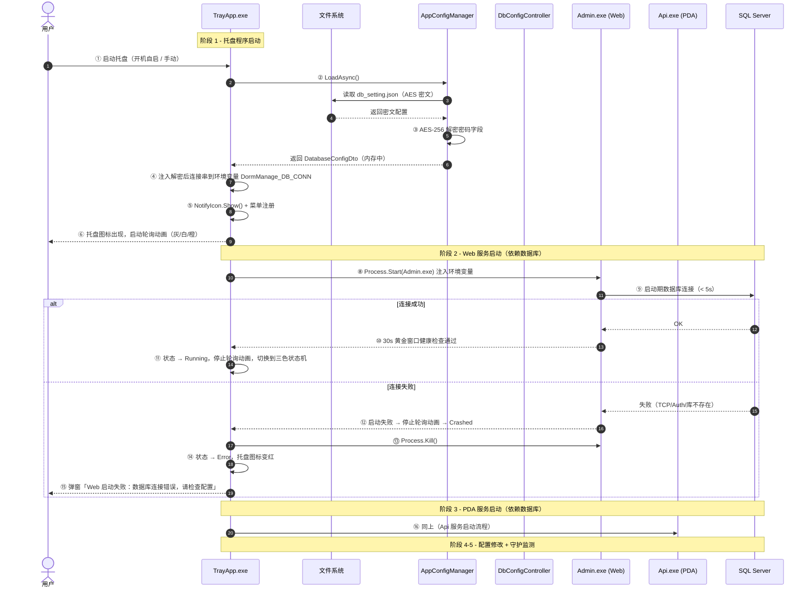

# 启动流程与图标状态机统一规范 — v2.13.200

> **版本**：v2.13.200
> **日期**：2026-07-28
> **类型**：启动流程与图标状态机统一规范
> **适用**：DormManage.TrayApp / DormManage.Admin / DormManage.Api
> **前置**：v2.13.19 托盘图标状态机 / v2.13.199 启动旋转动画

---

## 一、设计目标

将启动流程的 **5 个阶段** 与托盘任务栏图标的 **8 种状态切换** 统一规范，防止不同版本对启动过程描述不一致。

### 1.1 设计原则

1. **托盘是中枢**：第一个启动，最后一个退出，统一管理 Web/Api 生命周期
2. **明确可视化**：托盘图标颜色必须准确反映当前服务状态，不允许歧义
3. **拒绝假死感知**：t0 阶段（旧版固定红色）必须改为三色轮询，让用户能识别"正在加载中"

---

## 二、启动全流程 5 阶段

| 阶段 | 执行者 | 关键动作 | 失败行为 |
|:---:|------|---------|---------|
| **1** | `DormManage.TrayApp.exe` | 加载本地配置 → AES-256 解密 → 创建 NotifyIcon → 注册右键菜单 | 配置缺失时弹出「系统配置」窗口引导用户填写 |
| **2** | 托盘拉起 `DormManage.Admin.exe` | 进程启动 → 读取 db_setting.json → AppConfigRuntime 初始化 → IDbContextFactory | **DB 连接失败 ⇒ 立即 Kill 进程，托盘图标变红 + 弹窗** |
| **3** | 托盘拉起 `DormManage.Api.exe` | 同 §2 | DB 连接失败 ⇒ 立即 Kill |
| **4** | 用户 → 托盘菜单/Web 后台 → 系统配置 | 修改 Provider/Server/Port/Database/User/Password → 强制测试连通性 → 通过则 AES-256 加密保存 | v2.13.32 起保存即热加载，无需重启 |
| **5** | 托盘 GuardianTimer(2s) + HealthCheckTimer(10s) | 监控 Web/PDA 进程存活 + 端点健康 + 写日志到 Log/YYYYMMDD_log.txt | 进程消失自动拉起；端点连续 3 次失败标记 Error |

### 2.1 启动流程时序图



---

## 三、图标颜色状态机（v2.13.200 增强）

### 3.1 三色主状态机（业务运行时）

| Api 状态 | Admin 状态 | 图标颜色 | 含义 |
|----------|-----------|---------|------|
| Running | Running | 🟢 **Green** (#28A745) | 双服务均正常 |
| Running | 非 Running | 🟡 **Yellow** (#FFC107) | 仅 Api 正常 |
| 非 Running | Running | 🟡 **Yellow** (#FFC107) | 仅 Admin 正常 |
| 其他 | 其他 | 🔴 **Red** (#DC3545) | 启动阶段（动画接管）/ 双服务均异常 |

```csharp
private TrayIconColor EvaluateIconColor()
{
    var apiRunning = _apiState == ServiceState.Running;
    var adminRunning = _adminState == ServiceState.Running;
    if (apiRunning && adminRunning) return TrayIconColor.Green;
    if (apiRunning || adminRunning) return TrayIconColor.Yellow;
    return TrayIconColor.Red;
}
```

### 3.2 启动轮询动画色（v2.13.200 新增）

**触发场景**：t0 阶段（双服务均处于 `Stopped`），即托盘已启动但 Web/Api 还未拉起时。

**动画规则**：
- **每 500ms 切换一次颜色**（用户明确要求："每半秒轮询一种颜色"）
- **颜色序列（按顺序循环）**：

| 颜色 | RGB 颜色值 | Bootstrap 对应 | 含义 |
|------|----------|---------------|------|
| 🩶 **Gray** (#6c757d) | (108, 117, 125) | `text-secondary` | 托盘初始化中（加载配置、初始化菜单） |
| ⚪ **White** (#f8f9fa) | (248, 249, 250) | `bg-light` | 准备拉起 Web/Api 服务（加灰色描边以便可辨） |
| 🟧 **Orange** (#fd7e14) | (253, 126, 20) | `text-warning` | 等待数据库连接 + 健康检查（持续等待中） |

**停止条件（触发后立即停止轮询，交由主三色状态机接管）**：

1. Api 从 Stopped → Starting / Running / Crashed / Stopping 任一状态
2. Admin 从 Stopped → Starting / Running / Crashed / Stopping 任一状态
3. 轮询停止后，主三色状态机根据 Api/Admin 的 Running 状态自动显示对应的红/黄/绿

**重启轮询条件**：
- 当 Api 与 Admin 都重新回到 Stopped 状态时（如用户点击"停止所有服务"），再次启动轮询动画

### 3.3 子服务状态枚举

```csharp
public enum ServiceState {
    Stopped = 0,    // ○ 已停止（未启动）
    Starting = 1,   // ◐ 启动中（已下发启动命令，等待 HTTP 探测）
    Running = 2,    // ● 运行中
    Crashed = 3,    // ✕ 异常（HTTP 探测失败或进程崩溃）
    Stopping = 4    // ◐ 停止中
}
```

### 3.4 状态文本映射

```csharp
ServiceState.Running   => "● 运行中",
ServiceState.Starting  => "◐ 启动中",
ServiceState.Stopping  => "◐ 停止中",
ServiceState.Stopped   => "○ 已停止",
ServiceState.Crashed   => "✕ 异常",
_                     => "未知"
```

---

## 四、关键时序状态表（8 种状态切换）

| 时刻 | 事件 | 图标变化 | 文本显示 |
|------|------|----------|---------|
| **t0** | TrayApp 启动，双服务 Stopped | 🩶→⚪→🟧 三色轮询（每 500ms 切换） | "Api: ○ 已停止 / Admin: ○ 已停止" |
| **t1** | Api 进入 Starting（托盘已拉起 Api 进程） | 🟡 Yellow 立即显示 | "Api: ◐ 启动中" |
| **t2** | Api 健康检查通过 → Running，Admin 仍 Stopped | 🟡 Yellow（仅 Api Running） | "Api: ● 运行中 / Admin: ○ 已停止" |
| **t3** | Admin 也 Running | 🟢 Green（双服务 Running） | "Api: ● 运行中 / Admin: ● 运行中" |
| **t4** | Api 进程消失（被 Kill） | 🟡 Yellow（仅 Admin）→ 几秒后无恢复则 🔴 Red | "Api: ✕ 异常 / Admin: ● 运行中" |
| **t5** | HealthChecker 连续 3 次失败 | 🔴 Red（Crashed） | "Api: ✕ 异常" |
| **t6** | 用户右键 → 重启所有服务 | 短暂 🟡 Yellow → 🟢 Green | 中间过程显示 ◐ 启动中 → ● 运行中 |
| **t7** | 用户右键 → 退出 | NotifyIcon.Visible = false → 图标消失 | "Api/Admin: 正在停止" |
| **t8** | 重启后双服务都 Stopped | 重新进入三色轮询 | "Api: ○ 已停止 / Admin: ○ 已停止" |

---

## 五、代码实现位置

| 功能 | 文件 | 关键方法/类 |
|------|------|------------|
| 启动轮询动画 | `DormManage.TrayApp/Services/IconAnimator.cs` | `StartAnimation()` / `StopAnimation()` / `OnTick()` |
| 三色状态机 | `DormManage.TrayApp/NotifyIconManager.cs` | `EvaluateIconColor()` / `UpdateServiceState()` |
| 图标生成器 | `DormManage.TrayApp/IconGenerator.cs` | `CreateSolidCircle(TrayIconColor)` |
| 启动生命周期 | `DormManage.TrayApp/TrayAppContext.cs` | `Initialize()` / `StartAllAsync()` |
| 服务状态枚举 | `DormManage.TrayApp/Models/ServiceState.cs` | `enum ServiceState` |
| 进程管理 | `DormManage.TrayApp/Services/ProcessManager.cs` | `ServiceStateChanged` 事件 |

---

## 六、关键时序触发点（ProcessManager.cs）

```csharp
// 启动前：状态 → Starting
_health.MarkApiState(ServiceState.Starting);
ServiceStateChanged?.Invoke("Api", ServiceState.Starting);
// → NotifyIconManager 收到事件 → UpdateServiceStateCore
// → 停止轮询动画（因为状态不再是 Stopped）→ 三色状态机接管

// 启动失败：状态 → Crashed
_health.MarkApiState(ServiceState.Crashed);
ServiceStateChanged?.Invoke("Api", ServiceState.Crashed);
// → 立即显示 🔴 Red（Crashed 状态）

// 启动成功：状态 → Running
_health.MarkApiState(ServiceState.Running);
ServiceStateChanged?.Invoke("Api", ServiceState.Running);
// → 显示 🟢 Green 或 🟡 Yellow（取决于 Admin 状态）

// 停止前：状态 → Stopping
_health.MarkApiState(ServiceState.Stopping);
ServiceStateChanged?.Invoke("Api", ServiceState.Stopping);

// 停止完成：状态 → Stopped
_health.MarkApiState(ServiceState.Stopped);
ServiceStateChanged?.Invoke("Api", ServiceState.Stopped);
// → 双服务都 Stopped 时，重新启动轮询动画
```

---

## 七、文档历史

| 版本 | 日期 | 变更内容 |
|------|------|---------|
| v2.13.19 | 2026-07-19 | 引入三色状态机（红/黄/绿）反映 Api/Admin 健康状态 |
| v2.13.23 | 2026-07-19 | 修正文档：Starting/Stopping/Crashed 也归为红色（无任何服务 Running） |
| v2.13.199 | 2026-07-25 | 引入启动旋转动画（圆弧 loading 图标） |
| v2.13.200 | 2026-07-28 | 启动动画改用灰/白/橙三色轮询（每 500ms 切换），替代旋转动画 |

---

**所有启动流程的时序状态、图标颜色变化、文本显示现在均统一规范，禁止使用不同的描述。**
