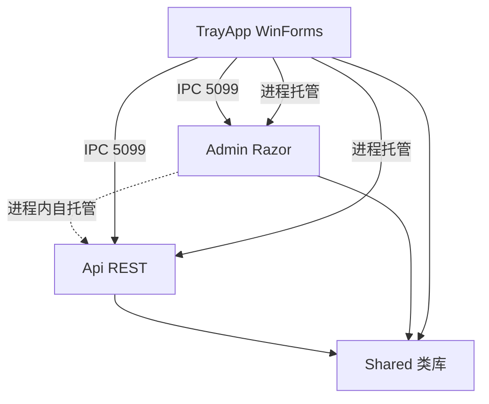

# 02 - 系统架构与 4 项目结构

> **性质**：最高优先级复用资产（4 项目布局、启动时序、进程托管、IPC 协议、数据源热加载）
> **复用等级**：⭐⭐⭐⭐⭐（强复用）
> **对应原始文档**：`00-方案文档/01-技术架构与系统开发方案.md` 第 3-5 章、`79-系统启动机制与生产部署文档-v2.13.25.md`、`85-数据源热加载与EF拦截器日志-v2.13.32.md`

---

## 一、解决方案结构详解

### 1.1 项目文件树（精简版）

```
DormManage.sln
│
├── DormManage.Shared/                    # 类库（net8.0）
│   ├── Data/
│   │   ├── DormDbContext.cs              # EF Core DbContext（62 DbSet）
│   │   └── Interceptors/
│   │       └── DatabaseOperationInterceptor.cs  # SQL 日志拦截器
│   ├── Exceptions/
│   │   └── BusinessException.cs          # 业务异常
│   ├── Models/                           # 实体（62 个）+ DTO（50+ 个）
│   │   ├── BaseEntity.cs                 # 审计字段基类
│   │   ├── SysUser.cs / SysRole.cs / SysPermission.cs
│   │   ├── Dorm.cs / DormBooking.cs
│   │   ├── MeterRecord.cs / BillingStandard.cs
│   │   └── ...
│   ├── Register/
│   │   ├── RegItem.cs                    # RegStatus 枚举 + 注册项 DTO
│   │   └── RegisterSdk.cs                # 机器码/注册码/DPAPI（详见 03 章）
│   ├── Security/
│   │   ├── LicenseGuard.cs               # 4 态降级判定 + GetLicenseBanner
│   │   └── TrayLaunchGuard.cs            # HMAC 握手 + 父进程校验
│   ├── Services/
│   │   ├── AppConfigManager.cs           # 配置管理器（AES-256 + 4 级回退）
│   │   ├── AppConfigRuntime.cs           # 配置运行时（单例 + 热加载）
│   │   ├── DatabaseConfigFileWatcher.cs  # FileSystemWatcher 跨进程同步
│   │   ├── DatabaseInitializer.cs        # 启动期 DB 初始化（迁移+种子）
│   │   ├── ServiceIpc.cs                 # TCP JSON IPC 协议
│   │   ├── LicenseMonitor.cs             # 5s 周期 IPC 推送
│   │   └── IBasicsService/IBookingService/...（11 个业务 Service）
│   └── Extensions/                       # HTML Helper / LINQ Extension
│
├── DormManage.Api/                       # Web API（net8.0）
│   ├── Program.cs                        # 入口（单实例 Mutex + TrayLaunchGuard + DataSource 热加载）
│   ├── Controllers/
│   │   ├── Account/SelfController.cs     # 个人中心 API
│   │   ├── Auth/UserController.cs        # 用户管理
│   │   ├── Booking/BookingController.cs
│   │   ├── Dorms/DormsController.cs
│   │   ├── Personnel/PersonnelController.cs
│   │   ├── Meter/MeterController.cs
│   │   ├── Billing/BillingController.cs
│   │   ├── Basics/BasicsController.cs
│   │   ├── Pda/PdaController.cs          # PDA 端点
│   │   └── System/
│   │       ├── SystemController.cs        # 服务启停/seed 完整性
│   │       ├── DbConfigController.cs      # 数据库连接配置
│   │       ├── DbHealthController.cs      # DB 深度健康检查
│   │       ├── IntegrationController.cs   # 系统集成配置
│   │       └── LicenseStatusController.cs # 注册状态（v2.13.169 新增）
│   ├── Middleware/
│   │   ├── GlobalExceptionMiddleware.cs   # 全局异常处理
│   │   ├── PerformanceMonitoringMiddleware.cs  # 慢 SQL 监控
│   │   └── LicenseReadOnlyMiddleware.cs   # 全局只读拦截（按 RegStatus 差异化）
│   ├── HostedServices/
│   │   ├── DataCleanupHostedService.cs    # 启动期 FK 归一
│   │   ├── DatabaseConfigFileWatcher.cs  # 跨进程 db_setting.json 同步
│   │   └── MeterMonthlyAutoFillHostedService.cs  # 每日抄表占位自动补全
│   └── appsettings.json                  # SQL Server 连接串（v2.13.145 默认值）
│
├── DormManage.Admin/                     # Web UI（net8.0）
│   ├── Program.cs                        # 入口（单实例 Mutex + TrayLaunchGuard + Razor 配置）
│   ├── Pages/                            # 35 个 Razor Page
│   │   ├── Account/（Login/Logout/ForgotPassword/Profile）
│   │   ├── Index.cshtml                  # 首页（Dashboard 7 KPI + 8 图表）
│   │   ├── Booking/（Index/Edit/CheckIn/CheckOut）
│   │   ├── Dorms/（Index/Create/Edit/Details/History）
│   │   ├── Personnel/（Index/Create/Edit/Details/Import）
│   │   ├── Meter/（Index/Entry/Edit/Detail/Import）
│   │   ├── BillingStandard/（Index/Create/Edit）
│   │   ├── DormBilling/（Index/Details）
│   │   ├── EmployeeBilling/（Index/Details）
│   │   ├── Basics/Index.cshtml           # 12 二级菜单（pane 切换）
│   │   ├── Settings/Index.cshtml          # 系统设置（数据库/PDA 版本/集成/备份/用户）
│   │   ├── Error.cshtml / Privacy.cshtml
│   │   └── Shared/（_Layout/_ViewImports/_ViewStart/_PaginationPartial/_UserPanel）
│   ├── Middleware/                       # LicenseReadOnlyMiddleware（按 RegStatus 差异化）
│   ├── Filters/                          # PagePermissionFilter + GlobalExceptionFilter
│   ├── ViewComponents/                   # Menu 组件
│   ├── wwwroot/
│   │   ├── js/                           # filter-persistence / list-pagination / site / profile
│   │   ├── css/                          # Bootstrap 5.3 + 自定义
│   │   ├── lib/                          # bootstrap-icons / chart.js / jQuery
│   │   └── license-status-badge.js (v2.13.169 新增)
│   └── appsettings.json                  # SQL Server 连接串
│
└── DormManage.TrayApp/                   # WinForms 托盘守护（net8.0-windows）
    ├── Program.cs                        # 入口（单实例 Mutex + MachineCodeProvider）
    ├── TrayAppContext.cs                 # ApplicationContext（IPC server + 进程管理 + 业务调度）
    ├── Forms/                            # WinForms 对话框
    │   ├── LicenseForm.cs                # 注册授权窗口（v2.13.167 优化）
    │   ├── SettingsForm.cs               # 系统设置窗口（数据库连接/PDA 版本）
    │   └── AboutForm.cs                  # 关于
    ├── Services/
    │   ├── ConfigService.cs              # appsettings.json 加载/保存（v2.13.157 自愈）
    │   ├── ProcessManager.cs             # Api/Admin 子进程管理
    │   ├── HealthChecker.cs              # 服务健康检查
    │   ├── IpcServer.cs                  # TCP JSON Server
    │   ├── AutoStartManager.cs           # Windows 自启动管理
    │   └── NotifyIconManager.cs          # 托盘图标
    ├── MachineCodeProvider.cs            # WMI 取 CPU+Disk 真实机器码
    └── appsettings.json                  # 端口/数据库配置
```

### 1.2 项目依赖关系



**关键点**：
- `DormManage.Shared` 是**单一真源**，不引用任何其他项目
- `DormManage.Admin` 通过 `AddApplicationPart(typeof(ApiController).Assembly)` 在进程内加载 `DormManage.Api` 控制器
- `DormManage.TrayApp` 通过 TCP `127.0.0.1:5099` 与子进程 IPC 通信

---

## 二、启动时序（v2.13.169 改造后）

### 2.1 完整启动时序图

```
┌──────────────────────────────────────────────────────────────────┐
│ TrayApp 启动 (DormManage.TrayApp.exe)                             │
│ ┌─────────────────────────────────────────────────────────────┐ │
│ │ [1] 单实例 Mutex (Global\DormManage.TrayApp.SingleInstance.v2)│ │
│ │ [2] MachineCodeProvider.Initialize() → 机器码写到文件/环境变量  │ │
│ │ [3] ConfigService.Load() → appsettings.json (含 v2.13.157 自愈) │ │
│ │ [4] AppConfigRuntime.GetCurrent() → 加载 db_setting.json        │ │
│ │ [5] TrayAppContext 构造 → 启动 IPC Server (5099)                │ │
│ │ [6] StartAutomaticValidationLogging() → 启动/心跳日志            │ │
│ │ [7] LicenseMonitor 启动 → 5s 周期 IPC 推送                      │ │
│ └─────────────────────────────────────────────────────────────┘ │
│ ┌─────────────────────────────────────────────────────────────┐ │
│ │ [8] StartAllAsync()                                             │ │
│ │     v2.13.169: 不再 throw 阻断，永远启动                       │ │
│ │     LogLicenseMode() → 仅记录当前模式                          │ │
│ └─────────────────────────────────────────────────────────────┘ │
└──────────────────────────────────────────────────────────────────┘
                              │
                              ▼ 进程托管
┌──────────────────────────────────────────────────────────────────┐
│ Api 启动 (DormManage.Api.exe, 端口 5100)                          │
│ ┌─────────────────────────────────────────────────────────────┐ │
│ │ [1] TrayLaunchGuard 校验 (Release)                              │ │
│ │     - 检查 DormManage_TRAY_HANDSHAKE env var (HMAC-SHA256)     │ │
│ │     - NtQueryInformationProcess 检查父进程 = DormManage.TrayApp │ │
│ │ [2] 单实例 Mutex (Global\DormManage.Api.SingleInstance.v1)      │ │
│ │ [3] WebApplication.CreateBuilder()                                │ │
│ │ [4] builder.Services 配置:                                       │ │
│ │     - AddDbContextFactory (热加载)                              │ │
│ │     - AddControllers + ApplicationPart (从 Api 加载控制器)        │ │
│ │     - AddHostedService (DatabaseConfigFileWatcher)               │ │
│ │ [5] builder.Build()                                              │ │
│ │ [6] AppConfigRuntime.GetCurrent() (预热)                        │ │
│ │ [7] DatabaseInitializer.InitializeAsync()                        │ │
│ │     - 数据库连接性 + Provider 校验 (SqlServer)                   │ │
│ │     - 18 张关键表存在性 + 缺失自动创建                          │ │
│ │     - 字段权限迁移 (v2.13.92)                                   │ │
│ │     - 设备档案过滤唯一索引 (v2.13.168 启动自愈)                │ │
│ │     - 字典种子 / admin 种子 / AppVersion 登记                    │ │
│ │ [8] app.UseMiddleware(顺序):                                     │ │
│ │     GlobalExceptionMiddleware                                    │ │
│ │     PerformanceMonitoringMiddleware                              │ │
│ │     LicenseReadOnlyMiddleware (按 RegStatus 差异化)            │ │
│ │ [9] app.MapControllers()                                          │ │
│ │ [10] app.Run() → Kestrel bind 5100                               │ │
│ └─────────────────────────────────────────────────────────────┘ │
└──────────────────────────────────────────────────────────────────┘
                              │
                              ▼ 进程托管
┌──────────────────────────────────────────────────────────────────┐
│ Admin 启动 (DormManage.Admin.exe, 端口 5001)                        │
│ ┌─────────────────────────────────────────────────────────────┐ │
│ │ [1-3] 同 Api (TrayLaunchGuard + Mutex + CreateBuilder)         │ │
│ │ [4] builder.Services 配置:                                       │ │
│ │     - AddRazorPages (含 ApplicationPart 加载 Api 控制器)          │ │
│ │     - AddAuthentication (Cookie)                                 │ │
│ │     - OnValidatePrincipal (v2.13.93 账号有效性校验)              │ │
│ │ [5-7] 同 Api (Build + Runtime + Initializer)                     │ │
│ │ [8] app.UseMiddleware(顺序):                                     │ │
│ │     UseExceptionHandler (开发) / UseExceptionHandler (生产)      │ │
│ │     UseStaticFiles                                               │ │
│ │     UseRouting                                                   │ │
│ │     UseAuthentication                                            │ │
│ │     UseAuthorization                                             │ │
│ │     LicenseReadOnlyMiddleware (v2.13.169 按差异化只读)        │ │
│ │ [9] app.MapRazorPages() + app.MapControllers()                   │ │
│ │ [10] app.Run() → Kestrel bind 5001                               │ │
│ └─────────────────────────────────────────────────────────────┘ │
└──────────────────────────────────────────────────────────────────┘
```

### 2.2 启动期关键时间点

| 阶段 | 耗时参考 | 失败行为 |
|------|----------|---------|
| TrayApp Mutex | < 50ms | 重复启动 → 提示+return |
| TrayApp IPC Server | < 200ms | 端口占用 → TrayApp 进程退出（graceful）|
| Api TrayLaunchGuard | < 100ms | 校验失败 → Console 提示 + 2s 延迟 + exit 0 |
| Api DbContext 初始化 | 200-500ms | 连接失败 → InvalidOperationException → 0xE0434352 |
| Api DatabaseInitializer | 500-2000ms | 表缺失/字段缺失 → 自动创建/迁移 |
| Api Kestrel bind 5100 | < 200ms | 端口占用 → 抛异常 → 0xE0434352 |

### 2.3 Api/Admin 子进程崩溃检测 + 自动重启

```csharp
// ProcessManager.cs OnApiExited
void OnApiExited(Process p)
{
    if (_isStopping) return;  // 用户主动停止，不重启
    if (p.ExitCode != 0)
    {
        _log.Warn($"Api 异常退出 code={p.ExitCode}，5s 后自动重启");
        // 5s 后重新 StartApiAsync()
    }
}
```

**5 分钟内最多重启 3 次**（防崩溃循环）。详见 `15-代码片段库.md` 的 `ProcessManager 片段`。

---

## 三、进程托管三件套

### 3.1 多实例端口检测（v2.13.171 取代单实例 Mutex）

**v2.13.171 起**去除单实例 Mutex 改用「端口冲突软告警 + IPC 端口可配置 + 反代层负载均衡」。详见 `00-方案文档/212-进程唯一锁解除与多实例高并发架构-v2.13.171.md`。

```csharp
// Program.cs (Api/Admin/TrayApp v2.13.171 新模板)
// 已删除：using var _singleInstanceMutex + Mutex 检测
// 新增：端口冲突软告警（不 throw）+ 优雅退出
if (await IsPortInUseAsync(cfg.Tray.ApiPort))
{
    _log.Warn($"[PORT-IN-USE] Api 端口 {cfg.Tray.ApiPort} 已被占用 — 多实例共存时属正常现象");
    // 不 throw，让 StartApi 继续
}
```

**关键变更**：
- ❌ **不要**加任何 `Mutex` 互斥锁（v2.13.72-v2.13.170 时代被 v2.13.171 全面解除）
- ✅ 端口冲突**只** WARN 日志，**不**退出（允许多 TrayApp + 多 Kestrel 进程共存）
- ✅ IPC 端口可配置（环境变量 `DORM_TRAY_IPC_PORT` 或 appsettings.json `Tray.IpcPort`，默认 5099）
- ✅ 多实例部署模式：
  - **同机多端口**：`DORM_TRAY_IPC_PORT=5098` TrayApp#2 监听 5098
  - **单机+反代**：IIS ARR / Nginx 暴露统一入口 `http://server:5001`
  - **多机集群**：每台 1 个 TrayApp + 1 个 Api，前置反代发现并负载均衡
- **v2.13.72 历史参考**：Mutex 命名规范（`Global\DormManage.{TrayApp/Api/Admin}.SingleInstance.vN`）仍记录在 `123-进程唯一性单实例保护-v2.13.72.md`（已加 DEPRECATED banner），仅作 v2.13.171 之前文件的理解参考

### 3.2 进程来源守卫（TrayLaunchGuard, v2.13.155）

**目的**：防止 Api/Admin 被独立双击运行（必须由托盘拉起）

**实现**：
- L1：HMAC-SHA256 握手令牌（托盘 → 子进程 env var）
- L2：NtQueryInformationProcess 父进程名校验

```csharp
// Api/Admin/Program.cs
#if !DEBUG  // 仅 Release 强制
if (!DormManage.Shared.Security.TrayLaunchGuard.VerifyLaunchedByTray(
        DormManage.Shared.Security.TrayLaunchGuard.ChildApi,  // "Api" / "Admin"
        out var _trayGuardReason))
{
    Console.Error.WriteLine($"[TRAY-GUARD] 本程序必须由「金戈宿舍管理系统托盘程序」启动。原因：{_trayGuardReason}");
    Console.Error.WriteLine("[TRAY-GUARD] 请运行 DormManage.TrayApp.exe。本次启动将在 2 秒后终止...");
    Thread.Sleep(2000);
    return;
}
Console.WriteLine("[TRAY-GUARD] 托盘托管校验通过。");
#endif
```

**托盘端注入令牌**（ProcessManager.BuildStartInfo）：
```csharp
var childKey = isApi
    ? DormManage.Shared.Security.TrayLaunchGuard.ChildApi
    : DormManage.Shared.Security.TrayLaunchGuard.ChildAdmin;
psi.EnvironmentVariables[DormManage.Shared.Security.TrayLaunchGuard.HandshakeEnvVar] =
    DormManage.Shared.Security.TrayLaunchGuard.CreateHandshakeToken(childKey);
```

**HMAC 算法**：
- 密钥：`"Jinge#Dorm@2026$Tray^Handshake&Key!v1"`（Release 下经 Obfuscar HideStrings 加密）
- Payload：`{childKey}|{trayPid}`（childKey = "Api" / "Admin"，trayPid = 托盘进程 ID）
- Token 格式：`{payload}|{HMAC-SHA256 hex}`

**子进程验证**（TrayLaunchGuard.VerifyLaunchedByTray）：
- 解析 token 三段（childKey/trayPid/sig）
- 验证 childKey 匹配本程序
- 用自身 KEY 重算 HMAC 与 sig 对比
- NtQueryInformationProcess 获取父进程 PID，验证托盘端在子进程启动后 1s 内还活着 + 进程名为 "DormManage.TrayApp"

### 3.3 进程生命周期管理（ProcessManager）

**关键方法**：
- `StartAllAsync()` - 启动所有服务（Api → Admin）
- `StartApiAsync()` / `StartAdminAsync()` - 单个启动
- `StopAllAsync()` - 优雅停止（先 Admin 再 Api）
- `OnApiExited()` / `OnAdminExited()` - 异常退出检测（5s 自动重启）
- `BuildStartInfo()` - 构造 ProcessStartInfo（注入 env vars）

**自动重启策略**：
```csharp
private const int RestartWindowMinutes = 5;
private const int MaxRestartInWindow = 3;
private int _restartCountInWindow = 0;
private DateTime _lastRestartAt = DateTime.MinValue;

// OnApiExited 中
if ((DateTime.Now - _lastRestartAt).TotalMinutes < RestartWindowMinutes)
{
    _restartCountInWindow++;
    if (_restartCountInWindow > MaxRestartInWindow)
    {
        _log.Error($"5 分钟内连续重启 {_restartCountInWindow} 次，停止自动重启");
        return;
    }
}
else
{
    _restartCountInWindow = 1;
}
_lastRestartAt = DateTime.Now;
await Task.Delay(5000);  // 5s 后重启
await StartApiAsync();
```

---

## 四、IPC 协议（ServiceIpc）

### 4.1 协议规范

- **传输层**：TCP `127.0.0.1:5099`
- **数据格式**：JSON 行（每条命令一行 JSON，`\n` 结束）
- **字符编码**：UTF-8

### 4.2 命令清单

| 命令 | 方向 | 用途 |
|------|------|------|
| `ping` | Client → Tray | 健康检查（返回 `pong`）|
| `status` | Client → Tray | 获取 Api/Admin 运行状态 |
| `start {service}` | Client → Tray | 启动 Api/Admin/all |
| `stop {service}` | Client → Tray | 停止 Api/Admin/all |
| `restart {service}` | Client → Tray | 重启 Api/Admin/all |
| `getdbconfig` | Client → Tray | 获取数据库配置 |
| `setdbconfig {payload}` | Client → Tray | 设置数据库配置（v2.13.19+）|
| `dbconfig.updated {payload}` | Tray → Client | Tray 主动推送（v2.13.19+）|
| `getregstate` | Client → Tray | 获取注册状态（v2.13.137+）|
| `regstate.changed {payload}` | Tray → Client | Tray 主动推送（v2.13.137+）|

### 4.3 命令格式

```json
{ "command": "getregstate" }
{ "command": "setdbconfig", "payload": { "Provider": "SqlServer", "ConnectionString": "..." } }
{ "command": "regstate.changed", "payload": { "RegInt": 1, "RegStatus": 1, ... } }
```

### 4.4 响应格式

```json
{ "success": true, "message": "ok", "data": { ... } }
{ "success": false, "message": "端口被占用", "data": null }
```

### 4.5 RegStateDto 完整字段

```csharp
public class RegStateDto
{
    public int RegInt { get; set; } = -1;       // 兼容字段
    public int RegStatus { get; set; } = -1;    // v2.13.169 新增（Unregistered=-1/Valid=1/Expired=2/Invalid=3）
    public string SN { get; set; } = "";
    public string CDKEY { get; set; } = "";
    public string LTDName { get; set; } = "";
    public DateTime? RegDate { get; set; }
    public int UseTimes { get; set; }
    public DateTime DetectedAtUtc { get; set; }
}
```

### 4.6 客户端封装（IpcClient）

```csharp
public class IpcClient
{
    public async Task<IpcResponse> SendAsync(IpcCommand cmd, int timeoutMs = 5000) { ... }
    public async Task<RegStateDto> GetRegStateAsync(int timeoutMs = 2000) { ... }  // v2.13.137+
    public async Task SetDbConfigAsync(DatabaseConfigDto config) { ... }
}
```

### 4.7 服务端实现（IpcServer）

```csharp
public class IpcServer : IDisposable
{
    public IpcServer(int port, Action<IpcCommand, Action<IpcResponse>> handler)
    public void Start()  // 监听 + 多客户端
    public void Stop()
}
```

**关键点**：
- 异步 AcceptTcpClientAsync + Task.Run 处理每个客户端
- 客户端断开时优雅关闭
- 超时机制（默认 5s，getregstate 用 2s）

---

## 五、数据源热加载（v2.13.32）

### 5.1 目标
**Web 端或托盘修改数据库配置 → Api/Admin 下次请求自动用新连接，无需重启服务**。

### 5.2 4 级回退优先级

```csharp
// AppConfigRuntime.GetCurrent() 内部
1. SysParameter 表（运行时真源 - 未来版本）
2. db_setting.json（AES-256 字段式）
3. appsettings.json ConnectionStrings.Default
4. 硬编码默认 172.16.0.100/WaterMeterDB/user/1234
```

### 5.3 关键组件

| 组件 | 路径 | 职责 |
|------|------|------|
| `AppConfigManager` | `Shared/Services/AppConfigManager.cs` | 配置读写（AES-256 加密）+ 单例 |
| `AppConfigRuntime` | `Shared/Services/AppConfigRuntime.cs` | 内存中的当前配置 + 4 级回退 |
| `DatabaseConfigFileWatcher` | `Api/HostedServices/` | FileSystemWatcher 监听 db_setting.json 变更 |
| `DbConfigController` | `Api/Controllers/System/DbConfigController.cs` | API 端点（`GET /runtime-info`、`PUT /config`）|

### 5.4 DbContext 注册

```csharp
// Program.cs
builder.Services.AddDbContextFactory<DormDbContext>((sp, options) =>
{
    var cfg = AppConfigRuntime.Instance.GetCurrent();  // 每次都从 Runtime 读
    if (!cfg.Provider.Equals("SqlServer"))
        throw new InvalidOperationException("Database provider must be SqlServer");
    options.UseSqlServer(cfg.BuildConnectionString(), sqlOptions => { ... });
});
builder.Services.AddScoped<DormDbContext>(sp =>
    sp.GetRequiredService<IDbContextFactory<DormDbContext>>().CreateDbContext());
```

### 5.5 跨进程同步

- TrayApp 修改 `db_setting.json` → FileSystemWatcher 触发 → Api/Admin 收到通知 → 重新加载
- 详见 `15-代码片段库.md` 的 `AppConfigManager 片段`

---

## 六、Admin 进程内自托管 API（v2.13.0）

### 6.1 目标
Admin 端通过相对路径 `/api/v1/...` 调用 API，无需独立 Api 进程。

### 6.2 实现

```csharp
// Admin/Program.cs
builder.Services.AddControllers()
    .AddApplicationPart(typeof(DormManage.Api.Controllers.Booking.BookingController).Assembly)
    .AddJsonOptions(options => { options.JsonSerializerOptions.PropertyNamingPolicy = CamelCase; });

// ...
app.MapControllers();  // 启用进程内 API 路由
```

**注意**：
- 必须用全限定名 `typeof(DormManage.Api.Controllers.Booking.BookingController).Assembly` 引用 Api 程序集
- 必须 `MapControllers()` 而非只 `MapRazorPages()`
- 独立 Api 进程（5100）仍保留供 PDA/移动端使用

---

## 七、关键文件清单（新建项目必拷贝）

### 7.1 根目录

```
/Directory.Build.props                    # Obfuscar + R2R 自动启用
/Obfuscar.xml                             # SkipNamespace 配置
/package-deploy.ps1                       # 旧版打包脚本
/scripts/build_protected_release.ps1      # 受保护构建入口
```

### 7.2 DormManage.Shared 关键文件

```
/DormManage.Shared.csproj
/Models/BaseEntity.cs                     # 审计字段 + IsActive + 通用方法
/Models/ApiResponse.cs                    # 统一响应包装（Ok/Fail）
/Data/DormDbContext.cs                    # DbSet 注册 + HasData seed
/Data/Interceptors/DatabaseOperationInterceptor.cs  # SQL 日志
/Exceptions/BusinessException.cs          # 业务异常（带 ErrorCode）
/Register/RegItem.cs + RegisterSdk.cs     # 详见 03 章
/Security/LicenseGuard.cs + TrayLaunchGuard.cs  # 详见 03 章
/Services/ServiceIpc.cs + LicenseMonitor.cs     # IPC 协议
/Services/AppConfigManager.cs + AppConfigRuntime.cs  # 配置热加载
/Services/DatabaseInitializer.cs          # 启动期 DB 初始化
```

### 7.3 DormManage.Api 关键文件

```
/Program.cs                               # 入口
/Controllers/Auth/UserController.cs        # 用户管理 API
/Controllers/System/DbConfigController.cs # 数据库配置 API
/Controllers/System/LicenseStatusController.cs  # v2.13.169 注册状态
/Middleware/GlobalExceptionMiddleware.cs
/Middleware/PerformanceMonitoringMiddleware.cs
/Middleware/LicenseReadOnlyMiddleware.cs   # v2.13.169 差异化只读
/HostedServices/DatabaseConfigFileWatcher.cs
/appsettings.json
```

### 7.4 DormManage.Admin 关键文件

```
/Program.cs
/Pages/Account/Login.cshtml + Login.cshtml.cs
/Pages/Shared/_Layout.cshtml              # 共用页头 + Tab 栏 + 4 态徽章
/Pages/Shared/_PaginationPartial.cshtml   # 分页器
/Pages/Shared/_UserPanel.cshtml            # 用户胶囊 + 注册状态徽章
/Middleware/LicenseReadOnlyMiddleware.cs
/Filters/PagePermissionFilter.cs          # Razor 路由级权限守卫
/wwwroot/js/site.js + filter-persistence.js + list-pagination.js
/wwwroot/js/license-status-badge.js        # v2.13.169 新增
```

### 7.5 DormManage.TrayApp 关键文件

```
/Program.cs
/TrayAppContext.cs                         # 托盘主类
/Forms/LicenseForm.cs                      # 注册窗口
/Forms/SettingsForm.cs                     # 系统设置窗口
/Services/ConfigService.cs                 # 配置加载（v2.13.157 自愈）
/Services/ProcessManager.cs                # 进程托管
/Services/IpcServer.cs                     # TCP JSON Server
/MachineCodeProvider.cs                    # WMI 真实机器码
/appsettings.json
```

---

## 八、本章小结

- **核心复用资产**：4 项目布局、启动时序、进程托管三件套、IPC 协议、数据源热加载
- **新项目必拷贝**：见 §7「关键文件清单」
- **避坑指南**：`13-永久教训` 中的 OOM-201（IPC 30s 缓存）、OOM-202（启动期 crash 自愈）

下一章：`03-注册许可子系统.md`（v2.13.169 4 态矩阵 + IPC 反转）
